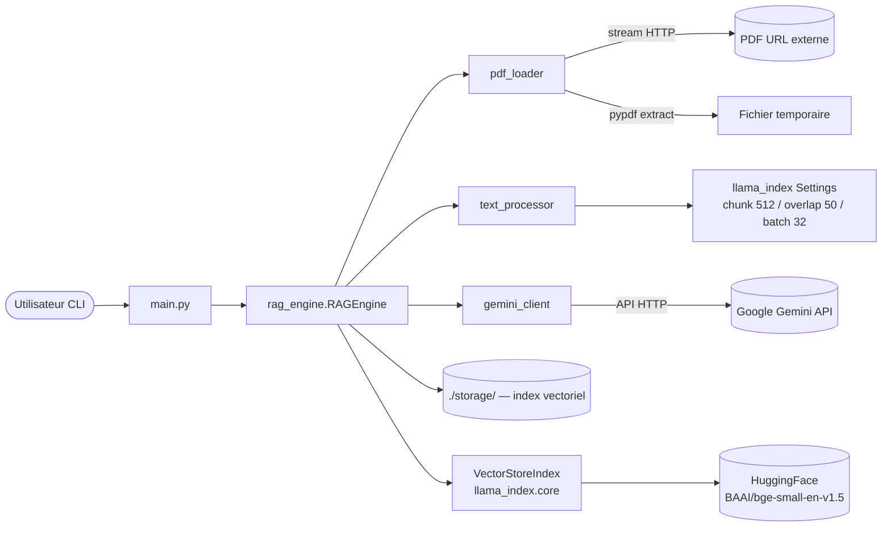

<!--
TEMPLATE — Architecture
=======================
Public cible : (1) une IA assistante de développement qui doit raisonner sur le système
sans relire tout le code à chaque tâche, (2) un humain qui prend le projet en cours.

Ce document est VIVANT : il est mis à jour avant chaque PR (par un skill IA, validé par
un humain). Il décrit le système TEL QU'IL EST, pas tel qu'on aimerait qu'il soit. Les
intentions et décisions à venir vont dans les ADR ou dans la backlog, pas ici.

Garde-fous d'écriture :
- Tout chiffre / nom de composant doit être vérifiable depuis le code ou un artefact
  versionné. Si déduit ou hypothétique, marquer explicitement "(à confirmer)".
- Distinguer "observé" / "décidé" / "ouvert".
- Toute affirmation forte → renvoyer vers un fichier source (code, ADR, schéma).
- Préférer les tableaux et listes courtes à la prose. Une PR doit pouvoir patcher 3 lignes,
  pas un paragraphe.

Le bloc "Mode d'emploi" en fin de fichier détaille la marche à suivre pour l'IA et le relecteur.
-->

# Architecture — RAG

| Champ | Valeur |
|---|---|
| **Dernière mise à jour** | 2026-05-07 |
| **Mise à jour par** | agent IA bt-ai |
| **PR de référence** | 04b7fd4 |
| **Version applicative** | 0.0.0 |
| **Statut du document** | Brouillon |

> **Résumé en 1 phrase** : Moteur RAG (Retrieval-Augmented Generation) en Python qui télécharge un PDF depuis une URL, en extrait le texte par pages, construit un index vectoriel local, puis répond à des questions en langage naturel via le LLM Gemini 2.5 Flash.

---

## 1. Vue d'ensemble

### 1.1 Nature du système

| Dimension | Valeur |
|---|---|
| **Type** | CLI / Batch |
| **Mode** | Synchrone |
| **Multi-tenant** | Non — usage mono-utilisateur, une seule instance à la fois |
| **Stateful** | Avec état persistant — index vectoriel sauvegardé dans `./storage/<hash_md5_url>/` |
| **Utilisateurs cibles** | Internes / développeurs |
| **Volumétrie typique** | (à confirmer) — conçu pour des PDFs jusqu'à plusieurs centaines de pages ; traitement en lots de 50 pages |

### 1.2 Flux principal

L'utilisateur lance `main.py` en passant une URL de PDF. `RAGEngine.__init__` calcule un hash MD5 de l'URL pour localiser un éventuel index déjà sauvegardé dans `./storage/`.

- **Cache présent** : l'index est rechargé depuis le disque via `load_index_from_storage` — aucun téléchargement, aucun embedding.
- **Pas de cache** :
  1. `pdf_loader.load_pdf_from_url` stream-télécharge le PDF (chunks de 8 Mo, timeout 10 s / 60 s) vers un fichier temporaire.
  2. `pdf_loader.load_documents_from_pdf` extrait le texte page par page via `pypdf`, par lots de 50 pages, avec `gc.collect()` entre chaque lot pour libérer la RAM.
  3. `RAGEngine` construit un `VectorStoreIndex` llama-index avec embeddings `BAAI/bge-small-en-v1.5` (HuggingFace, batch 32).
  4. L'index est persisté sur disque.
- Le fichier PDF temporaire est supprimé (`os.unlink`) dans un bloc `finally`.
- Le `query_engine` est créé avec `similarity_top_k=3` et `response_mode="compact"`.
- L'utilisateur saisit ses questions en boucle interactive ; chaque question passe par le `query_engine` qui interroge Gemini 2.5 Flash pour la génération.

---

## 2. Stack technique

| Couche | Choix | Version | Justification courte |
|---|---|---|---|
| **Langage principal** | Python | ≥ 3.12 | requis dans `pyproject.toml` |
| **Framework RAG** | llama-index (`llama_index.core`) | (à confirmer) | orchestration index vectoriel + query engine |
| **Modèle d'embedding** | HuggingFace `BAAI/bge-small-en-v1.5` | (à confirmer) | embedding local, pas de dépendance cloud pour l'indexation |
| **LLM de génération** | Google Gemini 2.5 Flash (`models/gemini-2.5-flash`) | — | via `llama_index.llms.gemini` |
| **Extraction PDF** | pypdf | (à confirmer) | import dynamique dans `pdf_loader.py` |
| **Persistance** | Fichiers locaux (`./storage/`) | — | `StorageContext.persist()` de llama-index |
| **Cache** | Aucun (système de fichiers) | — | hash MD5 de l'URL comme clé de cache |
| **Messaging** | Aucun | — | — |
| **Auth** | Clé API Google (`GOOGLE_API_KEY` via `config.py`) | — | variable d'environnement (à confirmer) |
| **Observabilité** | `print()` uniquement | — | pas de collecteur structuré |
| **CI/CD** | (à confirmer) | — | `pyproject.toml` configure ruff, bandit, pytest |
| **Déploiement** | Local / script | — | lancé via `python main.py` ou `uv run` |

**Dépendances externes critiques** (services tiers dont la panne dégrade le service) :

| Service | Rôle | Mode d'appel | Fallback |
|---|---|---|---|
| Google Gemini API | Génération de réponses LLM | HTTP / SDK `llama_index.llms.gemini` | Aucun — erreur levée |
| Source PDF (URL arbitraire) | Récupération du document à indexer | HTTP streaming (`requests`) | Aucun — `HTTPError` levée |
| HuggingFace Hub | Téléchargement du modèle d'embedding au premier lancement | HTTP | Cache local HuggingFace (après premier téléchargement) |

---

## 3. Pattern d'architecture

### 3.1 Style retenu

Procédural / monolithe modulaire. Le code est découpé en modules fonctionnels distincts (`pdf_loader`, `text_processor`, `gemini_client`, `rag_engine`, `main`) sans couche d'abstraction supplémentaire. Pas de framework web ; point d'entrée unique CLI. Ce style correspond à un outil de traitement de document mono-utilisateur.

> Décision tracée dans : (à confirmer) — aucun dossier ADR détecté dans le repo.

### 3.2 Diagramme de composants



### 3.3 Propriétés architecturales

| Propriété | Valeur observée | Justification / mécanisme |
|---|---|---|
| **Couplage** | Moyen | `RAGEngine` importe directement `pdf_loader`, `text_processor`, `gemini_client` — pas d'interface abstraite |
| **Cohésion** | Haute | Chaque module a une responsabilité unique et nommée |
| **Concurrence** | Séquentielle | Pas de threading ni d'async — traitement page par page en boucle `for` |
| **Idempotence** | Garantie (indexation) | La clé de cache MD5 évite de re-indexer le même PDF |
| **Cohérence** | N/A | Pas de base de données transactionnelle |
| **Scalabilité** | Verticale uniquement | Mono-processus ; `_PAGE_BATCH=50` et `embed_batch_size=32` bornent la RAM |

---

## 4. Composants

| Composant | Type | Localisation | Rôle | Entrées | Sorties |
|---|---|---|---|---|---|
| `RAGEngine` | Module / Classe | [`rag_engine.py`](../rag_engine.py) | Orchestrateur principal — init, cache, query | URL PDF, question texte | Réponse texte |
| `pdf_loader` | Module | [`pdf_loader.py`](../pdf_loader.py) | Téléchargement streaming et extraction texte PDF | URL ou chemin fichier | `list[Document]` llama-index |
| `text_processor` | Module | [`text_processor.py`](../text_processor.py) | Configuration embeddings et node parser | — | `HuggingFaceEmbedding`, `SentenceSplitter` |
| `gemini_client` | Module | [`gemini_client.py`](../gemini_client.py) | Initialisation du LLM Gemini | `GOOGLE_API_KEY` | `Gemini` llama-index LLM |
| `main` | Point d'entrée | [`main.py`](../main.py) | Boucle interactive CLI | Saisie utilisateur | Affichage console |

### 4.1 Détails par composant

#### pdf_loader

- **Rôle** : téléchargement HTTP streaming d'un PDF et extraction texte page par page via `pypdf`.
- **Entrées** : URL (string) pour `load_pdf_from_url` ; chemin fichier (string) pour `load_documents_from_pdf`.
- **Sorties** : chemin vers fichier temporaire (`str`) ; `list[Document]` avec métadonnées `page_label`, `file_path`, `total_pages`.
- **Dépendances internes** : aucune.
- **Dépendances externes** : `requests` (HTTP), `pypdf` (import dynamique), `llama_index.core.Document`.
- **Invariants** : le fichier temporaire est supprimé par l'appelant (`RAGEngine`) dans un `finally` ; `load_documents_from_pdf` lève `ValueError` si aucun texte extractible.
- **Pièges connus** : ⚠️ `pypdf` est importé dynamiquement — une `ImportError` claire est levée si absent. ⚠️ Pages sans texte (images scannées) sont silencieusement ignorées.

#### RAGEngine

- **Rôle** : orchestration complète — cache de l'index sur disque, construction de l'index vectoriel, exposition d'un `query_engine`.
- **Entrées** : `pdf_url` (str), `storage_dir` (str, défaut `./storage`).
- **Sorties** : réponse texte via `query(question: str) -> str`.
- **Dépendances internes** : `pdf_loader`, `text_processor`, `gemini_client`.
- **Dépendances externes** : `llama_index.core` (VectorStoreIndex, StorageContext), système de fichiers local.
- **Invariants** : après `__init__`, `self.index` et `self.query_engine` sont toujours initialisés.
- **Pièges connus** : ⚠️ `MemoryError` explicitement capturée lors de l'embedding — message d'aide vers `_PAGE_BATCH` et `embed_batch_size`. ⚠️ La clé de cache est le MD5 de l'URL — changer l'URL pour le même PDF force une ré-indexation.

---

## 5. Architecture des données

> Vue résumée. Le détail (tables, colonnes, contraintes) est dans [data-model.md](data-model.md).

| Domaine | Stockage | Tables / collections | Volumétrie | Croissance |
|---|---|---|---|---|
| Index vectoriel | Fichiers locaux (`./storage/<md5>/`) | Fichiers llama-index (`docstore.json`, `index_store.json`, vecteurs) | Dépend du PDF indexé | Linéaire avec le nombre de PDFs distincts |

**Pattern temporel** : Aucun versioning — écrasement en place si l'index est régénéré pour la même URL.

**Politique de rétention** : Aucune automatique — les répertoires `./storage/` persistent jusqu'à suppression manuelle.

---

## 6. Interfaces

> Vue résumée. Le détail (signatures, payloads, codes retour) est dans [contracts.md](contracts.md).

### 6.1 Interfaces exposées

| Interface | Type | Consommateurs | Stabilité |
|---|---|---|---|
| `RAGEngine.query(question: str) -> str` | Python API | `main.py` (CLI) | Interne / privé |

### 6.2 Interfaces consommées

| Interface | Fournisseur | Type d'appel | Criticité |
|---|---|---|---|
| Google Gemini API (`models/gemini-2.5-flash`) | Google Cloud | Sync HTTP via SDK | Bloquante — sans LLM, pas de réponse |
| URL PDF source | Serveur externe arbitraire | Sync HTTP streaming | Bloquante — sans PDF, pas d'index |
| HuggingFace Hub (modèle `BAAI/bge-small-en-v1.5`) | HuggingFace | HTTP (premier lancement) | Dégradable — mis en cache localement après |

---

## 7. Déploiement

### 7.1 Topologie

```
Environnement unique : poste local développeur
  └── python main.py  (ou uv run main.py)
        └── ./storage/   (index vectoriel persisté sur disque local)
```

### 7.2 Environnements

| Environnement | URL / Cluster | Données | Auth | Trafic |
|---|---|---|---|---|
| **local** | localhost | PDFs publics (ex. arxiv.org) | `GOOGLE_API_KEY` (à confirmer : variable d'env ou `config.py`) | Utilisateur unique |

### 7.3 Configuration

- **Format** : module Python `config.py` (importé par `gemini_client.py`) — contenu non versionné (à confirmer).
- **Source de vérité** : (à confirmer) — `config.py` n'est pas présent dans le repo au moment de cette analyse.
- **Secrets** : `GOOGLE_API_KEY` — mécanisme de chargement à confirmer (variable d'environnement recommandée).
- **Feature flags** : Aucun.

---

## 8. Préoccupations transverses

### 8.1 Sécurité

| Aspect | Mécanisme | Localisation |
|---|---|---|
| **Authentification** | Clé API Google | `config.GOOGLE_API_KEY` → `gemini_client.py` |
| **Autorisation** | Aucun contrôle d'accès (outil local) | — |
| **Secrets** | (à confirmer) — `config.py` absent du repo analysé | `config.py` |
| **Données sensibles** | Aucun chiffrement des index locaux | `./storage/` |
| **Audit** | Aucun — logs `print()` uniquement | — |

### 8.2 Observabilité

| Type | Outil | Volume | Rétention | Alerting |
|---|---|---|---|---|
| **Logs** | `print()` stdout | Faible | Aucune | Aucun |
| **Métriques** | Aucune | — | — | — |
| **Traces** | Aucune | — | — | — |
| **Erreurs** | Exceptions Python non capturées | — | — | — |

**Convention de corrélation** : Aucune.

### 8.3 Performance

| Métrique | Cible (SLO) | Mesure actuelle | Source |
|---|---|---|---|
| **Temps d'indexation** | (à confirmer) | (à confirmer) | — |
| **Latence requête** | (à confirmer) | (à confirmer) | — |
| **Mémoire pic** | Bornée par `_PAGE_BATCH=50` et `embed_batch_size=32` | (à confirmer) | [`pdf_loader.py`](../pdf_loader.py), [`text_processor.py`](../text_processor.py) |

### 8.4 Résilience

- **Timeouts** : connexion 10 s / lecture 60 s pour le téléchargement PDF (`_REQUEST_TIMEOUT` dans [`pdf_loader.py`](../pdf_loader.py)).
- **Retry** : Aucun — une erreur HTTP lève immédiatement `requests.HTTPError`.
- **Circuit breaker** : Aucun.
- **Backpressure** : Traitement PDF par lots de 50 pages (`_PAGE_BATCH`) avec `gc.collect()` entre lots ; embedding par lots de 32 (`embed_batch_size`).
- **Plan de reprise** : `MemoryError` lors de l'embedding capture un message d'aide explicite orientant vers la réduction de `_PAGE_BATCH` ou `embed_batch_size`.

---

## 9. Stratégie de test

| Niveau | Framework | Couverture | Quand |
|---|---|---|---|
| **Unitaire** | pytest | (à confirmer) | À chaque commit |
| **Intégration** | (à confirmer) | (à confirmer) | À chaque PR |
| **Contract** | Aucun détecté | — | — |
| **End-to-end** | Aucun détecté | — | — |
| **Charge** | Aucun détecté | — | — |
| **Sécurité** | bandit (SAST), ruff (lint) | Code source (hors `.venv`, migrations) | (à confirmer — CI non détectée) |

**Données de test** : répertoire `tests/` présent (`tests/test_pdf_loader.py` détecté) — fixtures à confirmer.

---

## 10. Workflow de développement

- **Branches** : trunk-based (à confirmer) — branche `main` unique observée.
- **Convention de commits** : (à confirmer) — `gitlint-core` présent en dépendance dev.
- **CI** : (à confirmer) — aucun fichier CI détecté ; `pyproject.toml` configure ruff, bandit, pytest, pyright.
- **Code review** : (à confirmer).
- **Mise à jour de cette doc** : Skill IA `bt-ai` exécuté en pre-PR + relecture humaine.

---

## 11. Décisions et points ouverts

### 11.1 Décisions actives

Aucun ADR détecté dans le repo.

### 11.2 Points ouverts

| # | Question | Impact | Owner |
|---|---|---|---|
| Q1 | `config.py` absent du repo — comment `GOOGLE_API_KEY` est-il injecté en pratique ? | Sécurité / onboarding | (à confirmer) |
| Q2 | Pas de CI détectée — bandit/ruff/pytest sont-ils exécutés automatiquement ? | Qualité | (à confirmer) |
| Q3 | Aucun retry sur l'appel Gemini — une erreur transitoire interrompt la session | Résilience | (à confirmer) |

### 11.3 Dette technique structurante

| Item | Origine | Coût d'évitement | Plan |
|---|---|---|---|
| Observabilité par `print()` uniquement | Conception initiale simple | Pas de traçabilité structurée, impossible à corréler | Ajouter `logging` structuré si le projet grossit |
| Pas de retry sur les appels externes | Conception initiale | Fragilité face aux pannes réseau transitoires | Ajouter `tenacity` ou retry manuel si nécessaire |

---

## 12. Références

- Modèle de données : [data-model.md](data-model.md)
- Contrats d'interface : [contracts.md](contracts.md)
- Glossaire : [glossaire.md](glossaire.md)
- Documentation fonctionnelle : [fonctionnel.md](fonctionnel.md)
- Index général : [index.md](index.md)
- ADR : aucun dossier ADR détecté
- Runbooks ops : (à confirmer)
- Dashboards : (à confirmer)

---

<!--
MODE D'EMPLOI DU TEMPLATE
=========================

POUR L'IA QUI MET À JOUR CE DOCUMENT AVANT UNE PR

Déclencheurs (mettre à jour les sections concernées si la PR touche…) :

| Modification dans la PR | Sections à relire |
|---|---|
| Ajout / suppression / renommage d'un service ou module | §3 (diagramme), §4 (composants) |
| Changement de stack (langage, framework, lib majeure) | §2 |
| Nouvelle table / collection ou schéma modifié | §5 (résumé), data-model.md (détail) |
| Nouvelle interface exposée ou consommée | §6, contracts.md (détail) |
| Changement d'environnement, IaC, manifestes K8s | §7 |
| Nouveau mécanisme d'auth, audit, secrets | §8.1 |
| Nouveau collecteur logs / métriques / dashboards | §8.2 |
| SLO, timeout, retry, circuit breaker modifiés | §8.3, §8.4 |
| Nouveau type de test, framework de test | §9 |
| Changement de workflow CI ou règle de branche | §10 |
| Nouvel ADR fusionné | §11.1 |

Règles d'écriture :
1. Mettre à jour le bloc d'en-tête (date, PR de référence, version, mise à jour par).
2. Pour chaque modification, citer la PR ou le commit en référence si non évident.
3. Ne pas réécrire des sections inchangées — diff minimal.
4. Marquer "(à confirmer)" toute affirmation non vérifiable depuis le code à l'instant T.
5. Si une section devient obsolète, la VIDER avec une mention "Aucun {{X}} actuellement"
   plutôt que la supprimer — l'absence est une information.
6. Si la doc et le code divergent, ouvrir un point dans §11.2 et le signaler dans le
   message de PR — ne PAS aligner silencieusement.

Auto-checks à effectuer avant de proposer la mise à jour :
- [ ] Les composants listés en §4 existent réellement dans le repo (vérifier les chemins).
- [ ] Le diagramme Mermaid §3.2 correspond aux appels effectivement présents dans le code.
- [ ] Les versions §2 correspondent au manifeste de dépendances actuel.
- [ ] Les ADR cités §11.1 existent dans le dossier ADR.
- [ ] Les liens des §12 ne sont pas cassés.

POUR LE RELECTEUR HUMAIN

- Le diff doit être lisible : si plus de 30 lignes changent, demander à l'IA de
  scinder par section.
- Vérifier que les chiffres (SLO, volumétrie, version) ne sont pas inventés.
- Toute hypothèse "(à confirmer)" doit être levée ou explicitement assumée.
- Si une section est trop générique (pleine de "{{}}" non remplis), c'est un signe que
  la section n'a jamais été vraiment travaillée — la signaler ou la vider.

POUR ADAPTER À UN AUTRE PROJET

1. Remplacer `{{NOM_PROJET}}` et tous les autres `{{...}}`.
2. Garder les 12 sections et leur ordre — c'est la grille standard.
3. Une section vide est légitime si « non applicable » ; le marquer explicitement.
4. Adapter le diagramme Mermaid §3.2 au style réel (peut être un schéma C4 niveau 2,
   un diagramme de séquence, etc.).
5. Pour un système purement frontal : §5 et §6 peuvent être minces, mais ne pas
   supprimer — pointer vers le backend qui porte ces aspects.
6. Pour un système purement batch : adapter §1.2 ("flux principal" = traitement d'un fichier),
   §6 (interfaces = formats E/S), §8.3 (perf = débit + temps fenêtre).
-->
