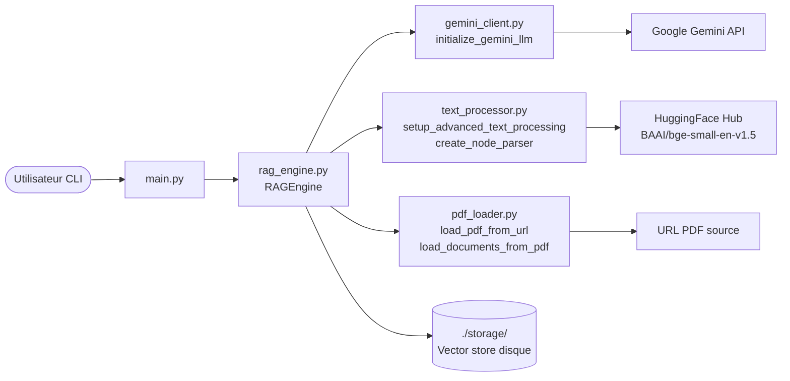

<!--
TEMPLATE — Architecture
=======================
Public cible : (1) une IA assistante de développement qui doit raisonner sur le système
sans relire tout le code à chaque tâche, (2) un humain qui prend le projet en cours.

Ce document est VIVANT : il est mis à jour avant chaque PR (par un skill IA, validé par
un humain). Il décrit le système TEL QU'IL EST, pas tel qu'on aimerait qu'il soit. Les
intentions et décisions à venir vont dans les ADR ou dans la backlog, pas ici.

Garde-fous d'écriture :
- Tout chiffre / nom de composant doit être vérifiable depuis le code ou un artefact
  versionné. Si déduit ou hypothétique, marquer explicitement "(à confirmer)".
- Distinguer "observé" / "décidé" / "ouvert".
- Toute affirmation forte → renvoyer vers un fichier source (code, ADR, schéma).
- Préférer les tableaux et listes courtes à la prose. Une PR doit pouvoir patcher 3 lignes,
  pas un paragraphe.

Le bloc "Mode d'emploi" en fin de fichier détaille la marche à suivre pour l'IA et le relecteur.
-->

# Architecture — RAG

| Champ | Valeur |
|---|---|
| **Dernière mise à jour** | 2026-05-20 |
| **Mise à jour par** | agent IA (doc-patcher) |
| **PR de référence** | (à confirmer) |
| **Version applicative** | 0.0.0 |
| **Statut du document** | Brouillon |

> **Résumé en 1 phrase** : Système RAG en ligne de commande qui télécharge un PDF depuis une URL, le découpe et l'indexe dans un vector store local, puis répond à des questions en langage naturel via le LLM Google Gemini.

---

## 1. Vue d'ensemble

### 1.1 Nature du système

| Dimension | Valeur |
|---|---|
| **Type** | CLI |
| **Mode** | Synchrone |
| **Multi-tenant** | Non |
| **Stateful** | Avec état persistant — vector store sur disque (`./storage/`) |
| **Utilisateurs cibles** | Internes / développeurs |
| **Volumétrie typique** | Non mesurée (à confirmer) |

### 1.2 Flux principal

L'utilisateur lance `main.py` et saisit une question. `RAGEngine` est instancié avec une URL de PDF :

1. **Premier lancement** : `pdf_loader` télécharge le PDF depuis l'URL et l'enregistre temporairement. `text_processor` découpe le document en chunks de 512 tokens (overlap 50) via `SentenceSplitter`, et configure le modèle d'embedding `BAAI/bge-small-en-v1.5` (HuggingFace). `RAGEngine` construit un `VectorStoreIndex` et le persiste dans `./storage/index_<md5(url)>/`.
2. **Lancements suivants** : le dossier de stockage est détecté, l'index est rechargé sans ré-embedding.
3. **Requête** : la question traverse le `query_engine` (similarity_top_k=3, mode compact) — les chunks les plus proches sont récupérés et envoyés au LLM Gemini (modèle `gemini-2.5-flash`, temperature 0.1) via `gemini_client`. La réponse est affichée dans le terminal.

---

## 2. Stack technique

| Couche | Choix | Version | Justification courte |
|---|---|---|---|
| **Langage principal** | Python | 3.12 | Requis par `pyproject.toml` (`requires-python = ">=3.12"`) |
| **Framework applicatif** | LlamaIndex (llama-index-core) | (à confirmer) | Orchestration RAG — indexation, retrieval, query engine |
| **Persistance** | Vector store local (LlamaIndex `StorageContext` sur disque) | (à confirmer) | Pas de SGBD ; persistence dans `./storage/` par hash MD5 de l'URL |
| **Cache** | Aucun (cache disque natif via `StorageContext.persist`) | — | Re-lecture du vector store au redémarrage |
| **Messaging** | Aucun | — | CLI synchrone |
| **Auth** | Clé API Google (`GOOGLE_API_KEY` dans `config.py`) | — | Variable de configuration locale |
| **Observabilité** | Aucune (prints console) | — | Pas de collecteur structuré |
| **CI/CD** | (à confirmer) | — | — |
| **Déploiement** | Local / CLI | — | — |

**Dépendances externes critiques** (services tiers dont la panne dégrade le service) :

| Service | Rôle | Mode d'appel | Fallback |
|---|---|---|---|
| Google Gemini API (`models/gemini-2.5-flash`) | Génération de la réponse LLM | SDK `llama-index-llms-gemini` (HTTP) | Erreur bloquante — pas de fallback |
| HuggingFace Hub (`BAAI/bge-small-en-v1.5`) | Téléchargement du modèle d'embedding au premier lancement | SDK `llama-index-embeddings-huggingface` | Bloquant au premier run uniquement ; si le modèle est en cache local, la panne ne bloque plus |
| URL PDF source | Téléchargement du document à indexer | HTTP (`requests`) | Bloquant au premier run uniquement ; si le vector store est en cache, la panne ne bloque plus |

---

## 3. Pattern d'architecture

### 3.1 Style retenu

Monolithe procédural — 5 modules Python à la racine du dépôt, sans couche d'abstraction supplémentaire. La séparation est fonctionnelle (chargement, traitement, LLM, moteur, entrée) mais les modules s'importent directement sans interface formelle. Adapté à la taille et au périmètre CLI du projet.

> Décision tracée dans : (à confirmer)

### 3.2 Diagramme de composants

> Diagramme Mermaid (rendu nativement par GitLab/GitHub). Montrer les composants principaux et le sens des appels — pas les classes.



### 3.3 Propriétés architecturales

| Propriété | Valeur observée | Justification / mécanisme |
|---|---|---|
| **Couplage** | Fort | Imports directs entre modules ; `RAGEngine` importe `pdf_loader`, `text_processor` et `gemini_client` explicitement |
| **Cohésion** | Haute | Chaque module a une responsabilité unique (chargement, embedding, LLM, orchestration, entrée) |
| **Concurrence** | Séquentielle | CLI mono-thread ; pas de parallélisme explicite |
| **Idempotence** | Garantie sur la construction d'index | Le hash MD5 de l'URL protège contre le double-indexage |
| **Cohérence** | Forte | Pas de données distribuées ; filesystem local |
| **Scalabilité** | Non applicable | CLI mono-utilisateur local |

---

## 4. Composants

> Une ligne par composant principal. Détail dans les sous-sections si nécessaire. Les composants triviaux (ex. utilitaires sans logique) ne sont pas listés ici.

| Composant | Type | Localisation | Rôle | Entrées | Sorties |
|---|---|---|---|---|---|
| `RAGEngine` | Module (classe) | [`rag_engine.py`](../rag_engine.py) | Orchestrateur principal — indexation, cache et requêtage | URL PDF, question utilisateur | Réponse texte |
| `gemini_client` | Module | [`gemini_client.py`](../gemini_client.py) | Initialise le LLM Gemini et le configure dans LlamaIndex Settings | `GOOGLE_API_KEY` (config) | Instance `Gemini` enregistrée dans `Settings.llm` |
| `pdf_loader` | Module | [`pdf_loader.py`](../pdf_loader.py) | Télécharge un PDF depuis une URL et l'extrait en documents LlamaIndex | URL HTTP | Liste de `Document` LlamaIndex |
| `text_processor` | Module | [`text_processor.py`](../text_processor.py) | Configure le modèle d'embedding HuggingFace et le `SentenceSplitter` | — | `HuggingFaceEmbedding`, `SentenceSplitter` |
| `main` | Module (CLI) | [`main.py`](../main.py) | Point d'entrée — instancie `RAGEngine` et boucle interactive | Saisie clavier | Affichage console |
| `config` | Module | `config.py` | Fournit `GOOGLE_API_KEY` | Fichier local | Constante Python |

### 4.1 Détails par composant

#### RAGEngine

- **Rôle** : Orchestre l'ensemble du pipeline RAG — chargement du PDF, découpe en nœuds, construction ou rechargement du vector store, et requêtage via Gemini.
- **Entrées** : URL du PDF (`pdf_url`), répertoire de stockage (`storage_dir`, défaut `./storage/`)
- **Sorties** : Réponse texte via `query(question)`
- **Dépendances internes** : `gemini_client.initialize_gemini_llm`, `pdf_loader.load_pdf_from_url`, `pdf_loader.load_documents_from_pdf`, `text_processor.setup_advanced_text_processing`, `text_processor.create_node_parser`
- **Dépendances externes** : LlamaIndex (`VectorStoreIndex`, `StorageContext`), filesystem `./storage/`
- **Invariants** : Un même URL produit toujours le même chemin d'index (hash MD5) — pas de duplication d'index
- **Pièges connus** : Le hash MD5 est calculé sur l'URL brute ; deux URLs pointant vers le même contenu produisent deux index distincts. ⚠️ `config.py` doit exister et contenir `GOOGLE_API_KEY` avant tout appel.

---

## 5. Architecture des données

> Vue résumée. Le détail (tables, colonnes, contraintes) est dans [data-model.md](data-model.md).

| Domaine | Stockage | Tables / collections | Volumétrie | Croissance |
|---|---|---|---|---|
| Index vectoriel | Filesystem (`./storage/index_<md5>/`) | Dossier par URL de PDF (fichiers LlamaIndex `docstore.json`, `index_store.json`, etc.) | Dépend de la taille du PDF | Linéaire — un dossier par PDF indexé |

**Pattern temporel** : Aucun versioning — les embeddings sont écrasés si le dossier est supprimé et le PDF ré-indexé.

**Politique de rétention** : Aucune politique automatique — les dossiers `./storage/` persistent indéfiniment jusqu'à suppression manuelle.

---

## 6. Interfaces

> Vue résumée. Le détail (signatures, payloads, codes retour) est dans [contracts.md](contracts.md).

### 6.1 Interfaces exposées

| Interface | Type | Consommateurs | Stabilité |
|---|---|---|---|
| CLI interactive (`main.py`) | CLI (stdin/stdout) | Utilisateur humain | Interne / privé |

### 6.2 Interfaces consommées

| Interface | Fournisseur | Type d'appel | Criticité |
|---|---|---|---|
| Google Gemini API (`models/gemini-2.5-flash`) | Google | Sync (SDK LlamaIndex) | Bloquante — toute requête échoue si l'API est indisponible |
| HuggingFace Hub (`BAAI/bge-small-en-v1.5`) | HuggingFace | Sync (téléchargement modèle) | Bloquante au premier lancement uniquement |
| URL PDF source | Externe | HTTP sync (`requests`) | Bloquante au premier lancement uniquement |

---

## 7. Déploiement

### 7.1 Topologie

```
Environnement unique : local (machine du développeur)
- 1 processus Python CLI
- Vector store : ./storage/ (filesystem local)
- Modèle d'embedding : cache HuggingFace local (~/.cache/huggingface/)
```

### 7.2 Environnements

| Environnement | URL / Cluster | Données | Auth | Trafic |
|---|---|---|---|---|
| **local** | Machine locale | PDF téléchargé + vector store local | Clé API Google dans `config.py` | 1 utilisateur |

### 7.3 Configuration

- **Format** : Fichier Python (`config.py`) à la racine du dépôt
- **Source de vérité** : `config.py` (non versionné — à créer localement)
- **Secrets** : `GOOGLE_API_KEY` — à ne pas committer. ⚠️ `config.py` n'est pas listé dans `.gitignore` (à confirmer)
- **Feature flags** : Aucun

---

## 8. Préoccupations transverses

### 8.1 Sécurité

| Aspect | Mécanisme | Localisation |
|---|---|---|
| **Authentification** | Clé API Google (`GOOGLE_API_KEY`) | `config.py` (fichier local) |
| **Autorisation** | Aucune (CLI mono-utilisateur local) | — |
| **Secrets** | Fichier `config.py` local — ⚠️ risque de commit accidentel | `config.py` |
| **Données sensibles** | Aucune donnée personnelle traitée (à confirmer) | — |
| **Audit** | Aucun | — |

### 8.2 Observabilité

| Type | Outil | Volume | Rétention | Alerting |
|---|---|---|---|---|
| **Logs** | `print()` console | Faible | Session uniquement | Aucun |
| **Métriques** | Aucune | — | — | — |
| **Traces** | Aucune | — | — | — |
| **Erreurs** | Exceptions Python non capturées | — | — | — |

**Convention de corrélation** : Aucune.

### 8.3 Performance

| Métrique | Cible (SLO) | Mesure actuelle | Source |
|---|---|---|---|
| **Latence p95** | Non définie | Non mesurée | — |
| **Latence p99** | Non définie | Non mesurée | — |
| **Disponibilité** | Non applicable (CLI local) | — | — |
| **Débit max** | Non applicable | — | — |

### 8.4 Résilience

- **Timeouts** : HTTP download PDF — `timeout=30s` ([`pdf_loader.py`](../pdf_loader.py)) ; appel Gemini API — délai géré par le SDK (à confirmer)
- **Retry** : Aucun mécanisme de retry explicite
- **Circuit breaker** : Aucun
- **Backpressure** : Aucun
- **Plan de reprise** : Aucun — échec = exception Python non gérée

---

## 9. Stratégie de test

| Niveau | Framework | Couverture | Quand |
|---|---|---|---|
| **Unitaire** | pytest (`tests/`) | (à confirmer — % non mesuré) | À chaque commit |
| **Intégration** | Aucun actuellement | — | — |
| **Contract** | Aucun actuellement | — | — |
| **End-to-end** | Aucun actuellement | — | — |
| **Charge** | Aucun actuellement | — | — |
| **Sécurité** | bandit (SAST — `pyproject.toml`) | Scan statique du code source | (à confirmer — CI non documentée) |

**Données de test** : `tests/test_gemini_client.py` utilise des mocks pour `config` et le SDK Gemini — pas de fixtures externes.

---

## 10. Workflow de développement

- **Branches** : `main` (branche unique observée — à confirmer)
- **Convention de commits** : Conventional Commits via `gitlint-core` (configuré dans `pyproject.toml`)
- **CI** : (à confirmer — pas de workflow CI versionné détecté)
- **Code review** : (à confirmer)
- **Mise à jour de cette doc** : Skill IA doc-patcher exécuté en pre-PR + relecture humaine — voir mode d'emploi en fin de fichier.

---

## 11. Décisions et points ouverts

### 11.1 Décisions actives

Aucun ADR actuellement.

### 11.2 Points ouverts

> Ce qui n'est pas tranché, source de risque ou de surprise pour un nouveau venu.

| # | Question | Impact | Owner |
|---|---|---|---|
| Q1 | `config.py` est-il exclu du versioning (`.gitignore`) ? | Risque de commit de clé API | (à confirmer) |
| Q2 | Quelle CI est configurée (GitHub Actions ou autre) ? | Déclencheurs du skill doc-patcher inconnus | (à confirmer) |
| Q3 | Le README mentionne "Python 3.10+" mais `pyproject.toml` exige `>=3.12` — quelle version est correcte ? | Compatibilité d'environnement | (à confirmer) |

### 11.3 Dette technique structurante

> Limitations connues qui orientent la lecture du code. Ne pas lister chaque TODO ; uniquement ce qui change la grille de lecture du système.

| Item | Origine | Coût d'évitement | Plan |
|---|---|---|---|
| Pas de gestion d'erreur sur les appels externes (Gemini, HTTP, HuggingFace) | Prototype / première version | Toute panne externe fait crasher le processus sans message clair | Ajouter try/except et messages d'erreur explicites |
| `config.py` non versionné et absent du repo | Contrainte sécurité (clé API) | Nécessite une documentation d'installation explicite ; risque d'oubli en CI | Documenter dans README, ajouter à `.gitignore` si non fait |

---

## 12. Références

- Modèle de données : [data-model.md](data-model.md)
- Contrats d'interface : [contracts.md](contracts.md)
- Glossaire : [glossaire.md](glossaire.md)
- Documentation fonctionnelle : [fonctionnel.md](fonctionnel.md)
- Index général : [index.md](index.md)
- ADR : Aucun actuellement
- Runbooks ops : Aucun actuellement
- Dashboards : Aucun actuellement

---

<!--
MODE D'EMPLOI DU TEMPLATE
=========================

POUR L'IA QUI MET À JOUR CE DOCUMENT AVANT UNE PR

Déclencheurs (mettre à jour les sections concernées si la PR touche…) :

| Modification dans la PR | Sections à relire |
|---|---|
| Ajout / suppression / renommage d'un service ou module | §3 (diagramme), §4 (composants) |
| Changement de stack (langage, framework, lib majeure) | §2 |
| Nouvelle table / collection ou schéma modifié | §5 (résumé), data-model.md (détail) |
| Nouvelle interface exposée ou consommée | §6, contracts.md (détail) |
| Changement d'environnement, IaC, manifestes K8s | §7 |
| Nouveau mécanisme d'auth, audit, secrets | §8.1 |
| Nouveau collecteur logs / métriques / dashboards | §8.2 |
| SLO, timeout, retry, circuit breaker modifiés | §8.3, §8.4 |
| Nouveau type de test, framework de test | §9 |
| Changement de workflow CI ou règle de branche | §10 |
| Nouvel ADR fusionné | §11.1 |

Règles d'écriture :
1. Mettre à jour le bloc d'en-tête (date, PR de référence, version, mise à jour par).
2. Pour chaque modification, citer la PR ou le commit en référence si non évident.
3. Ne pas réécrire des sections inchangées — diff minimal.
4. Marquer "(à confirmer)" toute affirmation non vérifiable depuis le code à l'instant T.
5. Si une section devient obsolète, la VIDER avec une mention "Aucun {{X}} actuellement"
   plutôt que la supprimer — l'absence est une information.
6. Si la doc et le code divergent, ouvrir un point dans §11.2 et le signaler dans le
   message de PR — ne PAS aligner silencieusement.

Auto-checks à effectuer avant de proposer la mise à jour :
- [ ] Les composants listés en §4 existent réellement dans le repo (vérifier les chemins).
- [ ] Le diagramme Mermaid §3.2 correspond aux appels effectivement présents dans le code.
- [ ] Les versions §2 correspondent au manifeste de dépendances actuel.
- [ ] Les ADR cités §11.1 existent dans le dossier ADR.
- [ ] Les liens des §12 ne sont pas cassés.

POUR LE RELECTEUR HUMAIN

- Le diff doit être lisible : si plus de 30 lignes changent, demander à l'IA de
  scinder par section.
- Vérifier que les chiffres (SLO, volumétrie, version) ne sont pas inventés.
- Toute hypothèse "(à confirmer)" doit être levée ou explicitement assumée.
- Si une section est trop générique (pleine de "{{}}" non remplis), c'est un signe que
  la section n'a jamais été vraiment travaillée — la signaler ou la vider.

POUR ADAPTER À UN AUTRE PROJET

1. Remplacer `{{NOM_PROJET}}` et tous les autres `{{...}}`.
2. Garder les 12 sections et leur ordre — c'est la grille standard.
3. Une section vide est légitime si « non applicable » ; le marquer explicitement.
4. Adapter le diagramme Mermaid §3.2 au style réel (peut être un schéma C4 niveau 2,
   un diagramme de séquence, etc.).
5. Pour un système purement frontal : §5 et §6 peuvent être minces, mais ne pas
   supprimer — pointer vers le backend qui porte ces aspects.
6. Pour un système purement batch : adapter §1.2 ("flux principal" = traitement d'un fichier),
   §6 (interfaces = formats E/S), §8.3 (perf = débit + temps fenêtre).
-->
