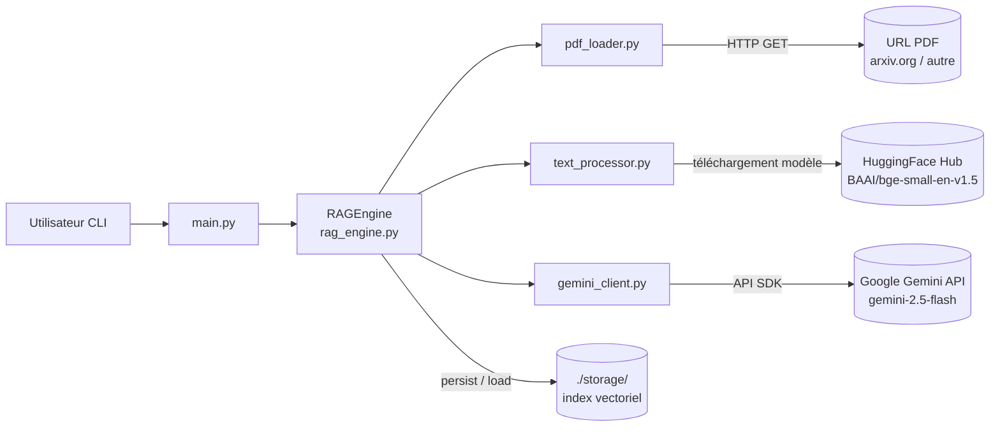

<!--
TEMPLATE — Architecture
=======================
Public cible : (1) une IA assistante de développement qui doit raisonner sur le système
sans relire tout le code à chaque tâche, (2) un humain qui prend le projet en cours.

Ce document est VIVANT : il est mis à jour avant chaque PR (par un skill IA, validé par
un humain). Il décrit le système TEL QU'IL EST, pas tel qu'on aimerait qu'il soit. Les
intentions et décisions à venir vont dans les ADR ou dans la backlog, pas ici.

Garde-fous d'écriture :
- Tout chiffre / nom de composant doit être vérifiable depuis le code ou un artefact
  versionné. Si déduit ou hypothétique, marquer explicitement "(à confirmer)".
- Distinguer "observé" / "décidé" / "ouvert".
- Toute affirmation forte → renvoyer vers un fichier source (code, ADR, schéma).
- Préférer les tableaux et listes courtes à la prose. Une PR doit pouvoir patcher 3 lignes,
  pas un paragraphe.

Le bloc "Mode d'emploi" en fin de fichier détaille la marche à suivre pour l'IA et le relecteur.
-->

# Architecture — RAG

| Champ | Valeur |
|---|---|
| **Dernière mise à jour** | 2026-05-10 |
| **Mise à jour par** | agent IA |
| **PR de référence** | 04b7fd4 |
| **Version applicative** | 0.0.0 |
| **Statut du document** | Brouillon |

> **Résumé en 1 phrase** : Système de Retrieval-Augmented Generation (RAG) qui permet de répondre à des questions en langage naturel sur des documents PDF, en combinant une recherche sémantique par embeddings HuggingFace et la génération de réponses via Google Gemini.

---

## 1. Vue d'ensemble

### 1.1 Nature du système

| Dimension | Valeur |
|---|---|
| **Type** | CLI |
| **Mode** | Synchrone |
| **Multi-tenant** | Non — instance unique par exécution, cloisonnée par URL de PDF |
| **Stateful** | Avec état persistant — index vectoriel sérialisé sur disque dans `./storage/` |
| **Utilisateurs cibles** | Internes (développeurs / chercheurs interrogeant un PDF via la CLI) |
| **Volumétrie typique** | (à confirmer) — usage interactif, quelques requêtes par session |

### 1.2 Flux principal

> Décrire en 5-10 lignes le chemin d'une requête / d'un enregistrement / d'un événement de l'entrée à la sortie, en nommant les composants traversés. Cette section est le « tour express » d'un nouveau venu.

L'utilisateur lance `main.py` avec une URL de PDF. `RAGEngine` (`rag_engine.py`) vérifie si un index mis en cache existe dans `./storage/` (identifié par le hash MD5 de l'URL). Si non : `pdf_loader.py` télécharge le PDF et l'extrait en documents ; `text_processor.py` configure l'embedding (`BAAI/bge-small-en-v1.5` via HuggingFace) et le découpeur de nœuds (`SentenceSplitter`, chunks de 512 tokens, overlap 50) ; `VectorStoreIndex` (LlamaIndex) génère les embeddings et les persiste sur disque. Si oui : l'index est rechargé depuis le cache. `gemini_client.py` initialise le LLM Gemini (`models/gemini-2.5-flash`, temperature 0.1) et l'enregistre dans `Settings.llm`. L'utilisateur pose une question dans la boucle interactive ; le `query_engine` effectue une recherche sémantique (`similarity_top_k=3`) et passe les chunks au LLM Gemini pour générer une réponse en mode `compact`.

---

## 2. Stack technique

| Couche | Choix | Version | Justification courte |
|---|---|---|---|
| **Langage principal** | Python | >=3.12 | Écosystème ML/NLP dominant |
| **Framework applicatif** | LlamaIndex (llama-index) | (à confirmer) | Orchestration RAG : index, retrieval, query engine |
| **Persistance** | Système de fichiers local (`./storage/`) | — | Index vectoriel sérialisé via `StorageContext.persist()` |
| **Cache** | Disque (hash MD5 de l'URL) | — | Évite de recalculer les embeddings à chaque session |
| **Messaging** | Aucun | — | Système synchrone, pas de file de messages |
| **Auth** | Clé API Google (`GOOGLE_API_KEY` dans `config.py`) | — | Accès à l'API Gemini |
| **Observabilité** | Logs console (`print`) | — | Aucun outil structuré actuellement |
| **CI/CD** | (à confirmer) | — | `pyproject.toml` configure ruff, bandit, pyright, pytest |
| **Déploiement** | Exécution locale (`python main.py`) | — | CLI — aucune infrastructure cloud identifiée |

**Dépendances externes critiques** (services tiers dont la panne dégrade le service) :

| Service | Rôle | Mode d'appel | Fallback |
|---|---|---|---|
| Google Gemini API (`models/gemini-2.5-flash`) | Génération des réponses (LLM) | SDK `llama-index-llms-gemini` | Aucun — panne bloque toute réponse |
| HuggingFace Hub (`BAAI/bge-small-en-v1.5`) | Téléchargement du modèle d'embedding | SDK `llama-index-embeddings-huggingface` | Aucun au premier lancement ; modèle mis en cache localement ensuite |
| URL source du PDF (ex. `arxiv.org`) | Accès au document à indexer | HTTP (`requests`) | Aucun — premier lancement échoue si indisponible |

---

## 3. Pattern d'architecture

### 3.1 Style retenu

Monolithe modulaire procédural. Le projet est découpé en modules Python à responsabilité unique (`pdf_loader`, `text_processor`, `gemini_client`, `rag_engine`, `main`) sans couche de service exposée. L'orchestration est centralisée dans `RAGEngine`. Ce style convient à un outil CLI mono-utilisateur sans exigence de scalabilité horizontale.

> Décision tracée dans : (à confirmer) — aucun ADR identifié dans le dépôt

### 3.2 Diagramme de composants

> Diagramme Mermaid (rendu nativement par GitLab/GitHub). Montrer les composants principaux et le sens des appels — pas les classes.



### 3.3 Propriétés architecturales

| Propriété | Valeur observée | Justification / mécanisme |
|---|---|---|
| **Couplage** | Faible entre modules | Chaque module expose des fonctions ciblées ; `RAGEngine` est le seul orchestrateur |
| **Cohésion** | Haute | Chaque fichier = une responsabilité (chargement PDF, embeddings, LLM, moteur RAG, CLI) |
| **Concurrence** | Séquentielle | Exécution single-thread en Python ; pas de async/await ni threading |
| **Idempotence** | Garantie sur l'indexation | Le hash MD5 de l'URL détermine le répertoire de cache — même URL → même index rechargé |
| **Cohérence** | Forte | Pas de base de données distribuée ; état sur disque local uniquement |
| **Scalabilité** | Verticale uniquement | CLI mono-processus ; montée en charge non prévue dans l'architecture actuelle |

---

## 4. Composants

> Une ligne par composant principal. Détail dans les sous-sections si nécessaire. Les composants triviaux (ex. utilitaires sans logique) ne sont pas listés ici.

| Composant | Type | Localisation | Rôle | Entrées | Sorties |
|---|---|---|---|---|---|
| `RAGEngine` | Module | [`rag_engine.py`](../rag_engine.py) | Orchestrateur central — indexation, cache, query pipeline | URL PDF, question utilisateur | Réponse textuelle |
| `pdf_loader` | Module | [`pdf_loader.py`](../pdf_loader.py) | Téléchargement HTTP du PDF et extraction de documents | URL HTTP | Liste de documents LlamaIndex |
| `text_processor` | Module | [`text_processor.py`](../text_processor.py) | Configuration embeddings HuggingFace et SentenceSplitter | — | `HuggingFaceEmbedding`, `SentenceSplitter` |
| `gemini_client` | Module | [`gemini_client.py`](../gemini_client.py) | Initialisation et enregistrement du LLM Gemini | `GOOGLE_API_KEY` | Instance `Gemini` enregistrée dans `Settings.llm` |
| `main` | CLI entry point | [`main.py`](../main.py) | Boucle interactive de questions-réponses | Saisie utilisateur | Affichage console |

### 4.1 Détails par composant

#### RAGEngine

- **Rôle** : Orchestre le cycle complet — chargement ou création de l'index vectoriel, puis réponse aux questions utilisateur via un `query_engine` LlamaIndex.
- **Entrées** : `pdf_url` (str), `storage_dir` (str, défaut `./storage`), questions en langage naturel via `query()`.
- **Sorties** : Réponse textuelle (`str`) issue du LLM Gemini.
- **Dépendances internes** : `pdf_loader`, `text_processor`, `gemini_client`.
- **Dépendances externes** : LlamaIndex (`VectorStoreIndex`, `StorageContext`), Google Gemini API, HuggingFace Hub.
- **Invariants** : Pour une même URL, le même répertoire de cache est toujours utilisé (hash MD5 de l'URL). Si le cache existe, aucun re-téléchargement ni re-embedding n'est effectué.
- **Pièges connus** : ⚠️ `GOOGLE_API_KEY` est lu depuis `config.py` — ce fichier n'est pas versionné ; son absence provoque une erreur à l'import. ⚠️ Le cache est invalidé uniquement par changement d'URL, pas par changement du contenu du PDF.

#### gemini_client

- **Rôle** : Instancie `Gemini(model="models/gemini-2.5-flash", temperature=0.1)` et l'enregistre dans `Settings.llm` (global LlamaIndex).
- **Entrées** : `GOOGLE_API_KEY` importée de `config`.
- **Sorties** : Instance `Gemini` (également enregistrée globalement via effet de bord).
- **Dépendances internes** : `config.py`.
- **Dépendances externes** : `llama-index-llms-gemini`, Google Gemini API.
- **Invariants** : Après appel, `Settings.llm` est une instance Gemini configurée.
- **Pièges connus** : ⚠️ Effet de bord global sur `Settings.llm` — tout code LlamaIndex exécuté après cet appel utilise ce LLM implicitement.

---

## 5. Architecture des données

> Vue résumée. Le détail (tables, colonnes, contraintes) est dans [data-model.md](data-model.md).

| Domaine | Stockage | Tables / collections | Volumétrie | Croissance |
|---|---|---|---|---|
| Index vectoriel | Système de fichiers local (`./storage/`) | Répertoire par URL (`index_<md5>/`) — fichiers LlamaIndex sérialisés | Dépend de la taille du PDF (à confirmer) | Linéaire — un répertoire par URL distincte |
| PDF source | Fichier temporaire système (`tempfile.gettempdir()`) | `temp_rag_document.pdf` | Taille du PDF source | Écrasé à chaque téléchargement |

**Pattern temporel** : Aucun versioning — le cache est une snapshot fixe au moment du premier indexage. Toute mise à jour du PDF nécessite une suppression manuelle du répertoire de cache.

**Politique de rétention** : Aucune politique automatisée — les répertoires `./storage/index_*` persistent jusqu'à suppression manuelle.

---

## 6. Interfaces

> Vue résumée. Le détail (signatures, payloads, codes retour) est dans [contracts.md](contracts.md).

### 6.1 Interfaces exposées

| Interface | Type | Consommateurs | Stabilité |
|---|---|---|---|
| `RAGEngine.query(question)` | Fonction Python | `main.py` (boucle interactive) | Interne / privé |
| Boucle CLI (`main.py`) | CLI interactive | Utilisateur humain | Interne |

### 6.2 Interfaces consommées

| Interface | Fournisseur | Type d'appel | Criticité |
|---|---|---|---|
| Google Gemini API (`models/gemini-2.5-flash`) | Google Cloud | Sync — SDK Python | Bloquante |
| HuggingFace Hub (`BAAI/bge-small-en-v1.5`) | HuggingFace | Sync — SDK (téléchargement modèle) | Bloquante au 1er lancement ; dégradable ensuite (cache local) |
| URL PDF source | Serveur HTTP tiers | Sync — `requests.get` | Bloquante au 1er lancement ; dégradable ensuite (cache index) |

---

## 7. Déploiement

### 7.1 Topologie

```
Environnement unique : machine locale du développeur
- 1 processus Python (main.py)
- Stockage : ./storage/ (répertoire local)
- Aucun serveur, aucun conteneur, aucune infrastructure cloud identifiée
```

### 7.2 Environnements

| Environnement | URL / Cluster | Données | Auth | Trafic |
|---|---|---|---|---|
| **local** | Machine du développeur | PDF réels téléchargés depuis URL publiques | Clé API Google dans `config.py` | Utilisateur unique, usage interactif |

### 7.3 Configuration

- **Format** : Fichier Python (`config.py`) — non versionné (à confirmer : absent du repo observé)
- **Source de vérité** : `config.py` local
- **Secrets** : `GOOGLE_API_KEY` stockée dans `config.py` — ⚠️ risque de commit accidentel si le fichier n'est pas dans `.gitignore`
- **Feature flags** : Aucun

---

## 8. Préoccupations transverses

### 8.1 Sécurité

| Aspect | Mécanisme | Localisation |
|---|---|---|
| **Authentification** | Clé API Google (`GOOGLE_API_KEY`) | `config.py` — fichier local non versionné |
| **Autorisation** | Aucune — outil mono-utilisateur local | — |
| **Secrets** | Fichier `config.py` en clair | ⚠️ Risque si `config.py` est committé ; aucun secret manager |
| **Données sensibles** | Aucun chiffrement au repos — index vectoriel en clair dans `./storage/` | Disque local |
| **Audit** | Aucun log structuré — uniquement `print` console | — |

### 8.2 Observabilité

| Type | Outil | Volume | Rétention | Alerting |
|---|---|---|---|---|
| **Logs** | `print` console | Faible — quelques lignes par requête | Session uniquement | Aucun |
| **Métriques** | Aucun | — | — | — |
| **Traces** | Aucun | — | — | — |
| **Erreurs** | Aucun outil dédié — exceptions Python non interceptées | — | — | — |

**Convention de corrélation** : Aucune — pas de corrélation de requêtes.

### 8.3 Performance

| Métrique | Cible (SLO) | Mesure actuelle | Source |
|---|---|---|---|
| **Latence p95** | (à confirmer) | (à confirmer) | Aucun dashboard |
| **Latence p99** | (à confirmer) | (à confirmer) | Aucun dashboard |
| **Disponibilité** | Non applicable — CLI | — | — |
| **Débit max** | Non applicable — usage interactif | — | — |

### 8.4 Résilience

- **Timeouts** : `requests.get(url, timeout=30)` pour le téléchargement PDF ; aucun timeout configuré sur les appels Gemini API.
- **Retry** : Aucune politique de retry — une exception non gérée arrête le processus.
- **Circuit breaker** : Aucun.
- **Backpressure** : Non applicable — usage séquentiel CLI.
- **Plan de reprise** : Aucun — relancer `python main.py` suffit ; le cache disque évite de re-indexer.

---

## 9. Stratégie de test

| Niveau | Framework | Couverture | Quand |
|---|---|---|---|
| **Unitaire** | pytest (`>=9.0.3`) + pytest-cov | (à confirmer — chiffre non mesuré) | À chaque commit |
| **Intégration** | (à confirmer) | (à confirmer) | À chaque PR |
| **Contract** | Aucun identifié | — | — |
| **End-to-end** | Aucun identifié | — | — |
| **Charge** | Aucun identifié | — | — |
| **Sécurité** | bandit (`>=1.9.4`) — SAST | Exclut `.venv`, `build`, `tests` | (à confirmer) |

**Données de test** : (à confirmer) — répertoire `tests/` présent dans `pyproject.toml` (`testpaths = ["tests"]`) ; fixtures non inspectées.

---

## 10. Workflow de développement

- **Branches** : (à confirmer) — branche `main` observée dans le dépôt
- **Convention de commits** : (à confirmer) — `gitlint-core>=0.19.1` présent dans les dépendances dev
- **CI** : (à confirmer) — aucun fichier CI identifié dans le repo ; outils configurés : ruff (lint/format), pyright (type-check), bandit (SAST), pytest (tests)
- **Code review** : (à confirmer)
- **Mise à jour de cette doc** : Skill IA `bt-ai:doc-sync` exécuté en pre-PR + relecture humaine — voir mode d'emploi en fin de fichier.

---

## 11. Décisions et points ouverts

### 11.1 Décisions actives

Aucun ADR identifié dans le dépôt actuellement.

### 11.2 Points ouverts

> Ce qui n'est pas tranché, source de risque ou de surprise pour un nouveau venu.

| # | Question | Impact | Owner |
|---|---|---|---|
| Q1 | `config.py` contient la clé API en clair — est-il dans `.gitignore` ? | Risque de fuite de secret si committé | (à confirmer) |
| Q2 | Le cache est invalidé par changement d'URL, pas par changement de contenu — quelle est la politique de mise à jour d'un PDF réindexé ? | Réponses potentiellement obsolètes | (à confirmer) |
| Q3 | Aucun timeout configuré sur les appels Gemini API — quelle est la politique en cas de latence ou d'erreur de l'API ? | Blocage indéfini de la CLI | (à confirmer) |

### 11.3 Dette technique structurante

> Limitations connues qui orientent la lecture du code. Ne pas lister chaque TODO ; uniquement ce qui change la grille de lecture du système.

| Item | Origine | Coût d'évitement | Plan |
|---|---|---|---|
| Effet de bord global sur `Settings.llm` et `Settings.embed_model` | Design LlamaIndex — mutation d'un singleton global | Toute modification de LLM/embed nécessite de connaître l'ordre d'initialisation | (à confirmer) |
| Pas de gestion d'erreur explicite dans `RAGEngine.__init__` et `query()` | Conception initiale | Une exception (réseau, API, disque) stoppe la CLI sans message utilisateur clair | (à confirmer) |

---

## 12. Références

- Modèle de données : [data-model.md](data-model.md)
- Contrats d'interface : [contracts.md](contracts.md)
- Glossaire : [glossaire.md](glossaire.md)
- Documentation fonctionnelle : [fonctionnel.md](fonctionnel.md)
- Index général : [index.md](index.md)
- ADR : Aucun dossier ADR identifié actuellement
- Runbooks ops : Aucun
- Dashboards : Aucun

---

<!--
MODE D'EMPLOI DU TEMPLATE
=========================

POUR L'IA QUI MET À JOUR CE DOCUMENT AVANT UNE PR

Déclencheurs (mettre à jour les sections concernées si la PR touche…) :

| Modification dans la PR | Sections à relire |
|---|---|
| Ajout / suppression / renommage d'un service ou module | §3 (diagramme), §4 (composants) |
| Changement de stack (langage, framework, lib majeure) | §2 |
| Nouvelle table / collection ou schéma modifié | §5 (résumé), data-model.md (détail) |
| Nouvelle interface exposée ou consommée | §6, contracts.md (détail) |
| Changement d'environnement, IaC, manifestes K8s | §7 |
| Nouveau mécanisme d'auth, audit, secrets | §8.1 |
| Nouveau collecteur logs / métriques / dashboards | §8.2 |
| SLO, timeout, retry, circuit breaker modifiés | §8.3, §8.4 |
| Nouveau type de test, framework de test | §9 |
| Changement de workflow CI ou règle de branche | §10 |
| Nouvel ADR fusionné | §11.1 |

Règles d'écriture :
1. Mettre à jour le bloc d'en-tête (date, PR de référence, version, mise à jour par).
2. Pour chaque modification, citer la PR ou le commit en référence si non évident.
3. Ne pas réécrire des sections inchangées — diff minimal.
4. Marquer "(à confirmer)" toute affirmation non vérifiable depuis le code à l'instant T.
5. Si une section devient obsolète, la VIDER avec une mention "Aucun {{X}} actuellement"
   plutôt que la supprimer — l'absence est une information.
6. Si la doc et le code divergent, ouvrir un point dans §11.2 et le signaler dans le
   message de PR — ne PAS aligner silencieusement.

Auto-checks à effectuer avant de proposer la mise à jour :
- [ ] Les composants listés en §4 existent réellement dans le repo (vérifier les chemins).
- [ ] Le diagramme Mermaid §3.2 correspond aux appels effectivement présents dans le code.
- [ ] Les versions §2 correspondent au manifeste de dépendances actuel.
- [ ] Les ADR cités §11.1 existent dans le dossier ADR.
- [ ] Les liens des §12 ne sont pas cassés.

POUR LE RELECTEUR HUMAIN

- Le diff doit être lisible : si plus de 30 lignes changent, demander à l'IA de
  scinder par section.
- Vérifier que les chiffres (SLO, volumétrie, version) ne sont pas inventés.
- Toute hypothèse "(à confirmer)" doit être levée ou explicitement assumée.
- Si une section est trop générique (pleine de "{{}}" non remplis), c'est un signe que
  la section n'a jamais été vraiment travaillée — la signaler ou la vider.

POUR ADAPTER À UN AUTRE PROJET

1. Remplacer `{{NOM_PROJET}}` et tous les autres `{{...}}`.
2. Garder les 12 sections et leur ordre — c'est la grille standard.
3. Une section vide est légitime si « non applicable » ; le marquer explicitement.
4. Adapter le diagramme Mermaid §3.2 au style réel (peut être un schéma C4 niveau 2,
   un diagramme de séquence, etc.).
5. Pour un système purement frontal : §5 et §6 peuvent être minces, mais ne pas
   supprimer — pointer vers le backend qui porte ces aspects.
6. Pour un système purement batch : adapter §1.2 ("flux principal" = traitement d'un fichier),
   §6 (interfaces = formats E/S), §8.3 (perf = débit + temps fenêtre).
-->
