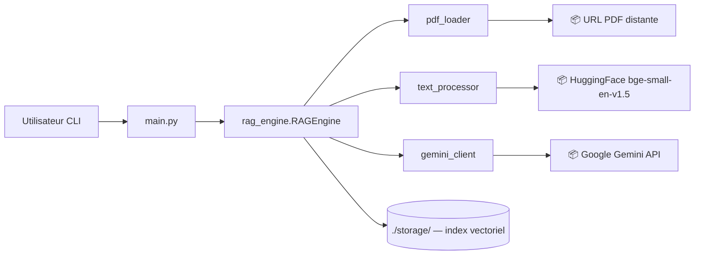

<!--
TEMPLATE — Architecture
=======================
Public cible : (1) une IA assistante de développement qui doit raisonner sur le système
sans relire tout le code à chaque tâche, (2) un humain qui prend le projet en cours.

Ce document est VIVANT : il est mis à jour avant chaque PR (par un skill IA, validé par
un humain). Il décrit le système TEL QU'IL EST, pas tel qu'on aimerait qu'il soit. Les
intentions et décisions à venir vont dans les ADR ou dans la backlog, pas ici.

Garde-fous d'écriture :
- Tout chiffre / nom de composant doit être vérifiable depuis le code ou un artefact
  versionné. Si déduit ou hypothétique, marquer explicitement "(à confirmer)".
- Distinguer "observé" / "décidé" / "ouvert".
- Toute affirmation forte → renvoyer vers un fichier source (code, ADR, schéma).
- Préférer les tableaux et listes courtes à la prose. Une PR doit pouvoir patcher 3 lignes,
  pas un paragraphe.

Le bloc "Mode d'emploi" en fin de fichier détaille la marche à suivre pour l'IA et le relecteur.
-->

# Architecture — RAG

| Champ | Valeur |
|---|---|
| **Dernière mise à jour** | 2026-05-11 |
| **Mise à jour par** | agent IA (doc-patcher) |
| **PR de référence** | fcd7a06 |
| **Version applicative** | 0.0.0 |
| **Statut du document** | Brouillon |

> **Résumé en 1 phrase** : Système de Retrieval-Augmented Generation (RAG) qui indexe des documents PDF depuis des URLs, génère des embeddings sémantiques via HuggingFace, et répond à des questions en langage naturel via le LLM Gemini de Google — à destination des développeurs et chercheurs.

---

## 1. Vue d'ensemble

### 1.1 Nature du système

| Dimension | Valeur |
|---|---|
| **Type** | CLI / Bibliothèque |
| **Mode** | Synchrone |
| **Multi-tenant** | Non — un index par URL de PDF (cloisonnement par hash MD5 de l'URL) |
| **Stateful** | Avec état persistant — embeddings et index vectoriel stockés dans `./storage/` |
| **Utilisateurs cibles** | Développeurs et chercheurs en ligne de commande |
| **Volumétrie typique** | (à confirmer) |

### 1.2 Flux principal

Au démarrage, `main.py` instancie `RAGEngine` avec l'URL d'un PDF. `RAGEngine` calcule un hash MD5 de l'URL et cherche un index persisté dans `./storage/index_<hash>/`. Si absent, `pdf_loader.load_pdf_from_url` télécharge le PDF (HTTP GET), puis `pdf_loader.load_documents_from_pdf` l'extrait via `PDFReader`. `text_processor.setup_advanced_text_processing` configure le modèle d'embeddings HuggingFace (`BAAI/bge-small-en-v1.5`, chunks de 512 tokens, overlap 50). `VectorStoreIndex` construit l'index et le persiste sur disque. À chaque requête utilisateur, `RAGEngine.query` effectue une recherche sémantique (top-k=3) et envoie le contexte récupéré au LLM Gemini (`gemini-2.5-flash`) pour générer la réponse.

---

## 2. Stack technique

| Couche | Choix | Version | Justification courte |
|---|---|---|---|
| **Langage principal** | Python | >=3.12 | Écosystème ML/IA dominant |
| **Framework applicatif** | LlamaIndex | (à confirmer) | Orchestration RAG : index, retrieval, query engine |
| **Embeddings** | HuggingFace `sentence-transformers` (BAAI/bge-small-en-v1.5) | (à confirmer) | Embeddings locaux, légers, haute qualité |
| **LLM** | Google Gemini (`gemini-2.5-flash`) via `llama-index-llms-gemini` | (à confirmer) | Génération de réponses contextuelles |
| **Persistance** | Fichiers locaux (`./storage/`) via LlamaIndex `StorageContext` | — | Index vectoriel sérialisé sur disque |
| **Cache** | Système de fichiers — détection par hash MD5 de l'URL | — | Évite de re-générer les embeddings |
| **Messaging** | Aucun | — | — |
| **Auth** | Clé API Google (variable dans `config.py`) | — | Accès au LLM Gemini |
| **Observabilité** | Aucun outillage dédié (prints console) | — | — |
| **CI/CD** | (à confirmer) | — | — |
| **Déploiement** | Local / script Python | — | Exécution via `python main.py` |

**Dépendances externes critiques** (services tiers dont la panne dégrade le service) :

| Service | Rôle | Mode d'appel | Fallback |
|---|---|---|---|
| Google Gemini API | Génération de réponses LLM | SDK HTTP (`llama-index-llms-gemini`) | Aucun — requête échoue si API indisponible |
| Source PDF (URL distante, ex. arxiv.org) | Documents source à indexer | HTTP GET (`requests`) | Aucun au premier run ; cache local ensuite |

---

## 3. Pattern d'architecture

### 3.1 Style retenu

Monolithe modulaire procédural. Le système est un script Python découpé en modules fonctionnels indépendants (`pdf_loader`, `text_processor`, `gemini_client`, `rag_engine`). Pas de services séparés, pas de bus de messages — la simplicité est assumée pour un usage CLI local.

> Décision tracée dans : (à confirmer)

### 3.2 Diagramme de composants

> Diagramme Mermaid (rendu nativement par GitLab/GitHub). Composants principaux et sens des appels.



### 3.3 Propriétés architecturales

| Propriété | Valeur observée | Justification / mécanisme |
|---|---|---|
| **Couplage** | Faible entre modules | Chaque module expose des fonctions autonomes ; `RAGEngine` orchestre sans connaître les détails internes |
| **Cohésion** | Haute par module | `pdf_loader` → I/O PDF, `text_processor` → embeddings/chunks, `gemini_client` → LLM |
| **Concurrence** | Séquentielle | Exécution monothreadée — pas de parallélisme explicite |
| **Idempotence** | Garantie à l'indexation | Re-run sur même URL → chargement depuis cache, index inchangé |
| **Cohérence** | Forte (locale) | Persistance sur disque synchrone via LlamaIndex `StorageContext.persist` |
| **Scalabilité** | Verticale uniquement | Mémoire/CPU liés à la taille du PDF et du modèle d'embeddings |

---

## 4. Composants

> Une ligne par composant principal. Détail dans les sous-sections si nécessaire. Les composants triviaux (ex. utilitaires sans logique) ne sont pas listés ici.

| Composant | Type | Localisation | Rôle | Entrées | Sorties |
|---|---|---|---|---|---|
| `main` | Point d'entrée CLI | [`main.py`](../main.py) | Boucle interactive utilisateur | stdin | stdout |
| `RAGEngine` | Orchestrateur | [`rag_engine.py`](../rag_engine.py) | Indexation, cache, query pipeline | URL PDF, question texte | Réponse texte |
| `pdf_loader` | Module I/O | [`pdf_loader.py`](../pdf_loader.py) | Téléchargement et extraction PDF | URL HTTP | Liste de `Document` LlamaIndex |
| `text_processor` | Module ML | [`text_processor.py`](../text_processor.py) | Configuration embeddings et chunking | — (configure `Settings` global) | `HuggingFaceEmbedding`, `SentenceSplitter` |
| `gemini_client` | Module LLM | [`gemini_client.py`](../gemini_client.py) | Initialisation, accès singleton, génération de texte, résumé et re-ranking via Gemini | Clé API (`config.py`), prompt texte | `Gemini` LLM instance, texte généré, passages re-rankés |

### 4.1 Détails par composant

#### gemini_client

- **Rôle** : Fournit un singleton `Gemini` LLM (modèle `models/gemini-2.5-flash`, température 0.1, max_tokens 1024 par défaut) et expose des fonctions utilitaires de haut niveau : génération de texte libre (`generate_text`), résumé (`summarize`), re-ranking de passages (`rerank_passages`), accès au singleton (`get_llm`), et réinitialisation (`reset_llm`).
- **Pattern** : Singleton paresseux via dictionnaire `_llm_state` — évite les effets de bord au niveau module.
- **Entrées** : Clé API Google (`config.py`), paramètres optionnels `model`, `temperature`, `max_tokens`
- **Sorties** : Instance `Gemini`, chaînes de texte générées, listes de passages re-rankés
- **Dépendances internes** : `config.GOOGLE_API_KEY`
- **Dépendances externes** : Google Gemini API (`llama-index-llms-gemini`)
- **Constantes par défaut** : `_DEFAULT_MODEL = "models/gemini-2.5-flash"`, `_DEFAULT_TEMPERATURE = 0.1`, `_DEFAULT_MAX_TOKENS = 1024`

#### RAGEngine

- **Rôle** : Orchestre l'ensemble du pipeline RAG — indexation au premier run, chargement depuis cache aux runs suivants, et exécution des requêtes sémantiques.
- **Entrées** : URL de PDF, questions texte utilisateur
- **Sorties** : Réponse textuelle générée par Gemini
- **Dépendances internes** : `pdf_loader`, `text_processor`, `gemini_client`
- **Dépendances externes** : Google Gemini API, URL PDF distante, système de fichiers local (`./storage/`)
- **Invariants** : Un même `pdf_url` produit toujours le même `index_path` (hash MD5 déterministe)
- **Pièges connus** : Le répertoire de cache est basé sur le hash de l'URL — un changement d'URL (même pour le même PDF) génère un nouvel index ; la suppression manuelle de `./storage/` force la ré-indexation complète

---

## 5. Architecture des données

> Vue résumée. Le détail (tables, colonnes, contraintes) est dans [data-model.md](data-model.md).

| Domaine | Stockage | Tables / collections | Volumétrie | Croissance |
|---|---|---|---|---|
| Index vectoriel PDF | Fichiers locaux (`./storage/index_<md5>/`) | Fichiers JSON/binaire LlamaIndex | Proportionnel à la taille du PDF | Linéaire (un répertoire par URL distincte) |

**Pattern temporel** : Aucun versioning — écrasement non applicable (un index par URL, identifié par hash).

**Politique de rétention** : Manuelle — suppression du répertoire `./storage/` pour forcer la ré-indexation. Aucune purge automatique.

---

## 6. Interfaces

> Vue résumée. Le détail (signatures, payloads, codes retour) est dans [contracts.md](contracts.md).

### 6.1 Interfaces exposées

| Interface | Type | Consommateurs | Stabilité |
|---|---|---|---|
| `RAGEngine.query(question)` | API Python | `main.py` / usage programmatique | Interne / privé |
| Boucle interactive `main.py` | CLI (stdin/stdout) | Utilisateur humain | Interne / privé |

### 6.2 Interfaces consommées

| Interface | Fournisseur | Type d'appel | Criticité |
|---|---|---|---|
| Google Gemini API (`models/gemini-2.5-flash`) | Google Cloud | Sync HTTP via SDK | Bloquante — aucune réponse sans LLM |
| URL PDF distante (ex. arxiv.org) | Externe | Sync HTTP GET (`requests`) | Bloquante au premier run uniquement |

---

## 7. Déploiement

### 7.1 Topologie

```
Machine locale développeur
└── python main.py
    ├── ./storage/           (cache index vectoriel sur disque local)
    └── /tmp/temp_rag_document.pdf  (fichier temporaire PDF téléchargé)
```

Aucun environnement de staging ou prod défini — usage local uniquement.

### 7.2 Environnements

| Environnement | URL / Cluster | Données | Auth | Trafic |
|---|---|---|---|---|
| **local** | Machine du développeur | PDFs publics distants | Clé API Google dans `config.py` | Utilisateur unique |

### 7.3 Configuration

- **Format** : Fichier Python (`config.py`)
- **Source de vérité** : `config.py` (non versionné — à ne pas committer avec la clé réelle)
- **Secrets** : `GOOGLE_API_KEY` — défini dans `config.py` ; ⚠️ ce fichier ne doit pas être commis en clair dans le repo
- **Feature flags** : Aucun

---

## 8. Préoccupations transverses

### 8.1 Sécurité

| Aspect | Mécanisme | Localisation |
|---|---|---|
| **Authentification** | Clé API Google | [`config.py`](../config.py) |
| **Autorisation** | Aucune (usage local mono-utilisateur) | — |
| **Secrets** | Clé API en clair dans `config.py` ⚠️ | [`config.py`](../config.py) — ne pas committer |
| **Données sensibles** | Aucun chiffrement des index locaux | `./storage/` |
| **Audit** | Aucun | — |

### 8.2 Observabilité

| Type | Outil | Volume | Rétention | Alerting |
|---|---|---|---|---|
| **Logs** | `print()` console uniquement | Faible | Session courante uniquement | Aucun |
| **Métriques** | Aucun outillage dédié | — | — | — |
| **Traces** | Aucun | — | — | — |
| **Erreurs** | Exceptions Python non capturées | — | — | — |

**Convention de corrélation** : Aucune.

### 8.3 Performance

| Métrique | Cible (SLO) | Mesure actuelle | Source |
|---|---|---|---|
| **Latence p95** | (à confirmer) | (à confirmer) | — |
| **Latence p99** | (à confirmer) | (à confirmer) | — |
| **Disponibilité** | N/A (usage local) | — | — |
| **Débit max** | (à confirmer) | (à confirmer) | — |

### 8.4 Résilience

- **Timeouts** : HTTP GET PDF → 30 secondes ([`pdf_loader.py:21`](../pdf_loader.py#L21)) ; appels Gemini → (à confirmer, géré par le SDK)
- **Retry** : Aucun mécanisme de retry explicite
- **Circuit breaker** : Aucun
- **Backpressure** : Aucun
- **Plan de reprise** : Aucun (usage local — relancer manuellement en cas d'échec)

---

## 9. Stratégie de test

| Niveau | Framework | Couverture | Quand |
|---|---|---|---|
| **Unitaire** | pytest + pytest-cov | (à confirmer) | À chaque commit |
| **Intégration** | pytest | (à confirmer) | À chaque PR |
| **Contract** | Aucun outillage dédié | — | — |
| **End-to-end** | Aucun | — | — |
| **Charge** | Aucun | — | — |
| **Sécurité** | bandit (SAST), ruff (lint) | Ensemble du code source | À chaque commit |

**Données de test** : (à confirmer) — répertoire `tests/` défini dans `pyproject.toml`.

---

## 10. Workflow de développement

- **Branches** : (à confirmer) — branche `main` observée
- **Convention de commits** : gitlint-core configuré (`pyproject.toml`) — convention précise à confirmer
- **CI** : ruff (lint + format), pyright (typage), bandit (sécurité), pytest + pytest-cov (tests)
- **Code review** : (à confirmer)
- **Mise à jour de cette doc** : Skill IA doc-patcher exécuté en pre-PR + relecture humaine — voir mode d'emploi en fin de fichier.

---

## 11. Décisions et points ouverts

### 11.1 Décisions actives

Aucun ADR actuellement.

### 11.2 Points ouverts

> Ce qui n'est pas tranché, source de risque ou de surprise pour un nouveau venu.

| # | Question | Impact | Owner |
|---|---|---|---|
| Q1 | `config.py` contient la clé API Google en clair — risque de fuite si commité | Sécurité — exposition de la clé Google | (à confirmer) |
| Q2 | Aucun mécanisme de retry ou de gestion d'erreur sur les appels Gemini et HTTP | Robustesse — échec silencieux ou crash brut | (à confirmer) |
| Q3 | Dépendances runtime non spécifiées dans `pyproject.toml` (seulement dans `requirements.txt`) | Reproductibilité — divergence possible entre envs | (à confirmer) |

### 11.3 Dette technique structurante

| Item | Origine | Coût d'évitement | Plan |
|---|---|---|---|
| Clé API en clair dans `config.py` | Choix initial de simplicité | Impossibilité de commiter `config.py` sans exposer un secret | Migrer vers variable d'environnement ou `.env` |
| Dépendances runtime absentes de `pyproject.toml` | Template initial sans deps applicatives | `pyproject.toml` ne suffit pas à reproduire l'env sans `requirements.txt` | Aligner `pyproject.toml` avec les dépendances de `requirements.txt` |

---

## 12. Références

- Modèle de données : [data-model.md](data-model.md)
- Contrats d'interface : [contracts.md](contracts.md)
- Glossaire : [glossaire.md](glossaire.md)
- Documentation fonctionnelle : [fonctionnel.md](fonctionnel.md)
- Index général : [index.md](index.md)
- ADR : (à confirmer)
- Runbooks ops : Aucun actuellement
- Dashboards : Aucun actuellement

---

<!--
MODE D'EMPLOI DU TEMPLATE
=========================

POUR L'IA QUI MET À JOUR CE DOCUMENT AVANT UNE PR

Déclencheurs (mettre à jour les sections concernées si la PR touche…) :

| Modification dans la PR | Sections à relire |
|---|---|
| Ajout / suppression / renommage d'un service ou module | §3 (diagramme), §4 (composants) |
| Changement de stack (langage, framework, lib majeure) | §2 |
| Nouvelle table / collection ou schéma modifié | §5 (résumé), data-model.md (détail) |
| Nouvelle interface exposée ou consommée | §6, contracts.md (détail) |
| Changement d'environnement, IaC, manifestes K8s | §7 |
| Nouveau mécanisme d'auth, audit, secrets | §8.1 |
| Nouveau collecteur logs / métriques / dashboards | §8.2 |
| SLO, timeout, retry, circuit breaker modifiés | §8.3, §8.4 |
| Nouveau type de test, framework de test | §9 |
| Changement de workflow CI ou règle de branche | §10 |
| Nouvel ADR fusionné | §11.1 |

Règles d'écriture :
1. Mettre à jour le bloc d'en-tête (date, PR de référence, version, mise à jour par).
2. Pour chaque modification, citer la PR ou le commit en référence si non évident.
3. Ne pas réécrire des sections inchangées — diff minimal.
4. Marquer "(à confirmer)" toute affirmation non vérifiable depuis le code à l'instant T.
5. Si une section devient obsolète, la VIDER avec une mention "Aucun {{X}} actuellement"
   plutôt que la supprimer — l'absence est une information.
6. Si la doc et le code divergent, ouvrir un point dans §11.2 et le signaler dans le
   message de PR — ne PAS aligner silencieusement.

Auto-checks à effectuer avant de proposer la mise à jour :
- [ ] Les composants listés en §4 existent réellement dans le repo (vérifier les chemins).
- [ ] Le diagramme Mermaid §3.2 correspond aux appels effectivement présents dans le code.
- [ ] Les versions §2 correspondent au manifeste de dépendances actuel.
- [ ] Les ADR cités §11.1 existent dans le dossier ADR.
- [ ] Les liens des §12 ne sont pas cassés.

POUR LE RELECTEUR HUMAIN

- Le diff doit être lisible : si plus de 30 lignes changent, demander à l'IA de
  scinder par section.
- Vérifier que les chiffres (SLO, volumétrie, version) ne sont pas inventés.
- Toute hypothèse "(à confirmer)" doit être levée ou explicitement assumée.
- Si une section est trop générique (pleine de "{{}}" non remplis), c'est un signe que
  la section n'a jamais été vraiment travaillée — la signaler ou la vider.

POUR ADAPTER À UN AUTRE PROJET

1. Remplacer `{{NOM_PROJET}}` et tous les autres `{{...}}`.
2. Garder les 12 sections et leur ordre — c'est la grille standard.
3. Une section vide est légitime si « non applicable » ; le marquer explicitement.
4. Adapter le diagramme Mermaid §3.2 au style réel (peut être un schéma C4 niveau 2,
   un diagramme de séquence, etc.).
5. Pour un système purement frontal : §5 et §6 peuvent être minces, mais ne pas
   supprimer — pointer vers le backend qui porte ces aspects.
6. Pour un système purement batch : adapter §1.2 ("flux principal" = traitement d'un fichier),
   §6 (interfaces = formats E/S), §8.3 (perf = débit + temps fenêtre).
-->
