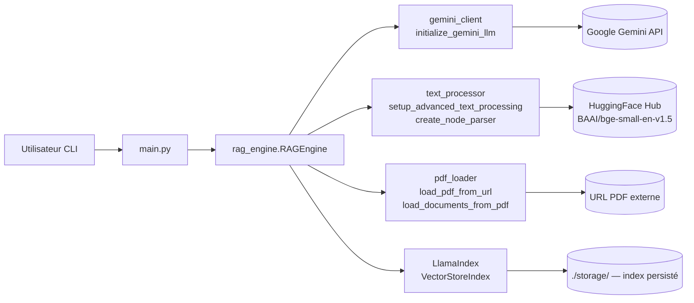

<!--
TEMPLATE — Architecture
=======================
Public cible : (1) une IA assistante de développement qui doit raisonner sur le système
sans relire tout le code à chaque tâche, (2) un humain qui prend le projet en cours.

Ce document est VIVANT : il est mis à jour avant chaque PR (par un skill IA, validé par
un humain). Il décrit le système TEL QU'IL EST, pas tel qu'on aimerait qu'il soit. Les
intentions et décisions à venir vont dans les ADR ou dans la backlog, pas ici.

Garde-fous d'écriture :
- Tout chiffre / nom de composant doit être vérifiable depuis le code ou un artefact
  versionné. Si déduit ou hypothétique, marquer explicitement "(à confirmer)".
- Distinguer "observé" / "décidé" / "ouvert".
- Toute affirmation forte → renvoyer vers un fichier source (code, ADR, schéma).
- Préférer les tableaux et listes courtes à la prose. Une PR doit pouvoir patcher 3 lignes,
  pas un paragraphe.

Le bloc "Mode d'emploi" en fin de fichier détaille la marche à suivre pour l'IA et le relecteur.
-->

# Architecture — RAG

| Champ | Valeur |
|---|---|
| **Dernière mise à jour** | 2026-05-21 |
| **Mise à jour par** | agent IA |
| **PR de référence** | 6d1386c |
| **Version applicative** | (à confirmer) |
| **Statut du document** | Brouillon |

> **Résumé en 1 phrase** : Système de questions-réponses interactif qui télécharge un PDF depuis une URL, en construit un index vectoriel persistant, puis répond aux questions en langage naturel via le modèle Gemini 2.5 Flash.

---

## 1. Vue d'ensemble

### 1.1 Nature du système

| Dimension | Valeur |
|---|---|
| **Type** | CLI |
| **Mode** | Synchrone |
| **Multi-tenant** | Non |
| **Stateful** | Avec état persistant — index vectoriel sur disque dans `./storage/` (un sous-dossier par PDF identifié par hash MD5 de l'URL) |
| **Utilisateurs cibles** | Internes / développeurs |
| **Volumétrie typique** | Usage interactif mono-utilisateur ; (à confirmer) |

### 1.2 Flux principal

> Décrire en 5-10 lignes le chemin d'une requête / d'un enregistrement / d'un événement de l'entrée à la sortie, en nommant les composants traversés. Cette section est le « tour express » d'un nouveau venu.

L'utilisateur lance `main.py` avec une URL de PDF codée en dur. `RAGEngine.__init__` calcule un hash MD5 de l'URL pour localiser un éventuel index existant dans `./storage/`. Si l'index n'existe pas, `pdf_loader.load_pdf_from_url` télécharge le PDF (HTTP GET, timeout 30s) vers un fichier temporaire, puis `pdf_loader.load_documents_from_pdf` le parse via `PDFReader`. `text_processor.setup_advanced_text_processing` configure l'embedding HuggingFace (`BAAI/bge-small-en-v1.5`, chunk 512 tokens, overlap 50) et `text_processor.create_node_parser` crée un `SentenceSplitter`. `VectorStoreIndex.from_documents` construit l'index en mémoire, puis le persiste sur disque. À chaque question de l'utilisateur, `RAGEngine.query` appelle le `query_engine` (top-k=3, mode compact) qui effectue une recherche sémantique puis génère la réponse via `gemini_client.initialize_gemini_llm` (Gemini 2.5 Flash, température 0.1, clé lue depuis `GOOGLE_API_KEY` via `python-dotenv`).

---

## 2. Stack technique

| Couche | Choix | Version | Justification courte |
|---|---|---|---|
| **Langage principal** | Python | 3.12 | cible `pyproject.toml` |
| **Framework applicatif** | LlamaIndex (llama-index-core) | (à confirmer) | orchestration RAG — index, query engine, settings |
| **Persistance** | Fichiers JSON sur disque (`./storage/`) | — | index vectoriel sérialisé par LlamaIndex |
| **Cache** | Disque local (index persisté par hash URL) | — | évite de re-générer les embeddings |
| **Messaging** | Aucun | — | — |
| **Auth** | Variable d'environnement `GOOGLE_API_KEY` via `python-dotenv` | — | clé API Gemini |
| **Observabilité** | `print` stdout uniquement | — | (à confirmer) |
| **CI/CD** | (à confirmer) | — | — |
| **Déploiement** | Local / venv | — | `runner = "venv"` dans `pyproject.toml` |

**Dépendances externes critiques** (services tiers dont la panne dégrade le service) :

| Service | Rôle | Mode d'appel | Fallback |
|---|---|---|---|
| Google Gemini API (`models/gemini-2.5-flash`) | Génération de réponses | SDK `llama_index.llms.gemini` | Aucun — réponse impossible sans LLM |
| HuggingFace Hub (`BAAI/bge-small-en-v1.5`) | Téléchargement du modèle d'embedding au premier lancement | HTTP | Index non constructible si modèle absent du cache local |
| URL source du PDF | Acquisition du document à indexer | HTTP GET (timeout 30s) | Aucun — indexation impossible |

---

## 3. Pattern d'architecture

### 3.1 Style retenu

Monolithe modulaire procédural. Le projet est découpé en modules Python à responsabilité unique (`gemini_client`, `pdf_loader`, `text_processor`, `rag_engine`) orchestrés par un point d'entrée `main.py`. Pas de services distribués, pas de framework web — adapté à un outil CLI mono-utilisateur.

> Décision tracée dans : (à confirmer)

### 3.2 Diagramme de composants

> Diagramme Mermaid (rendu nativement par GitLab/GitHub). Montrer les composants principaux et le sens des appels — pas les classes.



### 3.3 Propriétés architecturales

| Propriété | Valeur observée | Justification / mécanisme |
|---|---|---|
| **Couplage** | Faible | Modules Python indépendants reliés par imports directs ; `RAGEngine` agrège les autres |
| **Cohésion** | Haute | Un fichier = une responsabilité (LLM / PDF / texte / moteur RAG) |
| **Concurrence** | Séquentielle | Boucle interactive synchrone, pas de threads |
| **Idempotence** | Garantie sur l'indexation | Hash MD5 de l'URL → répertoire fixe ; re-run sans re-téléchargement ni re-embedding |
| **Cohérence** | Forte | Persistance fichier locale, pas de concurrence |
| **Scalabilité** | Non applicable | Outil CLI mono-utilisateur |

---

## 4. Composants

> Une ligne par composant principal. Détail dans les sous-sections si nécessaire. Les composants triviaux (ex. utilitaires sans logique) ne sont pas listés ici.

| Composant | Type | Localisation | Rôle | Entrées | Sorties |
|---|---|---|---|---|---|
| `main` | Module / point d'entrée | `main.py` | Boucle interactive CLI | Saisie utilisateur | Questions vers `RAGEngine`, réponses stdout |
| `RAGEngine` | Module / classe | `rag_engine.py` | Orchestration : build ou chargement d'index, query | URL PDF, question texte | Réponse texte |
| `gemini_client` | Module | `gemini_client.py` | Initialisation du LLM Gemini et enregistrement dans LlamaIndex Settings | `GOOGLE_API_KEY` (env) | Instance `Gemini` configurée dans `Settings.llm` |
| `text_processor` | Module | `text_processor.py` | Configuration embedding HuggingFace et node parser | — | `HuggingFaceEmbedding` + `SentenceSplitter` enregistrés dans Settings |
| `pdf_loader` | Module | `pdf_loader.py` | Téléchargement et parsing PDF | URL ou chemin local | Liste de documents LlamaIndex |

### 4.1 Détails par composant

#### RAGEngine

- **Rôle** : Construit ou recharge un `VectorStoreIndex` LlamaIndex pour un PDF donné par URL, puis expose une méthode `query` pour répondre aux questions.
- **Entrées** : URL du PDF (`pdf_url`), répertoire de stockage (`storage_dir`, défaut `./storage`)
- **Sorties** : Réponse texte générée par Gemini
- **Dépendances internes** : `gemini_client.initialize_gemini_llm`, `text_processor.setup_advanced_text_processing`, `text_processor.create_node_parser`, `pdf_loader.load_pdf_from_url`, `pdf_loader.load_documents_from_pdf`
- **Dépendances externes** : LlamaIndex `VectorStoreIndex`, système de fichiers local
- **Invariants** : Un même PDF (même URL) produit toujours le même répertoire d'index (hash MD5 déterministe)
- **Pièges connus** : ⚠️ La clé `GOOGLE_API_KEY` doit être présente dans l'environnement avant instanciation — `load_dotenv()` est appelé au niveau module dans `gemini_client.py`, donc le `.env` doit exister à la racine du projet

#### gemini_client

- **Rôle** : Crée une instance `Gemini` (modèle `models/gemini-2.5-flash`, température 0.1) et l'enregistre dans `Settings.llm`.
- **Entrées** : Variable d'environnement `GOOGLE_API_KEY`
- **Sorties** : Instance `Gemini` (et effet de bord sur `Settings.llm`)
- **Dépendances externes** : Google Gemini API, `python-dotenv`
- **Pièges connus** : ⚠️ `load_dotenv()` est exécuté à l'import du module — charger ce module modifie l'environnement global

---

## 5. Architecture des données

> Vue résumée. Le détail (tables, colonnes, contraintes) est dans [data-model.md](data-model.md).

| Domaine | Stockage | Tables / collections | Volumétrie | Croissance |
|---|---|---|---|---|
| Index vectoriel | Fichiers JSON sur disque (`./storage/index_<md5>/`) | Un répertoire par PDF indexé | Proportionnel au nombre de chunks (chunk_size=512) | Linéaire au nombre de PDFs |

**Pattern temporel** : Aucun versioning — l'index est écrasé si le répertoire est supprimé manuellement. Pas de gestion de versions de document.

**Politique de rétention** : Aucune politique automatique — les index persistent indéfiniment dans `./storage/` jusqu'à suppression manuelle.

---

## 6. Interfaces

> Vue résumée. Le détail (signatures, payloads, codes retour) est dans [contracts.md](contracts.md).

### 6.1 Interfaces exposées

| Interface | Type | Consommateurs | Stabilité |
|---|---|---|---|
| `RAGEngine.query(question)` | API Python | `main.py` (CLI) | Interne / privé |

### 6.2 Interfaces consommées

| Interface | Fournisseur | Type d'appel | Criticité |
|---|---|---|---|
| Google Gemini API (`models/gemini-2.5-flash`) | Google | Sync via SDK LlamaIndex | Bloquante |
| HuggingFace Hub (`BAAI/bge-small-en-v1.5`) | HuggingFace | HTTP (téléchargement au 1er lancement) | Bloquante au 1er run, dégradable ensuite (cache local) |
| URL source PDF | Externe | HTTP GET sync | Bloquante |

---

## 7. Déploiement

### 7.1 Topologie

```
Poste local
└── Python 3.12 (venv)
    ├── main.py  (point d'entrée CLI)
    └── ./storage/  (index vectoriel persisté sur disque)
```

### 7.2 Environnements

| Environnement | URL / Cluster | Données | Auth | Trafic |
|---|---|---|---|---|
| **local** | Poste développeur | PDFs téléchargés depuis URL publique | `GOOGLE_API_KEY` via `.env` | Mono-utilisateur |

### 7.3 Configuration

- **Format** : Variables d'environnement via fichier `.env` (chargé par `python-dotenv`)
- **Source de vérité** : `.env` local (non versionné)
- **Secrets** : `GOOGLE_API_KEY` — lu depuis l'environnement, jamais en clair dans le repo
- **Feature flags** : Aucun

---

## 8. Préoccupations transverses

### 8.1 Sécurité

| Aspect | Mécanisme | Localisation |
|---|---|---|
| **Authentification** | Clé API Google (`GOOGLE_API_KEY`) | Variable d'environnement / `.env` |
| **Autorisation** | Aucune (outil CLI mono-utilisateur) | — |
| **Secrets** | Variables d'environnement via `python-dotenv` | `.env` (non versionné) |
| **Données sensibles** | Aucun chiffrement au repos — index vectoriel en clair sur disque | `./storage/` |
| **Audit** | Aucun | — |

### 8.2 Observabilité

| Type | Outil | Volume | Rétention | Alerting |
|---|---|---|---|---|
| **Logs** | `print` stdout | Faible | Aucune (session terminale) | Aucun |
| **Métriques** | Aucun | — | — | — |
| **Traces** | Aucun | — | — | — |
| **Erreurs** | Exceptions Python non interceptées | — | — | — |

**Convention de corrélation** : Aucune.

### 8.3 Performance

| Métrique | Cible (SLO) | Mesure actuelle | Source |
|---|---|---|---|
| **Latence p95** | (à confirmer) | (à confirmer) | — |
| **Latence p99** | (à confirmer) | (à confirmer) | — |
| **Disponibilité** | Non applicable (CLI) | — | — |
| **Débit max** | Non applicable (CLI mono-utilisateur) | — | — |

### 8.4 Résilience

- **Timeouts** : HTTP GET PDF — 30s (`pdf_loader.py:21`) ; appels Gemini — géré par le SDK (à confirmer)
- **Retry** : Aucun
- **Circuit breaker** : Aucun
- **Backpressure** : Non applicable
- **Plan de reprise** : Non applicable (CLI local)

---

## 9. Stratégie de test

| Niveau | Framework | Couverture | Quand |
|---|---|---|---|
| **Unitaire** | pytest (`pytest>=9.0.3`) | (à confirmer) | À chaque commit |
| **Intégration** | pytest | (à confirmer) | À chaque PR |
| **Contract** | Aucun actuellement | — | — |
| **End-to-end** | Aucun actuellement | — | — |
| **Charge** | Aucun actuellement | — | — |
| **Sécurité** | bandit (`bandit>=1.9.4`), pyright (`pyright>=1.1.409`), ruff (`ruff>=0.15.14`) | SAST statique | (à confirmer) |

**Données de test** : (à confirmer)

---

## 10. Workflow de développement

- **Branches** : `main` (branche principale observée dans le repo)
- **Convention de commits** : gitlint (`gitlint-core>=0.19.1`) configuré — convention exacte (à confirmer)
- **CI** : (à confirmer)
- **Code review** : (à confirmer)
- **Mise à jour de cette doc** : Skill IA doc-sync exécuté en pre-PR + relecture humaine.

---

## 11. Décisions et points ouverts

### 11.1 Décisions actives

| ADR | Sujet | Date | Statut |
|---|---|---|---|
| — | Aucun ADR documenté actuellement | — | — |

### 11.2 Points ouverts

> Ce qui n'est pas tranché, source de risque ou de surprise pour un nouveau venu.

| # | Question | Impact | Owner |
|---|---|---|---|
| Q1 | L'URL du PDF est codée en dur dans `main.py` — doit-elle devenir un paramètre CLI ? | Limite la réutilisabilité sans modification du code | (à confirmer) |
| Q2 | Aucun retry ni circuit breaker sur les appels Gemini API — comportement en cas de rate-limit ? | Crash non géré possible | (à confirmer) |

### 11.3 Dette technique structurante

> Limitations connues qui orientent la lecture du code. Ne pas lister chaque TODO ; uniquement ce qui change la grille de lecture du système.

| Item | Origine | Coût d'évitement | Plan |
|---|---|---|---|
| URL PDF en dur dans `main.py` | Implémentation initiale | Impossible de changer de document sans éditer le code | Paramètre CLI ou variable d'environnement (à confirmer) |
| Absence de gestion d'erreurs sur les appels HTTP et LLM | Implémentation initiale | Crashes non gracieux | Ajouter try/except et retry (à confirmer) |

---

## 12. Références

- Modèle de données : [data-model.md](data-model.md)
- Contrats d'interface : [contracts.md](contracts.md)
- Glossaire : [glossaire.md](glossaire.md)
- Documentation fonctionnelle : [fonctionnel.md](fonctionnel.md)
- Index général : [index.md](index.md)
- ADR : (à confirmer)
- Runbooks ops : Non applicable
- Dashboards : Non applicable

---

<!--
MODE D'EMPLOI DU TEMPLATE
=========================

POUR L'IA QUI MET À JOUR CE DOCUMENT AVANT UNE PR

Déclencheurs (mettre à jour les sections concernées si la PR touche…) :

| Modification dans la PR | Sections à relire |
|---|---|
| Ajout / suppression / renommage d'un service ou module | §3 (diagramme), §4 (composants) |
| Changement de stack (langage, framework, lib majeure) | §2 |
| Nouvelle table / collection ou schéma modifié | §5 (résumé), data-model.md (détail) |
| Nouvelle interface exposée ou consommée | §6, contracts.md (détail) |
| Changement d'environnement, IaC, manifestes K8s | §7 |
| Nouveau mécanisme d'auth, audit, secrets | §8.1 |
| Nouveau collecteur logs / métriques / dashboards | §8.2 |
| SLO, timeout, retry, circuit breaker modifiés | §8.3, §8.4 |
| Nouveau type de test, framework de test | §9 |
| Changement de workflow CI ou règle de branche | §10 |
| Nouvel ADR fusionné | §11.1 |

Règles d'écriture :
1. Mettre à jour le bloc d'en-tête (date, PR de référence, version, mise à jour par).
2. Pour chaque modification, citer la PR ou le commit en référence si non évident.
3. Ne pas réécrire des sections inchangées — diff minimal.
4. Marquer "(à confirmer)" toute affirmation non vérifiable depuis le code à l'instant T.
5. Si une section devient obsolète, la VIDER avec une mention "Aucun {{X}} actuellement"
   plutôt que la supprimer — l'absence est une information.
6. Si la doc et le code divergent, ouvrir un point dans §11.2 et le signaler dans le
   message de PR — ne PAS aligner silencieusement.

Auto-checks à effectuer avant de proposer la mise à jour :
- [ ] Les composants listés en §4 existent réellement dans le repo (vérifier les chemins).
- [ ] Le diagramme Mermaid §3.2 correspond aux appels effectivement présents dans le code.
- [ ] Les versions §2 correspondent au manifeste de dépendances actuel.
- [ ] Les ADR cités §11.1 existent dans le dossier ADR.
- [ ] Les liens des §12 ne sont pas cassés.

POUR LE RELECTEUR HUMAIN

- Le diff doit être lisible : si plus de 30 lignes changent, demander à l'IA de
  scinder par section.
- Vérifier que les chiffres (SLO, volumétrie, version) ne sont pas inventés.
- Toute hypothèse "(à confirmer)" doit être levée ou explicitement assumée.
- Si une section est trop générique (pleine de "{{}}" non remplis), c'est un signe que
  la section n'a jamais été vraiment travaillée — la signaler ou la vider.

POUR ADAPTER À UN AUTRE PROJET

1. Remplacer `{{NOM_PROJET}}` et tous les autres `{{...}}`.
2. Garder les 12 sections et leur ordre — c'est la grille standard.
3. Une section vide est légitime si « non applicable » ; le marquer explicitement.
4. Adapter le diagramme Mermaid §3.2 au style réel (peut être un schéma C4 niveau 2,
   un diagramme de séquence, etc.).
5. Pour un système purement frontal : §5 et §6 peuvent être minces, mais ne pas
   supprimer — pointer vers le backend qui porte ces aspects.
6. Pour un système purement batch : adapter §1.2 ("flux principal" = traitement d'un fichier),
   §6 (interfaces = formats E/S), §8.3 (perf = débit + temps fenêtre).
-->
