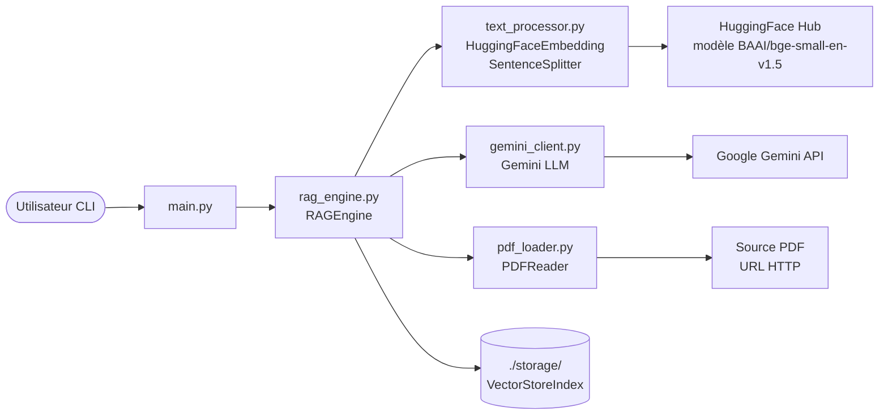

<!--
TEMPLATE — Architecture
=======================
Public cible : (1) une IA assistante de développement qui doit raisonner sur le système
sans relire tout le code à chaque tâche, (2) un humain qui prend le projet en cours.

Ce document est VIVANT : il est mis à jour avant chaque PR (par un skill IA, validé par
un humain). Il décrit le système TEL QU'IL EST, pas tel qu'on aimerait qu'il soit. Les
intentions et décisions à venir vont dans les ADR ou dans la backlog, pas ici.

Garde-fous d'écriture :
- Tout chiffre / nom de composant doit être vérifiable depuis le code ou un artefact
  versionné. Si déduit ou hypothétique, marquer explicitement "(à confirmer)".
- Distinguer "observé" / "décidé" / "ouvert".
- Toute affirmation forte → renvoyer vers un fichier source (code, ADR, schéma).
- Préférer les tableaux et listes courtes à la prose. Une PR doit pouvoir patcher 3 lignes,
  pas un paragraphe.

Le bloc "Mode d'emploi" en fin de fichier détaille la marche à suivre pour l'IA et le relecteur.
-->

# Architecture — RAG

| Champ | Valeur |
|---|---|
| **Dernière mise à jour** | 2026-05-10 |
| **Mise à jour par** | agent IA (doc-patcher) |
| **PR de référence** | 04b7fd4 |
| **Version applicative** | (à confirmer) |
| **Statut du document** | Brouillon |

> **Résumé en 1 phrase** : Système de Retrieval-Augmented Generation (RAG) qui permet d'interroger des documents PDF en langage naturel via des embeddings sémantiques HuggingFace et le LLM Gemini de Google.

---

## 1. Vue d'ensemble

### 1.1 Nature du système

| Dimension | Valeur |
|---|---|
| **Type** | CLI |
| **Mode** | Synchrone |
| **Multi-tenant** | Non — une session par processus, un PDF indexé à la fois |
| **Stateful** | Avec état persistant — index vectoriel stocké dans `./storage/` sur disque local |
| **Utilisateurs cibles** | Internes / développeurs / chercheurs |
| **Volumétrie typique** | (à confirmer) — usage interactif, quelques requêtes par session |

### 1.2 Flux principal

Au premier lancement, `main.py` instancie `RAGEngine` avec une URL de PDF. `pdf_loader.py` télécharge le fichier via HTTP et le sauvegarde dans un répertoire temporaire. `text_processor.py` configure le modèle d'embedding HuggingFace (`BAAI/bge-small-en-v1.5`) et le `SentenceSplitter` (chunks de 512 tokens, overlap 50). `rag_engine.py` construit un `VectorStoreIndex` LlamaIndex depuis les documents extraits et persiste l'index dans `./storage/index_<md5_url>/`. Aux lancements suivants, l'index est rechargé depuis le cache (détection par hash MD5 de l'URL). Lors d'une requête utilisateur, le `query_engine` effectue une recherche sémantique (top-k=3) et transmet le contexte récupéré à `gemini_client.py` (modèle `gemini-2.5-flash`) qui génère la réponse finale affichée dans la CLI.

---

## 2. Stack technique

| Couche | Choix | Version | Justification courte |
|---|---|---|---|
| **Langage principal** | Python | 3.12 (cible ruff/pyright) | Écosystème ML/IA dominant |
| **Framework applicatif** | LlamaIndex (llama-index) | (à confirmer) | Orchestration RAG clé-en-main : index, retrieval, query engine |
| **Embeddings** | HuggingFace — `BAAI/bge-small-en-v1.5` | (à confirmer) | Modèle léger haute qualité pour la recherche sémantique |
| **LLM** | Google Gemini (`gemini-2.5-flash`) | API REST via SDK | Génération de réponses contextuelles |
| **Persistance** | Système de fichiers local (`./storage/`) | — | Sérialisation native LlamaIndex du VectorStoreIndex |
| **Cache** | Disque — détection par hash MD5 de l'URL | — | Évite la re-génération des embeddings à chaque lancement |
| **Messaging** | Aucun | — | — |
| **Auth** | Clé API Google (`GOOGLE_API_KEY` dans `config.py`) | — | Simple clé applicative pour l'accès Gemini |
| **Observabilité** | Aucune — logs console (`print`) uniquement | — | (à confirmer) |
| **CI/CD** | (à confirmer) | — | Dev tools : pytest, ruff, pyright, bandit |
| **Déploiement** | Local / VM — exécution directe Python | — | `python main.py` |

**Dépendances externes critiques** (services tiers dont la panne dégrade le service) :

| Service | Rôle | Mode d'appel | Fallback |
|---|---|---|---|
| Google Gemini API | Génération de réponses LLM | SDK `google-generativeai` / HTTPS | Aucun — service bloquant |
| Source PDF (URL HTTP) | Chargement du document à indexer | HTTP GET via `requests` | Aucun au premier lancement ; cache disque utilisé aux suivants |
| HuggingFace Hub | Téléchargement du modèle d'embedding | HTTP (au premier chargement) | Cache local du modèle après premier téléchargement |

---

## 3. Pattern d'architecture

### 3.1 Style retenu

Monolithe modulaire procédural. Le système est une application Python mono-processus découpée en modules à responsabilité unique (`pdf_loader`, `text_processor`, `gemini_client`, `rag_engine`, `main`). LlamaIndex joue le rôle de framework d'orchestration interne. Il n'y a ni microservices ni messagerie asynchrone — le choix délibère la simplicité pour un outil interactif local.

> Décision tracée dans : (à confirmer — aucun ADR identifié dans le dépôt)

### 3.2 Diagramme de composants



### 3.3 Propriétés architecturales

| Propriété | Valeur observée | Justification / mécanisme |
|---|---|---|
| **Couplage** | Faible entre modules | Chaque module expose des fonctions simples ; `rag_engine` orchestre via imports directs |
| **Cohésion** | Haute | Un fichier = une responsabilité (chargement PDF, embeddings, LLM, moteur RAG, CLI) |
| **Concurrence** | Séquentielle | Mono-processus, aucun thread ni async ; les appels réseau (PDF, Gemini, HF) sont bloquants |
| **Idempotence** | Garantie pour l'indexation | Re-run sur même URL = rechargement depuis cache, pas de re-écriture |
| **Cohérence** | Forte (locale) | Index persisté atomiquement par LlamaIndex via `storage_context.persist()` |
| **Scalabilité** | Non applicable | Usage interactif local ; pas de conception pour montée en charge |

---

## 4. Composants

> Une ligne par composant principal. Détail dans les sous-sections si nécessaire. Les composants triviaux (ex. utilitaires sans logique) ne sont pas listés ici.

| Composant | Type | Localisation | Rôle | Entrées | Sorties |
|---|---|---|---|---|---|
| `main` | Module CLI | `main.py` | Point d'entrée interactif | Saisie utilisateur (stdin) | Affichage réponse (stdout) |
| `RAGEngine` | Module / Classe | `rag_engine.py` | Orchestrateur : indexation, cache, requête | URL PDF, question texte | Réponse texte générée |
| `pdf_loader` | Module | `pdf_loader.py` | Téléchargement et parsing PDF | URL HTTP | Liste de documents LlamaIndex |
| `text_processor` | Module | `text_processor.py` | Configuration embeddings et chunking | — | `HuggingFaceEmbedding`, `SentenceSplitter` |
| `gemini_client` | Module | `gemini_client.py` | Initialisation du LLM Gemini | `GOOGLE_API_KEY` (config) | Instance `Gemini` LlamaIndex |
| `VectorStoreIndex` | Lib (LlamaIndex) | `./storage/` | Index vectoriel persisté sur disque | Documents chunké + embeddings | Résultats de recherche sémantique |

### 4.1 Détails par composant

#### RAGEngine (`rag_engine.py`)

- **Rôle** : Orchestre l'ensemble du pipeline RAG — initialise les composants, gère le cache disque (hash MD5 de l'URL), construit ou charge l'index, expose la méthode `query()`.
- **Entrées** : URL PDF (string), répertoire de stockage (`./storage/` par défaut)
- **Sorties** : Réponse texte via `query_engine.query()`
- **Dépendances internes** : `pdf_loader`, `text_processor`, `gemini_client`
- **Dépendances externes** : LlamaIndex (`VectorStoreIndex`, `StorageContext`), système de fichiers local
- **Invariants** : Si `./storage/index_<md5>/` existe, l'index est chargé depuis le cache sans re-téléchargement ni re-embedding
- **Pièges connus** : ⚠️ Le hash est calculé sur l'URL brute — un changement de contenu sans changement d'URL ne déclenche pas de re-indexation

#### `gemini_client` (`gemini_client.py`)

- **Rôle** : Instancie le LLM Gemini (`gemini-2.5-flash`, température 0.1) et l'injecte dans les `Settings` globaux de LlamaIndex.
- **Entrées** : `GOOGLE_API_KEY` importée depuis `config.py`
- **Sorties** : Instance `Gemini` assignée à `Settings.llm`
- **Dépendances externes** : Google Gemini API (`llama-index-llms-gemini`)
- **Pièges connus** : ⚠️ `config.py` n'est pas versionné (absent du dépôt) — la clé API doit être fournie manuellement avant exécution

---

## 5. Architecture des données

> Vue résumée. Le détail (tables, colonnes, contraintes) est dans [data-model.md](data-model.md).

| Domaine | Stockage | Tables / collections | Volumétrie | Croissance |
|---|---|---|---|---|
| Index vectoriel | Fichiers locaux (`./storage/index_<md5>/`) | Répertoires par URL hashée — format LlamaIndex natif (JSON/pickle) | Proportionnel à la taille du PDF | Linéaire — un répertoire par PDF indexé |

**Pattern temporel** : Aucun versioning — remplacement complet si l'index est supprimé manuellement et reconstruit.

**Politique de rétention** : Aucune politique automatique — les répertoires `./storage/` persistent jusqu'à suppression manuelle.

---

## 6. Interfaces

> Vue résumée. Le détail (signatures, payloads, codes retour) est dans [contracts.md](contracts.md).

### 6.1 Interfaces exposées

| Interface | Type | Consommateurs | Stabilité |
|---|---|---|---|
| CLI interactive (`main.py`) | CLI (stdin/stdout) | Utilisateur humain | Privé / interne |

### 6.2 Interfaces consommées

| Interface | Fournisseur | Type d'appel | Criticité |
|---|---|---|---|
| Google Gemini API | Google Cloud | Sync HTTP (SDK) | Bloquante — aucune réponse sans LLM |
| Source PDF (URL HTTP) | Serveur externe (ex. arxiv.org) | Sync HTTP GET | Bloquante au premier lancement ; non bloquante si cache présent |
| HuggingFace Hub (modèle embedding) | HuggingFace | Sync HTTP (premier chargement) | Dégradable — modèle mis en cache localement après premier téléchargement |

---

## 7. Déploiement

### 7.1 Topologie

```
Machine locale (développeur)
└── python main.py
    ├── ./storage/          ← index vectoriel persisté
    └── /tmp/               ← PDF téléchargé (temporaire)
```

Aucun environnement de staging ou de production identifié — outil local uniquement (à confirmer).

### 7.2 Environnements

| Environnement | URL / Cluster | Données | Auth | Trafic |
|---|---|---|---|---|
| **local** | Machine développeur | PDF publics / de test | Clé API Google dans `config.py` | Utilisateur unique |

### 7.3 Configuration

- **Format** : Fichier Python (`config.py`) — non versionné
- **Source de vérité** : Fichier local `config.py` à créer manuellement
- **Secrets** : `GOOGLE_API_KEY` définie dans `config.py` — ⚠️ ne pas commiter en clair dans le repo
- **Feature flags** : Aucun

---

## 8. Préoccupations transverses

### 8.1 Sécurité

| Aspect | Mécanisme | Localisation |
|---|---|---|
| **Authentification** | Clé API Google (`GOOGLE_API_KEY`) | `config.py` (non versionné) |
| **Autorisation** | Aucun mécanisme applicatif — usage local mono-utilisateur | — |
| **Secrets** | Fichier `config.py` local non commité — ⚠️ aucun gestionnaire de secrets | `config.py` |
| **Données sensibles** | Aucun traitement de données personnelles identifié | — |
| **Audit** | Aucun — logs console uniquement (`print`) | — |

### 8.2 Observabilité

| Type | Outil | Volume | Rétention | Alerting |
|---|---|---|---|---|
| **Logs** | `print()` console | Faible | Durée de la session | Aucun |
| **Métriques** | Aucun | — | — | — |
| **Traces** | Aucun | — | — | — |
| **Erreurs** | Exceptions Python non capturées | — | — | Aucun |

**Convention de corrélation** : Aucune — pas d'identifiant de corrélation entre les appels.

### 8.3 Performance

| Métrique | Cible (SLO) | Mesure actuelle | Source |
|---|---|---|---|
| **Latence p95** | (à confirmer) | (à confirmer) | — |
| **Latence p99** | (à confirmer) | (à confirmer) | — |
| **Disponibilité** | Non applicable — outil local | — | — |
| **Débit max** | Non applicable — usage interactif | — | — |

### 8.4 Résilience

- **Timeouts** : HTTP GET PDF — timeout fixe à 30 secondes (`requests.get(..., timeout=30)`) ; appels Gemini — géré par le SDK (à confirmer)
- **Retry** : Aucune politique de retry implémentée
- **Circuit breaker** : Aucun
- **Backpressure** : Non applicable
- **Plan de reprise** : Aucun — outil local sans SLA

---

## 9. Stratégie de test

| Niveau | Framework | Couverture | Quand |
|---|---|---|---|
| **Unitaire** | pytest + pytest-cov | (à confirmer — dossier `tests/` configuré dans `pyproject.toml`) | À chaque commit |
| **Intégration** | pytest | (à confirmer) | À chaque PR |
| **Contract** | Aucun identifié | — | — |
| **End-to-end** | Aucun identifié | — | — |
| **Charge** | Aucun identifié | — | — |
| **Sécurité** | bandit (SAST) — configuré dans `pyproject.toml` | Répertoire `src/` (hors `tests/`, `.venv/`) | (à confirmer) |

**Données de test** : (à confirmer — aucun répertoire `tests/` ou fixtures identifiés dans le repo au moment de la rédaction)

---

## 10. Workflow de développement

- **Branches** : (à confirmer) — branche principale `main` identifiée
- **Convention de commits** : gitlint-core configuré (`pyproject.toml`) — convention exacte à confirmer
- **CI** : (à confirmer) — outils configurés : ruff (lint + format), pyright (typage), pytest (tests), bandit (sécurité)
- **Code review** : (à confirmer)
- **Mise à jour de cette doc** : Skill IA `bt-ai:doc-sync` exécuté en pre-PR + relecture humaine — voir mode d'emploi en fin de fichier.

---

## 11. Décisions et points ouverts

### 11.1 Décisions actives

Aucun ADR identifié dans le dépôt.

### 11.2 Points ouverts

| # | Question | Impact | Owner |
|---|---|---|---|
| Q1 | `config.py` absent du repo — comment distribuer la clé API sans risque ? | Sécurité / onboarding | (à confirmer) |
| Q2 | Aucun mécanisme de re-indexation si le contenu du PDF change à URL constante | Fraîcheur des données | (à confirmer) |
| Q3 | Pas de gestion d'erreur explicite sur les appels HTTP (PDF, Gemini) | Résilience | (à confirmer) |

### 11.3 Dette technique structurante

| Item | Origine | Coût d'évitement | Plan |
|---|---|---|---|
| Cache basé sur MD5 de l'URL uniquement | Choix initial de simplicité | Impossibilité de détecter une mise à jour du PDF sans changer l'URL | Ajouter un hash du contenu ou une date de modification (à confirmer) |
| Logs uniquement via `print()` | Absence d'instrumentation | Pas de traçabilité, de niveau de log ni d'intégration avec un outil d'observabilité | Migrer vers `logging` standard Python (à confirmer) |

---

## 12. Références

- Modèle de données : [data-model.md](data-model.md)
- Contrats d'interface : [contracts.md](contracts.md)
- Glossaire : [glossaire.md](glossaire.md)
- Documentation fonctionnelle : [fonctionnel.md](fonctionnel.md)
- Index général : [index.md](index.md)
- ADR : (à confirmer — aucun dossier ADR identifié dans le repo)
- Runbooks ops : Aucun
- Dashboards : Aucun

---

<!--
MODE D'EMPLOI DU TEMPLATE
=========================

POUR L'IA QUI MET À JOUR CE DOCUMENT AVANT UNE PR

Déclencheurs (mettre à jour les sections concernées si la PR touche…) :

| Modification dans la PR | Sections à relire |
|---|---|
| Ajout / suppression / renommage d'un service ou module | §3 (diagramme), §4 (composants) |
| Changement de stack (langage, framework, lib majeure) | §2 |
| Nouvelle table / collection ou schéma modifié | §5 (résumé), data-model.md (détail) |
| Nouvelle interface exposée ou consommée | §6, contracts.md (détail) |
| Changement d'environnement, IaC, manifestes K8s | §7 |
| Nouveau mécanisme d'auth, audit, secrets | §8.1 |
| Nouveau collecteur logs / métriques / dashboards | §8.2 |
| SLO, timeout, retry, circuit breaker modifiés | §8.3, §8.4 |
| Nouveau type de test, framework de test | §9 |
| Changement de workflow CI ou règle de branche | §10 |
| Nouvel ADR fusionné | §11.1 |

Règles d'écriture :
1. Mettre à jour le bloc d'en-tête (date, PR de référence, version, mise à jour par).
2. Pour chaque modification, citer la PR ou le commit en référence si non évident.
3. Ne pas réécrire des sections inchangées — diff minimal.
4. Marquer "(à confirmer)" toute affirmation non vérifiable depuis le code à l'instant T.
5. Si une section devient obsolète, la VIDER avec une mention "Aucun {{X}} actuellement"
   plutôt que la supprimer — l'absence est une information.
6. Si la doc et le code divergent, ouvrir un point dans §11.2 et le signaler dans le
   message de PR — ne PAS aligner silencieusement.

Auto-checks à effectuer avant de proposer la mise à jour :
- [ ] Les composants listés en §4 existent réellement dans le repo (vérifier les chemins).
- [ ] Le diagramme Mermaid §3.2 correspond aux appels effectivement présents dans le code.
- [ ] Les versions §2 correspondent au manifeste de dépendances actuel.
- [ ] Les ADR cités §11.1 existent dans le dossier ADR.
- [ ] Les liens des §12 ne sont pas cassés.

POUR LE RELECTEUR HUMAIN

- Le diff doit être lisible : si plus de 30 lignes changent, demander à l'IA de
  scinder par section.
- Vérifier que les chiffres (SLO, volumétrie, version) ne sont pas inventés.
- Toute hypothèse "(à confirmer)" doit être levée ou explicitement assumée.
- Si une section est trop générique (pleine de "{{}}" non remplis), c'est un signe que
  la section n'a jamais été vraiment travaillée — la signaler ou la vider.

POUR ADAPTER À UN AUTRE PROJET

1. Remplacer `{{NOM_PROJET}}` et tous les autres `{{...}}`.
2. Garder les 12 sections et leur ordre — c'est la grille standard.
3. Une section vide est légitime si « non applicable » ; le marquer explicitement.
4. Adapter le diagramme Mermaid §3.2 au style réel (peut être un schéma C4 niveau 2,
   un diagramme de séquence, etc.).
5. Pour un système purement frontal : §5 et §6 peuvent être minces, mais ne pas
   supprimer — pointer vers le backend qui porte ces aspects.
6. Pour un système purement batch : adapter §1.2 ("flux principal" = traitement d'un fichier),
   §6 (interfaces = formats E/S), §8.3 (perf = débit + temps fenêtre).
-->
