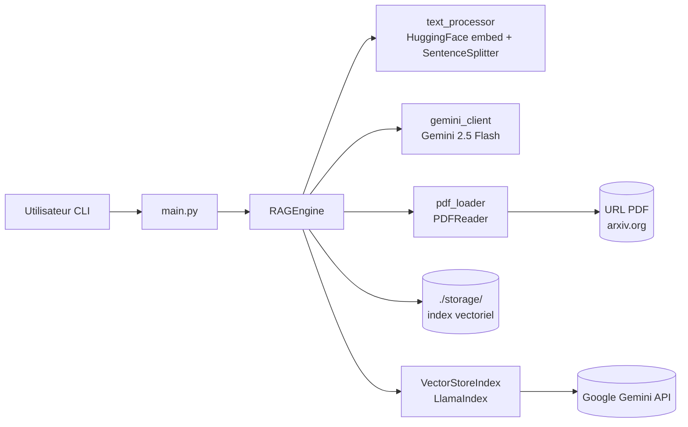

<!--
TEMPLATE — Architecture
=======================
Public cible : (1) une IA assistante de développement qui doit raisonner sur le système
sans relire tout le code à chaque tâche, (2) un humain qui prend le projet en cours.

Ce document est VIVANT : il est mis à jour avant chaque PR (par un skill IA, validé par
un humain). Il décrit le système TEL QU'IL EST, pas tel qu'on aimerait qu'il soit. Les
intentions et décisions à venir vont dans les ADR ou dans la backlog, pas ici.

Garde-fous d'écriture :
- Tout chiffre / nom de composant doit être vérifiable depuis le code ou un artefact
  versionné. Si déduit ou hypothétique, marquer explicitement "(à confirmer)".
- Distinguer "observé" / "décidé" / "ouvert".
- Toute affirmation forte → renvoyer vers un fichier source (code, ADR, schéma).
- Préférer les tableaux et listes courtes à la prose. Une PR doit pouvoir patcher 3 lignes,
  pas un paragraphe.

Le bloc "Mode d'emploi" en fin de fichier détaille la marche à suivre pour l'IA et le relecteur.
-->

# Architecture — RAG PDF Q&A

| Champ | Valeur |
|---|---|
| **Dernière mise à jour** | 2026-05-24 |
| **Mise à jour par** | agent IA |
| **PR de référence** | 6d1386c |
| **Version applicative** | (à confirmer) |
| **Statut du document** | Brouillon |

> **Résumé en 1 phrase** : Pipeline RAG interactif qui télécharge un PDF depuis une URL, construit un index vectoriel avec LlamaIndex et répond à des questions en langage naturel via le modèle Gemini 2.5 Flash de Google.

---

## 1. Vue d'ensemble

### 1.1 Nature du système

| Dimension | Valeur |
|---|---|
| **Type** | CLI / Script |
| **Mode** | Synchrone |
| **Multi-tenant** | Non — une instance, un PDF à la fois |
| **Stateful** | Avec état persistant — index vectoriel mis en cache dans `./storage/` (répertoire local) |
| **Utilisateurs cibles** | Internes / développeurs |
| **Volumétrie typique** | Usage interactif, une requête à la fois |

### 1.2 Flux principal

L'utilisateur lance `main.py` avec une URL de PDF codée en dur (`https://arxiv.org/pdf/2005.11401.pdf`). `RAGEngine.__init__` calcule un hash MD5 de l'URL pour localiser un éventuel cache dans `./storage/`. Si le cache est absent, `pdf_loader.load_pdf_from_url` télécharge le PDF dans un fichier temporaire, puis `pdf_loader.load_documents_from_pdf` l'extrait via `PDFReader`. `text_processor.setup_advanced_text_processing` configure l'embedding HuggingFace (`BAAI/bge-small-en-v1.5`) et `create_node_parser` crée un `SentenceSplitter` (chunk 512, overlap 50). Un `VectorStoreIndex` est construit et persisté sur disque. Pour chaque question de l'utilisateur, `RAGEngine.query` effectue une recherche sémantique (`similarity_top_k=3`) et délègue la génération de réponse à Gemini 2.5 Flash via `gemini_client.initialize_gemini_llm`.

---

## 2. Stack technique

| Couche | Choix | Version | Justification courte |
|---|---|---|---|
| **Langage principal** | Python | 3.12 | Cible `target-version = "py312"` dans `pyproject.toml` |
| **Framework applicatif** | LlamaIndex (`llama_index.core`) | (à confirmer) | Orchestration du pipeline RAG (index, retrieval, query engine) |
| **LLM** | Google Gemini 2.5 Flash (`llama_index.llms.gemini`) | — | Génération de réponses ; clé API via `GOOGLE_API_KEY` |
| **Embedding** | HuggingFace `BAAI/bge-small-en-v1.5` (`llama_index.embeddings.huggingface`) | — | Encodage sémantique des chunks |
| **Persistance** | Système de fichiers local (`./storage/`) | — | Cache des index vectoriels LlamaIndex par hash MD5 d'URL |
| **Cache** | Disque local (répertoire `./storage/`) | — | Évite de re-embedder un PDF déjà traité |
| **Messaging** | Aucun | — | — |
| **Auth** | Variable d'environnement `GOOGLE_API_KEY` | — | Aucune rotation automatique observée |
| **Observabilité** | `print()` console | — | Aucun outil structuré |
| **CI/CD** | (à confirmer) | — | `pyproject.toml` configure ruff, pyright, bandit, pytest |
| **Déploiement** | Local / script | — | Aucun manifeste de déploiement observé |

**Dépendances externes critiques** (services tiers dont la panne dégrade le service) :

| Service | Rôle | Mode d'appel | Fallback |
|---|---|---|---|
| Google Gemini API | Génération de réponses LLM | SDK (`llama_index.llms.gemini`) | Aucun — panne bloquante |
| URL source du PDF (arxiv.org par défaut) | Acquisition du document | HTTP (`requests.get`) | Aucun si cache absent ; cache disque sinon |

---

## 3. Pattern d'architecture

### 3.1 Style retenu

Monolithe modulaire procédural. Le code est découpé en modules Python thématiques (`rag_engine`, `gemini_client`, `pdf_loader`, `text_processor`) sans couche d'abstraction hexagonale ni injection de dépendances formelle. La simplicité prime — c'est un script d'expérimentation, pas un service de production.

> Décision tracée dans : (à confirmer)

### 3.2 Diagramme de composants

> Diagramme Mermaid (rendu nativement par GitLab/GitHub). Montrer les composants principaux et le sens des appels — pas les classes.



### 3.3 Propriétés architecturales

| Propriété | Valeur observée | Justification / mécanisme |
|---|---|---|
| **Couplage** | Faible entre modules | Chaque module expose des fonctions simples, `RAGEngine` orchestre en important directement |
| **Cohésion** | Haute par fichier | Chaque module a une responsabilité unique (embedding, LLM, chargement PDF, parsing) |
| **Concurrence** | Séquentielle | Boucle interactive bloquante, pas de threads ni d'async |
| **Idempotence** | Garantie sur l'indexation | Cache disque basé sur hash MD5 de l'URL — si l'index existe, pas de re-traitement |
| **Cohérence** | Forte | Pas de source de vérité distribuée, tout est local |
| **Scalabilité** | Aucune | Script mono-processus, non conçu pour la montée en charge |

---

## 4. Composants

> Une ligne par composant principal. Détail dans les sous-sections si nécessaire. Les composants triviaux (ex. utilitaires sans logique) ne sont pas listés ici.

| Composant | Type | Localisation | Rôle | Entrées | Sorties |
|---|---|---|---|---|---|
| `RAGEngine` | Classe | [`rag_engine.py`](rag_engine.py) | Orchestre indexation et requêtage | URL PDF, question utilisateur | Réponse textuelle |
| `gemini_client` | Module | [`gemini_client.py`](gemini_client.py) | Gère un singleton LLM Gemini et expose des fonctions utilitaires (`generate_text`, `summarize`, `rerank_passages`) | `GOOGLE_API_KEY` env var, prompt/texte | Instance `Gemini` ; texte généré |
| `pdf_loader` | Module | [`pdf_loader.py`](pdf_loader.py) | Télécharge et parse un PDF | URL HTTP | Liste de `Document` LlamaIndex |
| `text_processor` | Module | [`text_processor.py`](text_processor.py) | Configure embedding HuggingFace et `SentenceSplitter` | — | `HuggingFaceEmbedding`, `SentenceSplitter` |
| `main` | Script | [`main.py`](main.py) | Point d'entrée CLI interactif | Saisie clavier | Sortie console |

### 4.1 Détails par composant

#### RAGEngine

- **Rôle** : Construit ou charge un `VectorStoreIndex` pour un PDF donné, expose `query()` pour répondre à des questions.
- **Entrées** : `pdf_url` (str), `storage_dir` (str, défaut `./storage`)
- **Sorties** : Réponse textuelle via `query_engine.query()`
- **Dépendances internes** : `gemini_client.initialize_gemini_llm`, `pdf_loader.load_pdf_from_url`, `pdf_loader.load_documents_from_pdf`, `text_processor.setup_advanced_text_processing`, `text_processor.create_node_parser`
- **Dépendances externes** : LlamaIndex `VectorStoreIndex`, `StorageContext`, système de fichiers local
- **Invariants** : Si `./storage/index_<md5>/` existe, le PDF n'est pas re-téléchargé ni re-embedé.
- **Pièges connus** : ⚠️ Le hash est calculé sur l'URL ; si le PDF à l'URL change, le cache n'est pas invalidé.

#### gemini_client

- **Rôle** : Instancie et gère un singleton `Gemini` (modèle `models/gemini-2.5-flash`, température `0.1` par défaut), l'enregistre dans `Settings.llm`, et expose des fonctions utilitaires LLM de haut niveau.
- **Entrées** : Variable d'environnement `GOOGLE_API_KEY` ; paramètres optionnels `model` et `temperature` dans `initialize_gemini_llm()`
- **Sorties** : Instance `Gemini` ; texte généré (`str`)
- **Fonctions publiques** :
  | Fonction | Signature | Rôle |
  |---|---|---|
  | `initialize_gemini_llm` | `(model, temperature) → Gemini` | Instancie et enregistre le LLM ; stocke dans `_state` |
  | `get_llm` | `() → Gemini` | Retourne le singleton, l'initialise si absent |
  | `generate_text` | `(prompt, temperature?) → str` | Appel LLM générique ; crée une instance temporaire si `temperature` est fournie |
  | `summarize` | `(text, max_words?) → str` | Résumé en ~N mots via `generate_text` |
  | `rerank_passages` | `(query, passages) → list[str]` | Trie les passages par pertinence via un prompt LLM à `temperature=0.0` |
  | `reset_llm` | `() → None` | Réinitialise le singleton (`_state["llm"] = None`) |
- **Dépendances externes** : Google Gemini API
- **Pièges connus** :
  - ⚠️ `os.environ["GOOGLE_API_KEY"]` lève `KeyError` si la variable est absente — pas de message d'erreur explicite.
  - ⚠️ `generate_text` avec `temperature` explicite crée une nouvelle instance `Gemini` à chaque appel — pas de réutilisation du singleton.

---

## 5. Architecture des données

> Vue résumée. Le détail (tables, colonnes, contraintes) est dans [data-model.md](data-model.md).

| Domaine | Stockage | Tables / collections | Volumétrie | Croissance |
|---|---|---|---|---|
| Index vectoriel PDF | Système de fichiers (`./storage/index_<md5>/`) | Fichiers LlamaIndex (`docstore.json`, `index_store.json`, etc.) | Proportionnel à la taille du PDF | Un répertoire par URL unique |

**Pattern temporel** : Aucun versioning — cache clé/valeur simple basé sur hash MD5 de l'URL.

**Politique de rétention** : Aucune politique automatique — les répertoires de cache persistent indéfiniment jusqu'à suppression manuelle.

---

## 6. Interfaces

> Vue résumée. Le détail (signatures, payloads, codes retour) est dans [contracts.md](contracts.md).

### 6.1 Interfaces exposées

| Interface | Type | Consommateurs | Stabilité |
|---|---|---|---|
| Boucle interactive `main.py` | CLI (`input()` / `print()`) | Utilisateur humain | Privé / non versionné |

### 6.2 Interfaces consommées

| Interface | Fournisseur | Type d'appel | Criticité |
|---|---|---|---|
| Google Gemini API (`models/gemini-2.5-flash`) | Google | Sync via SDK LlamaIndex | Bloquante |
| URL source PDF | Serveur HTTP tiers (arxiv.org par défaut) | HTTP GET sync (`requests`) | Bloquante si pas de cache |

---

## 7. Déploiement

### 7.1 Topologie

```
Machine locale
└── python main.py
    ├── ./storage/          (cache index vectoriel)
    └── /tmp/               (PDF téléchargé temporairement)
```

### 7.2 Environnements

| Environnement | URL / Cluster | Données | Auth | Trafic |
|---|---|---|---|---|
| **local** | Machine du développeur | PDF téléchargé depuis URL publique | `GOOGLE_API_KEY` en variable d'environnement | Usage interactif unique |

### 7.3 Configuration

- **Format** : Variables d'environnement
- **Source de vérité** : Shell de l'utilisateur
- **Secrets** : `GOOGLE_API_KEY` — doit être défini dans l'environnement, jamais en clair dans le code (corrigé dans la PR `6d1386c`)
- **Feature flags** : Aucun

---

## 8. Préoccupations transverses

### 8.1 Sécurité

| Aspect | Mécanisme | Localisation |
|---|---|---|
| **Authentification** | Clé API Google | Variable d'environnement `GOOGLE_API_KEY` |
| **Autorisation** | Aucune (script mono-utilisateur local) | — |
| **Secrets** | Variable d'environnement | Shell utilisateur — la clé était auparavant hardcodée (corrigé en `6d1386c`) |
| **Données sensibles** | Aucun chiffrement au repos — index en clair sur disque | `./storage/` |
| **Audit** | Aucun | — |

### 8.2 Observabilité

| Type | Outil | Volume | Rétention | Alerting |
|---|---|---|---|---|
| **Logs** | `print()` console | Faible | Session uniquement | Aucun |
| **Métriques** | Aucun | — | — | — |
| **Traces** | Aucun | — | — | — |
| **Erreurs** | Exceptions Python non capturées | — | Session uniquement | Aucun |

**Convention de corrélation** : Aucune.

### 8.3 Performance

| Métrique | Cible (SLO) | Mesure actuelle | Source |
|---|---|---|---|
| **Latence p95** | (à confirmer) | (à confirmer) | Aucun dashboard |
| **Latence p99** | (à confirmer) | (à confirmer) | — |
| **Disponibilité** | Non applicable (script local) | — | — |
| **Débit max** | Non applicable | — | — |

### 8.4 Résilience

- **Timeouts** : `requests.get(url, timeout=30)` pour le téléchargement PDF ; aucun timeout sur les appels Gemini API
- **Retry** : Aucun
- **Circuit breaker** : Aucun
- **Backpressure** : Non applicable
- **Plan de reprise** : Aucun — en cas d'erreur, relancer le script manuellement

---

## 9. Stratégie de test

| Niveau | Framework | Couverture | Quand |
|---|---|---|---|
| **Unitaire** | pytest + pytest-cov | (à confirmer) | À chaque commit (configuré dans `pyproject.toml`) |
| **Intégration** | (à confirmer) | (à confirmer) | (à confirmer) |
| **Contract** | Aucun | — | — |
| **End-to-end** | Aucun | — | — |
| **Charge** | Aucun | — | — |
| **Sécurité** | bandit (SAST), pyright (type-check), ruff (lint) | Ensemble du code source | (à confirmer) |

**Données de test** : (à confirmer) — répertoire `tests/` configuré dans `pyproject.toml`.

---

## 10. Workflow de développement

- **Branches** : `main` (branche par défaut observée)
- **Convention de commits** : (à confirmer) — `gitlint-core` est en dépendance dev
- **CI** : (à confirmer) — outils configurés : ruff (lint), pyright (type-check), bandit (SAST), pytest (tests)
- **Code review** : (à confirmer)
- **Mise à jour de cette doc** : Skill IA doc-sync exécuté en pre-PR + relecture humaine.

---

## 11. Décisions et points ouverts

### 11.1 Décisions actives

| ADR | Sujet | Date | Statut |
|---|---|---|---|
| — | Aucun ADR observé dans le dépôt | — | — |

### 11.2 Points ouverts

> Ce qui n'est pas tranché, source de risque ou de surprise pour un nouveau venu.

| # | Question | Impact | Owner |
|---|---|---|---|
| Q1 | L'URL du PDF est hardcodée dans `main.py` — pas configurable en argument CLI | Limité à un seul document sans modifier le code | (à confirmer) |
| Q2 | Le cache n'est pas invalidé si le contenu du PDF à l'URL change (seule l'URL est hashée) | Réponses potentiellement obsolètes si le PDF est mis à jour | (à confirmer) |
| Q3 | `GOOGLE_API_KEY` absente lève un `KeyError` sans message d'erreur utilisateur | Expérience dégradée au démarrage | (à confirmer) |
| Q4 | `generate_text` avec `temperature` explicite instancie un nouveau `Gemini` à chaque appel — coût potentiel si appelé en boucle | Performance dégradée sur usage intensif de `rerank_passages` | (à confirmer) |

### 11.3 Dette technique structurante

| Item | Origine | Coût d'évitement | Plan |
|---|---|---|---|
| Clé API Google était hardcodée en clair | Développement initial (`fcd7a06`) | Fuite de secret si le repo est public | Corrigé en `6d1386c` — `os.environ["GOOGLE_API_KEY"]` |
| Nom de fonction `iNitialize_gemini_llm` (casse incorrecte) | Développement initial | Incohérence de style, violait les conventions Python | Corrigé en `6d1386c` → `initialize_gemini_llm` |

---

## 12. Références

- Modèle de données : [data-model.md](data-model.md)
- Contrats d'interface : [contracts.md](contracts.md)
- Glossaire : [glossaire.md](glossaire.md)
- Documentation fonctionnelle : [fonctionnel.md](fonctionnel.md)
- Index général : [index.md](index.md)
- ADR : (à confirmer)
- Runbooks ops : Non applicable
- Dashboards : Non applicable

---

<!--
MODE D'EMPLOI DU TEMPLATE
=========================

POUR L'IA QUI MET À JOUR CE DOCUMENT AVANT UNE PR

Déclencheurs (mettre à jour les sections concernées si la PR touche…) :

| Modification dans la PR | Sections à relire |
|---|---|
| Ajout / suppression / renommage d'un service ou module | §3 (diagramme), §4 (composants) |
| Changement de stack (langage, framework, lib majeure) | §2 |
| Nouvelle table / collection ou schéma modifié | §5 (résumé), data-model.md (détail) |
| Nouvelle interface exposée ou consommée | §6, contracts.md (détail) |
| Changement d'environnement, IaC, manifestes K8s | §7 |
| Nouveau mécanisme d'auth, audit, secrets | §8.1 |
| Nouveau collecteur logs / métriques / dashboards | §8.2 |
| SLO, timeout, retry, circuit breaker modifiés | §8.3, §8.4 |
| Nouveau type de test, framework de test | §9 |
| Changement de workflow CI ou règle de branche | §10 |
| Nouvel ADR fusionné | §11.1 |

Règles d'écriture :
1. Mettre à jour le bloc d'en-tête (date, PR de référence, version, mise à jour par).
2. Pour chaque modification, citer la PR ou le commit en référence si non évident.
3. Ne pas réécrire des sections inchangées — diff minimal.
4. Marquer "(à confirmer)" toute affirmation non vérifiable depuis le code à l'instant T.
5. Si une section devient obsolète, la VIDER avec une mention "Aucun {{X}} actuellement"
   plutôt que la supprimer — l'absence est une information.
6. Si la doc et le code divergent, ouvrir un point dans §11.2 et le signaler dans le
   message de PR — ne PAS aligner silencieusement.

Auto-checks à effectuer avant de proposer la mise à jour :
- [ ] Les composants listés en §4 existent réellement dans le repo (vérifier les chemins).
- [ ] Le diagramme Mermaid §3.2 correspond aux appels effectivement présents dans le code.
- [ ] Les versions §2 correspondent au manifeste de dépendances actuel.
- [ ] Les ADR cités §11.1 existent dans le dossier ADR.
- [ ] Les liens des §12 ne sont pas cassés.

POUR LE RELECTEUR HUMAIN

- Le diff doit être lisible : si plus de 30 lignes changent, demander à l'IA de
  scinder par section.
- Vérifier que les chiffres (SLO, volumétrie, version) ne sont pas inventés.
- Toute hypothèse "(à confirmer)" doit être levée ou explicitement assumée.
- Si une section est trop générique (pleine de "{{}}" non remplis), c'est un signe que
  la section n'a jamais été vraiment travaillée — la signaler ou la vider.

POUR ADAPTER À UN AUTRE PROJET

1. Remplacer `{{NOM_PROJET}}` et tous les autres `{{...}}`.
2. Garder les 12 sections et leur ordre — c'est la grille standard.
3. Une section vide est légitime si « non applicable » ; le marquer explicitement.
4. Adapter le diagramme Mermaid §3.2 au style réel (peut être un schéma C4 niveau 2,
   un diagramme de séquence, etc.).
5. Pour un système purement frontal : §5 et §6 peuvent être minces, mais ne pas
   supprimer — pointer vers le backend qui porte ces aspects.
6. Pour un système purement batch : adapter §1.2 ("flux principal" = traitement d'un fichier),
   §6 (interfaces = formats E/S), §8.3 (perf = débit + temps fenêtre).
-->
