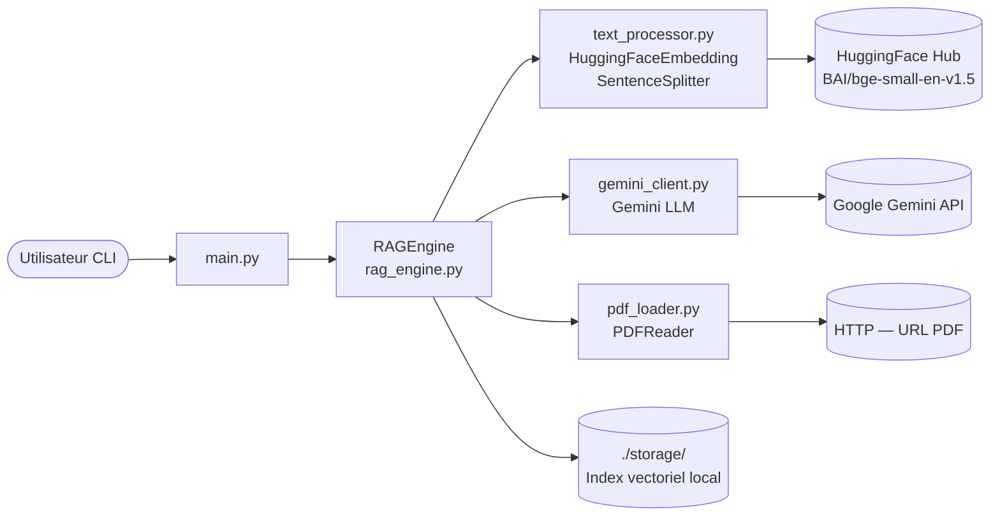

<!--
TEMPLATE — Architecture
=======================
Public cible : (1) une IA assistante de développement qui doit raisonner sur le système
sans relire tout le code à chaque tâche, (2) un humain qui prend le projet en cours.

Ce document est VIVANT : il est mis à jour avant chaque PR (par un skill IA, validé par
un humain). Il décrit le système TEL QU'IL EST, pas tel qu'on aimerait qu'il soit. Les
intentions et décisions à venir vont dans les ADR ou dans la backlog, pas ici.

Garde-fous d'écriture :
- Tout chiffre / nom de composant doit être vérifiable depuis le code ou un artefact
  versionné. Si déduit ou hypothétique, marquer explicitement "(à confirmer)".
- Distinguer "observé" / "décidé" / "ouvert".
- Toute affirmation forte → renvoyer vers un fichier source (code, ADR, schéma).
- Préférer les tableaux et listes courtes à la prose. Une PR doit pouvoir patcher 3 lignes,
  pas un paragraphe.

Le bloc "Mode d'emploi" en fin de fichier détaille la marche à suivre pour l'IA et le relecteur.
-->

# Architecture — RAG PDF Q&A

| Champ | Valeur |
|---|---|
| **Dernière mise à jour** | 2026-05-11 |
| **Mise à jour par** | agent IA (doc-patcher) |
| **PR de référence** | fcd7a06 (gemini_client étendu) |
| **Version applicative** | (à confirmer) |
| **Statut du document** | Brouillon |

> **Résumé en 1 phrase** : Application Python en ligne de commande qui charge un document PDF (depuis une URL), le vectorise avec des embeddings HuggingFace, et répond interactivement à des questions en langue naturelle via le LLM Gemini (RAG).

---

## 1. Vue d'ensemble

### 1.1 Nature du système

| Dimension | Valeur |
|---|---|
| **Type** | CLI |
| **Mode** | Synchrone |
| **Multi-tenant** | Non — instance locale par utilisateur |
| **Stateful** | Avec état persistant — index vectoriel mis en cache dans `./storage/` (répertoire local, clé = hash MD5 de l'URL du PDF) |
| **Utilisateurs cibles** | Internes / machines (usage local développeur/chercheur) |
| **Volumétrie typique** | (à confirmer) — usage interactif, 1 utilisateur à la fois |

### 1.2 Flux principal

> Décrire en 5-10 lignes le chemin d'une requête / d'un enregistrement / d'un événement de l'entrée à la sortie, en nommant les composants traversés. Cette section est le « tour express » d'un nouveau venu.

L'utilisateur lance `main.py` en lui passant implicitement l'URL du PDF cible (définie dans le code). `RAGEngine` vérifie si un index vectoriel existe déjà dans `./storage/` pour ce PDF (clé = hash MD5 de l'URL). S'il n'existe pas, `pdf_loader` télécharge le PDF via HTTP (`requests`) et `llama_index.readers.file.PDFReader` en extrait le texte ; `text_processor` configure les embeddings (`BAAI/bge-small-en-v1.5` via HuggingFace) et le `SentenceSplitter` (chunk 512, overlap 50) ; `RAGEngine` construit un `VectorStoreIndex` et le persiste. Si l'index existe déjà, il est rechargé depuis le disque. `gemini_client` initialise le LLM Gemini (`gemini-2.5-flash`). L'utilisateur saisit ses questions dans une boucle interactive ; le `query_engine` (top-k=3, mode compact) effectue la recherche sémantique et génère la réponse via Gemini.

---

## 2. Stack technique

| Couche | Choix | Version | Justification courte |
|---|---|---|---|
| **Langage principal** | Python | 3.12 (cible ruff/pyright) | Écosystème ML/NLP |
| **Framework applicatif** | LlamaIndex (core) | (à confirmer) | Orchestration RAG : index, retrieval, query engine |
| **LLM** | Gemini (`gemini-2.5-flash`) via `llama_index.llms.gemini` | — | LLM Google, accès via API key |
| **Embeddings** | HuggingFace `BAAI/bge-small-en-v1.5` via `llama_index.embeddings.huggingface` | — | Modèle local, pas de dépendance réseau à l'inférence |
| **Persistance** | Fichiers locaux (`./storage/`) — `VectorStoreIndex` sérialisé par LlamaIndex | — | Cache des embeddings entre sessions |
| **Cache** | Système de fichiers local (répertoire `./storage/`, clé MD5 URL) | — | Évite de ré-embedder le même PDF |
| **Messaging** | Aucun | — | Application interactive synchrone |
| **Auth** | Clé API Google (`GOOGLE_API_KEY` via `config.py`) | — | Accès Gemini |
| **Observabilité** | `print()` stdout uniquement | — | (à confirmer) pas de collecteur structuré |
| **CI/CD** | (à confirmer) — outils dev : ruff, pyright, bandit, pytest, pytest-cov, gitlint | — | Qualité de code, sécurité statique, tests |
| **Déploiement** | Local / venv | — | `runner = "venv"` dans `pyproject.toml` |

**Dépendances externes critiques** (services tiers dont la panne dégrade le service) :

| Service | Rôle | Mode d'appel | Fallback |
|---|---|---|---|
| Google Gemini API | Génération de réponses (LLM) | SDK `google-generativeai` via `llama_index.llms.gemini` | Aucun — erreur fatale si indisponible |
| URL source du PDF | Acquisition du document à indexer | HTTP GET (`requests`, timeout 30 s) | Aucun — erreur fatale si le PDF n'est pas téléchargeable et qu'aucun cache n'existe |
| HuggingFace Hub | Téléchargement du modèle d'embedding `BAAI/bge-small-en-v1.5` | SDK HuggingFace (premier démarrage uniquement) | Modèle mis en cache localement après la première utilisation |

---

## 3. Pattern d'architecture

### 3.1 Style retenu

Monolithe procédural modulaire. Le code est découpé en modules Python à responsabilité unique (`gemini_client`, `pdf_loader`, `rag_engine`, `text_processor`, `main`) sans framework d'injection ni couche hexagonale explicite. Ce style est approprié pour un outil CLI monoutilisateur sans contrainte de scalabilité horizontale.

> Décision tracée dans : (à confirmer) — aucun ADR trouvé dans le repo.

### 3.2 Diagramme de composants

> Diagramme Mermaid (rendu nativement par GitLab/GitHub). Montrer les composants principaux et le sens des appels — pas les classes.



### 3.3 Propriétés architecturales

| Propriété | Valeur observée | Justification / mécanisme |
|---|---|---|
| **Couplage** | Faible (entre modules) | Chaque module expose des fonctions simples ; `RAGEngine` orchestre via imports directs |
| **Cohésion** | Haute | Un module = une responsabilité (chargement PDF, embeddings, LLM, orchestration, point d'entrée) |
| **Concurrence** | Séquentielle | Boucle interactive bloquante ; pas de threading ni async |
| **Idempotence** | Garantie sur l'indexation | Re-construire l'index pour la même URL donne le même résultat ; cache par hash MD5 de l'URL |
| **Cohérence** | Forte (locale) | Index vectoriel persisté atomiquement par LlamaIndex sur disque local |
| **Scalabilité** | Verticale uniquement | Application mono-processus locale ; pas de mécanisme de scale-out |

---

## 4. Composants

> Une ligne par composant principal. Détail dans les sous-sections si nécessaire. Les composants triviaux (ex. utilitaires sans logique) ne sont pas listés ici.

| Composant | Type | Localisation | Rôle | Entrées | Sorties |
|---|---|---|---|---|---|
| `RAGEngine` | Module / Classe | [`rag_engine.py`](../rag_engine.py) | Orchestration complète : indexation PDF, gestion du cache, query engine | URL PDF (str), répertoire de stockage | Réponse texte (str) |
| `gemini_client` | Module | [`gemini_client.py`](../gemini_client.py) | Initialisation du LLM Gemini (singleton), accès lazy, génération de texte autonome, résumé, re-ranking zéro-shot et reset pour les tests | Clé API (`config.GOOGLE_API_KEY`), prompts texte, passages | Instance `Gemini`, texte généré (str), passages re-classés (list[str]) |
| `pdf_loader` | Module | [`pdf_loader.py`](../pdf_loader.py) | Téléchargement d'un PDF depuis une URL et extraction des documents LlamaIndex | URL HTTP | Liste de `Document` LlamaIndex |
| `text_processor` | Module | [`text_processor.py`](../text_processor.py) | Configuration des embeddings HuggingFace et du `SentenceSplitter` dans `Settings` | — | Instance `HuggingFaceEmbedding`, instance `SentenceSplitter` |
| `main` | Point d'entrée | [`main.py`](../main.py) | Boucle interactive CLI | Saisie utilisateur (stdin) | Réponses affichées (stdout) |

### 4.1 Détails par composant

#### RAGEngine

- **Rôle** : Orchestre l'ensemble du pipeline RAG — configuration des embeddings et du LLM, chargement ou construction de l'index vectoriel, exposition d'un `query_engine`.
- **Entrées** : URL du PDF, chemin du répertoire de stockage.
- **Sorties** : Réponse texte générée par Gemini pour chaque question.
- **Dépendances internes** : `gemini_client.initialize_gemini_llm`, `pdf_loader.load_pdf_from_url` / `load_documents_from_pdf`, `text_processor.setup_advanced_text_processing` / `create_node_parser`.
- **Dépendances externes** : `llama_index.core` (`VectorStoreIndex`, `StorageContext`, `Settings`), système de fichiers local (`./storage/`).
- **Invariants** : L'index pour une URL donnée est identifié par `md5(url)` — deux exécutions sur la même URL réutilisent le même cache.
- **Pièges connus** : ⚠️ Le hash MD5 est calculé sur l'URL brute — une variation mineure d'URL (trailing slash, paramètre querystring) génère un index distinct et re-déclenche l'embedding complet.

#### gemini_client

- **Rôle** : Fournit toutes les interactions avec Gemini dans un module autonome. Gère un singleton `_llm_instance` (liste à un élément, pattern évitant `global`) ; expose des utilitaires de haut niveau réutilisables indépendamment du pipeline RAG.
- **Fonctions publiques** :
  | Fonction | Signature simplifiée | Description |
  |---|---|---|
  | `initialize_gemini_llm` | `(model, temperature, max_tokens) → Gemini` | Crée et enregistre l'instance LLM dans `Settings` LlamaIndex ; met à jour le singleton. |
  | `get_llm` | `() → Gemini` | Accesseur lazy — initialise avec les valeurs par défaut si le singleton est `None`. |
  | `generate_text` | `(prompt, temperature) → str` | Génération de texte autonome (hors RAG). Si `temperature` est fourni, crée une instance temporaire sans remplacer le singleton. |
  | `summarize` | `(text, max_words) → str` | Résumé en langue naturelle via `generate_text`. |
  | `rerank_passages` | `(query, passages) → list[str]` | Re-classement zéro-shot des passages par pertinence ; retourne l'ordre original en cas d'échec de parsing. |
  | `reset_llm` | `() → None` | Remet le singleton à `None` — usage test/reset uniquement. |
- **Dépendances internes** : `config.GOOGLE_API_KEY`.
- **Dépendances externes** : `llama_index.llms.gemini.Gemini`, `llama_index.core.Settings`, Google Gemini API.
- **Invariants** : Un seul appel réseau Gemini par invocation de `generate_text` — pas de retry interne.
- **Pièges connus** : ⚠️ `generate_text` avec `temperature` non nul instancie un objet `Gemini` temporaire à chaque appel (coût de construction à évaluer si appelé en boucle). ⚠️ `rerank_passages` consomme un appel LLM complet pour le re-classement — surveiller les coûts API en cas d'usage intensif.

---

## 5. Architecture des données

> Vue résumée. Le détail (tables, colonnes, contraintes) est dans [data-model.md](data-model.md).

| Domaine | Stockage | Tables / collections | Volumétrie | Croissance |
|---|---|---|---|---|
| Index vectoriel PDF | Fichiers locaux (`./storage/index_<md5>/`) | Un répertoire par PDF indexé (format LlamaIndex) | Dépend de la taille du PDF | Linéaire — un répertoire par URL unique |

**Pattern temporel** : Aucun versioning — l'index est écrasé si le répertoire de cache est supprimé et reconstruit à la prochaine exécution (SCD Type 1 implicite).

**Politique de rétention** : Manuelle — l'utilisateur supprime `./storage/` pour forcer un ré-indexage. Pas de purge automatique.

---

## 6. Interfaces

> Vue résumée. Le détail (signatures, payloads, codes retour) est dans [contracts.md](contracts.md).

### 6.1 Interfaces exposées

| Interface | Type | Consommateurs | Stabilité |
|---|---|---|---|
| Boucle interactive stdin/stdout | CLI | Utilisateur humain local | Interne / privé |

### 6.2 Interfaces consommées

| Interface | Fournisseur | Type d'appel | Criticité |
|---|---|---|---|
| Google Gemini API (`models/gemini-2.5-flash`) | Google Cloud | Sync (SDK `google-generativeai`) | Bloquante — pas de fallback |
| URL HTTP source du PDF | Fournisseur externe (ex. arxiv.org) | Sync HTTP GET (`requests`) | Bloquante au premier chargement ; dégradable si cache présent |
| HuggingFace Hub (`BAAI/bge-small-en-v1.5`) | HuggingFace | Sync (téléchargement initial uniquement) | Dégradable — mis en cache localement après le premier téléchargement |

---

## 7. Déploiement

### 7.1 Topologie

```
Machine locale développeur
└── venv Python 3.12
    ├── main.py (point d'entrée CLI)
    ├── rag_engine.py
    ├── gemini_client.py  ──────────────────► Google Gemini API (HTTPS)
    ├── pdf_loader.py  ─────────────────────► URL PDF source (HTTPS)
    ├── text_processor.py  ─────────────────► HuggingFace Hub (HTTPS, 1er démarrage)
    └── ./storage/  (index vectoriel persisté localement)
```

Pas d'environnement staging ni prod — application locale monoposte.

### 7.2 Environnements

| Environnement | URL / Cluster | Données | Auth | Trafic |
|---|---|---|---|---|
| **local** | Machine développeur | PDF téléchargés / cache local | Clé API Google (`GOOGLE_API_KEY`) | 1 utilisateur |

### 7.3 Configuration

- **Format** : Module Python `config.py` (à confirmer — non présent dans le diff, mais importé par `gemini_client.py`)
- **Source de vérité** : Fichier local `config.py` (non versionné, à confirmer)
- **Secrets** : `GOOGLE_API_KEY` lu depuis `config.py` — ⚠️ vérifier que ce fichier est dans `.gitignore`
- **Feature flags** : Aucun

---

## 8. Préoccupations transverses

### 8.1 Sécurité

| Aspect | Mécanisme | Localisation |
|---|---|---|
| **Authentification** | Clé API Google pour Gemini | `config.GOOGLE_API_KEY` → `gemini_client.py` |
| **Autorisation** | Aucune (application locale mono-utilisateur) | — |
| **Secrets** | Clé API dans `config.py` local (à confirmer hors repo) | `config.py` — ⚠️ vérifier `.gitignore` |
| **Données sensibles** | Aucune donnée personnelle traitée (à confirmer selon le PDF indexé) | — |
| **Audit** | Aucun mécanisme d'audit structuré — logs `print()` uniquement | stdout |

### 8.2 Observabilité

| Type | Outil | Volume | Rétention | Alerting |
|---|---|---|---|---|
| **Logs** | `print()` stdout | Faible | Durée de la session terminal | Aucun |
| **Métriques** | Aucun collecteur | — | — | — |
| **Traces** | Aucun | — | — | — |
| **Erreurs** | Exceptions Python non interceptées (à confirmer) | — | — | — |

**Convention de corrélation** : Aucune — application synchrone sans corrélation de requêtes.

### 8.3 Performance

| Métrique | Cible (SLO) | Mesure actuelle | Source |
|---|---|---|---|
| **Latence p95** | (à confirmer) | (à confirmer) | Aucun dashboard |
| **Latence p99** | (à confirmer) | (à confirmer) | — |
| **Disponibilité** | N/A — outil local | — | — |
| **Débit max** | N/A — usage interactif | — | — |

### 8.4 Résilience

- **Timeouts** : HTTP GET PDF — 30 secondes (`requests.get(..., timeout=30)`) ; pas de timeout configuré côté Gemini API (à confirmer)
- **Retry** : Aucun mécanisme de retry implémenté
- **Circuit breaker** : Aucun
- **Backpressure** : N/A — synchrone mono-utilisateur
- **Plan de reprise** : Aucun — l'application plante sur erreur réseau ou API ; relancer manuellement

---

## 9. Stratégie de test

| Niveau | Framework | Couverture | Quand |
|---|---|---|---|
| **Unitaire** | pytest + pytest-cov | (à confirmer — `tests/` présent dans la config) | À chaque commit |
| **Analyse statique** | ruff (lint/format), pyright (typage), bandit (sécurité) | Tous les modules hors `tests/` et code généré | À chaque commit (à confirmer en CI) |
| **Intégration** | (à confirmer) | — | — |
| **Contract** | Aucun | — | — |
| **End-to-end** | Aucun | — | — |
| **Charge** | Aucun | — | — |
| **Sécurité** | bandit (SAST) — `B104` skippé intentionnellement | Tous les modules hors `tests/` | (à confirmer) |

**Données de test** : (à confirmer) — répertoire `tests/` configuré dans `pyproject.toml` mais contenu non inspecté.

---

## 10. Workflow de développement

- **Branches** : (à confirmer) — branche `main` observée dans le repo
- **Convention de commits** : gitlint-core présent dans les dépendances dev (convention exacte à confirmer)
- **CI** : (à confirmer) — outils configurés : ruff, pyright, bandit, pytest, pytest-cov ; pipeline CI non observé dans le repo
- **Code review** : (à confirmer)
- **Mise à jour de cette doc** : Skill IA doc-patcher exécuté en pre-PR + relecture humaine — voir mode d'emploi en fin de fichier.

---

## 11. Décisions et points ouverts

### 11.1 Décisions actives

| ADR | Sujet | Date | Statut |
|---|---|---|---|
| — | Aucun ADR trouvé dans le repo | — | — |

### 11.2 Points ouverts

> Ce qui n'est pas tranché, source de risque ou de surprise pour un nouveau venu.

| # | Question | Impact | Owner |
|---|---|---|---|
| Q1 | `config.py` est-il bien exclu du repo (`.gitignore`) pour protéger `GOOGLE_API_KEY` ? | Sécurité — fuite de clé API | (à confirmer) |
| Q2 | Le modèle Gemini `gemini-2.5-flash` est-il le modèle définitif ou susceptible de changer ? | Coût, qualité des réponses | (à confirmer) |
| Q3 | Y a-t-il une pipeline CI configurée (GitHub Actions / autre) ? | Qualité — les outils dev sont présents mais leur déclenchement automatique n'est pas observé | (à confirmer) |

### 11.3 Dette technique structurante

> Limitations connues qui orientent la lecture du code. Ne pas lister chaque TODO ; uniquement ce qui change la grille de lecture du système.

| Item | Origine | Coût d'évitement | Plan |
|---|---|---|---|
| URL du PDF codée en dur dans `main.py` | Choix initial de simplicité | Impossible de changer le document sans modifier le code | Paramétrer via argument CLI ou variable d'environnement |
| Pas de gestion d'erreur structurée | Prototype | L'application plante sur toute erreur réseau ou API sans message utilisateur clair | Ajouter des try/except avec messages explicites |

---

## 12. Références

- Modèle de données : [data-model.md](data-model.md)
- Contrats d'interface : [contracts.md](contracts.md)
- Glossaire : [glossaire.md](glossaire.md)
- Documentation fonctionnelle : [fonctionnel.md](fonctionnel.md)
- Index général : [index.md](index.md)
- ADR : Aucun dossier ADR trouvé dans le repo
- Runbooks ops : Aucun
- Dashboards : Aucun

---

<!--
MODE D'EMPLOI DU TEMPLATE
=========================

POUR L'IA QUI MET À JOUR CE DOCUMENT AVANT UNE PR

Déclencheurs (mettre à jour les sections concernées si la PR touche…) :

| Modification dans la PR | Sections à relire |
|---|---|
| Ajout / suppression / renommage d'un service ou module | §3 (diagramme), §4 (composants) |
| Changement de stack (langage, framework, lib majeure) | §2 |
| Nouvelle table / collection ou schéma modifié | §5 (résumé), data-model.md (détail) |
| Nouvelle interface exposée ou consommée | §6, contracts.md (détail) |
| Changement d'environnement, IaC, manifestes K8s | §7 |
| Nouveau mécanisme d'auth, audit, secrets | §8.1 |
| Nouveau collecteur logs / métriques / dashboards | §8.2 |
| SLO, timeout, retry, circuit breaker modifiés | §8.3, §8.4 |
| Nouveau type de test, framework de test | §9 |
| Changement de workflow CI ou règle de branche | §10 |
| Nouvel ADR fusionné | §11.1 |

Règles d'écriture :
1. Mettre à jour le bloc d'en-tête (date, PR de référence, version, mise à jour par).
2. Pour chaque modification, citer la PR ou le commit en référence si non évident.
3. Ne pas réécrire des sections inchangées — diff minimal.
4. Marquer "(à confirmer)" toute affirmation non vérifiable depuis le code à l'instant T.
5. Si une section devient obsolète, la VIDER avec une mention "Aucun {{X}} actuellement"
   plutôt que la supprimer — l'absence est une information.
6. Si la doc et le code divergent, ouvrir un point dans §11.2 et le signaler dans le
   message de PR — ne PAS aligner silencieusement.

Auto-checks à effectuer avant de proposer la mise à jour :
- [ ] Les composants listés en §4 existent réellement dans le repo (vérifier les chemins).
- [ ] Le diagramme Mermaid §3.2 correspond aux appels effectivement présents dans le code.
- [ ] Les versions §2 correspondent au manifeste de dépendances actuel.
- [ ] Les ADR cités §11.1 existent dans le dossier ADR.
- [ ] Les liens des §12 ne sont pas cassés.

POUR LE RELECTEUR HUMAIN

- Le diff doit être lisible : si plus de 30 lignes changent, demander à l'IA de
  scinder par section.
- Vérifier que les chiffres (SLO, volumétrie, version) ne sont pas inventés.
- Toute hypothèse "(à confirmer)" doit être levée ou explicitement assumée.
- Si une section est trop générique (pleine de "{{}}" non remplis), c'est un signe que
  la section n'a jamais été vraiment travaillée — la signaler ou la vider.

POUR ADAPTER À UN AUTRE PROJET

1. Remplacer `{{NOM_PROJET}}` et tous les autres `{{...}}`.
2. Garder les 12 sections et leur ordre — c'est la grille standard.
3. Une section vide est légitime si « non applicable » ; le marquer explicitement.
4. Adapter le diagramme Mermaid §3.2 au style réel (peut être un schéma C4 niveau 2,
   un diagramme de séquence, etc.).
5. Pour un système purement frontal : §5 et §6 peuvent être minces, mais ne pas
   supprimer — pointer vers le backend qui porte ces aspects.
6. Pour un système purement batch : adapter §1.2 ("flux principal" = traitement d'un fichier),
   §6 (interfaces = formats E/S), §8.3 (perf = débit + temps fenêtre).
-->
