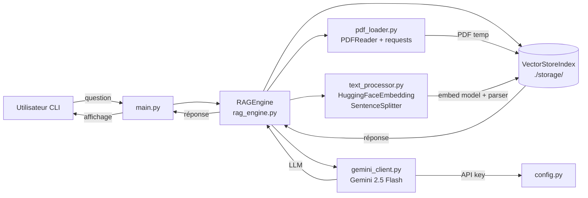

<!--
TEMPLATE — Architecture
=======================
Public cible : (1) une IA assistante de développement qui doit raisonner sur le système
sans relire tout le code à chaque tâche, (2) un humain qui prend le projet en cours.

Ce document est VIVANT : il est mis à jour avant chaque PR (par un skill IA, validé par
un humain). Il décrit le système TEL QU'IL EST, pas tel qu'on aimerait qu'il soit. Les
intentions et décisions à venir vont dans les ADR ou dans la backlog, pas ici.

Garde-fous d'écriture :
- Tout chiffre / nom de composant doit être vérifiable depuis le code ou un artefact
  versionné. Si déduit ou hypothétique, marquer explicitement "(à confirmer)".
- Distinguer "observé" / "décidé" / "ouvert".
- Toute affirmation forte → renvoyer vers un fichier source (code, ADR, schéma).
- Préférer les tableaux et listes courtes à la prose. Une PR doit pouvoir patcher 3 lignes,
  pas un paragraphe.

Le bloc "Mode d'emploi" en fin de fichier détaille la marche à suivre pour l'IA et le relecteur.
-->

# Architecture — RAG

| Champ | Valeur |
|---|---|
| **Dernière mise à jour** | 2026-05-20 |
| **Mise à jour par** | agent IA (doc-patcher) |
| **PR de référence** | (à confirmer) |
| **Version applicative** | (à confirmer) |
| **Statut du document** | Brouillon |

> **Résumé en 1 phrase** : Pipeline RAG (Retrieval-Augmented Generation) en ligne de commande qui télécharge un PDF depuis une URL, l'indexe dans un VectorStoreIndex llama_index avec embeddings HuggingFace, puis répond à des questions en langage naturel via le LLM Google Gemini.

---

## 1. Vue d'ensemble

### 1.1 Nature du système

| Dimension | Valeur |
|---|---|
| **Type** | CLI |
| **Mode** | Synchrone |
| **Multi-tenant** | Non — usage mono-utilisateur local |
| **Stateful** | Avec état persistant — index vectoriel sérialisé sur disque dans `./storage/<hash_url>/` |
| **Utilisateurs cibles** | Développeurs / chercheurs exécutant le script localement |
| **Volumétrie typique** | 1 PDF par session, interrogations interactives séquentielles |

### 1.2 Flux principal

L'utilisateur lance `main.py` avec une URL de PDF codée en dur (`https://arxiv.org/pdf/2005.11401.pdf`).

1. `RAGEngine.__init__` calcule un hash MD5 de l'URL pour localiser un éventuel cache dans `./storage/`.
2. Si le cache est absent : `pdf_loader.load_pdf_from_url` télécharge le PDF via `requests` dans un fichier temporaire ; `pdf_loader.load_documents_from_pdf` le parse avec `PDFReader` (llama_index).
3. `text_processor.setup_advanced_text_processing` initialise l'embedding `HuggingFaceEmbedding(BAAI/bge-small-en-v1.5)` ; `create_node_parser` crée un `SentenceSplitter` (chunk 512, overlap 50).
4. `VectorStoreIndex.from_documents` construit l'index ; il est persisté sur disque via `StorageContext`.
5. Si le cache existe, l'index est rechargé depuis le disque (aucun re-embedding).
6. `gemini_client.get_llm()` retourne (ou initialise) le singleton `_llm_instance` — `Gemini(model=_DEFAULT_MODEL, temperature=_DEFAULT_TEMPERATURE, max_tokens=_DEFAULT_MAX_TOKENS)` soit `models/gemini-2.5-flash, 0.1, 1024` — via l'API Google (clé dans `config.py`).
7. La boucle interactive lit les questions de l'utilisateur et appelle `RAGEngine.query`, qui effectue une recherche par similarité (top-k=3, mode compact) et renvoie la réponse générée.

---

## 2. Stack technique

| Couche | Choix | Version | Justification courte |
|---|---|---|---|
| **Langage principal** | Python | 3.12 | Cible pyproject.toml `pythonVersion = "3.12"` |
| **Framework RAG** | llama_index (core) | (à confirmer) | Orchestration embeddings, index, requêtes |
| **LLM** | Google Gemini 2.5 Flash | models/gemini-2.5-flash | Générer les réponses à partir des chunks récupérés |
| **Embeddings** | HuggingFaceEmbedding BAAI/bge-small-en-v1.5 | (à confirmer) | Embedding local, pas de dépendance API pour l'indexation |
| **Parsing PDF** | llama_index PDFReader | (à confirmer) | Intégration native llama_index |
| **HTTP client** | requests | (à confirmer) | Téléchargement du PDF depuis URL |
| **Persistance** | Fichiers locaux (StorageContext) | — | Index vectoriel sérialisé dans `./storage/` |
| **Cache** | Disque local (hash MD5 URL) | — | Évite le re-embedding à chaque session |
| **Messaging** | Aucun | — | — |
| **Auth** | Clé API Google (variable dans `config.py`) | — | Accès au LLM Gemini |
| **Observabilité** | `print` statements | — | Aucun outil structuré actuellement |
| **CI/CD** | (à confirmer) | — | pyproject.toml configure ruff, pyright, bandit, pytest |
| **Déploiement** | Local (venv) | — | `runner = "venv"` dans pyproject.toml |

**Dépendances externes critiques** (services tiers dont la panne dégrade le service) :

| Service | Rôle | Mode d'appel | Fallback |
|---|---|---|---|
| Google Gemini API | Génération de réponses LLM | SDK llama_index (HTTP) | Aucun — la génération échoue si l'API est KO |
| URL source du PDF (arxiv.org par défaut) | Fourniture du document à indexer | HTTP GET via `requests` | Aucun si pas de cache local — le démarrage échoue |

---

## 3. Pattern d'architecture

### 3.1 Style retenu

Procédural / pipeline séquentiel. Pas de framework web ni de service exposé. Le code est organisé en modules fonctionnels à responsabilité unique (chargement, embedding, indexation, requête, LLM) orchestrés par la classe `RAGEngine`. Style choisi pour la simplicité d'un outil de recherche local mono-utilisateur.

> Décision tracée dans : (à confirmer — aucun ADR présent)

### 3.2 Diagramme de composants



### 3.3 Propriétés architecturales

| Propriété | Valeur observée | Justification / mécanisme |
|---|---|---|
| **Couplage** | Faible entre modules | Chaque module expose une ou deux fonctions ; `RAGEngine` les assemble |
| **Cohésion** | Haute | Un module = une responsabilité (chargement PDF, embedding, LLM, orchestration) |
| **Concurrence** | Séquentielle | Boucle interactive bloquante, pas de threads ni async |
| **Idempotence** | Garantie sur l'indexation | Re-run sur même URL charge le cache sans re-embedder |
| **Cohérence** | N/A | Pas de base relationnelle ; index disque sérialisé atomiquement par llama_index |
| **Scalabilité** | Verticale uniquement | Mono-processus local, pas de mécanisme de scale-out |

---

## 4. Composants

| Composant | Type | Localisation | Rôle | Entrées | Sorties |
|---|---|---|---|---|---|
| `main.py` | CLI entrypoint | `main.py` | Boucle interactive Q&A, instancie RAGEngine | Stdin (questions) | Stdout (réponses) |
| `RAGEngine` | Module / Orchestrateur | `rag_engine.py` | Coordonne chargement, indexation, cache et requêtes | URL PDF, question texte | Réponse texte |
| `gemini_client` | Module LLM | `gemini_client.py` | Singleton LLM Gemini 2.5 Flash ; API publique : `get_llm`, `generate_text`, `summarize`, `rerank_passages`, `reset_llm` | Clé API (`config.py`) | Instance `Gemini` LLM (singleton `_llm_instance`) |
| `pdf_loader` | Module I/O | `pdf_loader.py` | Télécharge et parse le PDF | URL HTTP | Liste de `Document` llama_index |
| `text_processor` | Module embedding | `text_processor.py` | Configure embedding HuggingFace et node parser | — | `HuggingFaceEmbedding`, `SentenceSplitter` |

### 4.1 Détails par composant

#### RAGEngine (`rag_engine.py`)

- **Rôle** : Classe centrale qui orchestre l'ensemble du pipeline RAG — setup des modèles, gestion du cache disque, construction / chargement de l'index, et requêtage.
- **Entrées** : URL du PDF (str), répertoire de stockage optionnel (défaut `./storage`)
- **Sorties** : Réponse texte à une question (via `query_engine.query`)
- **Dépendances internes** : `pdf_loader`, `text_processor`, `gemini_client`
- **Dépendances externes** : `llama_index.core` (VectorStoreIndex, StorageContext), système de fichiers local
- **Invariants** : Si `./storage/<md5_url>/` existe, aucun appel réseau ni re-embedding n'est effectué au démarrage.
- **Pièges connus** : Aucun actuellement.

#### `gemini_client.py`

- **Rôle** : Fournit un singleton LLM `_llm_instance` et une API publique pour la génération de texte, la summarisation et le reranking zero-shot.
- **Constantes** : `_DEFAULT_MODEL = "models/gemini-2.5-flash"`, `_DEFAULT_TEMPERATURE = 0.1`, `_DEFAULT_MAX_TOKENS = 1024`
- **API publique** :
  - `get_llm()` — retourne ou initialise le singleton
  - `initialize_gemini_llm(model, temperature, max_tokens)` — crée une instance `Gemini` et l'assigne à `Settings.llm`
  - `generate_text(prompt, temperature)` — génération directe sans contexte RAG
  - `summarize(text, max_words=150)` — helper de summarisation
  - `rerank_passages(query, passages)` — reranker zero-shot via Gemini
  - `reset_llm()` — remet le singleton à `None`
- **Entrées** : `GOOGLE_API_KEY` importée depuis `config.py`
- **Sorties** : Instance `Gemini` (aussi stockée dans `Settings.llm`)
- **Dépendances externes** : `llama_index.llms.gemini`, `config.py` (non versionné — à confirmer)
- **Pièges connus** : Aucun actuellement.

#### `text_processor.py`

- **Rôle** : Configure l'embedding `BAAI/bge-small-en-v1.5` (local, HuggingFace) et le `SentenceSplitter` (chunk 512, overlap 50).
- **Dépendances externes** : `llama_index.embeddings.huggingface` — nécessite le téléchargement du modèle HuggingFace au premier lancement.

#### `pdf_loader.py`

- **Rôle** : Télécharge un PDF depuis une URL HTTP et le parse en documents llama_index.
- **Pièges connus** : Le fichier temporaire (`temp_rag_document.pdf`) est écrit dans le répertoire système temp sans nettoyage explicite après usage.

---

## 5. Architecture des données

> Vue résumée. Le détail est dans [data-model.md](data-model.md).

| Domaine | Stockage | Collections | Volumétrie | Croissance |
|---|---|---|---|---|
| Index vectoriel | Fichiers locaux (`./storage/<md5>/`) | Nœuds llama_index sérialisés | Dépend du PDF (à confirmer) | Une entrée par PDF distinct |
| PDF source | Fichier temporaire système | 1 fichier par session | Taille du PDF source | Pas de rétention — fichier écrasé à chaque appel |

**Pattern temporel** : Aucun versioning — l'index est recalculé si le cache est absent, sinon réutilisé tel quel (pas de SCD).

**Politique de rétention** : Aucune politique automatique — les dossiers `./storage/` s'accumulent indéfiniment. Le fichier PDF temporaire n'est pas supprimé explicitement.

---

## 6. Interfaces

### 6.1 Interfaces exposées

| Interface | Type | Consommateurs | Stabilité |
|---|---|---|---|
| CLI interactive (`main.py`) | Stdin/Stdout | Utilisateur humain | Interne / non versionné |

### 6.2 Interfaces consommées

| Interface | Fournisseur | Type d'appel | Criticité |
|---|---|---|---|
| Google Gemini API | Google Cloud | Sync HTTP (SDK llama_index) | Bloquante — sans LLM, pas de réponse |
| URL PDF source | Serveur tiers (arxiv.org par défaut) | Sync HTTP GET | Bloquante au premier lancement (sans cache) |
| Modèle HuggingFace BAAI/bge-small-en-v1.5 | HuggingFace Hub | Téléchargement auto à la première exécution | Bloquante au premier lancement |

---

## 7. Déploiement

### 7.1 Topologie

```
Poste développeur (Windows / Linux / macOS)
└── venv Python 3.12
    ├── main.py  (point d'entrée)
    └── ./storage/  (cache index vectoriel local)
```

### 7.2 Environnements

| Environnement | URL / Cluster | Données | Auth | Trafic |
|---|---|---|---|---|
| **local** | Machine développeur | PDF téléchargé + index local | Clé API Google dans `config.py` | Usage interactif unique |

### 7.3 Configuration

- **Format** : Fichier Python `config.py` (non versionné — à confirmer)
- **Source de vérité** : `config.py` local, non commité
- **Secrets** : `GOOGLE_API_KEY` lu depuis `config.py` — ⚠️ ne pas commiter ce fichier
- **Feature flags** : Aucun

---

## 8. Préoccupations transverses

### 8.1 Sécurité

| Aspect | Mécanisme | Localisation |
|---|---|---|
| **Authentification** | Clé API Google | `config.py` (importé dans `gemini_client.py`) |
| **Autorisation** | N/A — usage local mono-utilisateur | — |
| **Secrets** | Clé API dans fichier local non versionné (à confirmer) | `config.py` |
| **Données sensibles** | Aucune donnée personnelle traitée (à confirmer) | — |
| **Audit** | Aucun mécanisme d'audit | — |

### 8.2 Observabilité

| Type | Outil | Volume | Rétention | Alerting |
|---|---|---|---|---|
| **Logs** | `print` statements | Faible | Session uniquement (stdout) | Aucun |
| **Métriques** | Aucun outil structuré | — | — | — |
| **Traces** | Aucun | — | — | — |
| **Erreurs** | Exceptions Python non interceptées | — | — | — |

**Convention de corrélation** : Aucune.

### 8.3 Performance

| Métrique | Cible (SLO) | Mesure actuelle | Source |
|---|---|---|---|
| **Latence p95** | (à confirmer) | (à confirmer) | — |
| **Latence p99** | (à confirmer) | (à confirmer) | — |
| **Disponibilité** | N/A — CLI locale | — | — |
| **Débit max** | 1 requête simultanée | — | Architecture séquentielle |

### 8.4 Résilience

- **Timeouts** : `requests.get(url, timeout=30)` pour le téléchargement PDF ; aucun timeout configuré sur les appels Gemini.
- **Retry** : Aucune politique de retry.
- **Circuit breaker** : Aucun.
- **Backpressure** : N/A — CLI mono-utilisateur séquentielle.
- **Plan de reprise** : Aucun — en cas d'échec, relancer manuellement.

---

## 9. Stratégie de test

| Niveau | Framework | Couverture | Quand |
|---|---|---|---|
| **Unitaire** | pytest ≥ 9.0.3 + unittest.mock | `test_gemini_client.py` (17 tests), `test_pdf_loader.py` (4), `test_main.py` (3), `test_rag_engine.py` (3), `test_text_processor.py` (3) — 30 tests au total | À chaque commit |
| **Intégration** | Aucun actuellement | — | — |
| **Contract** | Aucun actuellement | — | — |
| **End-to-end** | Aucun actuellement | — | — |
| **Charge** | Aucun actuellement | — | — |
| **Sécurité** | bandit ≥ 1.9.4 (SAST) | Scan statique du code source | (à confirmer — CI non documentée) |

**Données de test** : Mocks `unittest.mock` injectés dans les fichiers `tests/` — pas de fixtures fichier ni de PDF de test. Le shim `conftest.py` (`sys.path.insert`) permet l'import des modules depuis la racine du projet.

---

## 10. Workflow de développement

- **Branches** : (à confirmer) — repo git présent, branche `main`
- **Convention de commits** : gitlint-core ≥ 0.19.1 configuré (convention exacte à confirmer)
- **CI** : Non documentée — pyproject.toml configure ruff (lint), pyright (types), bandit (sécurité), pytest + pytest-cov (tests)
- **Code review** : (à confirmer)
- **Mise à jour de cette doc** : Skill IA doc-patcher exécuté en pre-PR + relecture humaine.

---

## 11. Décisions et points ouverts

### 11.1 Décisions actives

Aucun ADR présent dans le dépôt actuellement.

### 11.2 Points ouverts

| # | Question | Impact | Owner |
|---|---|---|---|
| Q1 | `config.py` est-il versionné ou gitignored ? | Risque de fuite de la clé API Google si commité | (à confirmer) |
| Q2 | ~~`iNitialize_gemini_llm` — majuscule interne~~ | Résolu : la fonction s'appelle désormais `initialize_gemini_llm` (casse standard). | Résolu |
| Q3 | Pas de nettoyage du fichier PDF temporaire — peut-il saturer le disque sur exécutions répétées ? | Faible à court terme | (à confirmer) |
| Q4 | Aucune gestion d'erreur explicite sur les appels réseau (Gemini, téléchargement PDF) | Crash non gracieux en cas de panne réseau | (à confirmer) |

### 11.3 Dette technique structurante

| Item | Origine | Coût d'évitement | Plan |
|---|---|---|---|
| Pas de timeout sur Gemini | Code initial | Requêtes bloquantes indéfiniment si l'API ne répond pas | Ajouter `request_timeout` à l'initialisation Gemini |
| URL PDF codée en dur dans `main.py` | Code initial | Impossible de changer le document sans éditer le source | Exposer comme argument CLI ou variable d'env |

---

## 12. Références

- Modèle de données : [data-model.md](data-model.md)
- Contrats d'interface : [contracts.md](contracts.md)
- Glossaire : [glossaire.md](glossaire.md)
- Documentation fonctionnelle : [fonctionnel.md](fonctionnel.md)
- Index général : [index.md](index.md)
- ADR : (à confirmer — aucun dossier ADR présent)
- Runbooks ops : (à confirmer)
- Dashboards : (à confirmer)

---

<!--
MODE D'EMPLOI DU TEMPLATE
=========================

POUR L'IA QUI MET À JOUR CE DOCUMENT AVANT UNE PR

Déclencheurs (mettre à jour les sections concernées si la PR touche…) :

| Modification dans la PR | Sections à relire |
|---|---|
| Ajout / suppression / renommage d'un service ou module | §3 (diagramme), §4 (composants) |
| Changement de stack (langage, framework, lib majeure) | §2 |
| Nouvelle table / collection ou schéma modifié | §5 (résumé), data-model.md (détail) |
| Nouvelle interface exposée ou consommée | §6, contracts.md (détail) |
| Changement d'environnement, IaC, manifestes K8s | §7 |
| Nouveau mécanisme d'auth, audit, secrets | §8.1 |
| Nouveau collecteur logs / métriques / dashboards | §8.2 |
| SLO, timeout, retry, circuit breaker modifiés | §8.3, §8.4 |
| Nouveau type de test, framework de test | §9 |
| Changement de workflow CI ou règle de branche | §10 |
| Nouvel ADR fusionné | §11.1 |

Règles d'écriture :
1. Mettre à jour le bloc d'en-tête (date, PR de référence, version, mise à jour par).
2. Pour chaque modification, citer la PR ou le commit en référence si non évident.
3. Ne pas réécrire des sections inchangées — diff minimal.
4. Marquer "(à confirmer)" toute affirmation non vérifiable depuis le code à l'instant T.
5. Si une section devient obsolète, la VIDER avec une mention "Aucun {{X}} actuellement"
   plutôt que la supprimer — l'absence est une information.
6. Si la doc et le code divergent, ouvrir un point dans §11.2 et le signaler dans le
   message de PR — ne PAS aligner silencieusement.

Auto-checks à effectuer avant de proposer la mise à jour :
- [ ] Les composants listés en §4 existent réellement dans le repo (vérifier les chemins).
- [ ] Le diagramme Mermaid §3.2 correspond aux appels effectivement présents dans le code.
- [ ] Les versions §2 correspondent au manifeste de dépendances actuel.
- [ ] Les ADR cités §11.1 existent dans le dossier ADR.
- [ ] Les liens des §12 ne sont pas cassés.

POUR LE RELECTEUR HUMAIN

- Le diff doit être lisible : si plus de 30 lignes changent, demander à l'IA de
  scinder par section.
- Vérifier que les chiffres (SLO, volumétrie, version) ne sont pas inventés.
- Toute hypothèse "(à confirmer)" doit être levée ou explicitement assumée.
- Si une section est trop générique (pleine de "{{}}" non remplis), c'est un signe que
  la section n'a jamais été vraiment travaillée — la signaler ou la vider.

POUR ADAPTER À UN AUTRE PROJET

1. Remplacer `{{NOM_PROJET}}` et tous les autres `{{...}}`.
2. Garder les 12 sections et leur ordre — c'est la grille standard.
3. Une section vide est légitime si « non applicable » ; le marquer explicitement.
4. Adapter le diagramme Mermaid §3.2 au style réel (peut être un schéma C4 niveau 2,
   un diagramme de séquence, etc.).
5. Pour un système purement frontal : §5 et §6 peuvent être minces, mais ne pas
   supprimer — pointer vers le backend qui porte ces aspects.
6. Pour un système purement batch : adapter §1.2 ("flux principal" = traitement d'un fichier),
   §6 (interfaces = formats E/S), §8.3 (perf = débit + temps fenêtre).
-->
