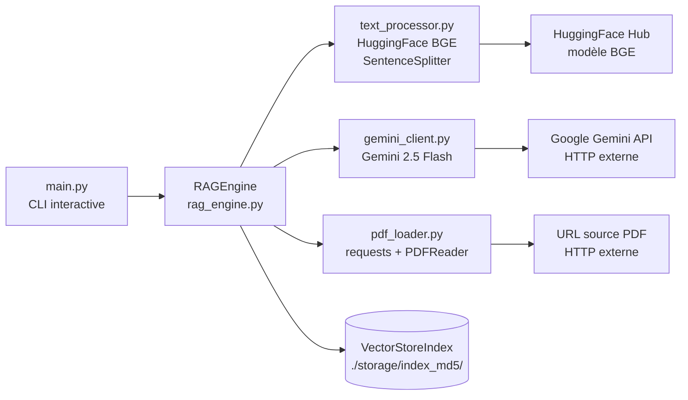

<!--
TEMPLATE — Architecture
=======================
Public cible : (1) une IA assistante de développement qui doit raisonner sur le système
sans relire tout le code à chaque tâche, (2) un humain qui prend le projet en cours.

Ce document est VIVANT : il est mis à jour avant chaque PR (par un skill IA, validé par
un humain). Il décrit le système TEL QU'IL EST, pas tel qu'on aimerait qu'il soit. Les
intentions et décisions à venir vont dans les ADR ou dans la backlog, pas ici.

Garde-fous d'écriture :
- Tout chiffre / nom de composant doit être vérifiable depuis le code ou un artefact
  versionné. Si déduit ou hypothétique, marquer explicitement "(à confirmer)".
- Distinguer "observé" / "décidé" / "ouvert".
- Toute affirmation forte → renvoyer vers un fichier source (code, ADR, schéma).
- Préférer les tableaux et listes courtes à la prose. Une PR doit pouvoir patcher 3 lignes,
  pas un paragraphe.

Le bloc "Mode d'emploi" en fin de fichier détaille la marche à suivre pour l'IA et le relecteur.
-->

# Architecture — RAG

| Champ | Valeur |
|---|---|
| **Dernière mise à jour** | 2026-05-21 |
| **Mise à jour par** | agent IA (doc-patcher) |
| **PR de référence** | 6d1386c |
| **Version applicative** | (à confirmer) |
| **Statut du document** | Brouillon |

> **Résumé en 1 phrase** : Système RAG (Retrieval-Augmented Generation) qui permet de poser des questions en langage naturel sur des documents PDF en combinant un index vectoriel LlamaIndex, des embeddings HuggingFace et le LLM Gemini de Google.

---

## 1. Vue d'ensemble

### 1.1 Nature du système

| Dimension | Valeur |
|---|---|
| **Type** | CLI / Bibliothèque |
| **Mode** | Synchrone |
| **Multi-tenant** | Non — une instance par exécution, un PDF par session |
| **Stateful** | Avec état persistant — index vectoriel sauvegardé dans `./storage/index_<md5_url>/` |
| **Utilisateurs cibles** | Développeurs / chercheurs interrogeant des PDF via terminal |
| **Volumétrie typique** | (à confirmer) |

### 1.2 Flux principal

Au démarrage, `main.py` instancie `RAGEngine` avec une URL de PDF. `RAGEngine` configure les embeddings via `text_processor.setup_advanced_text_processing()` (modèle `BAAI/bge-small-en-v1.5`, chunks de 512 tokens, overlap 50), puis initialise le LLM Gemini via `gemini_client.initialize_gemini_llm()` (modèle `models/gemini-2.5-flash`, clé lue depuis `GOOGLE_API_KEY` via `.env`).

Si un index existe déjà sur disque (`./storage/index_<md5_url>/`), il est rechargé via `StorageContext`. Sinon, `pdf_loader.load_pdf_from_url()` télécharge le PDF (timeout 30 s), `pdf_loader.load_documents_from_pdf()` l'extrait via `PDFReader`, et `VectorStoreIndex.from_documents()` construit et persiste l'index.

L'utilisateur entre ses questions dans une boucle interactive ; chaque question est traitée par `query_engine.query()` avec `similarity_top_k=3` et `response_mode="compact"`, Gemini générant la réponse finale.

---

## 2. Stack technique

| Couche | Choix | Version | Justification courte |
|---|---|---|---|
| **Langage principal** | Python | 3.12 | Cible explicite dans `pyproject.toml` |
| **Framework applicatif** | LlamaIndex (llama-index-core) | (à confirmer) | Orchestration RAG — index, retrieval, query engine |
| **Embeddings** | llama-index-embeddings-huggingface / `BAAI/bge-small-en-v1.5` | (à confirmer) | Embeddings sémantiques dense, légers |
| **LLM** | llama-index-llms-gemini / `models/gemini-2.5-flash` | (à confirmer) | Génération de réponses via Google Gemini |
| **Lecture PDF** | llama-index-readers-file (`PDFReader`) | (à confirmer) | Extraction de texte depuis fichiers PDF locaux |
| **Persistance** | Fichiers locaux (`./storage/`) | — | Sérialisation LlamaIndex `StorageContext.persist()` |
| **Cache** | Aucun cache réseau — cache disque par hash MD5 de l'URL | — | Évite de re-générer les embeddings à chaque run |
| **Messaging** | Aucun | — | — |
| **Auth** | Variable d'environnement `GOOGLE_API_KEY` lue via module `config` (à confirmer) | — | Clé API Google, jamais hardcodée |
| **Observabilité** | `print()` stdout uniquement | — | Aucun collecteur structuré actuellement |
| **CI/CD** | (à confirmer) | — | `pyproject.toml` configure ruff, pyright, bandit, pytest |
| **Déploiement** | Local / script Python | — | Aucune infrastructure cloud observée |

**Dépendances externes critiques** (services tiers dont la panne dégrade le service) :

| Service | Rôle | Mode d'appel | Fallback |
|---|---|---|---|
| Google Gemini API | Génération de la réponse finale | SDK (`llama-index-llms-gemini`) | Aucun — erreur fatale si indisponible |
| HuggingFace Hub | Téléchargement du modèle d'embedding au premier run | HTTP (bibliothèque sentence-transformers) | Cache local HuggingFace si déjà téléchargé |
| URL source du PDF | Fourniture du document à indexer | HTTP via `requests` (timeout 30 s) | Aucun — erreur fatale si inaccessible |

---

## 3. Pattern d'architecture

### 3.1 Style retenu

Procédural modulaire — le projet est une CLI à fichier unique d'entrée (`main.py`) avec quatre modules fonctionnels (`rag_engine`, `pdf_loader`, `text_processor`, `gemini_client`). Pas de framework web, pas d'injection de dépendances formelle. Le couplage est direct (imports Python). Ce style est cohérent avec un outil de recherche/expérimentation mono-utilisateur.

> Décision tracée dans : (à confirmer) — aucun ADR présent dans le repo

### 3.2 Diagramme de composants



### 3.3 Propriétés architecturales

| Propriété | Valeur observée | Justification / mécanisme |
|---|---|---|
| **Couplage** | Fort | Imports directs entre tous les modules ; pas d'interfaces abstraites |
| **Cohésion** | Haute par module | Chaque fichier a une responsabilité unique (loader, embeddings, LLM, orchestration) |
| **Concurrence** | Séquentielle | Boucle interactive bloquante ; pas de threads ni d'async observés |
| **Idempotence** | Garantie sur l'indexation | Même URL → même hash MD5 → même répertoire de cache ; re-run sans effet |
| **Cohérence** | Forte | Fichiers locaux uniquement, pas de base distribuée |
| **Scalabilité** | Verticale uniquement | Process unique, pas de worker pool ; limité par RAM et disque local |

---

## 4. Composants

| Composant | Type | Localisation | Rôle | Entrées | Sorties |
|---|---|---|---|---|---|
| `RAGEngine` | Classe / Orchestrateur | [`rag_engine.py`](../rag_engine.py) | Orchestre indexation, cache et query pipeline | URL de PDF, question texte | Réponse texte |
| `pdf_loader` | Module | [`pdf_loader.py`](../pdf_loader.py) | Télécharge et extrait le contenu d'un PDF | URL HTTP | Liste de `Document` LlamaIndex |
| `text_processor` | Module | [`text_processor.py`](../text_processor.py) | Configure embeddings HuggingFace et `SentenceSplitter` | — | `HuggingFaceEmbedding`, `SentenceSplitter` |
| `gemini_client` | Module | [`gemini_client.py`](../gemini_client.py) | Initialise le LLM Gemini (singleton), l'enregistre dans `Settings`, et expose `generate_text`, `summarize`, `rerank_passages`, `reset_llm` | `GOOGLE_API_KEY` (via `config`) | Instance `Gemini` ; textes générés |
| `main` | Script CLI | [`main.py`](../main.py) | Boucle interactive de questions-réponses | Stdin utilisateur | Stdout réponses |

### 4.1 Détails par composant

#### RAGEngine

- **Rôle** : Point central du pipeline RAG ; gère le cycle de vie de l'index (construction ou chargement depuis cache) et expose la méthode `query()`.
- **Entrées** : `pdf_url` (str), `storage_dir` (str, défaut `./storage`)
- **Sorties** : Réponse textuelle via `query_engine.query()`
- **Dépendances internes** : `pdf_loader`, `text_processor`, `gemini_client`
- **Dépendances externes** : `VectorStoreIndex`, `StorageContext` (LlamaIndex), Google Gemini API
- **Invariants** : Après `__init__`, `self.index` et `self.query_engine` sont toujours initialisés ; `similarity_top_k=3`, `response_mode="compact"`
- **Pièges connus** : Le hash de cache est un MD5 de l'URL brute — une URL identique avec contenu changé côté serveur ne détectera pas la mise à jour du PDF

#### pdf_loader

- **Rôle** : Télécharge un PDF depuis une URL vers un fichier temporaire, puis l'extrait en `Document[]` via `PDFReader`.
- **Entrées** : URL (str) pour `load_pdf_from_url` ; chemin local (str) pour `load_documents_from_pdf`
- **Sorties** : Chemin temporaire (`str`) ; liste de `Document` LlamaIndex
- **Dépendances externes** : `requests` (timeout 30 s), `llama-index-readers-file.PDFReader`
- **Pièges connus** : Le fichier temporaire est toujours `temp_rag_document.pdf` — exécutions concurrentes s'écraseraient mutuellement

#### text_processor

- **Rôle** : Configure globalement LlamaIndex (`Settings.embed_model`, `chunk_size=512`, `chunk_overlap=50`) avec le modèle `BAAI/bge-small-en-v1.5`.
- **Dépendances externes** : `llama-index-embeddings-huggingface`, HuggingFace Hub (download initial)
- **Invariants** : Après appel, `Settings.embed_model` est `HuggingFaceEmbedding(model_name="BAAI/bge-small-en-v1.5")`

#### gemini_client

- **Rôle** : Lit `GOOGLE_API_KEY` depuis le module `config` (à confirmer — `config.py` non présent dans le repo), instancie `Gemini(model="models/gemini-2.5-flash", temperature=0.1, max_tokens=1024)` et l'enregistre dans `Settings.llm`. Expose un singleton (`_llm_state`) et des utilitaires de haut niveau : `generate_text()`, `summarize()`, `rerank_passages()`, `reset_llm()`.
- **Constantes** : `_DEFAULT_MODEL = "models/gemini-2.5-flash"`, `_DEFAULT_TEMPERATURE = 0.1`, `_DEFAULT_MAX_TOKENS = 1024`
- **Dépendances externes** : Google Gemini API, `llama-index-llms-gemini`
- **Pièges connus** : ⚠️ Si le module `config` est absent ou si `GOOGLE_API_KEY` n'y est pas défini, l'import échoue dès le chargement du module (erreur à l'import, pas à l'appel)

---

## 5. Architecture des données

> Vue résumée. Le détail (tables, colonnes, contraintes) est dans [data-model.md](data-model.md).

| Domaine | Stockage | Tables / collections | Volumétrie | Croissance |
|---|---|---|---|---|
| Index vectoriel | Fichiers locaux (`./storage/index_<md5>/`) | Sérialisation LlamaIndex (JSON + binaire) | Dépend de la taille du PDF | Un répertoire par URL unique |

**Pattern temporel** : Aucun versioning — le cache est lié à l'URL ; un changement d'URL crée un nouvel index.

**Politique de rétention** : Aucune politique automatique — les répertoires `./storage/` s'accumulent indéfiniment (à confirmer).

---

## 6. Interfaces

> Vue résumée. Le détail (signatures, payloads, codes retour) est dans [contracts.md](contracts.md).

### 6.1 Interfaces exposées

| Interface | Type | Consommateurs | Stabilité |
|---|---|---|---|
| `RAGEngine.query(question: str) -> str` | API Python in-process | `main.py` | Interne / privé |
| CLI interactive (`main.py`) | CLI stdin/stdout | Utilisateur humain | Interne |

### 6.2 Interfaces consommées

| Interface | Fournisseur | Type d'appel | Criticité |
|---|---|---|---|
| Google Gemini API (`models/gemini-2.5-flash`) | Google Cloud | Sync SDK | Bloquante — pas de fallback |
| HuggingFace Hub (modèle BGE) | HuggingFace | HTTP (download initial) | Dégradable — cache local après premier téléchargement |
| URL source PDF | Serveur HTTP tiers | HTTP sync (`requests`) | Bloquante au premier run |

---

## 7. Déploiement

### 7.1 Topologie

```
Exécution locale uniquement (à confirmer) :
  - Poste développeur / serveur unique
  - Process Python unique
  - Stockage : ./storage/ local
  - Pas de containerisation observée
```

### 7.2 Environnements

| Environnement | URL / Cluster | Données | Auth | Trafic |
|---|---|---|---|---|
| **local** | Poste développeur | PDF téléchargé depuis URL externe | `GOOGLE_API_KEY` via `.env` | Utilisateur unique |
| **staging** | (à confirmer) | (à confirmer) | (à confirmer) | (à confirmer) |
| **prod** | (à confirmer) | (à confirmer) | (à confirmer) | (à confirmer) |

### 7.3 Configuration

- **Format** : Variables d'environnement via fichier `.env` (chargé par `python-dotenv`)
- **Source de vérité** : Fichier `.env` local (non versionné)
- **Secrets** : `GOOGLE_API_KEY` — lu depuis `os.environ`, jamais hardcodé (corrigé dans ce diff)
- **Feature flags** : Aucun

---

## 8. Préoccupations transverses

### 8.1 Sécurité

| Aspect | Mécanisme | Localisation |
|---|---|---|
| **Authentification** | Clé API Google via variable d'environnement | `gemini_client.py`, `.env` |
| **Autorisation** | Aucune — CLI mono-utilisateur | — |
| **Secrets** | `GOOGLE_API_KEY` importée via module `config` (à confirmer) ; `.env` non versionné | `gemini_client.py`, `config` (à confirmer) |
| **Données sensibles** | Aucun chiffrement des index sur disque actuellement | `./storage/` |
| **Audit** | Aucun mécanisme d'audit structuré — `print()` stdout uniquement | — |

### 8.2 Observabilité

| Type | Outil | Volume | Rétention | Alerting |
|---|---|---|---|---|
| **Logs** | `print()` stdout | Faible | Aucune | Aucun |
| **Métriques** | Aucun | — | — | — |
| **Traces** | Aucun | — | — | — |
| **Erreurs** | Exceptions Python non interceptées | — | — | — |

**Convention de corrélation** : Aucune.

### 8.3 Performance

| Métrique | Cible (SLO) | Mesure actuelle | Source |
|---|---|---|---|
| **Latence p95** | (à confirmer) | (à confirmer) | — |
| **Latence p99** | (à confirmer) | (à confirmer) | — |
| **Disponibilité** | (à confirmer) | (à confirmer) | — |
| **Débit max** | (à confirmer) | (à confirmer) | — |

### 8.4 Résilience

- **Timeouts** : 30 s sur le téléchargement PDF (`requests.get(url, timeout=30)`) ; aucun timeout sur les appels Gemini
- **Retry** : Aucune politique de retry
- **Circuit breaker** : Aucun
- **Backpressure** : Aucun
- **Plan de reprise** : (à confirmer)

---

## 9. Stratégie de test

| Niveau | Framework | Couverture | Quand |
|---|---|---|---|
| **Unitaire** | pytest (configuré dans `pyproject.toml`) | (à confirmer) | À chaque commit |
| **Intégration** | (à confirmer) | (à confirmer) | À chaque PR |
| **Contract** | Aucun actuellement | — | — |
| **End-to-end** | Aucun actuellement | — | — |
| **Charge** | Aucun actuellement | — | — |
| **Sécurité** | bandit (configuré dans `pyproject.toml`) | Analyse statique | (à confirmer) |

**Données de test** : (à confirmer) — dossier `tests/` configuré dans `pyproject.toml` mais non observé dans le repo.

---

## 10. Workflow de développement

- **Branches** : `main` (branche par défaut observée)
- **Convention de commits** : (à confirmer) — gitlint configuré dans les dépendances dev
- **CI** : (à confirmer) — ruff (lint + format), pyright (typage), bandit (sécurité), pytest configurés dans `pyproject.toml`
- **Code review** : (à confirmer)
- **Mise à jour de cette doc** : Skill IA doc-patcher exécuté en pre-PR + relecture humaine — voir mode d'emploi en fin de fichier.

---

## 11. Décisions et points ouverts

### 11.1 Décisions actives

Aucun ADR actuellement dans le repo.

### 11.2 Points ouverts

| # | Question | Impact | Owner |
|---|---|---|---|
| Q1 | Le fichier temporaire PDF est toujours le même chemin (`temp_rag_document.pdf`) — exécutions parallèles s'écraseraient | Corruption silencieuse si usage concurrent | (à confirmer) |
| Q2 | Pas de politique de purge du cache `./storage/` — croissance illimitée | Espace disque | (à confirmer) |
| Q3 | Aucun timeout sur les appels Gemini — une réponse lente bloque l'utilisateur indéfiniment | UX | (à confirmer) |
| Q4 | `pyproject.toml` ne déclare pas de section `[project]` avec les dépendances principales — versions non épinglées | Reproductibilité des builds | (à confirmer) |
| Q5 | `gemini_client.py` importe `from config import GOOGLE_API_KEY` mais aucun module `config.py` n'est présent dans le repo — échec à l'import si non créé | Démarrage impossible | (à confirmer) |

### 11.3 Dette technique structurante

| Item | Origine | Coût d'évitement | Plan |
|---|---|---|---|
| Pas d'interface abstraite entre composants | Prototypage rapide | Rend les tests unitaires avec mocks difficiles | (à confirmer) |
| Logs via `print()` uniquement | Simplicité initiale | Pas de niveaux de log, pas de corrélation, pas d'export | (à confirmer) |

---

## 12. Références

- Modèle de données : [data-model.md](data-model.md)
- Contrats d'interface : [contracts.md](contracts.md)
- Glossaire : [glossaire.md](glossaire.md)
- Documentation fonctionnelle : [fonctionnel.md](fonctionnel.md)
- Index général : [index.md](index.md)
- ADR : Aucun actuellement
- Runbooks ops : (à confirmer)
- Dashboards : (à confirmer)

---

<!--
MODE D'EMPLOI DU TEMPLATE
=========================

POUR L'IA QUI MET À JOUR CE DOCUMENT AVANT UNE PR

Déclencheurs (mettre à jour les sections concernées si la PR touche…) :

| Modification dans la PR | Sections à relire |
|---|---|
| Ajout / suppression / renommage d'un service ou module | §3 (diagramme), §4 (composants) |
| Changement de stack (langage, framework, lib majeure) | §2 |
| Nouvelle table / collection ou schéma modifié | §5 (résumé), data-model.md (détail) |
| Nouvelle interface exposée ou consommée | §6, contracts.md (détail) |
| Changement d'environnement, IaC, manifestes K8s | §7 |
| Nouveau mécanisme d'auth, audit, secrets | §8.1 |
| Nouveau collecteur logs / métriques / dashboards | §8.2 |
| SLO, timeout, retry, circuit breaker modifiés | §8.3, §8.4 |
| Nouveau type de test, framework de test | §9 |
| Changement de workflow CI ou règle de branche | §10 |
| Nouvel ADR fusionné | §11.1 |

Règles d'écriture :
1. Mettre à jour le bloc d'en-tête (date, PR de référence, version, mise à jour par).
2. Pour chaque modification, citer la PR ou le commit en référence si non évident.
3. Ne pas réécrire des sections inchangées — diff minimal.
4. Marquer "(à confirmer)" toute affirmation non vérifiable depuis le code à l'instant T.
5. Si une section devient obsolète, la VIDER avec une mention "Aucun {{X}} actuellement"
   plutôt que la supprimer — l'absence est une information.
6. Si la doc et le code divergent, ouvrir un point dans §11.2 et le signaler dans le
   message de PR — ne PAS aligner silencieusement.

Auto-checks à effectuer avant de proposer la mise à jour :
- [ ] Les composants listés en §4 existent réellement dans le repo (vérifier les chemins).
- [ ] Le diagramme Mermaid §3.2 correspond aux appels effectivement présents dans le code.
- [ ] Les versions §2 correspondent au manifeste de dépendances actuel.
- [ ] Les ADR cités §11.1 existent dans le dossier ADR.
- [ ] Les liens des §12 ne sont pas cassés.

POUR LE RELECTEUR HUMAIN

- Le diff doit être lisible : si plus de 30 lignes changent, demander à l'IA de
  scinder par section.
- Vérifier que les chiffres (SLO, volumétrie, version) ne sont pas inventés.
- Toute hypothèse "(à confirmer)" doit être levée ou explicitement assumée.
- Si une section est trop générique (pleine de "{{}}" non remplis), c'est un signe que
  la section n'a jamais été vraiment travaillée — la signaler ou la vider.

POUR ADAPTER À UN AUTRE PROJET

1. Remplacer `{{NOM_PROJET}}` et tous les autres `{{...}}`.
2. Garder les 12 sections et leur ordre — c'est la grille standard.
3. Une section vide est légitime si « non applicable » ; le marquer explicitement.
4. Adapter le diagramme Mermaid §3.2 au style réel (peut être un schéma C4 niveau 2,
   un diagramme de séquence, etc.).
5. Pour un système purement frontal : §5 et §6 peuvent être minces, mais ne pas
   supprimer — pointer vers le backend qui porte ces aspects.
6. Pour un système purement batch : adapter §1.2 ("flux principal" = traitement d'un fichier),
   §6 (interfaces = formats E/S), §8.3 (perf = débit + temps fenêtre).
-->
