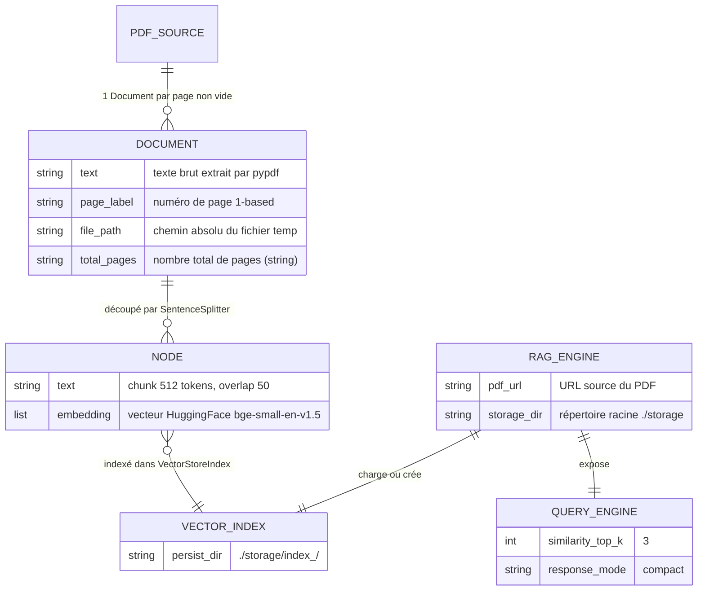

<!--
TEMPLATE — Modèle de données
============================
Public cible : (1) une IA qui écrit du code touchant à la persistance et doit raisonner
sur le schéma sans relire le SQL/ORM, (2) un humain qui prend le projet.

Doit permettre de RAISONNER sur les données sans ouvrir une seule migration. Catalogue
exhaustif, ordonné par importance fonctionnelle (pivot d'abord), pas par ordre alphabétique.

Garde-fous d'écriture :
- Tout type, contrainte, index = vérifiable depuis le DDL versionné OU le code (annotations
  ORM, schéma de validation). Si ni l'un ni l'autre, marquer "(à confirmer)".
- Les volumétries citées sont datées et tracent leur source (dashboard, requête, anonymisée
  depuis prod, etc.).
- Une cellule "non utilisé / aucun accès" est UNE INFORMATION — ne pas la supprimer.

Bloc « Mode d'emploi » en fin de fichier.
-->

# Modèle de données — RAG

| Champ | Valeur |
|---|---|
| **Dernière mise à jour** | 2026-05-07 |
| **Mise à jour par** | agent IA (doc-patcher) |
| **PR de référence** | (à confirmer) |
| **SGBD / Stockage** | Stockage vectoriel local sur disque (LlamaIndex `VectorStoreIndex`, persisté dans `./storage/`) |
| **État du DDL** | Pas de DDL SQL — schéma défini par les annotations Python et la configuration LlamaIndex |
| **Source d'extraction** | `rag_engine.py`, `pdf_loader.py`, `text_processor.py`, `gemini_client.py` |

> **Résumé en 1 phrase** : Ce système RAG télécharge un PDF depuis une URL, en extrait le texte page par page, le découpe en chunks sémantiques, génère des embeddings vectoriels persistés localement, puis répond à des questions en langage naturel via Gemini LLM.

---

## 1. Vue d'ensemble

| Indicateur | Valeur | Source |
|---|---|---|
| **Nombre de tables / collections** | 1 collection de documents vectoriels par PDF (dossier `index_<md5>`) | `rag_engine.py` |
| **Nombre de domaines fonctionnels** | 1 — recherche sémantique sur PDF | — |
| **Relations** | Aucune FK déclarée ; lien implicite entre chunk `Document` et ses métadonnées `page_label` / `file_path` / `total_pages` | `pdf_loader.py` |
| **Objets non-table** | Aucun trigger, vue ou procédure stockée | — |
| **Volume total approximatif** | Dépend du PDF source — 1 `Document` LlamaIndex par page non vide | (à confirmer) |
| **Croissance** | Append-only par PDF ; un nouveau PDF crée un nouveau sous-dossier de stockage | `rag_engine.py:_get_index_path` |

> _Résumé en 3 lignes : à quoi sert cette base ? Quels sont les concepts pivots ?_
>
> La persistance repose sur le stockage vectoriel de LlamaIndex sérialisé sur disque. Le concept pivot est le `Document` (un par page PDF), découpé en nœuds de 512 tokens avec 50 tokens de chevauchement. Le mode dominant est write-once à l'indexation, read-only au moment des requêtes.

---

## 2. Vue d'ensemble par domaine

> Les tables sont regroupées par **rôle fonctionnel**, pas par ordre alphabétique. Une cellule vide dans la matrice d'accès §7 est une information en soi : elle signifie « aucun accès ».

```
┌─── Chargement PDF ─────────────────────────────────────────┐
│   pdf_loader.load_pdf_from_url()                           │
│     → fichier temp .pdf                                    │
│   pdf_loader.load_documents_from_pdf()                     │
│     → list[Document]  (1 par page, par lots de 50)         │
│       ├─ text        : str   (texte extrait pypdf)         │
│       └─ metadata    : dict                                │
│            ├─ page_label   : str  (numéro 1-based)         │
│            ├─ file_path    : str  (chemin temp absolu)     │
│            └─ total_pages  : str  (nombre total de pages)  │
└────────────────────────┬───────────────────────────────────┘
                         │ documents
                         ▼
┌─── Indexation vectorielle ─────────────────────────────────┐
│   text_processor.setup_advanced_text_processing()          │
│     Settings.chunk_size      = 512                         │
│     Settings.chunk_overlap   = 50                          │
│     Settings.embed_batch_size = 32                         │
│     Settings.embed_model = HuggingFaceEmbedding            │
│                             (BAAI/bge-small-en-v1.5)       │
│   text_processor.create_node_parser() → SentenceSplitter   │
│   VectorStoreIndex.from_documents(documents)               │
│     → persisté dans ./storage/index_<md5(url)>/            │
└────────────────────────┬───────────────────────────────────┘
                         │ index
                         ▼
┌─── Requête ────────────────────────────────────────────────┐
│   RAGEngine.query_engine  (similarity_top_k=3,             │
│                            response_mode="compact")        │
│   gemini_client → Gemini(models/gemini-2.5-flash,          │
│                           temperature=0.1)                 │
└────────────────────────────────────────────────────────────┘
```

---

## 3. Diagramme entité-relation



> Cardinalités Mermaid : `||--o{` = 1:N · `||--||` = 1:1 · `}o--o{` = N:N · `||--o|` = 1:0..1.
> Les relations entre `Document`, `Node` et `VectorStoreIndex` sont gérées par LlamaIndex en mémoire puis persistées sur disque — aucune FK SQL déclarée.

---

## 4. Relations

> Une ligne par arête. Ordonner par centralité : pivot d'abord, feuilles après.

| Source | Cible | Cardinalité | Clé(s) | Déclarée ? | Sémantique |
|---|---|---|---|---|---|
| `Document` | `Node` | 1:N | `page_label` (métadonnée) | Implicite (LlamaIndex) | Un document PDF par page est découpé en N nœuds de 512 tokens |
| `Node` | `VectorStoreIndex` | N:1 | vecteur d'embedding | Implicite (LlamaIndex) | Chaque nœud est inséré dans l'index vectoriel persisté |
| `RAGEngine` | `VectorStoreIndex` | 1:1 | `index_<md5(pdf_url)>` | Implicite (code) | Le moteur charge ou crée un index par URL de PDF |

> ⚠️ Il n'existe aucune FK SQL. Toute l'intégrité référentielle est tenue par LlamaIndex et `rag_engine.py`. Un changement de modèle d'embedding invalide les index existants sans erreur explicite — reconstruire le stockage en cas de changement d'embedding.

---

## 5. Catalogue des tables

> Un bloc complet par table **pivot** ou **fréquemment écrite**. Un bloc abrégé pour les référentiels stables. Ordre : pivot → catalogue → liens → audit.

### 5.1 `Document` — unité de texte PDF extraite par page

| Méta | Valeur |
|---|---|
| **Domaine** | Chargement PDF |
| **Accédée par** | `pdf_loader.load_documents_from_pdf`, `RAGEngine.__init__` |
| **Volumétrie** | 1 par page non vide ; variable selon le PDF source |
| **Mode dominant** | Write-once (indexation) — jamais mis à jour |
| **PK** | Aucune PK explicite ; identifié par `page_label` en pratique |
| **FK sortantes** | Aucune déclarée |
| **Index** | Aucun index secondaire |
| **Pattern temporel** | Append-only à l'indexation ; fichier temp supprimé après indexation |

**Champs**

| Champ | Type Python | Null | Description | Flags |
|---|---|---|---|---|
| `text` | `str` | N | Texte brut extrait par `pypdf` pour la page | — |
| `metadata.page_label` | `str` | N | Numéro de page 1-based converti en chaîne | — |
| `metadata.file_path` | `str` | N | Chemin absolu du fichier PDF temporaire | — |
| `metadata.total_pages` | `str` | N | Nombre total de pages du PDF converti en chaîne | — |

**Pièges connus**

- ⚠️ Les pages vides (texte extrait vide ou uniquement des espaces) sont silencieusement ignorées — un PDF scanné sans OCR produira zéro `Document` et lèvera `ValueError`.
- ⚠️ `total_pages` et `page_label` sont des `str`, non des `int` — comparer avec précaution.
- ⚠️ `file_path` pointe vers un fichier temporaire supprimé après indexation (`os.unlink`) — ne pas le stocker comme référence durable.

**Évolutions notables**

| Date | PR | Changement |
|---|---|---|
| 2026-05-07 | (à confirmer) | Définition initiale du schéma de métadonnées `page_label / file_path / total_pages` |

---

### 5.2 `Node` — chunk sémantique prêt à l'embedding _(forme abrégée)_

- **Domaine :** Indexation vectorielle · **Créé par :** `SentenceSplitter` (LlamaIndex) · **Consommé par :** `VectorStoreIndex`
- **Champs clés :** `text` (str, ≤ 512 tokens), `embedding` (list[float], bge-small-en-v1.5), métadonnées héritées du `Document` parent
- **Pattern :** Dérivé du `Document` à l'indexation ; 50 tokens de chevauchement entre nœuds consécutifs (`chunk_overlap = 50`)

---

### 5.3 `RAGEngine` — classe principale orchestrant le pipeline _(forme abrégée)_

- **Domaine :** Orchestration · **Défini dans :** `rag_engine.py`
- **Attributs d'instance :** `pdf_url` (str), `storage_dir` (str, défaut `"./storage"`), `embed_model` (HuggingFaceEmbedding), `llm` (Gemini), `parser` (SentenceSplitter), `index` (VectorStoreIndex), `query_engine` (QueryEngine)
- **Pattern :** Initialisation complète dans `__init__` ; index chargé depuis le cache si `./storage/index_<md5(pdf_url)>/` existe, sinon construit et persisté

---

## 6. Synthèse catalogue

| Domaine | Entité | Volume | PK | Évolutivité |
|---|---|---|---|---|
| Chargement PDF | `Document` | 1 par page non vide | `page_label` (implicite) | Write-once par indexation |
| Indexation vectorielle | `Node` | N par `Document` (chunk_size=512, overlap=50) | ID LlamaIndex interne | Write-once par indexation |
| Stockage persisté | `VectorStoreIndex` | 1 par URL de PDF (dossier `index_<md5>`) | Chemin de dossier | Append-only — recréé si absent |
| Orchestration | `RAGEngine` | Instance unique par session | — | Quasi-stable |

---

## 7. Matrice d'accès composant × table

> Lignes = composants/services. Colonnes = tables. Cellule vide = aucun accès = information utile.
> Légende : 👁 SELECT · 🔄 SELECT curseur / paginé · ✍ INSERT · ✏ UPDATE · 🗑 DELETE · 🔀 UPSERT.

| Composant | `Document` | `Node` | `VectorStoreIndex` |
|---|---|---|---|
| `pdf_loader` | ✍ | — | — |
| `text_processor` | 👁 | ✍ | — |
| `rag_engine.RAGEngine` | 👁 | 👁 | ✍ 👁 |
| `gemini_client` | — | — | 👁 |

---

## 8. Objets non-table

| Type | Nom | Rôle | Localisation source |
|---|---|---|---|
| Vue | — | Aucune vue SQL | — |
| Séquence | — | Aucune séquence | — |
| Trigger | — | Aucun trigger | — |
| Fonction / Procédure | — | Aucune procédure stockée | — |
| Index spécial | `VectorStoreIndex` (HNSW implicite LlamaIndex) | Index de similarité cosinus pour la recherche `similarity_top_k=3` | `rag_engine.py:66` |

> ⚠️ Les triggers et procédures stockées sont des **zones à risque** : la logique métier qu'ils portent doit aussi être documentée dans [fonctionnel.md](fonctionnel.md) ou [contracts.md](contracts.md).

---

## 9. Conventions transverses

### 9.1 Nommage

| Préfixe / suffixe | Sémantique | Exemple | Type canonique |
|---|---|---|---|
| `page_label` | Numéro de page | `page_label` | `str` (entier 1-based sérialisé) |
| `file_path` | Chemin absolu fichier | `file_path` | `str` (chemin OS absolu) |
| `total_pages` | Compteur total pages | `total_pages` | `str` (entier sérialisé) |
| `_<NOM>` (constantes module) | Constante de configuration interne | `_DOWNLOAD_CHUNK`, `_REQUEST_TIMEOUT`, `_PAGE_BATCH` | `int` ou `tuple[int, int]` |

### 9.2 Types et conversions critiques

> Documenter ICI tout type qui pose problème aux frontières (sérialisation, comparaison, hashing).

- **`str` pour `page_label` et `total_pages`** : ces champs contiennent des entiers sérialisés en chaîne (`str(idx + 1)`, `str(total)`) — toute comparaison numérique nécessite une conversion explicite (`int(page_label)`).
- **`tuple[int, int]` pour `_REQUEST_TIMEOUT`** : `(10, 60)` = (timeout connexion en s, timeout lecture en s) — passé directement à `requests.get(timeout=...)`.
- **`_DOWNLOAD_CHUNK`** : 8 388 608 octets (8 MiB) — taille des blocs en écriture streaming du PDF ; réduire si contrainte mémoire réseau.

### 9.3 Dates et périodes de validité

- **Format applicatif** : Pas de champ date applicatif dans le schéma courant — aucune temporalité métier persistée.
- **Fuseau** : Sans objet.
- **Convention de validité** : Sans objet — les données sont write-once, jamais mises à jour.

### 9.4 NULL sémantique

| Champ | NULL signifie | Impact |
|---|---|---|
| `Document.text` | Jamais NULL — page ignorée si texte vide après strip | Aucun `Document` créé pour la page |
| `metadata.file_path` | Jamais NULL — chemin temp toujours valorisé | — |
| `metadata.page_label` | Jamais NULL | — |

### 9.5 Capture d'erreur SQL / DB

- **Mécanisme** : `requests.HTTPError` levée par `resp.raise_for_status()` dans `pdf_loader.load_pdf_from_url` ; `ValueError` levée si aucun texte extractible ; `MemoryError` capturée dans `RAGEngine.__init__` avec message explicite.
- **Logs** : `print()` vers stdout — pas de logging structuré actuellement (à confirmer).
- **Localisation** : Gestion dans `pdf_loader.py` (téléchargement) et `rag_engine.py` (indexation).

---

## 10. Contraintes implicites

> Règles d'intégrité **non déclarées en base** mais **tenues par le code**. Toute évolution doit les préserver — voir [contracts.md](contracts.md) pour les composants qui les portent.

| # | Règle | Tenue par | Sanction si violée |
|---|---|---|---|
| IMP-01 | Toute page PDF dont le texte est vide après `strip()` est exclue silencieusement | `pdf_loader.load_documents_from_pdf` | Perte silencieuse de contenu (PDF scanné sans OCR) |
| IMP-02 | Si zéro `Document` produit, `ValueError` levée avant toute indexation | `pdf_loader.load_documents_from_pdf` | Arrêt complet du pipeline — aucun index créé |
| IMP-03 | L'index existant est réutilisé sans vérification de cohérence avec le modèle d'embedding courant | `rag_engine.RAGEngine._get_index_path` | Résultats silencieusement incohérents si le modèle d'embedding a changé |
| IMP-04 | Le fichier PDF temporaire est supprimé après indexation via `os.unlink` dans un bloc `finally` | `rag_engine.RAGEngine.__init__` | Fuite de fichiers temporaires si l'exception survient hors du `finally` |

---

## 11. Politique de rétention et purge

| Entité | Rétention | Mécanisme | RGPD / sensible |
|---|---|---|---|
| `Document` (objet en mémoire) | Durée de l'indexation uniquement ; libéré par `del documents` + `gc.collect()` | Suppression explicite en mémoire (`rag_engine.py:58-59`) | Dépend du contenu PDF source |
| Fichier PDF temporaire | Supprimé immédiatement après indexation | `os.unlink` dans `finally` (`rag_engine.py:43`) | Potentiellement sensible selon le PDF |
| `VectorStoreIndex` (persisté) | Indéfinie — aucun mécanisme de purge automatique | Dossier `./storage/index_<md5>/` sur disque | Embeddings vectoriels — non directement lisibles mais issus du contenu source |

---

## 12. Migrations / évolutions

> Les migrations détaillées vivent dans `{{db/migrations/}}`. Cette section donne le cadre.

- **Outil** : Pas de migration SQL — le schéma est défini par le code Python et la configuration LlamaIndex.
- **Convention de nommage** : Dossiers de stockage nommés `index_<md5_hex(pdf_url)>` dans `./storage/` — déterministe par URL.
- **Réversibilité** : Supprimer le dossier `./storage/index_<md5>/` pour forcer la réindexation — aucune migration à appliquer.
- **Stratégie pour les changements bloquants** : Changer `chunk_size`, `chunk_overlap` ou `embed_model` nécessite de purger manuellement `./storage/` et de réindexer tous les PDFs.

---

## 13. Recommandations actives

> Recommandations **non encore appliquées** — actions concrètes, pas des vœux pieux. Une fois traitées, les retirer (les conserver dans la PR qui les implémente).

1. **Ajouter un mécanisme de vérification de cohérence de l'index** — Lors du chargement d'un index existant, vérifier que le modèle d'embedding et les paramètres de chunking correspondent à ceux de l'index persisté (`chunk_size`, `chunk_overlap`, `embed_model`). Sans cette vérification, un changement de configuration produit silencieusement des résultats incohérents (IMP-03).
2. **Remplacer les `print()` par un logger structuré** — Le pipeline actuel utilise `print()` pour tout son reporting. Un logger (`logging.getLogger`) permettrait le filtrage par niveau, la structuration et l'intégration dans des systèmes d'observabilité.
3. **Définir une politique de purge pour `./storage/`** — Les index vectoriels s'accumulent indéfiniment sur disque. Définir un TTL ou un mécanisme de purge explicite, notamment pour les PDFs temporaires.

---

## Références

- Architecture : [architecture.md](architecture.md)
- Contrats des composants accédant aux données : [contracts.md](contracts.md)
- Glossaire : [glossaire.md](glossaire.md)
- Migrations versionnées : Sans objet — pas de DDL SQL dans ce projet

---

<!--
MODE D'EMPLOI DU TEMPLATE
=========================

POUR L'IA QUI MET À JOUR CE FICHIER

Déclencheurs (mettre à jour les sections concernées si la PR touche…) :

| Modification dans la PR | Sections à relire |
|---|---|
| Nouvelle migration / DDL change | §1, §3, §4, §5 (table concernée), §6 |
| Ajout / suppression de table | §1, §2, §3, §4, §5, §6, §7 |
| Nouvelle FK ou index | §4, §5 (table concernée), §10 si elle remplace une contrainte implicite |
| Nouveau composant accédant à la base | §7 (matrice) |
| Nouveau trigger / procédure / vue | §8 |
| Changement de convention de nommage | §9.1 |
| Changement de mécanisme de date / fuseau | §9.3 |
| Politique de rétention modifiée | §11 |
| Outil de migration changé | §12 |

Pour chaque table modifiée, MAJ obligatoire :
- Le bloc colonnes (§5.x).
- La ligne dans §6 si la volumétrie change d'ordre de grandeur.
- La ligne dans la matrice §7 si l'accès change.
- Ajouter une ligne « Évolutions notables » dans le bloc table avec date + PR.

Auto-checks :
- [ ] Toutes les tables citées en §5 existent dans le DDL / l'ORM.
- [ ] Toutes les FK §4 marquées « déclarée » correspondent à une vraie FK SQL.
- [ ] Le diagramme §3 reflète les relations §4.
- [ ] La matrice §7 ne mentionne pas de composant supprimé.
- [ ] Aucune `(à confirmer)` ancienne de plus de 60 jours sans ticket associé.

POUR LE RELECTEUR HUMAIN

- Vérifier que les volumétries ont une source datée (sinon : « ordre approximatif »).
- Les pièges §5.x doivent être réalistes — pas de sur-anticipation.
- Si l'IA invente un IMP-XX, vérifier que c'est bien tenu par le code et pas une
  hypothèse de relecture.

POUR ADAPTER À UN AUTRE PROJET

1. Remplacer placeholders.
2. Si stockage non relationnel (DynamoDB, MongoDB, Cassandra) :
   - §3 (ER) → schéma de documents / partitions clés.
   - §4 (relations) → références dénormalisées + GSI / SI.
   - §5 → catalogue de collections / item types ; les « colonnes » deviennent attributs.
3. Si plusieurs bases : dupliquer §5 par base, garder une vue d'ensemble §1 unique.
4. Garder les sections vides plutôt que les supprimer — l'absence est une information
   (« pas de trigger », « pas de pattern temporel »).
-->
