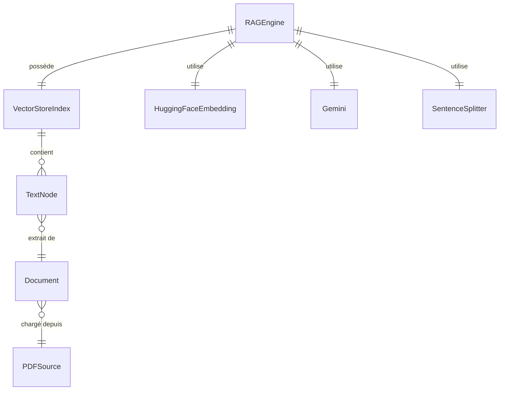

<!--
TEMPLATE — Modèle de données
============================
Public cible : (1) une IA qui écrit du code touchant à la persistance et doit raisonner
sur le schéma sans relire le SQL/ORM, (2) un humain qui prend le projet.

Doit permettre de RAISONNER sur les données sans ouvrir une seule migration. Catalogue
exhaustif, ordonné par importance fonctionnelle (pivot d'abord), pas par ordre alphabétique.

Garde-fous d'écriture :
- Tout type, contrainte, index = vérifiable depuis le DDL versionné OU le code (annotations
  ORM, schéma de validation). Si ni l'un ni l'autre, marquer "(à confirmer)".
- Les volumétries citées sont datées et tracent leur source (dashboard, requête, anonymisée
  depuis prod, etc.).
- Une cellule "non utilisé / aucun accès" est UNE INFORMATION — ne pas la supprimer.

Bloc « Mode d'emploi » en fin de fichier.
-->

# Modèle de données — RAG PDF Engine

| Champ | Valeur |
|---|---|
| **Dernière mise à jour** | 2026-05-21 |
| **Mise à jour par** | agent IA (doc-patcher) |
| **PR de référence** | (à confirmer) |
| **SGBD / Stockage** | Fichiers vectoriels sur disque — LlamaIndex `VectorStoreIndex` persisté dans `./storage/` |
| **État du DDL** | Pas de DDL SQL — structure tenue par le code (`rag_engine.py`, `text_processor.py`) |
| **Source d'extraction** | `rag_engine.py`, `text_processor.py`, `gemini_client.py`, `pdf_loader.py` |

> **Résumé en 1 phrase** : Ce système persiste des index vectoriels issus de PDF téléchargés, chaque index étant identifié par le hash MD5 de l'URL source et stocké sur disque pour réutilisation.

---

## 1. Vue d'ensemble

| Indicateur | Valeur | Source |
|---|---|---|
| **Nombre de tables / collections** | 1 type de collection (index vectoriel par URL) | `rag_engine.py:_get_index_path` |
| **Nombre de domaines fonctionnels** | 1 (indexation et interrogation de PDF) | `rag_engine.py` |
| **Relations** | 0 FK déclarées — 1 lien implicite (index ↔ URL via hash MD5) | `rag_engine.py:_get_index_path` |
| **Objets non-table** | Aucun (pas de triggers, vues ou procédures) | — |
| **Volume total approximatif** | Dépend des PDF indexés — un répertoire par URL | (à confirmer) |
| **Croissance** | Append-only (un nouveau répertoire par nouvelle URL) | `rag_engine.py:_save_index` |

> Le pivot est l'**index vectoriel** (`VectorStoreIndex`) généré à partir d'un PDF. Chaque index est identifié par `index_{md5(pdf_url)}` et persiste sur disque.
> Le mode dominant est **lecture** (chargement de l'index existant) avec une phase **écriture** unique lors du premier accès à une URL.
> Il n'y a pas de base de données relationnelle — le stockage est entièrement géré par LlamaIndex via des fichiers dans `./storage/`.

---

## 2. Vue d'ensemble par domaine

> Pas de base relationnelle. Les « collections » sont des répertoires sur disque gérés par LlamaIndex.

```
┌─── Entrée ──────────────────────────────┐
│   pdf_url (str)                         │
│   → hash MD5 → index_{hash}/            │
└────────────────────┬────────────────────┘
                     │ téléchargement (requests)
                     ▼
┌─── Traitement ──────────────────────────┐
│   Fichier temp : /tmp/temp_rag_document.pdf │
│   → PDFReader → list[Document]          │
│   → SentenceSplitter (chunk=512, ov=50) │
│   → nodes (TextNode[])                  │
└────────────────────┬────────────────────┘
                     │ indexation (HuggingFaceEmbedding)
                     ▼
┌─── Persistance ─────────────────────────┐
│   ./storage/index_{md5}/                │
│   ├─ docstore.json                      │
│   ├─ index_store.json                   │
│   └─ vector_store.json  (à confirmer)   │
└─────────────────────────────────────────┘
```

---

## 3. Diagramme entité-relation



> Cardinalités Mermaid : `||--o{` = 1:N · `||--||` = 1:1 · `}o--o{` = N:N · `||--o|` = 1:0..1.
> Les entités sont des objets Python / LlamaIndex, pas des tables SQL. Les relations sont tenues par le code (`rag_engine.py`), non déclarées en base.

---

## 4. Relations

> Une ligne par arête. Ordonner par centralité : pivot d'abord, feuilles après.

| Source | Cible | Cardinalité | Clé(s) | Déclarée ? | Sémantique |
|---|---|---|---|---|---|
| `RAGEngine` | `VectorStoreIndex` | 1:1 | `self.index` | Implicite (code) | L'engine possède un seul index vectoriel |
| `RAGEngine` | `HuggingFaceEmbedding` | 1:1 | `self.embed_model` | Implicite (code) | Modèle BAAI/bge-small-en-v1.5 — configuré dans `Settings` |
| `RAGEngine` | `Gemini` | 1:1 | `self.llm` | Implicite (code) | LLM gemini-2.5-flash — configuré dans `Settings` |
| `RAGEngine` | `SentenceSplitter` | 1:1 | `self.parser` | Implicite (code) | Découpage en chunks de 512 tokens, overlap 50 |
| `VectorStoreIndex` | `TextNode` | 1:N | interne LlamaIndex | Implicite (LlamaIndex) | Chaque index contient N nœuds textuels |
| `pdf_url` | `storage_path` | 1:1 | `md5(pdf_url)` | Implicite (code) | Le chemin disque est dérivé du hash MD5 de l'URL |

> ⚠️ La correspondance `url → index_path` est tenue uniquement par `_get_index_path()` via MD5. Un changement d'URL (même PDF) génère un nouvel index — pas de déduplication de contenu.

---

## 5. Catalogue des entités

> Pas de tables SQL. Les entités sont des objets Python / structures LlamaIndex. Un bloc par entité pivot.

### 5.1 `RAGEngine` — moteur principal du système RAG

| Méta | Valeur |
|---|---|
| **Domaine** | Orchestration RAG |
| **Fichier source** | [`rag_engine.py`](../rag_engine.py) |
| **Mode dominant** | Mixte (écriture à la création de l'index, lecture pour les requêtes) |
| **Pattern temporel** | Stateless à l'exécution — état persisté sur disque |

**Attributs d'instance**

| Attribut | Type | Description | Valeur par défaut |
|---|---|---|---|
| `storage_dir` | `str` | Répertoire racine de persistance des index | `'./storage'` |
| `pdf_url` | `str` | URL du PDF source | (requis) |
| `embed_model` | `HuggingFaceEmbedding` | Modèle d'embedding (`BAAI/bge-small-en-v1.5`) | — |
| `llm` | `Gemini` | LLM Gemini (`models/gemini-2.5-flash`) | — |
| `parser` | `SentenceSplitter` | Découpeur de texte (chunk=512, overlap=50) | — |
| `index` | `VectorStoreIndex` | Index vectoriel LlamaIndex | — |
| `query_engine` | objet query engine | Moteur de requête (`similarity_top_k=3`, `response_mode="compact"`) | — |

**Flux d'initialisation**

```python
# Premier accès — construction
RAGEngine(pdf_url="https://...") 
# → télécharge PDF → extrait Documents → construit VectorStoreIndex → persiste dans ./storage/index_{md5}/

# Accès ultérieur — cache
RAGEngine(pdf_url="https://...")
# → détecte ./storage/index_{md5}/ existant → charge depuis disque
```

**Pièges connus**

- ⚠️ La clé d'index est `md5(pdf_url)` — une URL modifiée (ex. paramètre de query string) force une re-indexation complète même si le contenu du PDF est identique.
- ⚠️ `Settings` de LlamaIndex est un singleton global — `embed_model`, `llm` et `node_parser` sont mutés globalement à chaque instanciation de `RAGEngine`.

**Évolutions notables**

| Date | PR | Changement |
|---|---|---|
| 2026-05-21 | (à confirmer) | Initialisation du document |

---

### 5.2 `VectorStoreIndex` — index vectoriel persisté _(forme abrégée)_

- **Domaine :** Persistance · **Géré par :** LlamaIndex (`llama_index.core`) · **Clé :** répertoire `./storage/index_{md5(url)}/`
- **Attributs exposés :** `storage_context` (utilisé pour `persist()`)
- **Pattern :** Append-only à la création, lecture seule au runtime

---

### 5.3 `SentenceSplitter` — parseur de nœuds _(forme abrégée)_

- **Domaine :** Traitement texte · **Fichier :** [`text_processor.py`](../text_processor.py) · **Classe :** `llama_index.core.node_parser.SentenceSplitter`
- **Paramètres :** `chunk_size=512`, `chunk_overlap=50`
- **Pattern :** Stateless — recréé à chaque instanciation de `RAGEngine`

---

## 6. Synthèse catalogue

| Domaine | Entité | Volume | Clé | Évolutivité |
|---|---|---|---|---|
| Orchestration | `RAGEngine` | 1 instance par exécution | `pdf_url` (en mémoire) | Stateless |
| Persistance vectorielle | `VectorStoreIndex` | 1 répertoire par URL unique | `index_{md5(url)}/` | Append-only (1 écriture, N lectures) |
| Traitement texte | `SentenceSplitter` | Stateless | — | Quasi-stable (paramètres fixes) |
| Embeddings | `HuggingFaceEmbedding` | Modèle chargé en mémoire | — | Quasi-stable (`BAAI/bge-small-en-v1.5`) |
| LLM | `Gemini` | 1 client par exécution | — | Quasi-stable (`models/gemini-2.5-flash`) |

---

## 7. Matrice d'accès composant × entité

> Lignes = modules Python. Colonnes = entités / stockages. Cellule vide = aucun accès.
> Légende : 👁 lecture · ✍ écriture / création · 🔀 lecture+écriture.

| Module | `VectorStoreIndex` (disque) | `HuggingFaceEmbedding` | `Gemini` | `SentenceSplitter` |
|---|---|---|---|---|
| `rag_engine.py` | 🔀 | 👁 | 👁 | 👁 |
| `text_processor.py` | — | ✍ | — | ✍ |
| `gemini_client.py` | — | — | ✍ | — |
| `pdf_loader.py` | — | — | — | — |

---

## 8. Objets non-table

> Pas de base relationnelle — aucun trigger, vue, séquence ou procédure stockée. Les seuls objets persistés sont les fichiers LlamaIndex dans `./storage/`.

| Type | Nom | Rôle | Localisation source |
|---|---|---|---|
| Répertoire d'index | `./storage/index_{md5}/` | Persistance du `VectorStoreIndex` (docstore, index_store, vector_store) | `rag_engine.py:_save_index` |
| Fichier temporaire | `/tmp/temp_rag_document.pdf` | PDF téléchargé avant indexation — non persisté entre sessions | `pdf_loader.py:load_pdf_from_url` |

---

## 9. Conventions transverses

### 9.1 Nommage

> Pas de convention SQL. Les noms suivent les conventions Python (snake_case) et LlamaIndex.

| Élément | Convention | Exemple |
|---|---|---|
| Répertoire d'index | `index_{md5_hex_16chars}` | `index_a3f2c1...` |
| Attributs `RAGEngine` | snake_case Python | `storage_dir`, `embed_model` |
| Variables de configuration | constantes en dur dans le code | `chunk_size=512`, `model_name="BAAI/bge-small-en-v1.5"` |

### 9.2 Types et conversions critiques

- **`pdf_url` (str)** : la clé de cache est calculée via `hashlib.md5(url.encode(), usedforsecurity=False).hexdigest()` — toute variation de la chaîne URL (casse, trailing slash, query params) produit un hash différent et force une re-indexation.
- **`response` (objet LlamaIndex)** : converti en `str` via `str(response)` avant retour depuis `RAGEngine.query()` — les métadonnées de sources ne sont pas exposées.

### 9.3 Dates et périodes de validité

> Pas de gestion de dates applicatives dans ce système. La fraîcheur d'un index est implicite : si le répertoire `./storage/index_{md5}/` existe, l'index est considéré valide indéfiniment — aucune invalidation par TTL n'est implémentée (à confirmer).

### 9.4 NULL sémantique

> Pas de colonnes SQL. Les attributs Python ne sont pas typés avec `Optional` explicitement — ils sont tous initialisés dans `__init__` et jamais `None` après construction réussie.

### 9.5 Gestion des erreurs

- **Mécanisme** : aucune gestion explicite des erreurs dans le code actuel — les exceptions LlamaIndex, `requests`, et I/O se propagent non capturées (à confirmer).
- **Logs** : `print()` stdout uniquement — pas de logging structuré.
- **Localisation** : toute la logique est dans `RAGEngine.__init__` et `RAGEngine.query`.

---

## 10. Contraintes implicites

> Règles d'intégrité **non déclarées en base** mais **tenues par le code**. Toute évolution doit les préserver.

| # | Règle | Tenue par | Sanction si violée |
|---|---|---|---|
| IMP-01 | `GEMINI_API_KEY` doit être présente dans l'environnement | `gemini_client.py:initialize_gemini_llm` via `os.environ["GEMINI_API_KEY"]` | `KeyError` non capturée à l'init |
| IMP-02 | Le répertoire `./storage/` doit être accessible en écriture | `rag_engine.py:_save_index` via `os.makedirs` | `OSError` non capturée |
| IMP-03 | L'URL PDF doit retourner un contenu PDF valide | `pdf_loader.py:load_pdf_from_url` (pas de validation du content-type) | Erreur silencieuse ou crash PDFReader |
| IMP-04 | La clé de cache `md5(url)` suppose une stabilité de l'URL pour un même contenu | `rag_engine.py:_get_index_path` | Re-indexation inutile ou index orphelin |

---

## 11. Politique de rétention et purge

| Stockage | Rétention | Mécanisme | RGPD / sensible |
|---|---|---|---|
| `./storage/index_{md5}/` | Indéfinie — aucune purge automatique | Suppression manuelle du répertoire | Non (contenu vectorisé, pas de PII directe) (à confirmer) |
| `/tmp/temp_rag_document.pdf` | Session uniquement — écrasé à chaque appel | Fichier temporaire système | Dépend du contenu du PDF source (à confirmer) |

---

## 12. Migrations / évolutions

> Pas d'outil de migration SQL. Le schéma de persistance est géré implicitement par LlamaIndex.

- **Outil** : aucun — structure de fichiers imposée par `VectorStoreIndex.storage_context.persist()`
- **Compatibilité** : un changement de version de `llama_index` peut invalider les index existants — supprimer `./storage/` et re-indexer (à confirmer)
- **Stratégie pour les changements bloquants** : suppression manuelle du répertoire de cache et re-génération

---

## 13. Recommandations actives

> Recommandations **non encore appliquées** — actions concrètes, pas des vœux pieux. Une fois traitées, les retirer (les conserver dans la PR qui les implémente).

1. **Ajouter une invalidation de cache par TTL ou hash de contenu** — actuellement un index est réutilisé indéfiniment même si le PDF source a changé.
2. **Valider le content-type lors du téléchargement PDF** — `pdf_loader.py` n'inspecte pas `response.headers['Content-Type']` avant d'écrire le fichier temp.
3. **Exposer les sources dans `RAGEngine.query()`** — le `str(response)` actuel perd les métadonnées de nœuds sources (numéros de page, scores de similarité).

---

## Références

- Architecture : [architecture.md](architecture.md)
- Contrats des composants accédant aux données : [contracts.md](contracts.md)
- Glossaire : [glossaire.md](glossaire.md)
- Code source principal : [`rag_engine.py`](../rag_engine.py), [`text_processor.py`](../text_processor.py), [`gemini_client.py`](../gemini_client.py), [`pdf_loader.py`](../pdf_loader.py)

---

<!--
MODE D'EMPLOI DU TEMPLATE
=========================

POUR L'IA QUI MET À JOUR CE FICHIER

Déclencheurs (mettre à jour les sections concernées si la PR touche…) :

| Modification dans la PR | Sections à relire |
|---|---|
| Nouvelle migration / DDL change | §1, §3, §4, §5 (table concernée), §6 |
| Ajout / suppression de table | §1, §2, §3, §4, §5, §6, §7 |
| Nouvelle FK ou index | §4, §5 (table concernée), §10 si elle remplace une contrainte implicite |
| Nouveau composant accédant à la base | §7 (matrice) |
| Nouveau trigger / procédure / vue | §8 |
| Changement de convention de nommage | §9.1 |
| Changement de mécanisme de date / fuseau | §9.3 |
| Politique de rétention modifiée | §11 |
| Outil de migration changé | §12 |

Pour chaque table modifiée, MAJ obligatoire :
- Le bloc colonnes (§5.x).
- La ligne dans §6 si la volumétrie change d'ordre de grandeur.
- La ligne dans la matrice §7 si l'accès change.
- Ajouter une ligne « Évolutions notables » dans le bloc table avec date + PR.

Auto-checks :
- [ ] Toutes les tables citées en §5 existent dans le DDL / l'ORM.
- [ ] Toutes les FK §4 marquées « déclarée » correspondent à une vraie FK SQL.
- [ ] Le diagramme §3 reflète les relations §4.
- [ ] La matrice §7 ne mentionne pas de composant supprimé.
- [ ] Aucune `(à confirmer)` ancienne de plus de 60 jours sans ticket associé.

POUR LE RELECTEUR HUMAIN

- Vérifier que les volumétries ont une source datée (sinon : « ordre approximatif »).
- Les pièges §5.x doivent être réalistes — pas de sur-anticipation.
- Si l'IA invente un IMP-XX, vérifier que c'est bien tenu par le code et pas une
  hypothèse de relecture.

POUR ADAPTER À UN AUTRE PROJET

1. Remplacer placeholders.
2. Si stockage non relationnel (DynamoDB, MongoDB, Cassandra) :
   - §3 (ER) → schéma de documents / partitions clés.
   - §4 (relations) → références dénormalisées + GSI / SI.
   - §5 → catalogue de collections / item types ; les « colonnes » deviennent attributs.
3. Si plusieurs bases : dupliquer §5 par base, garder une vue d'ensemble §1 unique.
4. Garder les sections vides plutôt que les supprimer — l'absence est une information
   (« pas de trigger », « pas de pattern temporel »).
-->
