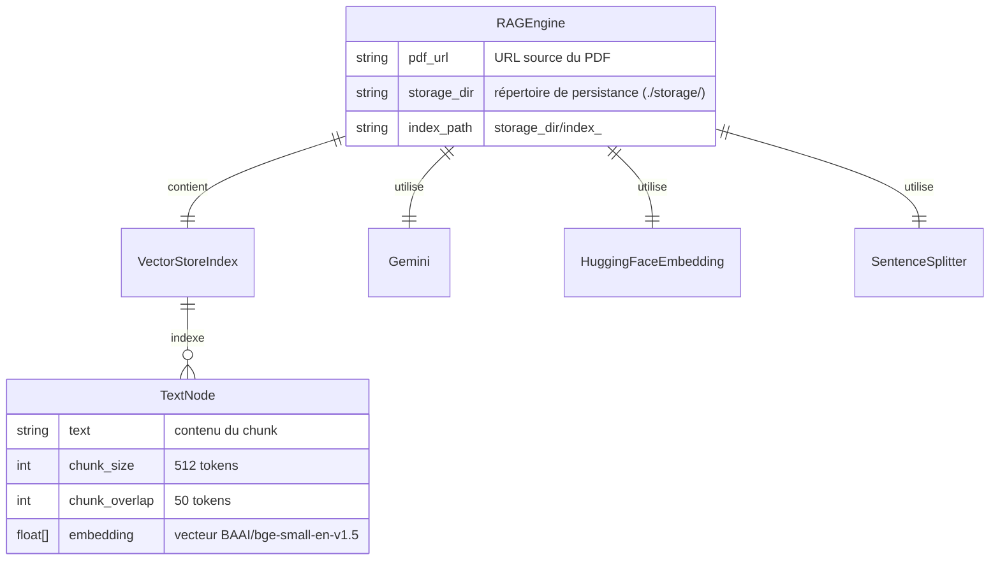

<!--
TEMPLATE — Modèle de données
============================
Public cible : (1) une IA qui écrit du code touchant à la persistance et doit raisonner
sur le schéma sans relire le SQL/ORM, (2) un humain qui prend le projet.

Doit permettre de RAISONNER sur les données sans ouvrir une seule migration. Catalogue
exhaustif, ordonné par importance fonctionnelle (pivot d'abord), pas par ordre alphabétique.

Garde-fous d'écriture :
- Tout type, contrainte, index = vérifiable depuis le DDL versionné OU le code (annotations
  ORM, schéma de validation). Si ni l'un ni l'autre, marquer "(à confirmer)".
- Les volumétries citées sont datées et tracent leur source (dashboard, requête, anonymisée
  depuis prod, etc.).
- Une cellule "non utilisé / aucun accès" est UNE INFORMATION — ne pas la supprimer.

Bloc « Mode d'emploi » en fin de fichier.
-->

# Modèle de données — RAG

| Champ | Valeur |
|---|---|
| **Dernière mise à jour** | 2026-05-10 |
| **Mise à jour par** | agent IA (doc-patcher) |
| **PR de référence** | (à confirmer) |
| **SGBD / Stockage** | Fichiers sur disque — index vectoriel LlamaIndex persisté dans `./storage/` |
| **État du DDL** | Pas de DDL SQL — schéma implicite géré par LlamaIndex (`VectorStoreIndex`) |
| **Source d'extraction** | `rag_engine.py`, `pdf_loader.py`, `text_processor.py`, `gemini_client.py`, `README.md` |

> **Résumé en 1 phrase** : Ce système ne dispose pas de base de données relationnelle ; il persiste un index vectoriel sur disque (un répertoire par document PDF, identifié par hash MD5 de l'URL) afin de mémoriser les embeddings de chunks de texte extraits de PDFs.

---

## 1. Vue d'ensemble

| Indicateur | Valeur | Source |
|---|---|---|
| **Nombre de tables / collections** | 0 table SQL — 1 collection de nœuds (chunks) par index vectoriel | `rag_engine.py` |
| **Nombre de domaines fonctionnels** | 1 (indexation et recherche de documents) | `README.md` |
| **Relations** | Aucune FK déclarée — relation implicite URL → répertoire d'index via hash MD5 | `rag_engine.py:_get_index_path` |
| **Objets non-table** | Fichiers JSON LlamaIndex dans `./storage/index_<md5>/` (docstore, vector store, graph) | `rag_engine.py:_save_index` |
| **Volume total approximatif** | Dépend du PDF indexé — (à confirmer) | (à confirmer) |
| **Croissance** | Un répertoire par URL de PDF distincte — croissance discrète | `rag_engine.py:_get_index_path` |

> _Résumé en 3 lignes : à quoi sert cette base ? Quels sont les concepts pivots ?_
>
> Le système ne dispose pas d'une base de données au sens traditionnel. Il stocke sur disque des index vectoriels LlamaIndex, un répertoire par PDF (nommé `index_<md5_url>`). Le concept pivot est le **nœud de texte** (chunk), découpé à 512 tokens avec 50 tokens de chevauchement, et encodé par le modèle HuggingFace `BAAI/bge-small-en-v1.5`. Le mode dominant est lecture (requête sémantique) après une phase d'écriture initiale (indexation).

---

## 2. Vue d'ensemble par domaine

> Le système ne possède pas de tables SQL. Les entités logiques sont des structures LlamaIndex persistées sur fichiers. Elles sont regroupées ci-dessous par rôle fonctionnel.

```
┌─── Ingestion PDF ───────────────────────────┐   ┌─── Index vectoriel (./storage/) ──────────────────────────────┐
│  PDFDocument                                │   │  VectorStoreIndex                                             │
│    url         (source URL)                 │──▶│    nodes[]  (TextNode — chunk_size=512, overlap=50)           │
│    local_path  (fichier temporaire)         │   │    embeddings  (BAAI/bge-small-en-v1.5, dim=384)              │
│                                             │   │  Persisté dans : ./storage/index_<md5_url>/                   │
└─────────────────────────────────────────────┘   └───────────────────────────────────────────────────────────────┘
                                                          │
                                                          ▼
                                              ┌─── Requête / Réponse ──────────────────────────────────────────┐
                                              │  QueryResult                                                    │
                                              │    top_k = 3  chunks récupérés par similarité cosinus          │
                                              │    response  (généré par Gemini models/gemini-2.5-flash)        │
                                              └────────────────────────────────────────────────────────────────┘
```

---

## 3. Diagramme entité-relation



> Cardinalités Mermaid : `||--o{` = 1:N · `||--||` = 1:1 · `}o--o{` = N:N · `||--o|` = 1:0..1.
> Les entités ci-dessus sont des classes Python / objets LlamaIndex, non des tables SQL. Aucune FK n'est déclarée en base.

---

## 4. Relations

> Une ligne par arête. Ordonner par centralité : pivot d'abord, feuilles après.

| Source | Cible | Cardinalité | Clé(s) | Déclarée ? | Sémantique |
|---|---|---|---|---|---|
| `RAGEngine` | `VectorStoreIndex` | 1:1 | `storage_dir / index_<md5_url>` | Implicite (code) | Un moteur gère exactement un index vectoriel pour un PDF donné |
| `RAGEngine` | `TextNode` | 1:N | via `VectorStoreIndex` | Implicite (code) | Le PDF est découpé en N nœuds de texte lors de l'indexation |
| `pdf_url` | `index_path` | 1:1 | `hashlib.md5(pdf_url)` | Implicite (code) | L'URL du PDF détermine le répertoire de stockage de l'index |

> ⚠️ Aucune FK SQL n'existe. L'intégrité référentielle URL ↔ répertoire d'index est tenue uniquement par `RAGEngine._get_index_path()`. Un changement de schéma de nommage invaliderait tous les caches existants.

---

## 5. Catalogue des entités

> Ce système n'utilise pas de base de données relationnelle. Les entités ci-dessous sont des classes Python et des objets LlamaIndex persistés sur fichiers. La terminologie « colonnes » désigne ici les attributs d'instance.

### 5.1 `RAGEngine` — orchestrateur principal du pipeline RAG

| Méta | Valeur |
|---|---|
| **Domaine** | Orchestration RAG |
| **Accédée par** | `main.py` |
| **Volumétrie** | 1 instance par session d'exécution |
| **Mode dominant** | Mixte — écriture lors de l'indexation, lecture lors des requêtes |
| **PK** | `pdf_url` (identifiant logique) |
| **FK sortantes** | `index_path` → répertoire `./storage/index_<md5_url>/` (implicite) |
| **Index** | Aucun index SQL — l'index vectoriel LlamaIndex joue ce rôle |
| **Pattern temporel** | Aucun — l'état est entièrement rechargé depuis le cache disque à chaque démarrage |

**Attributs**

| Attribut | Type | Null | Description | Flags |
|---|---|---|---|---|
| `pdf_url` | `str` | N | URL source du PDF à indexer | PK logique |
| `storage_dir` | `str` | N | Répertoire racine de persistance (défaut : `./storage`) | |
| `embed_model` | `HuggingFaceEmbedding` | N | Modèle d'embedding (`BAAI/bge-small-en-v1.5`) | |
| `llm` | `Gemini` | N | LLM de génération (`models/gemini-2.5-flash`, temperature=0.1) | |
| `parser` | `SentenceSplitter` | N | Parseur de nœuds (chunk_size=512, chunk_overlap=50) | |
| `index` | `VectorStoreIndex` | N | Index vectoriel LlamaIndex chargé ou construit | |
| `query_engine` | `RetrieverQueryEngine` | N | Moteur de requête (similarity_top_k=3, mode compact) | |

**Requêtes typiques**

```python
# Indexation (première exécution)
rag = RAGEngine("https://arxiv.org/pdf/2005.11401.pdf")

# Requête
answer = rag.query("What is the main contribution of this paper?")
```

**Pièges connus**

- ⚠️ Le cache est identifié par MD5 de l'URL (`hashlib.md5`, `usedforsecurity=False`). Deux URLs différentes pointant vers le même PDF produisent deux index distincts.
- ⚠️ Si `./storage/` est supprimé, tout le cache est perdu et le PDF est re-téléchargé et re-indexé.
- ⚠️ `config.py` doit exister à la racine du projet et exposer `GOOGLE_API_KEY` — aucune gestion d'erreur explicite si absent.

**Évolutions notables**

| Date | PR | Changement |
|---|---|---|
| (à confirmer) | (à confirmer) | Création initiale du moteur RAG |

---

### 5.2 `TextNode` (LlamaIndex) — unité atomique d'information indexée

| Méta | Valeur |
|---|---|
| **Domaine** | Index vectoriel |
| **Accédée par** | `RAGEngine` (via `VectorStoreIndex`) |
| **Volumétrie** | Dépend du PDF — (à confirmer) |
| **Mode dominant** | Écriture unique (indexation), lecture (requêtes) |
| **PK** | `node_id` (UUID généré par LlamaIndex) |
| **FK sortantes** | Aucune |
| **Pattern** | Append-only lors de l'indexation ; immuable ensuite |

**Attributs**

| Attribut | Type | Null | Description | Flags |
|---|---|---|---|---|
| `node_id` | `str` (UUID) | N | Identifiant unique du nœud | PK |
| `text` | `str` | N | Contenu textuel du chunk (≤ 512 tokens) | |
| `embedding` | `list[float]` | N | Vecteur d'embedding (dim 384, BAAI/bge-small-en-v1.5) | IDX vectoriel |
| `metadata` | `dict` | Y | Métadonnées issues du PDF (numéro de page, etc.) | |

**Pièges connus**

- ⚠️ Les nœuds sont persistés dans le format binaire de LlamaIndex — non lisibles directement sans la bibliothèque.

---

### 5.3 `./storage/index_<md5_url>/` — répertoire de cache disque _(forme abrégée)_

- **Domaine :** Cache / persistance · **Accédée par :** `RAGEngine._save_index`, `RAGEngine._load_index` · **PK :** nom du répertoire (`index_<md5_url>`)
- **Fichiers :** `docstore.json`, `vector_store.json`, `graph_store.json`, `index_store.json` (générés par LlamaIndex `StorageContext.persist`)
- **Pattern :** Écriture unique à l'indexation, lecture à chaque démarrage si le répertoire existe

---

## 6. Synthèse catalogue

| Domaine | Entité / Fichier | Volume | PK | Évolutivité |
|---|---|---|---|---|
| Orchestration | `RAGEngine` (classe Python) | 1 instance/session | `pdf_url` | Stable — modifiée lors de refactors du pipeline |
| Index vectoriel | `TextNode` (LlamaIndex) | N chunks par PDF (à confirmer) | `node_id` (UUID) | Append-only à l'indexation, immuable ensuite |
| Cache disque | `./storage/index_<md5_url>/` | 1 répertoire par PDF distinct | Nom du répertoire | Écriture unique, lecture à chaque démarrage |

---

## 7. Matrice d'accès composant × entité

> Lignes = composants/modules. Colonnes = entités de données. Cellule vide = aucun accès = information utile.
> Légende : 👁 lecture · ✍ création/écriture · 🔀 lecture + écriture conditionnelle.

| Composant | `VectorStoreIndex` / `TextNode` | Cache disque `./storage/` | `Gemini` (LLM) |
|---|---|---|---|
| `rag_engine.py` (RAGEngine) | 🔀 (construit ou charge) | 🔀 (persist ou load) | 👁 (requête) |
| `pdf_loader.py` | — | — | — |
| `text_processor.py` | ✍ (configure parseur et embed) | — | — |
| `gemini_client.py` | — | — | ✍ (initialise) |
| `main.py` | — | — | — |

---

## 8. Objets non-table

> Ce système ne possède pas de base de données relationnelle. Il n'existe donc aucune vue SQL, séquence, trigger ou procédure stockée.

| Type | Nom | Rôle | Localisation source |
|---|---|---|---|
| Index vectoriel (LlamaIndex) | `VectorStoreIndex` | Recherche sémantique par similarité cosinus sur les chunks de texte | `rag_engine.py` |
| Répertoire de cache | `./storage/index_<md5_url>/` | Persistance des nœuds, embeddings et graphe de documents entre les sessions | `rag_engine.py:_save_index` / `_load_index` |
| Fichier temporaire PDF | `<tempdir>/temp_rag_document.pdf` | Stockage intermédiaire du PDF téléchargé avant extraction | `pdf_loader.py:load_pdf_from_url` |

---

## 9. Conventions transverses

### 9.1 Nommage

> Pas de convention SQL dans ce projet. Les conventions de nommage Python s'appliquent (snake_case, Google docstring style — voir `pyproject.toml`).

| Convention | Sémantique | Exemple | Type |
|---|---|---|---|
| `<nom>_url` | URL source d'un document | `pdf_url` | `str` |
| `<nom>_dir` | Répertoire de stockage | `storage_dir` | `str` |
| `index_<md5>` | Répertoire de cache d'un index vectoriel | `index_a3f9...` | répertoire |

### 9.2 Types et conversions critiques

> Documenter ICI tout type qui pose problème aux frontières (sérialisation, comparaison, hashing).

- **MD5 URL hash** : calculé avec `hashlib.md5(pdf_url.encode(), usedforsecurity=False).hexdigest()` — sensible à la casse et à la normalisation de l'URL. Deux URLs fonctionnellement identiques mais lexicalement différentes produisent des hash distincts et donc des caches dupliqués.
- **Embeddings** (`list[float]`, dimension 384) : produits par `BAAI/bge-small-en-v1.5`. Incompatibles avec des embeddings d'un autre modèle — un changement de modèle nécessite la suppression et reconstruction complète du cache.
- **Chunks de texte** : encodés en UTF-8, limités à 512 tokens (tokenisation interne HuggingFace). Les PDFs avec caractères non-ASCII peuvent produire des tokens plus courts que prévu.

### 9.3 Dates et périodes de validité

- **Format applicatif** : non applicable — aucune date n'est stockée explicitement dans le système.
- **Fuseau** : non applicable.
- **Convention de validité** : la fraîcheur du cache est déterminée par l'existence du répertoire `./storage/index_<md5_url>/` — il n'y a pas d'expiration temporelle automatique.
- **Filtre temporel canonique** : aucun — `os.path.exists(index_path)` est le seul test de validité du cache.

### 9.4 NULL sémantique

| Attribut | None/absent signifie | Impact |
|---|---|---|
| `TextNode.metadata` | Aucune métadonnée extraite du PDF | Les métadonnées de page ne sont pas disponibles pour filtrage |
| `config.GOOGLE_API_KEY` | Clé API non configurée | Erreur à l'initialisation de `Gemini` — non interceptée explicitement |

### 9.5 Capture d'erreur stockage / IO

- **Mécanisme** : Aucune gestion d'erreur explicite dans le code actuel — les exceptions Python natives (`OSError`, `requests.exceptions.RequestException`, etc.) se propagent.
- **Logs** : `print()` uniquement — pas de logging structuré.
- **Localisation** : Aucune couche DAO dédiée — la logique de persistance est directement dans `RAGEngine._save_index` et `RAGEngine._load_index`.

---

## 10. Contraintes implicites

> Règles d'intégrité **non déclarées en base** mais **tenues par le code**. Toute évolution doit les préserver — voir [contracts.md](contracts.md) pour les composants qui les portent.

| # | Règle | Tenue par | Sanction si violée |
|---|---|---|---|
| IMP-01 | Le répertoire `./storage/index_<md5_url>/` ne doit contenir que des fichiers LlamaIndex produits par le même modèle d'embedding (`BAAI/bge-small-en-v1.5`) | Convention de déploiement — non vérifiée par le code | Erreur de dimension lors du chargement de l'index / réponses incorrectes silencieuses |
| IMP-02 | `config.GOOGLE_API_KEY` doit être une clé Google valide avant toute instanciation de `RAGEngine` | `gemini_client.initialize_gemini_llm` (non validé explicitement) | Erreur d'authentification API à l'exécution |
| IMP-03 | L'URL passée à `RAGEngine` doit pointer vers un PDF accessible publiquement au moment de l'indexation | `pdf_loader.load_pdf_from_url` (timeout=30s, pas de retry) | `requests.exceptions.Timeout` ou `ConnectionError` non interceptés |

---

## 11. Politique de rétention et purge

| Entité / Fichier | Rétention | Mécanisme | RGPD / sensible |
|---|---|---|---|
| `./storage/index_<md5_url>/` | Indéfinie — aucune expiration automatique | Suppression manuelle du répertoire | Non sensible — contient uniquement des chunks de texte et vecteurs issus de PDFs publics (à confirmer) |
| `<tempdir>/temp_rag_document.pdf` | Durée de la session OS | Fichier temporaire système (non supprimé explicitement par le code) | Dépend du contenu du PDF indexé (à confirmer) |

---

## 12. Migrations / évolutions

> Il n'existe pas d'outil de migration SQL dans ce projet. La gestion des évolutions de schéma de l'index vectoriel est manuelle.

- **Outil** : Aucun — le schéma est implicitement défini par LlamaIndex et le modèle d'embedding.
- **Convention de nommage** : Le répertoire `./storage/index_<md5_url>/` constitue l'unique unité de stockage versionnée de facto par l'URL du PDF.
- **Réversibilité** : Totale — supprimer le répertoire force une ré-indexation complète.
- **Stratégie pour les changements bloquants** : En cas de changement de modèle d'embedding ou de paramètres de chunking, vider `./storage/` en intégralité pour éviter des index corrompus.

---

## 13. Recommandations actives

> Recommandations **non encore appliquées** — actions concrètes, pas des vœux pieux. Une fois traitées, les retirer (les conserver dans la PR qui les implémente).

1. **Ajouter un fichier de métadonnées dans `./storage/index_<md5_url>/`** — stocker le nom du modèle d'embedding et les paramètres de chunking utilisés à la création, pour détecter les incohérences au chargement (IMP-01).
2. **Remplacer les `print()` par un logging structuré** — faciliter le débogage en production et permettre le filtrage par niveau (INFO/WARNING/ERROR).
3. **Nettoyer le fichier temporaire PDF après indexation** — `pdf_loader.load_pdf_from_url` ne supprime pas `temp_rag_document.pdf` après usage (voir §11).
4. **Valider `GOOGLE_API_KEY` à l'initialisation** — lever une exception explicite si la clé est absente ou vide, avant tout appel réseau (IMP-02).

---

## Références

- Architecture : [architecture.md](architecture.md)
- Contrats des composants accédant aux données : [contracts.md](contracts.md)
- Glossaire : [glossaire.md](glossaire.md)
- Code source du moteur RAG : [`rag_engine.py`](../rag_engine.py)
- Code source du chargeur PDF : [`pdf_loader.py`](../pdf_loader.py)
- Code source du traitement texte : [`text_processor.py`](../text_processor.py)
- Code source du client Gemini : [`gemini_client.py`](../gemini_client.py)

---

<!--
MODE D'EMPLOI DU TEMPLATE
=========================

POUR L'IA QUI MET À JOUR CE FICHIER

Déclencheurs (mettre à jour les sections concernées si la PR touche…) :

| Modification dans la PR | Sections à relire |
|---|---|
| Nouvelle migration / DDL change | §1, §3, §4, §5 (table concernée), §6 |
| Ajout / suppression de table | §1, §2, §3, §4, §5, §6, §7 |
| Nouvelle FK ou index | §4, §5 (table concernée), §10 si elle remplace une contrainte implicite |
| Nouveau composant accédant à la base | §7 (matrice) |
| Nouveau trigger / procédure / vue | §8 |
| Changement de convention de nommage | §9.1 |
| Changement de mécanisme de date / fuseau | §9.3 |
| Politique de rétention modifiée | §11 |
| Outil de migration changé | §12 |

Pour chaque table modifiée, MAJ obligatoire :
- Le bloc colonnes (§5.x).
- La ligne dans §6 si la volumétrie change d'ordre de grandeur.
- La ligne dans la matrice §7 si l'accès change.
- Ajouter une ligne « Évolutions notables » dans le bloc table avec date + PR.

Auto-checks :
- [ ] Toutes les tables citées en §5 existent dans le DDL / l'ORM.
- [ ] Toutes les FK §4 marquées « déclarée » correspondent à une vraie FK SQL.
- [ ] Le diagramme §3 reflète les relations §4.
- [ ] La matrice §7 ne mentionne pas de composant supprimé.
- [ ] Aucune `(à confirmer)` ancienne de plus de 60 jours sans ticket associé.

POUR LE RELECTEUR HUMAIN

- Vérifier que les volumétries ont une source datée (sinon : « ordre approximatif »).
- Les pièges §5.x doivent être réalistes — pas de sur-anticipation.
- Si l'IA invente un IMP-XX, vérifier que c'est bien tenu par le code et pas une
  hypothèse de relecture.

POUR ADAPTER À UN AUTRE PROJET

1. Remplacer placeholders.
2. Si stockage non relationnel (DynamoDB, MongoDB, Cassandra) :
   - §3 (ER) → schéma de documents / partitions clés.
   - §4 (relations) → références dénormalisées + GSI / SI.
   - §5 → catalogue de collections / item types ; les « colonnes » deviennent attributs.
3. Si plusieurs bases : dupliquer §5 par base, garder une vue d'ensemble §1 unique.
4. Garder les sections vides plutôt que les supprimer — l'absence est une information
   (« pas de trigger », « pas de pattern temporel »).
-->
