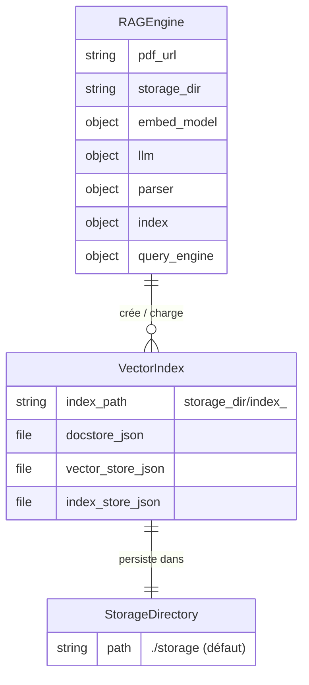

<!--
TEMPLATE — Modèle de données
============================
Public cible : (1) une IA qui écrit du code touchant à la persistance et doit raisonner
sur le schéma sans relire le SQL/ORM, (2) un humain qui prend le projet.

Doit permettre de RAISONNER sur les données sans ouvrir une seule migration. Catalogue
exhaustif, ordonné par importance fonctionnelle (pivot d'abord), pas par ordre alphabétique.

Garde-fous d'écriture :
- Tout type, contrainte, index = vérifiable depuis le DDL versionné OU le code (annotations
  ORM, schéma de validation). Si ni l'un ni l'autre, marquer "(à confirmer)".
- Les volumétries citées sont datées et tracent leur source (dashboard, requête, anonymisée
  depuis prod, etc.).
- Une cellule "non utilisé / aucun accès" est UNE INFORMATION — ne pas la supprimer.

Bloc « Mode d'emploi » en fin de fichier.
-->

# Modèle de données — RAG

| Champ | Valeur |
|---|---|
| **Dernière mise à jour** | 2026-05-11 |
| **Mise à jour par** | agent IA (doc-patcher) |
| **PR de référence** | fcd7a06 |
| **SGBD / Stockage** | Système de fichiers local — index vectoriel LlamaIndex persisté dans `./storage/` |
| **État du DDL** | Géré par le code (`rag_engine.py` — `VectorStoreIndex` + `StorageContext`) |
| **Source d'extraction** | `rag_engine.py`, `text_processor.py`, `gemini_client.py` |

> **Résumé en 1 phrase** : Le système persiste des index vectoriels de chunks de texte issus de PDFs, identifiés par un hash MD5 de leur URL, afin de permettre la recherche sémantique et la génération de réponses via Gemini.

---

## 1. Vue d'ensemble

| Indicateur | Valeur | Source |
|---|---|---|
| **Nombre de collections** | 1 collection logique (répertoires d'index par URL) | `rag_engine.py` |
| **Nombre de domaines fonctionnels** | 1 (indexation vectorielle de PDFs) | `rag_engine.py` |
| **Relations** | Aucune relation déclarée — index autonomes par hash d'URL | `rag_engine.py::_get_index_path` |
| **Objets non-collection** | Aucun trigger, vue ou procédure — gestion entièrement par code | `rag_engine.py` |
| **Volume total approximatif** | Dépend des PDFs indexés — un index par URL hachée | (à confirmer) |
| **Croissance** | Append-only par URL nouvelle ; index immuables une fois créés | `rag_engine.py::_save_index` |

> _Résumé en 3 lignes : à quoi sert cette base ? Quels sont les concepts pivots ?_
>
> Le système ne dispose pas de base de données relationnelle. Il persiste sur le système de fichiers des **index vectoriels LlamaIndex**, un par PDF (identifié par son URL). Chaque index contient les embeddings de chunks de texte (512 tokens, overlap 50) générés par `BAAI/bge-small-en-v1.5`. Le mode dominant est écriture unique à la première indexation, puis lecture seule pour le requêtage sémantique.

---

## 2. Vue d'ensemble par domaine

> Les collections sont regroupées par **rôle fonctionnel**. Ce projet n'utilise pas de base de données relationnelle — le stockage est un système de fichiers structuré par LlamaIndex.

```
┌─── Indexation vectorielle ──────────────────────────────────────────────────────┐
│   ./storage/                                                                    │
│   └─ index_<md5(pdf_url)>/        (PK logique : hash MD5 de l'URL du PDF)      │
│       ├─ docstore.json            (chunks de texte extraits du PDF)             │
│       ├─ vector_store.json        (vecteurs d'embedding — BAAI/bge-small-en)    │
│       ├─ index_store.json         (métadonnées de l'index LlamaIndex)           │
│       └─ graph_store.json         (réservé LlamaIndex, non utilisé ici)        │
└────────────────────────────────────────────────────────────────────────────────┘
```

---

## 3. Diagramme entité-relation

> Ce projet n'utilise pas de base de données relationnelle. Le diagramme représente les structures logiques persistées sur le système de fichiers par LlamaIndex.



> Cardinalités Mermaid : `||--o{` = 1:N · `||--||` = 1:1.
> Les relations sont gérées par code (`rag_engine.py`) — aucune FK déclarée en base.

---

## 4. Relations

> Une ligne par arête. Ordonner par centralité : pivot d'abord, feuilles après.

| Source | Cible | Cardinalité | Clé(s) | Déclarée ? | Sémantique |
|---|---|---|---|---|---|
| `RAGEngine` | `VectorIndex` (répertoire) | 1:1 par URL | `index_<md5(pdf_url)>` | Implicite (code) | Un moteur gère exactement un index par URL de PDF |
| `RAGEngine` | `StorageContext` (LlamaIndex) | 1:1 | `persist_dir` | Implicite (code) | Le contexte de stockage lie l'index à son répertoire sur disque |

> ⚠️ Il n'existe aucune FK déclarée — toute l'intégrité est tenue par `rag_engine.py`. Si `storage_dir` est modifié manuellement, les index existants ne seront plus trouvés.

---

## 5. Catalogue des structures de données

> Ce projet n'utilise pas de tables SQL. Les structures sont des **répertoires de fichiers JSON** persistés par LlamaIndex sur le système de fichiers local. Un bloc complet pour la structure pivot, des blocs abrégés pour les fichiers internes.

### 5.1 `index_<md5(pdf_url)>/` — Répertoire d'index vectoriel (structure pivot)

| Méta | Valeur |
|---|---|
| **Domaine** | Indexation vectorielle |
| **Accédée par** | `RAGEngine` (`rag_engine.py`) |
| **Volumétrie** | Un répertoire par URL de PDF indexée — taille dépend du PDF (à confirmer) |
| **Mode dominant** | Écriture unique à la première indexation, lecture seule ensuite |
| **PK logique** | `md5(pdf_url)` — calculé via `hashlib.md5(pdf_url.encode(), usedforsecurity=False)` |
| **FK sortantes** | Aucune |
| **Pattern temporel** | Append-only (new URL = new directory) ; aucune suppression automatique |

**Attributs du répertoire**

| Fichier | Format | Description | Flags |
|---|---|---|---|
| `docstore.json` | JSON (LlamaIndex) | Chunks de texte extraits du PDF, avec métadonnées | Pivot |
| `vector_store.json` | JSON (LlamaIndex) | Vecteurs d'embedding `BAAI/bge-small-en-v1.5` (dim 384) | Pivot |
| `index_store.json` | JSON (LlamaIndex) | Métadonnées de l'index (`VectorStoreIndex`) | Pivot |
| `graph_store.json` | JSON (LlamaIndex) | Réservé par LlamaIndex — non utilisé activement | (à confirmer) |

**Opérations typiques**

```python
# Vérification de l'existence du cache
index_path = os.path.join(storage_dir, f"index_{hashlib.md5(pdf_url.encode(), usedforsecurity=False).hexdigest()}")
os.path.exists(index_path)  # → True si déjà indexé

# Chargement depuis le cache
storage_context = StorageContext.from_defaults(persist_dir=index_path)
index = load_index_from_storage(storage_context)

# Persistance après indexation
index.storage_context.persist(persist_dir=index_path)
```

**Pièges connus**

- ⚠️ Le hash MD5 est calculé sur l'URL brute (bytes encodés UTF-8) — une même URL avec ou sans trailing slash génère deux index distincts.
- ⚠️ Aucune purge automatique — les anciens index s'accumulent dans `./storage/` sans limite.
- ⚠️ `usedforsecurity=False` est requis sur certaines plateformes Python (FIPS) — ne pas retirer.

**Évolutions notables**

| Date | PR | Changement |
|---|---|---|
| 2026-05-11 | fcd7a06 | Création de la classe `RAGEngine` avec gestion du cache sur disque |

---

### 5.2 Paramètres de chunking — _(forme abrégée)_

- **Domaine :** traitement du texte · **Configuré dans :** `text_processor.py` · **Appliqué par :** `RAGEngine.__init__`
- **Attributs :** `chunk_size` = 512 tokens, `chunk_overlap` = 50 tokens, parser = `SentenceSplitter`
- **Pattern :** configuré au démarrage via `Settings` global LlamaIndex — partagé pour toute la durée de vie du processus.

---

### 5.3 Configuration du moteur de requêtage — _(forme abrégée)_

- **Domaine :** requêtage · **Configuré dans :** `rag_engine.py` · **LLM :** Gemini (`models/gemini-2.5-flash`, temperature 0.1)
- **Attributs :** `similarity_top_k` = 3, `response_mode` = `"compact"`
- **Pattern :** instance unique par `RAGEngine` — lecture seule après initialisation.

---

## 6. Synthèse catalogue

| Domaine | Structure | Volume | PK logique | Évolutivité |
|---|---|---|---|---|
| Indexation vectorielle | `index_<md5>/` (répertoire) | 1 par URL de PDF indexée | `md5(pdf_url)` hex | Append-only par nouvelle URL |
| Traitement du texte | `Settings` LlamaIndex (mémoire) | — | — | Fixe à l'initialisation |
| Requêtage | `query_engine` (mémoire) | — | — | Fixe à l'initialisation |

---

## 7. Matrice d'accès composant × structure

> Lignes = composants/modules. Colonnes = structures de stockage. Cellule vide = aucun accès.
> Légende : 👁 Lecture · ✍ Écriture · 🔀 Lecture + Écriture.

| Composant | `index_<md5>/` (disque) | `Settings` LlamaIndex | `query_engine` |
|---|---|---|---|
| `RAGEngine` (`rag_engine.py`) | 🔀 | ✍ | ✍ |
| `text_processor.py` | — | ✍ | — |
| `gemini_client.py` | — | ✍ | — |
| `main.py` | — | — | 👁 |

---

## 8. Objets non-table

> Ce projet ne dispose d'aucun objet de base de données (pas de vue, séquence, trigger, ni procédure stockée). La logique métier est entièrement dans le code Python.

| Type | Nom | Rôle | Localisation source |
|---|---|---|---|
| Aucun | — | — | — |

---

## 9. Conventions transverses

### 9.1 Nommage

| Convention | Sémantique | Exemple |
|---|---|---|
| `index_<hex>` | Répertoire d'index vectoriel, hex = MD5 de l'URL du PDF | `index_a3f2c1d4…` |
| `storage_dir` | Paramètre de `RAGEngine` — répertoire racine de persistance | `./storage` (défaut) |
| `pdf_url` | URL complète du PDF source — sert de clé de déduplication | `https://…/doc.pdf` |

### 9.2 Types et conversions critiques

> Documenter ICI tout type qui pose problème aux frontières (sérialisation, comparaison, hashing).

- **`pdf_url` (str → MD5 hex)** : le hachage est calculé sur `pdf_url.encode()` (UTF-8 par défaut). Une même URL avec casse différente ou query string différente produit un hash distinct et un index séparé.
- **Fichiers JSON LlamaIndex** : les embeddings sont sérialisés en JSON — les vecteurs float32 peuvent subir une légère perte de précision selon la sérialisation. (à confirmer)

### 9.3 Dates et périodes de validité

- **Format applicatif** : aucune date stockée dans les index — pas de gestion temporelle au niveau du stockage.
- **Convention de validité** : un index est considéré valide tant que son répertoire existe sur disque (`os.path.exists(index_path)`).

### 9.4 NULL sémantique

> Pas de valeurs NULL dans ce système de stockage. L'absence d'un répertoire d'index est l'équivalent fonctionnel d'un NULL — elle déclenche une nouvelle indexation.

### 9.5 Capture d'erreur / stockage

- **Mécanisme** : aucun try-catch explicite autour des opérations de stockage dans `rag_engine.py` — les exceptions LlamaIndex / OS se propagent à l'appelant. (à confirmer)
- **Logs** : `print()` statements inline dans `RAGEngine.__init__` — pas de logging structuré.
- **Localisation** : `rag_engine.py` — méthodes `_load_index`, `_save_index`.

---

## 10. Contraintes implicites

> Règles d'intégrité **non déclarées en base** mais **tenues par le code**. Toute évolution doit les préserver — voir [contracts.md](contracts.md) pour les composants qui les portent.

| # | Règle | Tenue par | Sanction si violée |
|---|---|---|---|
| IMP-01 | Un seul index par `pdf_url` — le hash MD5 doit être unique par URL | `RAGEngine._get_index_path` (hashlib.md5) | Collision de répertoire — index mélangés (quasi-impossible avec MD5 sur des URL) |
| IMP-02 | Le répertoire `storage_dir` doit exister ou être créable avant la persistance | `RAGEngine._save_index` (`os.makedirs(index_path, exist_ok=True)`) | `OSError` — persistance échoue, embeddings perdus |
| IMP-03 | Les `Settings` LlamaIndex (`embed_model`, `node_parser`, `llm`) doivent être configurés avant toute création ou chargement d'index | `RAGEngine.__init__` (ordre d'initialisation) | Index chargé avec un modèle d'embedding différent → résultats de recherche incohérents |

---

## 11. Politique de rétention et purge

| Structure | Rétention | Mécanisme | RGPD / sensible |
|---|---|---|---|
| `index_<md5>/` | Indéfinie — aucune purge automatique | Manuel (suppression du répertoire) | Non — index de contenu public de PDFs (à confirmer selon les PDFs indexés) |

---

## 12. Migrations / évolutions

> Ce projet ne dispose pas d'outil de migration au sens classique — il n'y a pas de schéma SQL à versionner. Les « migrations » correspondent à des changements de structure des fichiers JSON LlamaIndex, gérés par la bibliothèque elle-même.

- **Outil** : aucun — gestion native LlamaIndex (`VectorStoreIndex`, `StorageContext`)
- **Convention** : si le format LlamaIndex change entre versions, les anciens index doivent être supprimés et reconstruits manuellement.
- **Réversibilité** : oui — supprimer le répertoire `index_<md5>/` et relancer `RAGEngine` pour reconstruire l'index depuis l'URL.
- **Stratégie pour les changements bloquants** : purge manuelle du `storage_dir` en cas de changement de modèle d'embedding ou de version majeure de LlamaIndex.

---

## 13. Recommandations actives

> Recommandations **non encore appliquées** — actions concrètes, pas des vœux pieux. Une fois traitées, les retirer (les conserver dans la PR qui les implémente).

1. **Ajouter un mécanisme de purge automatique des anciens index** — les répertoires `index_<md5>/` s'accumulent sans limite dans `./storage/` ; prévoir une stratégie de nettoyage (TTL, taille max).
2. **Remplacer les `print()` par un logger structuré** — la lisibilité des logs en production s'en trouverait améliorée, et les erreurs de stockage seraient plus faciles à tracer.
3. **Valider la compatibilité des index lors du rechargement** — si le modèle d'embedding change, les index existants sont silencieusement chargés et produisent des résultats incohérents ; ajouter un contrôle de version de l'index.

---

## Références

- Architecture : [architecture.md](architecture.md)
- Contrats des composants accédant aux données : [contracts.md](contracts.md)
- Glossaire : [glossaire.md](glossaire.md)
- Code source principal : [`rag_engine.py`](../rag_engine.py)

---

<!--
MODE D'EMPLOI DU TEMPLATE
=========================

POUR L'IA QUI MET À JOUR CE FICHIER

Déclencheurs (mettre à jour les sections concernées si la PR touche…) :

| Modification dans la PR | Sections à relire |
|---|---|
| Nouvelle migration / DDL change | §1, §3, §4, §5 (table concernée), §6 |
| Ajout / suppression de table | §1, §2, §3, §4, §5, §6, §7 |
| Nouvelle FK ou index | §4, §5 (table concernée), §10 si elle remplace une contrainte implicite |
| Nouveau composant accédant à la base | §7 (matrice) |
| Nouveau trigger / procédure / vue | §8 |
| Changement de convention de nommage | §9.1 |
| Changement de mécanisme de date / fuseau | §9.3 |
| Politique de rétention modifiée | §11 |
| Outil de migration changé | §12 |

Pour chaque table modifiée, MAJ obligatoire :
- Le bloc colonnes (§5.x).
- La ligne dans §6 si la volumétrie change d'ordre de grandeur.
- La ligne dans la matrice §7 si l'accès change.
- Ajouter une ligne « Évolutions notables » dans le bloc table avec date + PR.

Auto-checks :
- [ ] Toutes les tables citées en §5 existent dans le DDL / l'ORM.
- [ ] Toutes les FK §4 marquées « déclarée » correspondent à une vraie FK SQL.
- [ ] Le diagramme §3 reflète les relations §4.
- [ ] La matrice §7 ne mentionne pas de composant supprimé.
- [ ] Aucune `(à confirmer)` ancienne de plus de 60 jours sans ticket associé.

POUR LE RELECTEUR HUMAIN

- Vérifier que les volumétries ont une source datée (sinon : « ordre approximatif »).
- Les pièges §5.x doivent être réalistes — pas de sur-anticipation.
- Si l'IA invente un IMP-XX, vérifier que c'est bien tenu par le code et pas une
  hypothèse de relecture.

POUR ADAPTER À UN AUTRE PROJET

1. Remplacer placeholders.
2. Si stockage non relationnel (DynamoDB, MongoDB, Cassandra) :
   - §3 (ER) → schéma de documents / partitions clés.
   - §4 (relations) → références dénormalisées + GSI / SI.
   - §5 → catalogue de collections / item types ; les « colonnes » deviennent attributs.
3. Si plusieurs bases : dupliquer §5 par base, garder une vue d'ensemble §1 unique.
4. Garder les sections vides plutôt que les supprimer — l'absence est une information
   (« pas de trigger », « pas de pattern temporel »).
-->
