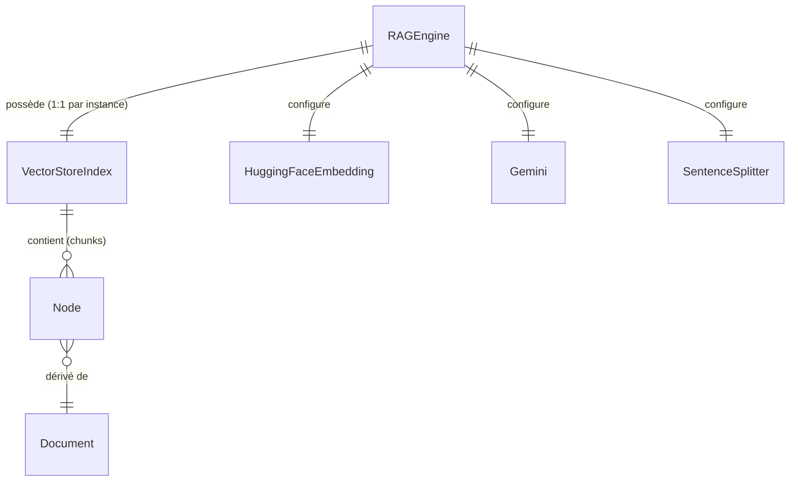

<!--
TEMPLATE — Modèle de données
============================
Public cible : (1) une IA qui écrit du code touchant à la persistance et doit raisonner
sur le schéma sans relire le SQL/ORM, (2) un humain qui prend le projet.

Doit permettre de RAISONNER sur les données sans ouvrir une seule migration. Catalogue
exhaustif, ordonné par importance fonctionnelle (pivot d'abord), pas par ordre alphabétique.

Garde-fous d'écriture :
- Tout type, contrainte, index = vérifiable depuis le DDL versionné OU le code (annotations
  ORM, schéma de validation). Si ni l'un ni l'autre, marquer "(à confirmer)".
- Les volumétries citées sont datées et tracent leur source (dashboard, requête, anonymisée
  depuis prod, etc.).
- Une cellule "non utilisé / aucun accès" est UNE INFORMATION — ne pas la supprimer.

Bloc « Mode d'emploi » en fin de fichier.
-->

# Modèle de données — RAG

| Champ | Valeur |
|---|---|
| **Dernière mise à jour** | 2026-05-24 |
| **Mise à jour par** | agent IA (doc-patcher) |
| **PR de référence** | (à confirmer) |
| **SGBD / Stockage** | Index vectoriel sur disque — LlamaIndex `VectorStoreIndex`, persistance via `StorageContext` |
| **État du DDL** | Sans objet — schéma défini par les classes Python (`rag_engine.py`, `text_processor.py`, `gemini_client.py`, `pdf_loader.py`) |
| **Source d'extraction** | `rag_engine.py`, `text_processor.py`, `gemini_client.py`, `pdf_loader.py`, `README.md` |

> **Résumé en 1 phrase** : Le système persiste des index vectoriels de chunks de documents PDF sur disque, chacun identifié par le hash MD5 de l'URL source, afin de permettre la recherche sémantique et la génération de réponses via Gemini.

---

## 1. Vue d'ensemble

| Indicateur | Valeur | Source |
|---|---|---|
| **Nombre de types d'entités / collections** | 3 (`RAGEngine`, `Document`, `Node`/chunk) | `rag_engine.py`, `pdf_loader.py`, `text_processor.py` |
| **Nombre de domaines fonctionnels** | 2 (indexation vectorielle, requêtage) | `README.md` |
| **Relations** | 1 composition (`RAGEngine` → `VectorStoreIndex`) ; aucune FK SQL | `rag_engine.py` |
| **Objets non-table** | Aucun (pas de vues, triggers ni procédures stockées) | — |
| **Volume total approximatif** | Dépend du PDF source ; index sérialisé dans `./storage/index_<md5>/` | `rag_engine.py:59-60` |
| **Croissance** | Append-only par URL de PDF (un répertoire par URL distincte) | `rag_engine.py:_get_index_path` |

> _Résumé en 3 lignes :_
>
> Ce système indexe des documents PDF sous forme de chunks sémantiques (taille 512, chevauchement 50 tokens) vectorisés par `BAAI/bge-small-en-v1.5`. L'index est persisté sur disque sous `./storage/index_<md5(pdf_url)>/` et rechargé à chaud lors des exécutions suivantes. Le mode dominant est lecture (requêtage sémantique via `similarity_top_k=3`) après une phase d'écriture unique par PDF.

---

## 2. Vue d'ensemble par domaine

> Pas de base relationnelle. Les entités sont les classes Python et les artefacts disque qu'elles produisent.

```
┌─── Indexation ─────────────────────────────────────────┐
│  RAGEngine                                             │
│    ├─ pdf_url (clé fonctionnelle → hash MD5)          │
│    ├─ storage_dir (racine disque, défaut ./storage)   │
│    ├─ embed_model  ──▶ HuggingFaceEmbedding           │
│    ├─ llm          ──▶ Gemini (gemini-2.5-flash)      │
│    ├─ parser       ──▶ SentenceSplitter               │
│    └─ index        ──▶ VectorStoreIndex               │
│         └─ (persisté dans storage_dir/index_<md5>/)   │
└────────────────────────────────────────────────────────┘
         │
         ▼
┌─── Requêtage ──────────────────────────────────────────┐
│  query_engine (VectorIndexRetriever + response_mode)  │
│    ├─ similarity_top_k = 3                             │
│    └─ response_mode = "compact"                        │
└────────────────────────────────────────────────────────┘
```

---

## 3. Diagramme entité-relation



> Toutes les relations sont de composition en mémoire — aucune FK SQL déclarée.
> `Node` = chunk de 512 tokens (chevauchement 50) produit par `SentenceSplitter` à partir d'un `Document` PDF.

---

## 4. Relations

> Une ligne par arête. Ordonner par centralité : pivot d'abord, feuilles après.

| Source | Cible | Cardinalité | Clé(s) | Déclarée ? | Sémantique |
|---|---|---|---|---|---|
| `RAGEngine` | `VectorStoreIndex` | 1:1 | `self.index` | Implicite (code) | L'engine orchestre un unique index vectoriel par instance |
| `RAGEngine` | `StorageContext` | 1:1 | `index_path` (dérivé de `md5(pdf_url)`) | Implicite (code) | Persistance/chargement de l'index sur disque |
| `VectorStoreIndex` | `Node` | 1:N | vecteur d'embedding | Implicite (LlamaIndex) | Chaque index contient N chunks vectorisés |
| `Node` | `Document` | N:1 | (interne LlamaIndex) | Implicite (LlamaIndex) | Chaque chunk est extrait d'un document PDF source |

> ⚠️ Aucune FK SQL. L'intégrité référentielle est entièrement tenue par LlamaIndex en mémoire et sur disque.

---

## 5. Catalogue des entités

> Un bloc complet par entité **pivot**. Pas de SQL : les « colonnes » sont les attributs Python de l'instance.

### 5.1 `RAGEngine` — orchestrateur central du pipeline RAG

| Méta | Valeur |
|---|---|
| **Domaine** | Indexation + requêtage |
| **Accédée par** | `main.py` (CLI), tests |
| **Volumétrie** | 1 instance par processus |
| **Mode dominant** | Écriture au premier lancement (indexation), lecture ensuite (requêtage) |
| **Clé fonctionnelle** | `md5(pdf_url)` → répertoire disque |
| **Dépendances** | `HuggingFaceEmbedding`, `Gemini`, `SentenceSplitter`, `VectorStoreIndex` |
| **Pattern temporel** | Cache disque append-only par URL ; pas de purge automatique |

**Attributs d'instance**

| Attribut | Type Python | Valeur par défaut | Description |
|---|---|---|---|
| `storage_dir` | `str` | `"./storage"` | Répertoire racine des index persistés |
| `pdf_url` | `str` | — (requis) | URL du PDF source indexé |
| `embed_model` | `HuggingFaceEmbedding` | `BAAI/bge-small-en-v1.5` | Modèle d'embedding HuggingFace |
| `llm` | `Gemini` | `models/gemini-2.5-flash`, température 0.1 | LLM Gemini pour la génération de réponses |
| `parser` | `SentenceSplitter` | chunk_size=512, chunk_overlap=50 | Découpeur de texte en chunks sémantiques |
| `index` | `VectorStoreIndex` | — | Index vectoriel chargé depuis disque ou construit à la volée |
| `query_engine` | `RetrieverQueryEngine` | similarity_top_k=3, response_mode="compact" | Moteur de recherche sémantique + génération |

**Flux typiques**

```python
# Premier lancement — indexation complète
engine = RAGEngine(pdf_url="https://arxiv.org/pdf/2005.11401.pdf")
# → télécharge le PDF, découpe en chunks, vectorise, persiste sous ./storage/index_<md5>/

# Lancement suivant — chargement depuis cache
engine = RAGEngine(pdf_url="https://arxiv.org/pdf/2005.11401.pdf")
# → détecte ./storage/index_<md5>/ existant, charge directement

# Requêtage
answer = engine.query("What is the main contribution?")
```

**Pièges connus**

- ⚠️ L'identifiant du cache est le hash MD5 de l'URL **exacte** (sensible à la casse et aux paramètres query string) — deux URL pointant le même PDF mais différentes produisent deux index distincts.
- ⚠️ `GOOGLE_API_KEY` doit être définie dans l'environnement ; l'absence lève `KeyError` sans message explicite.
- ⚠️ `Settings` LlamaIndex est un singleton global — instancier plusieurs `RAGEngine` dans le même processus écrase les paramètres précédents.
- ⚠️ `gemini_client` maintient un singleton `_state["llm"]` indépendant de `Settings` — appeler `reset_llm()` remet le singleton à `None` mais ne réinitialise pas `Settings.llm` ; les deux peuvent diverger si `initialize_gemini_llm` n'est pas rappelé explicitement.

**Évolutions notables**

| Date | PR | Changement |
|---|---|---|
| 2026-05-24 | (à confirmer) | Ajout de la classe `RAGEngine` avec persistance disque et cache par URL |

---

### 5.2 `VectorStoreIndex` / index disque _(forme abrégée)_

- **Domaine :** Indexation vectorielle · **Accédée par :** `RAGEngine` · **Clé :** répertoire `storage_dir/index_<md5(pdf_url)>/`
- **Attributs persistés :** vecteurs d'embedding, métadonnées de nodes, mapping document→nodes (format LlamaIndex natif)
- **Pattern :** Écriture unique au premier lancement, lecture seule ensuite ; pas de mise à jour incrémentale

---

### 5.3 `Node` (chunk sémantique) _(forme abrégée)_

- **Domaine :** Indexation · **Accédée par :** LlamaIndex en interne, `query_engine` à la requête
- **Attributs :** texte brut (max 512 tokens), vecteur d'embedding (`BAAI/bge-small-en-v1.5`), référence au `Document` parent
- **Pattern :** Produit par `SentenceSplitter(chunk_size=512, chunk_overlap=50)` — quasi-stable après indexation

---

## 6. Synthèse catalogue

| Domaine | Entité | Volume | Clé | Évolutivité |
|---|---|---|---|---|
| Indexation | `RAGEngine` | 1 instance/processus | instance Python | Statique après init |
| Indexation | `VectorStoreIndex` (disque) | 1 répertoire par PDF | `md5(pdf_url)` | Append-only (nouveau PDF = nouvel index) |
| Indexation | `Node` (chunk) | N chunks par PDF (à confirmer) | interne LlamaIndex | Write-only à l'indexation, read-only au requêtage |
| Requêtage | `query_engine` | 1 par instance `RAGEngine` | instance Python | Statique après init |

---

## 7. Matrice d'accès composant × entité

> Légende : 👁 lecture · ✍ écriture (indexation) · 🔀 lecture + écriture. Pas de stockage relationnel — les accès sont en mémoire ou sur disque via LlamaIndex.

| Composant | `VectorStoreIndex` (disque) | `Node` (mémoire) | `Gemini` (LLM externe) |
|---|---|---|---|
| `rag_engine.py` (RAGEngine) | 🔀 (build + load) | ✍ (parsing) | 👁 (génération réponse) |
| `pdf_loader.py` | — | — | — |
| `text_processor.py` | — | ✍ (configuration parser) | — |
| `gemini_client.py` | — | 👁 (rerank via `rerank_passages`) | ✍ (init + config + reset) |
| `main.py` | — | — | — |

---

## 8. Objets non-table

Sans objet — pas de base de données relationnelle. Aucun trigger, vue, séquence ni procédure stockée.

Les fonctions utilitaires Python exposées par chaque module sont documentées dans [contracts.md](contracts.md).

---

## 9. Conventions transverses

### 9.1 Nommage

Sans objet — pas de conventions de nommage SQL. Les attributs Python suivent `snake_case` (PEP 8), enforced par Ruff (`N` rules, `pyproject.toml`).

### 9.2 Types et conversions critiques

- **`pdf_url` (str)** : utilisé tel quel pour le hash MD5 — sensible à la casse et aux paramètres d'URL ; deux variantes d'une même URL produisent des index différents.
- **`storage_dir` (str)** : chemin relatif ou absolu ; la résolution est faite par `os.path.join` au moment de l'appel — s'assurer que le CWD est stable entre les runs.

### 9.3 Dates et périodes de validité

Sans objet — aucun champ temporel persisté dans le modèle de données actuel.

### 9.4 Valeurs sentinelles

| Attribut | Valeur par défaut | Signification |
|---|---|---|
| `storage_dir` | `"./storage"` | Répertoire courant d'exécution |
| `similarity_top_k` | `3` | Nombre de chunks retournés lors de la recherche sémantique |
| `chunk_size` | `512` | Taille maximale d'un chunk en tokens |
| `chunk_overlap` | `50` | Chevauchement entre chunks consécutifs |

### 9.5 Capture d'erreur

- **Mécanisme** : exceptions Python non capturées au niveau `RAGEngine` — propagées à l'appelant (`main.py`).
- **Logs** : `print()` natif (pas de logger structuré) — (à confirmer) si logging formel ajouté.
- **Localisation** : aucune couche DAO centralisée ; les erreurs réseau (`requests.get`) et disque (`os.makedirs`) remontent directement.

---

## 10. Contraintes implicites

> Règles d'intégrité **non déclarées en base** mais **tenues par le code**.

| # | Règle | Tenue par | Sanction si violée |
|---|---|---|---|
| IMP-01 | `GOOGLE_API_KEY` doit être définie dans l'environnement avant d'instancier `RAGEngine` | `gemini_client.initialize_gemini_llm` (`os.environ["GOOGLE_API_KEY"]`) | `KeyError` au démarrage |
| IMP-02 | L'URL passée à `RAGEngine` doit pointer un PDF accessible publiquement (HTTP 200) | `pdf_loader.load_pdf_from_url` (`requests.get`) | Exception `requests` non capturée |
| IMP-03 | Le répertoire `storage_dir` doit être accessible en écriture lors du premier lancement | `RAGEngine._save_index` (`os.makedirs`) | `PermissionError` ou `OSError` |

---

## 11. Politique de rétention et purge

Sans objet — pas de base de données relationnelle. Les index vectoriels sur disque (`./storage/index_<md5>/`) ne contiennent pas de données personnelles identifiables (ils stockent des vecteurs d'embedding et le texte brut du PDF source). Aucun mécanisme de purge automatique — suppression manuelle du répertoire si nécessaire. (à confirmer) si des PDFs contenant des données personnelles sont indexés.

---

## 12. Migrations / évolutions

Sans objet — pas d'outil de migration DDL. L'évolution du schéma de données correspond à des changements de classes Python. Un changement de `chunk_size` ou de modèle d'embedding invalide les index en cache existants (les vecteurs ne sont plus comparables) — supprimer manuellement `./storage/` pour forcer la ré-indexation. (à confirmer) si une stratégie d'invalidation automatique du cache est envisagée.

---

## 13. Recommandations actives

> Recommandations **non encore appliquées** — actions concrètes, pas des vœux pieux. Une fois traitées, les retirer (les conserver dans la PR qui les implémente).

1. **Ajouter un mécanisme d'invalidation du cache disque** — un changement de `chunk_size`, `chunk_overlap` ou de modèle d'embedding rend les index existants silencieusement incohérents ; stocker un manifeste de configuration dans le répertoire d'index permettrait de détecter ce cas.
2. **Remplacer `print()` par un logger structuré** — les logs actuels ne sont pas filtrables par niveau ni capturables par un système d'observabilité.
3. **Gérer explicitement les erreurs réseau dans `load_pdf_from_url`** — timeout de 30s défini mais les codes HTTP d'erreur ne sont pas vérifiés (`response.raise_for_status()` manquant). (à confirmer)

---

## Références

- Architecture : [architecture.md](architecture.md)
- Contrats des composants accédant aux données : [contracts.md](contracts.md)
- Glossaire : [glossaire.md](glossaire.md)
- Migrations versionnées : Sans objet (pas de DDL)

---

<!--
MODE D'EMPLOI DU TEMPLATE
=========================

POUR L'IA QUI MET À JOUR CE FICHIER

Déclencheurs (mettre à jour les sections concernées si la PR touche…) :

| Modification dans la PR | Sections à relire |
|---|---|
| Nouvelle migration / DDL change | §1, §3, §4, §5 (table concernée), §6 |
| Ajout / suppression de table | §1, §2, §3, §4, §5, §6, §7 |
| Nouvelle FK ou index | §4, §5 (table concernée), §10 si elle remplace une contrainte implicite |
| Nouveau composant accédant à la base | §7 (matrice) |
| Nouveau trigger / procédure / vue | §8 |
| Changement de convention de nommage | §9.1 |
| Changement de mécanisme de date / fuseau | §9.3 |
| Politique de rétention modifiée | §11 |
| Outil de migration changé | §12 |

Pour chaque table modifiée, MAJ obligatoire :
- Le bloc colonnes (§5.x).
- La ligne dans §6 si la volumétrie change d'ordre de grandeur.
- La ligne dans la matrice §7 si l'accès change.
- Ajouter une ligne « Évolutions notables » dans le bloc table avec date + PR.

Auto-checks :
- [ ] Toutes les tables citées en §5 existent dans le DDL / l'ORM.
- [ ] Toutes les FK §4 marquées « déclarée » correspondent à une vraie FK SQL.
- [ ] Le diagramme §3 reflète les relations §4.
- [ ] La matrice §7 ne mentionne pas de composant supprimé.
- [ ] Aucune `(à confirmer)` ancienne de plus de 60 jours sans ticket associé.

POUR LE RELECTEUR HUMAIN

- Vérifier que les volumétries ont une source datée (sinon : « ordre approximatif »).
- Les pièges §5.x doivent être réalistes — pas de sur-anticipation.
- Si l'IA invente un IMP-XX, vérifier que c'est bien tenu par le code et pas une
  hypothèse de relecture.

POUR ADAPTER À UN AUTRE PROJET

1. Remplacer placeholders.
2. Si stockage non relationnel (DynamoDB, MongoDB, Cassandra) :
   - §3 (ER) → schéma de documents / partitions clés.
   - §4 (relations) → références dénormalisées + GSI / SI.
   - §5 → catalogue de collections / item types ; les « colonnes » deviennent attributs.
3. Si plusieurs bases : dupliquer §5 par base, garder une vue d'ensemble §1 unique.
4. Garder les sections vides plutôt que les supprimer — l'absence est une information
   (« pas de trigger », « pas de pattern temporel »).
-->
