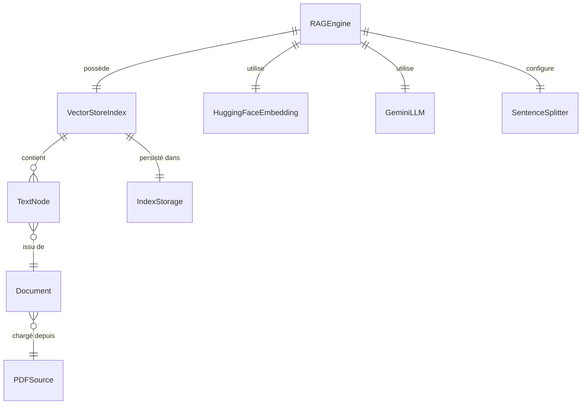

<!--
TEMPLATE — Modèle de données
============================
Public cible : (1) une IA qui écrit du code touchant à la persistance et doit raisonner
sur le schéma sans relire le SQL/ORM, (2) un humain qui prend le projet.

Doit permettre de RAISONNER sur les données sans ouvrir une seule migration. Catalogue
exhaustif, ordonné par importance fonctionnelle (pivot d'abord), pas par ordre alphabétique.

Garde-fous d'écriture :
- Tout type, contrainte, index = vérifiable depuis le DDL versionné OU le code (annotations
  ORM, schéma de validation). Si ni l'un ni l'autre, marquer "(à confirmer)".
- Les volumétries citées sont datées et tracent leur source (dashboard, requête, anonymisée
  depuis prod, etc.).
- Une cellule "non utilisé / aucun accès" est UNE INFORMATION — ne pas la supprimer.

Bloc « Mode d'emploi » en fin de fichier.
-->

# Modèle de données — RAG

| Champ | Valeur |
|---|---|
| **Dernière mise à jour** | 2026-05-21 |
| **Mise à jour par** | agent IA |
| **PR de référence** | (à confirmer) |
| **SGBD / Stockage** | Système de fichiers local (`./storage/`) — index vectoriel LlamaIndex sérialisé sur disque |
| **État du DDL** | Aucun DDL SQL — structure définie par LlamaIndex (`VectorStoreIndex`) et les dataclasses internes de llama_index |
| **Source d'extraction** | `rag_engine.py`, `pdf_loader.py`, `text_processor.py`, `gemini_client.py` |

> **Résumé en 1 phrase** : Ce projet persiste des chunks de texte extraits de PDFs sous forme d'index vectoriels sur disque, chaque index étant identifié par le hash MD5 de l'URL source du document.

---

## 1. Vue d'ensemble

| Indicateur | Valeur | Source |
|---|---|---|
| **Nombre de collections / index** | 1 par PDF indexé (N = variable) | `rag_engine.py:_get_index_path` |
| **Nombre de domaines fonctionnels** | 1 (RAG pipeline) | `rag_engine.py` |
| **Relations** | Aucune FK SQL — lien implicite `index_path → pdf_url` via hash MD5 | `rag_engine.py:_get_index_path` |
| **Objets non-table** | Répertoires sur disque (`./storage/index_<md5hash>/`) | `rag_engine.py:_save_index` |
| **Volume total approximatif** | Dépend du PDF source ; (à confirmer) | (à confirmer) |
| **Croissance** | Append-only par nouvelle URL indexée | `rag_engine.py:__init__` |

> Le pivot du système est l'**index vectoriel LlamaIndex** : un répertoire par URL de PDF, identifié par hash MD5, contenant les chunks et leurs embeddings.
> Les concepts clés sont : `RAGEngine`, `VectorStoreIndex`, `SentenceSplitter`, `HuggingFaceEmbedding`.
> Mode dominant : écriture à l'initialisation, lecture à chaque requête.

---

## 2. Vue d'ensemble par domaine

> Pas de base relationnelle. Le stockage est un système de fichiers structuré par LlamaIndex. Une entrée = un répertoire sur disque par PDF indexé.

```
┌─── Indexation (disque) ────────────────────────────────────────┐
│   ./storage/index_<md5hash>/                                   │
│   ├─ docstore.json          (chunks de texte extraits du PDF)  │
│   ├─ index_store.json       (métadonnées de l'index)           │
│   ├─ vector_store.json      (vecteurs d'embeddings)            │
│   └─ graph_store.json       (graphe de nœuds, à confirmer)     │
└────────────────────────────────────────────────────────────────┘
         ▲
         │ clé = md5(pdf_url)
┌─── Runtime (mémoire) ──────────────────────────────────────────┐
│   RAGEngine                                                    │
│   ├─ pdf_url : str                                             │
│   ├─ storage_dir : str  (défaut: "./storage")                  │
│   ├─ embed_model : HuggingFaceEmbedding                        │
│   ├─ llm : Gemini LLM                                          │
│   ├─ parser : SentenceSplitter (chunk_size=512, overlap=50)    │
│   ├─ index : VectorStoreIndex                                  │
│   └─ query_engine : QueryEngine (similarity_top_k=3)          │
└────────────────────────────────────────────────────────────────┘
```

---

## 3. Diagramme entité-relation



> Cardinalités Mermaid : `||--o{` = 1:N · `||--||` = 1:1 · `}o--o{` = N:N · `||--o|` = 1:0..1.
> Les entités ci-dessus sont des objets Python / structures LlamaIndex — pas des tables SQL. Les relations sont implicites au code.

---

## 4. Relations

> Une ligne par arête. Ordonner par centralité : pivot d'abord, feuilles après.

| Source | Cible | Cardinalité | Clé(s) | Déclarée ? | Sémantique |
|---|---|---|---|---|---|
| `RAGEngine` | `VectorStoreIndex` | 1:1 | `storage_dir + md5(pdf_url)` | Implicite (code) | L'engine charge ou crée un index par URL |
| `RAGEngine` | `HuggingFaceEmbedding` | 1:1 | — | Implicite (code) | Modèle `BAAI/bge-small-en-v1.5` injecté dans `Settings` |
| `RAGEngine` | `GeminiLLM` | 1:1 | — | Implicite (code) | LLM initialisé via `gemini_client.initialize_gemini_llm()` |
| `VectorStoreIndex` | `TextNode` | 1:N | node_id interne LlamaIndex | Implicite (LlamaIndex) | Chaque chunk de texte = un nœud de l'index |
| `TextNode` | `Document` | N:1 | doc_id interne LlamaIndex | Implicite (LlamaIndex) | Plusieurs chunks peuvent provenir d'un même document PDF |
| `IndexStorage` | `PDFSource` | 1:1 | `md5(pdf_url)` (nom du répertoire) | Implicite (code) | Le répertoire est nommé `index_<md5hash>` |

> ⚠️ Aucune FK SQL déclarée — toute l'intégrité est tenue par `RAGEngine._get_index_path()` et par LlamaIndex en mémoire.

---

## 5. Catalogue des structures de données

> Pas de tables SQL. Ce catalogue décrit les structures persistées sur disque et les objets Python principaux.

### 5.1 `RAGEngine` — orchestrateur principal du pipeline RAG

| Méta | Valeur |
|---|---|
| **Domaine** | RAG pipeline |
| **Accédée par** | `main.py` |
| **Volumétrie** | 1 instance par session |
| **Mode dominant** | Écriture à l'init (1ère exécution), lecture à chaque `query()` |
| **PK** | `pdf_url` (identifiant logique) |
| **Dépendances** | `HuggingFaceEmbedding`, `GeminiLLM`, `SentenceSplitter`, `VectorStoreIndex` |
| **Pattern temporel** | Append-only : un nouveau répertoire de stockage par URL jamais vue |

**Attributs**

| Attribut | Type Python | Description | Source |
|---|---|---|---|
| `pdf_url` | `str` | URL du PDF source indexé | `rag_engine.py:16` |
| `storage_dir` | `str` | Répertoire racine du cache (défaut `./storage`) | `rag_engine.py:16` |
| `embed_model` | `HuggingFaceEmbedding` | Modèle d'embeddings (`BAAI/bge-small-en-v1.5`) | `text_processor.py:14` |
| `llm` | `GeminiLLM` | LLM Google Gemini | `gemini_client.py` |
| `parser` | `SentenceSplitter` | Découpeur de texte (chunk_size=512, overlap=50) | `text_processor.py:29` |
| `index` | `VectorStoreIndex` | Index vectoriel LlamaIndex chargé ou construit | `rag_engine.py:36/47` |
| `query_engine` | `QueryEngine` | Moteur de requête (similarity_top_k=3, mode compact) | `rag_engine.py:54` |

**Pièges connus**

- ⚠️ Le cache est basé sur `md5(pdf_url)` — deux URLs identiques à un paramètre GET près produisent des index distincts.
- ⚠️ Si `./storage/` est supprimé, tous les embeddings sont perdus et doivent être recalculés (coûteux en temps).

**Évolutions notables**

| Date | PR | Changement |
|---|---|---|
| 2026-05-21 | (à confirmer) | Création initiale |

---

### 5.2 `IndexStorage` — répertoire de persistance sur disque _(forme abrégée)_

- **Domaine :** Stockage · **Accédée par :** `RAGEngine._save_index`, `RAGEngine._load_index` · **PK :** `index_<md5(pdf_url)>/`
- **Fichiers :** `docstore.json` (chunks), `index_store.json` (méta-index), `vector_store.json` (embeddings), `graph_store.json` (à confirmer)
- **Pattern :** Append-only à la création ; lecture seule au runtime ; aucune purge automatique

---

### 5.3 `SentenceSplitter` — configuration du découpage de texte _(forme abrégée)_

- **Domaine :** Text processing · **Accédée par :** `RAGEngine.__init__` · **PK :** N/A (objet stateless)
- **Paramètres :** `chunk_size=512`, `chunk_overlap=50`
- **Pattern :** Instancié une fois par session, appliqué à l'indexation uniquement

---

## 6. Synthèse catalogue

| Domaine | Structure | Volume | PK / Clé | Évolutivité |
|---|---|---|---|---|
| RAG pipeline | `RAGEngine` | 1 instance/session | `pdf_url` | Paramétrique |
| Stockage disque | `IndexStorage` (répertoire) | 1 dossier par PDF indexé | `index_<md5hash>/` | Append-only |
| Embeddings | `VectorStoreIndex` (LlamaIndex) | N chunks × 384 dims (à confirmer) | node_id interne | Write-once, read-many |
| Text processing | `SentenceSplitter` | N/A (stateless) | N/A | Quasi-stable |

---

## 7. Matrice d'accès composant × structure

> Légende : 👁 lecture · ✍ écriture · 🔀 lecture+écriture · — aucun accès.

| Composant | `IndexStorage` (disque) | `VectorStoreIndex` (mémoire) | `HuggingFaceEmbedding` | `GeminiLLM` |
|---|---|---|---|---|
| `rag_engine.py` | 🔀 | 🔀 | 👁 | 👁 |
| `text_processor.py` | — | — | ✍ | — |
| `pdf_loader.py` | — | — | — | — |
| `gemini_client.py` | — | — | — | ✍ |
| `main.py` | — | — | — | — |

---

## 8. Objets non-table

Pas de base relationnelle — aucun trigger, vue, séquence ni procédure stockée.

| Type | Nom | Rôle | Localisation source |
|---|---|---|---|
| Fichier JSON | `docstore.json` | Chunks de texte extraits des PDFs | `./storage/index_<hash>/` |
| Fichier JSON | `index_store.json` | Métadonnées de l'index vectoriel | `./storage/index_<hash>/` |
| Fichier JSON | `vector_store.json` | Vecteurs d'embeddings | `./storage/index_<hash>/` |
| Fichier JSON | `graph_store.json` | Graphe de nœuds LlamaIndex | `./storage/index_<hash>/` |

---

## 9. Conventions transverses

### 9.1 Nommage

| Convention | Sémantique | Exemple |
|---|---|---|
| `index_<md5hash>` | Répertoire d'index, nommé par hash MD5 de l'URL | `index_a1b2c3d4e5f6...` |
| `storage_dir` | Attribut Python — chemin racine du cache | `./storage` |
| `pdf_url` | Attribut Python — URL source du document | `https://arxiv.org/pdf/...` |

### 9.2 Types et conversions critiques

- **MD5 (hash d'URL)** : calculé avec `hashlib.md5(..., usedforsecurity=False)` — non cryptographique, usage uniquement comme clé de cache.
- **Embeddings** : vecteurs `float32` produits par `BAAI/bge-small-en-v1.5` (dimension 384, à confirmer). Sérialisés en JSON par LlamaIndex.

### 9.3 Dates et périodes de validité

- Aucune gestion de date applicative dans le code source — pas de colonne temporelle dans les structures de données.
- Le cache n'a pas de TTL : un index sur disque reste valable indéfiniment jusqu'à suppression manuelle.

### 9.4 NULL sémantique

Aucun champ nullable explicite dans les structures Python du projet. Les valeurs manquantes sont gérées par LlamaIndex en interne (à confirmer).

### 9.5 Capture d'erreur

- **Mécanisme** : aucun try-catch explicite dans `rag_engine.py`, `pdf_loader.py`, `text_processor.py` — les exceptions remontent à `main.py` (à confirmer).
- **Logs** : prints console uniquement (`print(...)`) — pas de logging structuré.

---

## 10. Contraintes implicites

> Règles d'intégrité **non déclarées en base** mais **tenues par le code**.

| # | Règle | Tenue par | Sanction si violée |
|---|---|---|---|
| IMP-01 | Le répertoire `index_<md5(pdf_url)>` doit correspondre exactement à l'URL passée à `RAGEngine.__init__` | `rag_engine._get_index_path()` | Chargement d'un index appartenant à un autre PDF |
| IMP-02 | `Settings.embed_model` doit être configuré avant la création du `VectorStoreIndex` | `text_processor.setup_advanced_text_processing()` appelé avant indexation | Erreur LlamaIndex à l'indexation |
| IMP-03 | `Settings.node_parser` doit être le `SentenceSplitter` configuré avec les mêmes paramètres chunk_size/overlap que lors de la création de l'index | `rag_engine.__init__` | Incohérence entre index existant et nouveau parser |

---

## 11. Politique de rétention et purge

| Structure | Rétention | Mécanisme | RGPD / sensible |
|---|---|---|---|
| `IndexStorage` (répertoires `./storage/`) | Illimitée — aucune purge automatique | Suppression manuelle du répertoire | Non — contenu issu de PDFs publics (à confirmer pour PDFs privés) |

---

## 12. Migrations / évolutions

Pas de migrations SQL. La structure de stockage est définie par LlamaIndex.

- **Outil** : Aucun — LlamaIndex gère la sérialisation JSON des index.
- **Stratégie de changement** : Si le format interne de LlamaIndex change (upgrade de version), les index existants doivent être régénérés — supprimer `./storage/` et relancer.
- **Réversibilité** : Toute évolution des paramètres (chunk_size, overlap, modèle d'embeddings) invalide les index existants ; il faut les reconstruire.

---

## 13. Recommandations actives

> Recommandations **non encore appliquées** — actions concrètes. Une fois traitées, les retirer.

1. **Ajouter un TTL ou une politique de purge sur `./storage/`** — sans nettoyage, le cache croît indéfiniment si de nombreuses URLs sont indexées.
2. **Versionner les paramètres de chunking avec l'index** — stocker `chunk_size`, `chunk_overlap`, et le nom du modèle d'embeddings dans un fichier `metadata.json` par index pour détecter les incohérences au chargement.

---

## Références

- Architecture : [architecture.md](architecture.md)
- Contrats des composants accédant aux données : [contracts.md](contracts.md)
- Glossaire : [glossaire.md](glossaire.md)
- Migrations versionnées : N/A (pas de SQL)

---

<!--
MODE D'EMPLOI DU TEMPLATE
=========================

POUR L'IA QUI MET À JOUR CE FICHIER

Déclencheurs (mettre à jour les sections concernées si la PR touche…) :

| Modification dans la PR | Sections à relire |
|---|---|
| Nouvelle migration / DDL change | §1, §3, §4, §5 (table concernée), §6 |
| Ajout / suppression de table | §1, §2, §3, §4, §5, §6, §7 |
| Nouvelle FK ou index | §4, §5 (table concernée), §10 si elle remplace une contrainte implicite |
| Nouveau composant accédant à la base | §7 (matrice) |
| Nouveau trigger / procédure / vue | §8 |
| Changement de convention de nommage | §9.1 |
| Changement de mécanisme de date / fuseau | §9.3 |
| Politique de rétention modifiée | §11 |
| Outil de migration changé | §12 |

Pour chaque table modifiée, MAJ obligatoire :
- Le bloc colonnes (§5.x).
- La ligne dans §6 si la volumétrie change d'ordre de grandeur.
- La ligne dans la matrice §7 si l'accès change.
- Ajouter une ligne « Évolutions notables » dans le bloc table avec date + PR.

Auto-checks :
- [ ] Toutes les tables citées en §5 existent dans le DDL / l'ORM.
- [ ] Toutes les FK §4 marquées « déclarée » correspondent à une vraie FK SQL.
- [ ] Le diagramme §3 reflète les relations §4.
- [ ] La matrice §7 ne mentionne pas de composant supprimé.
- [ ] Aucune `(à confirmer)` ancienne de plus de 60 jours sans ticket associé.

POUR LE RELECTEUR HUMAIN

- Vérifier que les volumétries ont une source datée (sinon : « ordre approximatif »).
- Les pièges §5.x doivent être réalistes — pas de sur-anticipation.
- Si l'IA invente un IMP-XX, vérifier que c'est bien tenu par le code et pas une
  hypothèse de relecture.

POUR ADAPTER À UN AUTRE PROJET

1. Remplacer placeholders.
2. Si stockage non relationnel (DynamoDB, MongoDB, Cassandra) :
   - §3 (ER) → schéma de documents / partitions clés.
   - §4 (relations) → références dénormalisées + GSI / SI.
   - §5 → catalogue de collections / item types ; les « colonnes » deviennent attributs.
3. Si plusieurs bases : dupliquer §5 par base, garder une vue d'ensemble §1 unique.
4. Garder les sections vides plutôt que les supprimer — l'absence est une information
   (« pas de trigger », « pas de pattern temporel »).
-->
