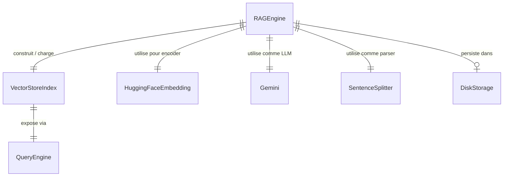

<!--
TEMPLATE — Modèle de données
============================
Public cible : (1) une IA qui écrit du code touchant à la persistance et doit raisonner
sur le schéma sans relire le SQL/ORM, (2) un humain qui prend le projet.

Doit permettre de RAISONNER sur les données sans ouvrir une seule migration. Catalogue
exhaustif, ordonné par importance fonctionnelle (pivot d'abord), pas par ordre alphabétique.

Garde-fous d'écriture :
- Tout type, contrainte, index = vérifiable depuis le DDL versionné OU le code (annotations
  ORM, schéma de validation). Si ni l'un ni l'autre, marquer "(à confirmer)".
- Les volumétries citées sont datées et tracent leur source (dashboard, requête, anonymisée
  depuis prod, etc.).
- Une cellule "non utilisé / aucun accès" est UNE INFORMATION — ne pas la supprimer.

Bloc « Mode d'emploi » en fin de fichier.
-->

# Modèle de données — RAG Engine

| Champ | Valeur |
|---|---|
| **Dernière mise à jour** | 2026-05-21 |
| **Mise à jour par** | agent IA |
| **PR de référence** | (à confirmer) |
| **SGBD / Stockage** | Système de fichiers local — index vectoriel LlamaIndex persisté dans `./storage/` |
| **État du DDL** | Pas de DDL SQL — schéma déduit du code (`rag_engine.py`, `text_processor.py`) |
| **Source d'extraction** | `rag_engine.py`, `text_processor.py`, `gemini_client.py`, `pdf_loader.py` |

> **Résumé en 1 phrase** : Ce projet persiste un index vectoriel LlamaIndex sur disque (dossier `./storage/`) pour permettre la recherche sémantique et la génération de réponses (RAG) à partir de documents PDF chargés depuis une URL.

---

## 1. Vue d'ensemble

| Indicateur | Valeur | Source |
|---|---|---|
| **Nombre de collections / structures** | 1 index vectoriel par PDF (identifié par hash MD5 de l'URL) | `rag_engine.py:_get_index_path` |
| **Nombre de domaines fonctionnels** | 1 — pipeline RAG | `rag_engine.py` |
| **Relations** | Aucune FK — les nœuds sont liés implicitement via l'index LlamaIndex | (à confirmer) |
| **Objets non-table** | Aucun trigger ni vue — logique entièrement en Python | `rag_engine.py` |
| **Volume total approximatif** | Dépend du PDF source — (à confirmer) | — |
| **Croissance** | Append-once par URL de PDF (écriture unique, lectures répétées) | `rag_engine.py:__init__` |

> Le concept pivot est l'**index vectoriel** (`VectorStoreIndex`), créé une seule fois par URL de PDF et réutilisé depuis le cache disque. Le mode dominant est **lecture** (requêtes sémantiques), l'écriture n'ayant lieu qu'à la création de l'index. Il n'y a pas de base relationnelle.

---

## 2. Vue d'ensemble par domaine

> Pas de base relationnelle. Le stockage est un dossier par index vectoriel sur le système de fichiers.

```
┌─── Pipeline RAG ────────────────────────────────────────────────────┐
│  RAGEngine (rag_engine.py)                                          │
│   ├─ storage_dir : str        chemin racine du cache disque         │
│   ├─ pdf_url    : str         URL du PDF source (clé logique)       │
│   ├─ embed_model: HuggingFaceEmbedding  (BAAI/bge-small-en-v1.5)   │
│   ├─ llm        : Gemini      modèle LLM via llama_index            │
│   ├─ parser     : SentenceSplitter  chunk_size=512, overlap=50      │
│   ├─ index      : VectorStoreIndex  index vectoriel LlamaIndex      │
│   └─ query_engine: QueryEngine  similarity_top_k=3, mode=compact   │
└──────────────────────────────────────────────────────────────────────┘
                │ persiste dans
                ▼
┌─── Stockage disque ─────────────────────────────────────────────────┐
│  {storage_dir}/index_{md5(pdf_url)}/                                │
│   └─ fichiers internes LlamaIndex (docstore, vector_store, etc.)   │
└──────────────────────────────────────────────────────────────────────┘
```

---

## 3. Diagramme entité-relation



> Ce diagramme représente les dépendances de composition de la classe `RAGEngine`, pas des entités SQL. Toutes les relations sont implicites (code Python).
> Cardinalités Mermaid : `||--o{` = 1:N · `||--||` = 1:1 · `}o--o{` = N:N · `||--o|` = 1:0..1.

---

## 4. Relations

> Une ligne par dépendance. Ordonner par centralité : pivot d'abord, feuilles après.

| Source | Cible | Cardinalité | Clé(s) | Déclarée ? | Sémantique |
|---|---|---|---|---|---|
| `RAGEngine` | `VectorStoreIndex` | 1:1 | `storage_dir` + hash MD5 de `pdf_url` | Implicite (code) | L'engine détient un seul index, chargé ou construit à l'init |
| `RAGEngine` | `HuggingFaceEmbedding` | 1:1 | — | Implicite (code) | Modèle `BAAI/bge-small-en-v1.5` assigné à `Settings.embed_model` |
| `RAGEngine` | `Gemini` | 1:1 | — | Implicite (code) | LLM configuré via `initialize_gemini_llm()` |
| `RAGEngine` | `SentenceSplitter` | 1:1 | — | Implicite (code) | Parser `chunk_size=512`, `chunk_overlap=50`, assigné à `Settings.node_parser` |
| `VectorStoreIndex` | `QueryEngine` | 1:1 | — | Implicite (code) | `as_query_engine(similarity_top_k=3, response_mode="compact")` |
| `RAGEngine` | `DiskStorage` | 1:0..1 | `{storage_dir}/index_{md5(pdf_url)}/` | Implicite (code) | Cache optionnel — absent à la première exécution |

> ⚠️ Toutes les relations sont tenues par le code Python (`rag_engine.py`), il n'existe aucune contrainte FK déclarée dans une base de données.

---

## 5. Catalogue des structures

> Ce projet n'a pas de tables SQL. Cette section documente les structures de données Python et le schéma de stockage disque.

### 5.1 `RAGEngine` — moteur principal RAG

| Méta | Valeur |
|---|---|
| **Domaine** | Pipeline RAG |
| **Accédée par** | Point d'entrée applicatif (à confirmer) |
| **Volumétrie** | 1 instance par session |
| **Mode dominant** | Lecture (requêtes) après écriture unique (construction de l'index) |
| **Clé logique** | `pdf_url` — identifie le document source |
| **Dépendances sortantes** | `HuggingFaceEmbedding`, `Gemini`, `SentenceSplitter`, `VectorStoreIndex`, `QueryEngine` |
| **Stockage** | `{storage_dir}/index_{md5(pdf_url)}/` |
| **Pattern temporel** | Append-once (l'index est écrit une seule fois, puis relu) |

**Attributs d'instance**

| Attribut | Type Python | Description | Flags |
|---|---|---|---|
| `storage_dir` | `str` | Chemin racine du cache disque | valeur par défaut `"./storage"` |
| `pdf_url` | `str` | URL du PDF source — sert de clé de cache (hash MD5) | clé logique |
| `embed_model` | `HuggingFaceEmbedding` | Modèle d'embedding (`BAAI/bge-small-en-v1.5`) assigné à `Settings.embed_model` | |
| `llm` | `Gemini` | LLM pour la génération de réponses, assigné à `Settings.llm` (à confirmer) | |
| `parser` | `SentenceSplitter` | Parser de nœuds — `chunk_size=512`, `chunk_overlap=50` — assigné à `Settings.node_parser` | |
| `index` | `VectorStoreIndex` | Index vectoriel LlamaIndex — chargé depuis disque ou construit depuis le PDF | pivot |
| `query_engine` | `QueryEngine` | Moteur de requête — `similarity_top_k=3`, `response_mode="compact"` | |

**Méthodes publiques**

```python
RAGEngine(pdf_url: str, storage_dir: str = "./storage")
    # Construit ou charge l'index au démarrage.

RAGEngine.query(question: str) -> str
    # Requête sémantique → génère une réponse via LLM.
```

**Pièges connus**

- ⚠️ Le cache est identifié par `md5(pdf_url)` — deux URLs distinctes pointant le même fichier génèrent deux index séparés.
- ⚠️ `Settings` est un singleton global LlamaIndex — l'instanciation de `RAGEngine` modifie les paramètres globaux (`embed_model`, `node_parser`).

**Évolutions notables**

| Date | PR | Changement |
|---|---|---|
| 2026-05-21 | (à confirmer) | Classe `RAGEngine` documentée depuis le code source |

---

### 5.2 Stockage disque — `{storage_dir}/index_{md5(pdf_url)}/` _(forme abrégée)_

- **Domaine :** Cache vectoriel · **Accédée par :** `RAGEngine._save_index`, `RAGEngine._load_index` · **Clé :** hash MD5 de `pdf_url`
- **Contenu :** Fichiers internes LlamaIndex (`StorageContext`) — format propriétaire
- **Pattern :** Quasi-stable — écriture unique à la création, lecture à chaque démarrage si le cache existe

---

## 6. Synthèse catalogue

| Domaine | Structure | Volume | Clé | Évolutivité |
|---|---|---|---|---|
| Pipeline RAG | `RAGEngine` | 1 instance par session | `pdf_url` | Écriture unique (index), lecture fréquente (requêtes) |
| Cache vectoriel | `{storage_dir}/index_{md5}/` | 1 dossier par PDF distinct | `md5(pdf_url)` | Quasi-stable — append-once |

---

## 7. Matrice d'accès composant × structure

> Lignes = composants/modules. Colonnes = structures de données / stockage.
> Légende : 👁 lecture · ✍ écriture · 🔧 configure · — aucun accès.

| Composant | `RAGEngine` | `VectorStoreIndex` | `DiskStorage` | `Settings` (global) |
|---|---|---|---|---|
| `rag_engine.py` | — | 👁 ✍ | 👁 ✍ | 🔧 |
| `text_processor.py` | — | — | — | 🔧 |
| `gemini_client.py` | — | — | — | 🔧 |
| `pdf_loader.py` | — | — | — | — |

---

## 8. Objets non-table

Pas de base relationnelle — aucun trigger, vue, séquence ou procédure stockée. La logique de traitement est entièrement portée par les fonctions Python suivantes :

| Type | Nom | Rôle | Localisation source |
|---|---|---|---|
| Fonction | `setup_advanced_text_processing()` | Configure le modèle d'embedding HuggingFace et les paramètres globaux LlamaIndex | `text_processor.py` |
| Fonction | `create_node_parser()` | Crée un `SentenceSplitter` (chunk_size=512, overlap=50) | `text_processor.py` |
| Fonction | `initialize_gemini_llm()` | Initialise le LLM Gemini depuis les variables d'environnement | `gemini_client.py` |
| Fonction | `load_pdf_from_url(url)` | Télécharge un PDF depuis une URL vers un fichier temporaire | `pdf_loader.py` |
| Fonction | `load_documents_from_pdf(pdf_path)` | Extrait les documents LlamaIndex depuis un PDF local | `pdf_loader.py` |

---

## 9. Conventions transverses

### 9.1 Nommage

| Convention | Sémantique | Exemple |
|---|---|---|
| `storage_dir` | Chemin racine du cache disque | `"./storage"` |
| `index_{md5}` | Sous-dossier de cache identifié par hash MD5 de l'URL | `index_a1b2c3d4...` |
| `pdf_url` | URL complète du document PDF source | `"https://..."` |

### 9.2 Types et conversions critiques

- **`pdf_url` → clé de cache** : la clé disque est calculée par `hashlib.md5(pdf_url.encode(), usedforsecurity=False).hexdigest()`. Deux URLs identiques au caractère près partagent le même cache.
- **`embed_model`** : modèle HuggingFace `BAAI/bge-small-en-v1.5` — les embeddings dépendent de la version du modèle ; un changement de modèle invalide le cache existant.

### 9.3 Paramètres de découpage texte

- **`chunk_size`** : 512 tokens (défini dans `text_processor.py` et `create_node_parser`)
- **`chunk_overlap`** : 50 tokens
- **`similarity_top_k`** : 3 (passages récupérés par requête)
- **`response_mode`** : `"compact"` (mode de synthèse LlamaIndex)

### 9.4 Valeurs absentes / cas limites

| Attribut | Absent signifie | Impact |
|---|---|---|
| Cache disque manquant | Premier lancement ou URL jamais indexée | L'index est construit depuis le PDF (lent) |
| `GOOGLE_API_KEY` non définie | Clé Gemini absente | Échec à l'initialisation du LLM (à confirmer : comportement exact) |

### 9.5 Capture d'erreur

- **Mécanisme** : pas de gestion d'erreur explicite dans `RAGEngine` — les exceptions LlamaIndex / réseau se propagent à l'appelant (à confirmer)
- **Logs** : `print()` utilisé pour le suivi de progression — pas de logger structuré
- **Localisation** : couche unique (`rag_engine.py`)

---

## 10. Contraintes implicites

> Règles d'intégrité tenues par le code Python. Toute évolution doit les préserver.

| # | Règle | Tenue par | Sanction si violée |
|---|---|---|---|
| IMP-01 | Le dossier `{storage_dir}/index_{md5(pdf_url)}/` doit contenir un `StorageContext` valide pour être chargé | `RAGEngine._load_index` via `StorageContext.from_defaults` | Exception LlamaIndex à l'initialisation |
| IMP-02 | `Settings.embed_model` doit être configuré avant la construction ou le chargement de l'index | `setup_advanced_text_processing()` appelé dans `__init__` | Embeddings incohérents ou erreur LlamaIndex |
| IMP-03 | `Settings.node_parser` doit être configuré avant `VectorStoreIndex.from_documents` | `create_node_parser()` + assignation dans `__init__` | Découpage par défaut LlamaIndex utilisé à la place |

---

## 11. Politique de rétention et purge

| Structure | Rétention | Mécanisme | RGPD / sensible |
|---|---|---|---|
| `{storage_dir}/index_{md5}/` | Indéfinie — aucune purge automatique | Manuel (suppression du dossier) | Non — contient uniquement des vecteurs et du texte issu du PDF source |

---

## 12. Migrations / évolutions

Pas de système de migration SQL. Les évolutions du schéma de stockage sont gérées manuellement :

- **Outil** : aucun — le format du cache est dicté par la version de LlamaIndex installée
- **Incompatibilité de cache** : un changement de version de LlamaIndex ou de modèle d'embedding nécessite de supprimer le dossier `storage/` et de reconstruire l'index
- **Réversibilité** : supprimer le cache force une reconstruction complète depuis le PDF source
- **Stratégie pour les changements bloquants** : suppression manuelle du dossier de cache puis relance

---

## 13. Recommandations actives

> Recommandations **non encore appliquées** — actions concrètes. Une fois traitées, les retirer.

1. **Ajouter un logger structuré** — remplacer les `print()` par un logger Python standard pour faciliter le débogage et l'observabilité en production.
2. **Gérer l'invalidation du cache** — documenter (et idéalement automatiser) la détection d'incompatibilité entre la version du modèle d'embedding et le cache disque existant.
3. **Capturer les exceptions réseau** — `load_pdf_from_url` et l'initialisation Gemini peuvent échouer silencieusement ; ajouter une gestion d'erreur explicite dans `RAGEngine.__init__`.

---

## Références

- Architecture : [architecture.md](architecture.md)
- Contrats des composants accédant aux données : [contracts.md](contracts.md)
- Glossaire : [glossaire.md](glossaire.md)
- Code source principal : [`rag_engine.py`](../rag_engine.py), [`text_processor.py`](../text_processor.py)

---

<!--
MODE D'EMPLOI DU TEMPLATE
=========================

POUR L'IA QUI MET À JOUR CE FICHIER

Déclencheurs (mettre à jour les sections concernées si la PR touche…) :

| Modification dans la PR | Sections à relire |
|---|---|
| Nouvelle migration / DDL change | §1, §3, §4, §5 (table concernée), §6 |
| Ajout / suppression de table | §1, §2, §3, §4, §5, §6, §7 |
| Nouvelle FK ou index | §4, §5 (table concernée), §10 si elle remplace une contrainte implicite |
| Nouveau composant accédant à la base | §7 (matrice) |
| Nouveau trigger / procédure / vue | §8 |
| Changement de convention de nommage | §9.1 |
| Changement de mécanisme de date / fuseau | §9.3 |
| Politique de rétention modifiée | §11 |
| Outil de migration changé | §12 |

Pour chaque table modifiée, MAJ obligatoire :
- Le bloc colonnes (§5.x).
- La ligne dans §6 si la volumétrie change d'ordre de grandeur.
- La ligne dans la matrice §7 si l'accès change.
- Ajouter une ligne « Évolutions notables » dans le bloc table avec date + PR.

Auto-checks :
- [ ] Toutes les tables citées en §5 existent dans le DDL / l'ORM.
- [ ] Toutes les FK §4 marquées « déclarée » correspondent à une vraie FK SQL.
- [ ] Le diagramme §3 reflète les relations §4.
- [ ] La matrice §7 ne mentionne pas de composant supprimé.
- [ ] Aucune `(à confirmer)` ancienne de plus de 60 jours sans ticket associé.

POUR LE RELECTEUR HUMAIN

- Vérifier que les volumétries ont une source datée (sinon : « ordre approximatif »).
- Les pièges §5.x doivent être réalistes — pas de sur-anticipation.
- Si l'IA invente un IMP-XX, vérifier que c'est bien tenu par le code et pas une
  hypothèse de relecture.

POUR ADAPTER À UN AUTRE PROJET

1. Remplacer placeholders.
2. Si stockage non relationnel (DynamoDB, MongoDB, Cassandra) :
   - §3 (ER) → schéma de documents / partitions clés.
   - §4 (relations) → références dénormalisées + GSI / SI.
   - §5 → catalogue de collections / item types ; les « colonnes » deviennent attributs.
3. Si plusieurs bases : dupliquer §5 par base, garder une vue d'ensemble §1 unique.
4. Garder les sections vides plutôt que les supprimer — l'absence est une information
   (« pas de trigger », « pas de pattern temporel »).
-->
