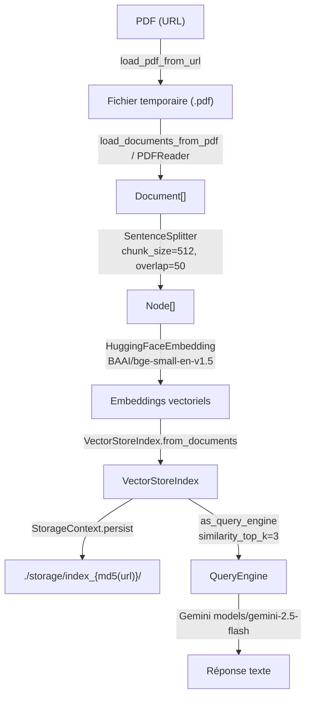

<!--
TEMPLATE — Modèle de données
============================
Public cible : (1) une IA qui écrit du code touchant à la persistance et doit raisonner
sur le schéma sans relire le SQL/ORM, (2) un humain qui prend le projet.

Doit permettre de RAISONNER sur les données sans ouvrir une seule migration. Catalogue
exhaustif, ordonné par importance fonctionnelle (pivot d'abord), pas par ordre alphabétique.

Garde-fous d'écriture :
- Tout type, contrainte, index = vérifiable depuis le DDL versionné OU le code (annotations
  ORM, schéma de validation). Si ni l'un ni l'autre, marquer "(à confirmer)".
- Les volumétries citées sont datées et tracent leur source (dashboard, requête, anonymisée
  depuis prod, etc.).
- Une cellule "non utilisé / aucun accès" est UNE INFORMATION — ne pas la supprimer.

Bloc « Mode d'emploi » en fin de fichier.
-->

# Modèle de données — RAG

| Champ | Valeur |
|---|---|
| **Dernière mise à jour** | 2026-05-20 |
| **Mise à jour par** | agent IA (doc-patcher) |
| **PR de référence** | (à confirmer) |
| **SGBD / Stockage** | Aucun SGBD — index vectoriel LlamaIndex persisté sur système de fichiers (`./storage/`) |
| **État du DDL** | Pas de DDL — structure gérée par LlamaIndex `StorageContext.persist` |
| **Source d'extraction** | `rag_engine.py`, `pdf_loader.py`, `text_processor.py`, `gemini_client.py`, `main.py` |

> **Résumé en 1 phrase** : Ce projet est un moteur RAG (Retrieval-Augmented Generation) qui charge un PDF depuis une URL, le découpe en nœuds vectorisés, les persiste sur disque via LlamaIndex, et répond à des questions en combinant recherche sémantique et LLM Gemini.

---

## 1. Vue d'ensemble

| Indicateur | Valeur | Source |
|---|---|---|
| **Nombre de collections / types d'objets** | 3 (Documents, Nodes, Index) | `rag_engine.py`, LlamaIndex internals |
| **Nombre de domaines fonctionnels** | 3 (Ingestion, Indexation, Requête) | `rag_engine.py` |
| **Relations** | Implicites (Document → Nodes via parser ; Nodes → Index via VectorStoreIndex) | N/A — pas de FK SQL |
| **Objets non-table** | N/A — pas de SGBD | — |
| **Volume total approximatif** | Dépend du PDF source ; index persisté dans `./storage/index_{md5}/` | (à confirmer) |
| **Croissance** | Append-only par PDF indexé (1 dossier par URL unique) | `rag_engine.py:_get_index_path` |

> _Le pivot est l'objet `VectorStoreIndex` de LlamaIndex, alimenté par les `Node` extraits du PDF. Le mode dominant est écriture lors de la première indexation, puis lecture exclusive pour toutes les requêtes suivantes. L'identifiant d'une indexation est le hash MD5 de l'URL du PDF._

---

## 2. Vue d'ensemble par domaine

> Pas de SGBD relationnel. Les « domaines » correspondent aux étapes du pipeline RAG. Les objets persistés vivent sur le système de fichiers ; les objets en mémoire sont reconstruits à chaque instanciation de `RAGEngine`.

```
┌─── Ingestion ──────────────────────────┐
│  PDF (URL)                             │
│  → temp file (tempfile.gettempdir())   │
│  → Document[] (LlamaIndex)             │
└───────────────────┬────────────────────┘
                    │
┌─── Indexation ────▼────────────────────┐
│  Document[] → Node[] (SentenceSplitter)│
│  Node[] + HuggingFaceEmbedding         │
│  → VectorStoreIndex                    │
│  → persiste dans ./storage/index_{md5}/│
└───────────────────┬────────────────────┘
                    │
┌─── Requête ───────▼────────────────────┐
│  QueryEngine (similarity_top_k=3,      │
│               response_mode="compact") │
│  → LLM Gemini (models/gemini-2.5-flash)│
│  → réponse texte                       │
└────────────────────────────────────────┘
```

---

## 3. Diagramme entité-relation

> Pas de schéma relationnel. Le diagramme ci-dessous représente le flux de transformation des données dans le pipeline LlamaIndex.



---

## 4. Relations

> Pas de FK SQL — pas de SGBD. Les relations entre objets sont implicites, gérées par LlamaIndex en mémoire.

| Source | Cible | Cardinalité | Clé(s) | Déclarée ? | Sémantique |
|---|---|---|---|---|---|
| `Document` | `Node` | 1:N | `doc_id` interne LlamaIndex | Implicite (code) | Un document PDF produit N nœuds via `SentenceSplitter` |
| `Node` | `VectorStoreIndex` | N:1 | index interne LlamaIndex | Implicite (code) | Tous les nœuds alimentent un seul index par PDF |
| `pdf_url` | `index_path` | 1:1 | `md5(pdf_url)` | Implicite (code, `_get_index_path`) | L'URL détermine le chemin de persistance sur disque |

> ⚠️ La clé de cache est le hash MD5 de l'URL brute (`pdf_url.encode()`). Tout changement de casse ou de paramètre de requête dans l'URL crée un nouvel index, l'ancien reste orphelin sur le disque.

---

## 5. Catalogue des entités

> Pas de tables SQL. Les entités ci-dessous sont soit des objets Python en mémoire, soit des artefacts persistés sur le système de fichiers par LlamaIndex.

### 5.1 `RAGEngine` — classe pivot orchestrant l'ensemble du pipeline

| Méta | Valeur |
|---|---|
| **Domaine** | Tous (Ingestion + Indexation + Requête) |
| **Accédée par** | `main.py` |
| **Volumétrie** | 1 instance par session |
| **Mode dominant** | Écriture (1ère exécution) puis lecture (exécutions suivantes) |
| **Identifiant** | `md5(pdf_url)` — détermine le chemin de cache |
| **Dépendances sortantes** | `pdf_loader`, `text_processor`, `gemini_client`, LlamaIndex |
| **Persistance** | `./storage/index_{md5(pdf_url)}/` via `StorageContext.persist` |
| **Pattern temporel** | Append-only (1 dossier par URL unique, jamais purgé automatiquement) |

**Attributs de l'instance**

| Attribut | Type | Description | Valeur par défaut |
|---|---|---|---|
| `pdf_url` | `str` | URL du PDF source | (fourni à l'instanciation) |
| `storage_dir` | `str` | Répertoire racine du cache | `"./storage"` |
| `embed_model` | `HuggingFaceEmbedding` | Modèle d'embedding | `BAAI/bge-small-en-v1.5` |
| `llm` | `Gemini` | LLM pour la génération | `models/gemini-2.5-flash`, température 0.1 |
| `parser` | `SentenceSplitter` | Découpage en nœuds | chunk_size=512, overlap=50 |
| `index` | `VectorStoreIndex` | Index vectoriel LlamaIndex | Chargé depuis cache ou construit |
| `query_engine` | `QueryEngine` | Moteur de requête | similarity_top_k=3, response_mode="compact" |

**Pièges connus**

- ⚠️ `gemini_client.py` définit la fonction `iNitialize_gemini_llm` (casse incorrecte) mais `rag_engine.py` l'importe sous `initialize_gemini_llm` — le projet ne s'exécute pas tel quel.
- ⚠️ Le hash MD5 est calculé avec `usedforsecurity=False` ; toute variation de l'URL (casse, paramètres) produit un nouveau dossier de cache, laissant les anciens orphelins.
- ⚠️ Le fichier PDF temporaire (`temp_rag_document.pdf`) est écrit dans `tempfile.gettempdir()` sans nettoyage explicite.

**Évolutions notables**

| Date | PR | Changement |
|---|---|---|
| 2026-05-20 | (à confirmer) | Correction syntaxe `__init__` : ajout de la virgule manquante entre `pdf_url` et `storage_dir` |

---

### 5.2 `VectorStoreIndex` (persisté) — artefact de cache sur disque _(forme abrégée)_

- **Domaine :** Indexation · **Accédée par :** `RAGEngine._load_index`, `RAGEngine._save_index` · **Clé :** `index_{md5(pdf_url)}`
- **Contenu :** fichiers internes LlamaIndex (`docstore.json`, `index_store.json`, `vector_store.json`, `graph_store.json`) (à confirmer)
- **Pattern :** Écrit une seule fois, relu à chaque redémarrage si l'URL est inchangée

---

## 6. Synthèse catalogue

| Domaine | Entité / Artefact | Volume | Identifiant | Évolutivité |
|---|---|---|---|---|
| Ingestion | `Document[]` (LlamaIndex) | 1 par page PDF (à confirmer) | `doc_id` interne | Écriture unique par PDF |
| Indexation | `Node[]` (LlamaIndex) | N par document (chunk_size=512) | `node_id` interne | Écriture unique par PDF |
| Indexation | `VectorStoreIndex` (disque) | 1 dossier par URL | `index_{md5(url)}` | Append-only, jamais purgé |
| Requête | `QueryEngine` (mémoire) | 1 instance | — | Quasi-stable (paramètres fixes) |
| Configuration | Constantes code | — | — | Stable (modifiable dans le code) |

---

## 7. Matrice d'accès composant × artefact

> Lignes = modules Python. Colonnes = artefacts de données (mémoire ou disque). Cellule vide = aucun accès.
> Légende : 👁 lecture · ✍ écriture · 🔀 lecture + écriture.

| Composant | Fichier PDF (temp) | `Document[]` | `Node[]` | `VectorStoreIndex` (disque) | `QueryEngine` |
|---|---|---|---|---|---|
| `main.py` | — | — | — | — | 👁 (via `rag.query`) |
| `rag_engine.py` | 👁 (chemin) | 👁 | 👁 | 🔀 | ✍ |
| `pdf_loader.py` | ✍ (download) | ✍ (extrait) | — | — | — |
| `text_processor.py` | — | — | ✍ (configure parser) | — | — |
| `gemini_client.py` | — | — | — | — | ✍ (configure LLM) |

---

## 8. Objets non-table

N/A — pas de SGBD, donc pas de vues, séquences, triggers, fonctions stockées, ni index SQL. La logique équivalente est portée par le code Python (`rag_engine.py`) et les paramètres LlamaIndex.

---

## 9. Conventions transverses

### 9.1 Nommage

Pas de convention de nommage de colonnes SQL à documenter. Les noms d'attributs de `RAGEngine` suivent le snake_case Python standard (`storage_dir`, `pdf_url`, `embed_model`, `query_engine`).

### 9.2 Types et conversions critiques

- **Hash d'URL** : MD5 hex (`hashlib.md5(pdf_url.encode(), usedforsecurity=False).hexdigest()`) — sensible à l'encodage de l'URL ; une URL identique encodée différemment (ex. `%2F` vs `/`) produira un hash distinct.
- **Embeddings** : vecteurs float32 produits par `BAAI/bge-small-en-v1.5` (dimension 384 d'après la fiche HuggingFace — à confirmer à l'exécution).

### 9.3 Dates et périodes de validité

N/A — pas de gestion temporelle explicite dans le modèle de données. LlamaIndex ajoute des métadonnées internes (à confirmer), mais elles ne sont pas exploitées par le code applicatif.

### 9.4 NULL sémantique

N/A — pas de SGBD. `RAGEngine.index` et `RAGEngine.query_engine` sont initialisés à `None` dans `__init__` puis assignés avant utilisation ; un `None` signifie « non encore initialisé ».

### 9.5 Capture d'erreur

- **Mécanisme** : aucun try/catch explicite dans le code applicatif actuel — les exceptions LlamaIndex, `requests` et `hashlib` remontent sans traitement (à confirmer).
- **Logs** : `print()` exclusivement — pas de logging structuré.

---

## 10. Contraintes implicites

> Règles d'intégrité **non déclarées en base** mais **tenues par le code**.

| # | Règle | Tenue par | Sanction si violée |
|---|---|---|---|
| IMP-01 | `pdf_url` doit être une URL HTTP(S) valide et accessible | `pdf_loader.load_pdf_from_url` (timeout=30s) | `requests.exceptions.RequestException` non gérée |
| IMP-02 | Le dossier `storage_dir` doit être accessible en écriture | `RAGEngine._save_index` via `os.makedirs` | `OSError` non gérée |
| IMP-03 | La clé `GOOGLE_API_KEY` doit être définie dans `config.py` | `gemini_client.initialize_gemini_llm` | `ImportError` ou erreur API Gemini |

---

## 11. Politique de rétention et purge

N/A — pas de SGBD. Les artefacts persistés (`./storage/index_*/`) ne sont jamais purgés automatiquement. Le fichier PDF temporaire (`temp_rag_document.pdf`) est écrasé à chaque exécution mais pas supprimé. Pas de données personnelles identifiées dans le pipeline — dépend du contenu du PDF source (à confirmer par l'exploitant).

---

## 12. Migrations / évolutions

N/A — pas de SGBD ni de schéma versionné. Toute évolution du modèle (ex. changement de modèle d'embedding, de taille de chunk) rend les index existants incompatibles. La stratégie implicite est de supprimer le dossier `./storage/` et de relancer l'indexation (à confirmer / formaliser).

---

## 13. Recommandations actives

> Recommandations **non encore appliquées** — actions concrètes. Une fois traitées, les retirer.

1. **Corriger le nom de la fonction dans `gemini_client.py`** — `iNitialize_gemini_llm` doit être renommé `initialize_gemini_llm` pour que l'import dans `rag_engine.py` fonctionne. Le projet est actuellement non fonctionnel à l'exécution.
2. **Ajouter un mécanisme de purge du cache** — les dossiers `./storage/index_*/` orphelins s'accumulent indéfiniment. Implémenter une commande de nettoyage ou un TTL.
3. **Remplacer `print()` par `logging`** — les logs de progression ne sont pas structurés, rendant le débogage difficile en production.
4. **Définir `[project]` dans `pyproject.toml`** — le champ `name` et `version` sont absents, ce qui empêche le packaging correct.

---

## Références

- Architecture : [architecture.md](architecture.md)
- Contrats des composants accédant aux données : [contracts.md](contracts.md)
- Glossaire : [glossaire.md](glossaire.md)
- Pas de migrations versionnées — N/A pour ce projet

---

<!--
MODE D'EMPLOI DU TEMPLATE
=========================

POUR L'IA QUI MET À JOUR CE FICHIER

Déclencheurs (mettre à jour les sections concernées si la PR touche…) :

| Modification dans la PR | Sections à relire |
|---|---|
| Nouvelle migration / DDL change | §1, §3, §4, §5 (table concernée), §6 |
| Ajout / suppression de table | §1, §2, §3, §4, §5, §6, §7 |
| Nouvelle FK ou index | §4, §5 (table concernée), §10 si elle remplace une contrainte implicite |
| Nouveau composant accédant à la base | §7 (matrice) |
| Nouveau trigger / procédure / vue | §8 |
| Changement de convention de nommage | §9.1 |
| Changement de mécanisme de date / fuseau | §9.3 |
| Politique de rétention modifiée | §11 |
| Outil de migration changé | §12 |

Pour chaque table modifiée, MAJ obligatoire :
- Le bloc colonnes (§5.x).
- La ligne dans §6 si la volumétrie change d'ordre de grandeur.
- La ligne dans la matrice §7 si l'accès change.
- Ajouter une ligne « Évolutions notables » dans le bloc table avec date + PR.

Auto-checks :
- [ ] Toutes les tables citées en §5 existent dans le DDL / l'ORM.
- [ ] Toutes les FK §4 marquées « déclarée » correspondent à une vraie FK SQL.
- [ ] Le diagramme §3 reflète les relations §4.
- [ ] La matrice §7 ne mentionne pas de composant supprimé.
- [ ] Aucune `(à confirmer)` ancienne de plus de 60 jours sans ticket associé.

POUR LE RELECTEUR HUMAIN

- Vérifier que les volumétries ont une source datée (sinon : « ordre approximatif »).
- Les pièges §5.x doivent être réalistes — pas de sur-anticipation.
- Si l'IA invente un IMP-XX, vérifier que c'est bien tenu par le code et pas une
  hypothèse de relecture.

POUR ADAPTER À UN AUTRE PROJET

1. Remplacer placeholders.
2. Si stockage non relationnel (DynamoDB, MongoDB, Cassandra) :
   - §3 (ER) → schéma de documents / partitions clés.
   - §4 (relations) → références dénormalisées + GSI / SI.
   - §5 → catalogue de collections / item types ; les « colonnes » deviennent attributs.
3. Si plusieurs bases : dupliquer §5 par base, garder une vue d'ensemble §1 unique.
4. Garder les sections vides plutôt que les supprimer — l'absence est une information
   (« pas de trigger », « pas de pattern temporel »).
-->
