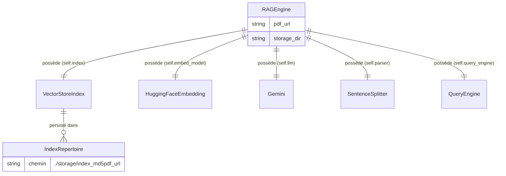

<!--
TEMPLATE — Modèle de données
============================
Public cible : (1) une IA qui écrit du code touchant à la persistance et doit raisonner
sur le schéma sans relire le SQL/ORM, (2) un humain qui prend le projet.

Doit permettre de RAISONNER sur les données sans ouvrir une seule migration. Catalogue
exhaustif, ordonné par importance fonctionnelle (pivot d'abord), pas par ordre alphabétique.

Garde-fous d'écriture :
- Tout type, contrainte, index = vérifiable depuis le DDL versionné OU le code (annotations
  ORM, schéma de validation). Si ni l'un ni l'autre, marquer "(à confirmer)".
- Les volumétries citées sont datées et tracent leur source (dashboard, requête, anonymisée
  depuis prod, etc.).
- Une cellule "non utilisé / aucun accès" est UNE INFORMATION — ne pas la supprimer.

Bloc « Mode d'emploi » en fin de fichier.
-->

# Modèle de données — RAG

| Champ | Valeur |
|---|---|
| **Dernière mise à jour** | 2026-05-10 |
| **Mise à jour par** | agent IA |
| **PR de référence** | (à confirmer) |
| **SGBD / Stockage** | Fichiers vectoriels sur disque (`./storage/`) via LlamaIndex `VectorStoreIndex` |
| **État du DDL** | Pas de DDL SQL — index persistés sur disque par `StorageContext.persist()` |
| **Source d'extraction** | `rag_engine.py`, `text_processor.py`, `pdf_loader.py`, `gemini_client.py` |

> **Résumé en 1 phrase** : Le projet persiste des index vectoriels issus de documents PDF afin de répondre à des questions en langage naturel via un moteur RAG (Retrieval-Augmented Generation) utilisant Gemini comme LLM et BAAI/bge-small-en-v1.5 comme modèle d'embedding.

---

## 1. Vue d'ensemble

| Indicateur | Valeur | Source |
|---|---|---|
| **Nombre de structures de données** | 1 classe principale (`RAGEngine`) + index vectoriel sur disque | `rag_engine.py` |
| **Nombre de domaines fonctionnels** | 1 (pipeline RAG sur PDF) | `rag_engine.py` |
| **Relations** | Les attributs de `RAGEngine` sont liés par composition (pas de FK SQL) | `rag_engine.py` |
| **Objets non-table** | Index LlamaIndex persistés sous `./storage/index_<md5>/` | `rag_engine.py:59-60` |
| **Volume total approximatif** | Dépend du PDF source — (à confirmer) | — |
| **Croissance** | Append-only (un répertoire d'index par URL de PDF, jamais écrasé) | `rag_engine.py:33-51` |

> _Le pivot central est la classe `RAGEngine`, qui orchestre le chargement du PDF, la construction de l'index vectoriel et l'interrogation en langage naturel. Le stockage est entièrement fichier-based (pas de base de données relationnelle). Le mode dominant est lecture : l'index est construit une seule fois puis interrogé en boucle._

---

## 2. Vue d'ensemble par domaine

> Pas de base de données relationnelle. Les données sont organisées par rôle fonctionnel dans la classe `RAGEngine` et dans les répertoires de stockage sur disque.

```
┌─── Pipeline RAG (rag_engine.py) ──────────────────────────────────────────┐
│   RAGEngine                                                                │
│   ├─ pdf_url          → identifiant logique du document source             │
│   ├─ storage_dir      → racine du cache disque (défaut : ./storage)        │
│   ├─ embed_model      → HuggingFaceEmbedding (BAAI/bge-small-en-v1.5)     │
│   ├─ llm              → Gemini (models/gemini-2.5-flash)                   │
│   ├─ parser           → SentenceSplitter (chunk=512, overlap=50)           │
│   ├─ index            → VectorStoreIndex (LlamaIndex)                      │
│   └─ query_engine     → QueryEngine (similarity_top_k=3, mode=compact)    │
└────────────────────────────────────────────────────────────────────────────┘
         │
         ▼
┌─── Stockage disque ────────────────────────────────────────────────────────┐
│   ./storage/index_<md5(pdf_url)>/   (un répertoire par PDF unique)         │
│   Contenu géré par LlamaIndex StorageContext                               │
└────────────────────────────────────────────────────────────────────────────┘
```

---

## 3. Diagramme entité-relation

> Pas de schéma relationnel SQL. Le diagramme ci-dessous représente les relations de **composition** entre les objets Python de `RAGEngine` et les données persistées sur disque.



> Les relations sont des compositions Python (attributs d'instance), non des FK SQL. Toutes sont déclarées implicitement dans `RAGEngine.__init__`.

---

## 4. Relations

> Une ligne par relation de composition entre objets Python. Pas de FK SQL — toutes les relations sont implicites (tenues par le code).

| Source | Cible | Cardinalité | Attribut | Déclarée ? | Sémantique |
|---|---|---|---|---|---|
| `RAGEngine` | `HuggingFaceEmbedding` | 1:1 | `self.embed_model` | Implicite (code) | Modèle d'embedding vectoriel |
| `RAGEngine` | `Gemini` | 1:1 | `self.llm` | Implicite (code) | LLM pour la génération de réponses |
| `RAGEngine` | `SentenceSplitter` | 1:1 | `self.parser` | Implicite (code) | Découpage du texte en nœuds |
| `RAGEngine` | `VectorStoreIndex` | 1:1 | `self.index` | Implicite (code) | Index vectoriel chargé ou construit |
| `RAGEngine` | `QueryEngine` | 1:1 | `self.query_engine` | Implicite (code) | Moteur de recherche sémantique + génération |
| `RAGEngine` | `./storage/index_<md5>/` | 1:N | `storage_dir` + hash MD5 de `pdf_url` | Implicite (code) | Cache disque de l'index par PDF |

> ⚠️ La relation entre `RAGEngine` et le répertoire de stockage est identifiée par le hash MD5 de `pdf_url` (`hashlib.md5`). Si l'URL d'un PDF change (même contenu), un nouvel index est recalculé — aucune déduplication de contenu n'est effectuée.

---

## 5. Catalogue des structures de données

> Pas de tables SQL. Cette section documente la classe principale et les structures de données persistées sur disque.

### 5.1 `RAGEngine` — classe pivot orchestrant l'ensemble du pipeline RAG

| Méta | Valeur |
|---|---|
| **Domaine** | Pipeline RAG (ingestion PDF → index vectoriel → requête LLM) |
| **Défini dans** | [`rag_engine.py`](../rag_engine.py) |
| **Mode dominant** | Écriture à l'initialisation (si pas de cache), lecture lors des requêtes |
| **Pattern temporel** | Append-only par URL de PDF (index jamais écrasé) |

**Attributs d'instance**

| Attribut | Type Python | Valeur par défaut | Description |
|---|---|---|---|
| `pdf_url` | `str` | — (obligatoire) | URL du PDF source à indexer |
| `storage_dir` | `str` | `"./storage"` | Répertoire racine du cache d'index sur disque |
| `embed_model` | `HuggingFaceEmbedding` | `BAAI/bge-small-en-v1.5` | Modèle d'embedding vectoriel |
| `llm` | `Gemini` | `models/gemini-2.5-flash`, temperature=0.1 | LLM de génération de réponses |
| `parser` | `SentenceSplitter` | chunk_size=512, chunk_overlap=50 | Découpeur de texte en nœuds |
| `index` | `VectorStoreIndex` | — (construit ou chargé) | Index vectoriel LlamaIndex |
| `query_engine` | `QueryEngine` | similarity_top_k=3, response_mode="compact" | Moteur de requête sémantique |

**Méthodes publiques**

| Méthode | Signature | Description |
|---|---|---|
| `__init__` | `(pdf_url: str, storage_dir: str = "./storage")` | Initialise le pipeline : charge ou construit l'index |
| `query` | `(question: str) -> str` | Interroge l'index et retourne la réponse générée |

**Pièges connus**

- ⚠️ Le cache est identifié par le hash MD5 de `pdf_url` — deux URLs différentes pointant vers le même PDF produiront deux index distincts.
- ⚠️ Si le répertoire `storage_dir` est supprimé entre deux exécutions, tout l'index est recalculé (re-téléchargement + re-embedding du PDF complet).

**Évolutions notables**

| Date | PR | Changement |
|---|---|---|
| 2026-05-10 | (à confirmer) | Création initiale de `RAGEngine` avec Gemini et HuggingFace embedding |

---

### 5.2 Répertoire d'index disque — cache vectoriel par PDF _(forme abrégée)_

- **Chemin :** `./storage/index_<md5(pdf_url)>/` · **Géré par :** `LlamaIndex StorageContext` · **Clé :** hash MD5 de `pdf_url`
- **Contenu :** Fichiers de persistance LlamaIndex (à confirmer — format interne LlamaIndex)
- **Pattern :** Écrit une seule fois à la première indexation d'un PDF, puis lecture seule

---

## 6. Synthèse catalogue

| Domaine | Structure | Volume | Clé | Évolutivité |
|---|---|---|---|---|
| Pipeline RAG | `RAGEngine` (objet Python) | 1 instance par exécution | — | Évolue avec le code |
| Cache vectoriel | `./storage/index_<md5>/` (répertoire) | 1 répertoire par PDF unique | `md5(pdf_url)` | Append-only (jamais écrasé) |

---

## 7. Matrice d'accès composant × structure de données

> Légende : 👁 lecture · ✍ écriture (création) · 🔀 lecture ou écriture selon cache.

| Composant | `RAGEngine` | Cache disque `./storage/` |
|---|---|---|
| `rag_engine.py` | 🔀 (instancié par l'appelant) | 🔀 (lit si cache existe, écrit sinon) |
| `text_processor.py` | ✍ (configure `embed_model`, `parser`) | — |
| `gemini_client.py` | ✍ (configure `llm`) | — |
| `pdf_loader.py` | — (fournit les documents au pipeline) | — |

---

## 8. Objets non-table

> Pas de base de données SQL — donc pas de vues, séquences, triggers ni procédures stockées. Les objets notables non-table sont listés ci-dessous.

| Type | Nom | Rôle | Localisation source |
|---|---|---|---|
| Fichier temporaire | `temp_rag_document.pdf` | PDF téléchargé depuis l'URL, stocké dans `tempfile.gettempdir()` | [`pdf_loader.py:23`](../pdf_loader.py) |
| Répertoire de cache | `./storage/index_<md5>/` | Index vectoriel LlamaIndex persisté par `StorageContext.persist()` | [`rag_engine.py:63-64`](../rag_engine.py) |

---

## 9. Conventions transverses

### 9.1 Nommage

> Pas de conventions de nommage SQL — les attributs Python suivent `snake_case` (PEP 8, enforced par ruff).

| Convention | Sémantique | Exemple |
|---|---|---|
| `snake_case` | Attributs et paramètres Python | `storage_dir`, `pdf_url`, `embed_model` |
| `index_<md5>` | Répertoire de cache par PDF | `index_a3f2c1...` |

### 9.2 Types et conversions critiques

- **`pdf_url` (str)** : utilisé tel quel pour le hash MD5 via `hashlib.md5(pdf_url.encode())`. Toute variation (trailing slash, http vs https) produit un hash différent et donc un nouveau répertoire de cache.
- **Réponse de `query_engine.query()`** : retournée comme objet LlamaIndex, convertie en `str` avant retour (`str(response)`).

### 9.3 Dates et périodes de validité

- Pas de gestion de dates applicatives dans le modèle de données actuel.
- Le cache disque n'est pas horodaté — l'existence du répertoire suffit à déterminer si un PDF a déjà été indexé.

### 9.4 Valeurs par défaut notables

| Attribut | Valeur par défaut | Impact |
|---|---|---|
| `storage_dir` | `"./storage"` | Relatif au répertoire de travail à l'exécution |
| `chunk_size` | `512` | Taille des nœuds de texte pour l'embedding |
| `chunk_overlap` | `50` | Recouvrement entre nœuds consécutifs |
| `similarity_top_k` | `3` | Nombre de nœuds récupérés par requête sémantique |
| `response_mode` | `"compact"` | Mode de synthèse de la réponse LlamaIndex |
| `temperature` | `0.1` | Déterminisme du LLM Gemini |

### 9.5 Capture d'erreur

- **Mécanisme** : Aucun try/catch explicite dans `rag_engine.py` — les exceptions HTTP (`requests.get`) et LlamaIndex remontent au code appelant. (à confirmer)

---

## 10. Contraintes implicites

> Règles d'intégrité **non déclarées en base** (pas de SQL) mais **tenues par le code**. Toute évolution doit les préserver.

| # | Règle | Tenue par | Sanction si violée |
|---|---|---|---|
| IMP-01 | `pdf_url` doit être une URL HTTP(S) valide pointant vers un PDF accessible | `pdf_loader.load_pdf_from_url` via `requests.get` | Levée d'exception HTTP non catchée |
| IMP-02 | Le répertoire `storage_dir` doit être accessible en écriture | `rag_engine._save_index` via `os.makedirs` | `PermissionError` ou `OSError` non catchée |
| IMP-03 | `GOOGLE_API_KEY` doit être défini dans `config.py` | `gemini_client.initialize_gemini_llm` | Erreur d'authentification Gemini non catchée |

---

## 11. Politique de rétention et purge

| Structure | Rétention | Mécanisme | RGPD / sensible |
|---|---|---|---|
| `./storage/index_<md5>/` | Indéfinie (pas de TTL implémenté) | Suppression manuelle du répertoire | Non — contient des vecteurs numériques, pas de données personnelles brutes (à confirmer) |
| `temp_rag_document.pdf` | Durée de la session OS (tempdir) | Géré par l'OS | Dépend du contenu du PDF source (à confirmer) |

---

## 12. Migrations / évolutions

> Pas de base de données SQL — pas de migrations DDL. Les évolutions du modèle de données correspondent à des changements de code Python ou de paramètres de configuration.

- **Outil** : Aucun outil de migration SQL — les paramètres de l'index (chunk_size, embed_model) sont définis dans le code.
- **Convention** : Si les paramètres d'embedding changent (`chunk_size`, `model_name`), les index existants dans `./storage/` doivent être supprimés manuellement et recalculés — ils ne sont pas compatibles avec de nouveaux paramètres.
- **Réversibilité** : Suppression du répertoire cache + re-exécution suffit à reconstruire l'index.
- **Stratégie pour les changements bloquants** : Vider `./storage/` avant tout changement de modèle d'embedding ou de taille de chunk.

---

## 13. Recommandations actives

> Recommandations **non encore appliquées** — actions concrètes, pas des vœux pieux. Une fois traitées, les retirer (les conserver dans la PR qui les implémente).

1. **Ajouter une gestion d'erreur explicite dans `RAGEngine.__init__`** — Les exceptions HTTP (`requests.get`) et les erreurs d'authentification Gemini remontent sans contexte utile pour le débogage.
2. **Ajouter un TTL ou un mécanisme de purge du cache `./storage/`** — Sans purge automatique, les index s'accumulent indéfiniment sur le disque, en particulier si `pdf_url` varie fréquemment.
3. **Valider la compatibilité du cache lors d'un changement de `chunk_size` ou de `model_name`** — Aucun mécanisme actuel ne détecte qu'un index existant a été créé avec des paramètres différents.

---

## Références

- Architecture : [architecture.md](architecture.md)
- Contrats des composants accédant aux données : [contracts.md](contracts.md)
- Glossaire : [glossaire.md](glossaire.md)
- Migrations versionnées : sans objet (pas de base de données SQL)

---

<!--
MODE D'EMPLOI DU TEMPLATE
=========================

POUR L'IA QUI MET À JOUR CE FICHIER

Déclencheurs (mettre à jour les sections concernées si la PR touche…) :

| Modification dans la PR | Sections à relire |
|---|---|
| Nouvelle migration / DDL change | §1, §3, §4, §5 (table concernée), §6 |
| Ajout / suppression de table | §1, §2, §3, §4, §5, §6, §7 |
| Nouvelle FK ou index | §4, §5 (table concernée), §10 si elle remplace une contrainte implicite |
| Nouveau composant accédant à la base | §7 (matrice) |
| Nouveau trigger / procédure / vue | §8 |
| Changement de convention de nommage | §9.1 |
| Changement de mécanisme de date / fuseau | §9.3 |
| Politique de rétention modifiée | §11 |
| Outil de migration changé | §12 |

Pour chaque table modifiée, MAJ obligatoire :
- Le bloc colonnes (§5.x).
- La ligne dans §6 si la volumétrie change d'ordre de grandeur.
- La ligne dans la matrice §7 si l'accès change.
- Ajouter une ligne « Évolutions notables » dans le bloc table avec date + PR.

Auto-checks :
- [ ] Toutes les tables citées en §5 existent dans le DDL / l'ORM.
- [ ] Toutes les FK §4 marquées « déclarée » correspondent à une vraie FK SQL.
- [ ] Le diagramme §3 reflète les relations §4.
- [ ] La matrice §7 ne mentionne pas de composant supprimé.
- [ ] Aucune `(à confirmer)` ancienne de plus de 60 jours sans ticket associé.

POUR LE RELECTEUR HUMAIN

- Vérifier que les volumétries ont une source datée (sinon : « ordre approximatif »).
- Les pièges §5.x doivent être réalistes — pas de sur-anticipation.
- Si l'IA invente un IMP-XX, vérifier que c'est bien tenu par le code et pas une
  hypothèse de relecture.

POUR ADAPTER À UN AUTRE PROJET

1. Remplacer placeholders.
2. Si stockage non relationnel (DynamoDB, MongoDB, Cassandra) :
   - §3 (ER) → schéma de documents / partitions clés.
   - §4 (relations) → références dénormalisées + GSI / SI.
   - §5 → catalogue de collections / item types ; les « colonnes » deviennent attributs.
3. Si plusieurs bases : dupliquer §5 par base, garder une vue d'ensemble §1 unique.
4. Garder les sections vides plutôt que les supprimer — l'absence est une information
   (« pas de trigger », « pas de pattern temporel »).
-->
