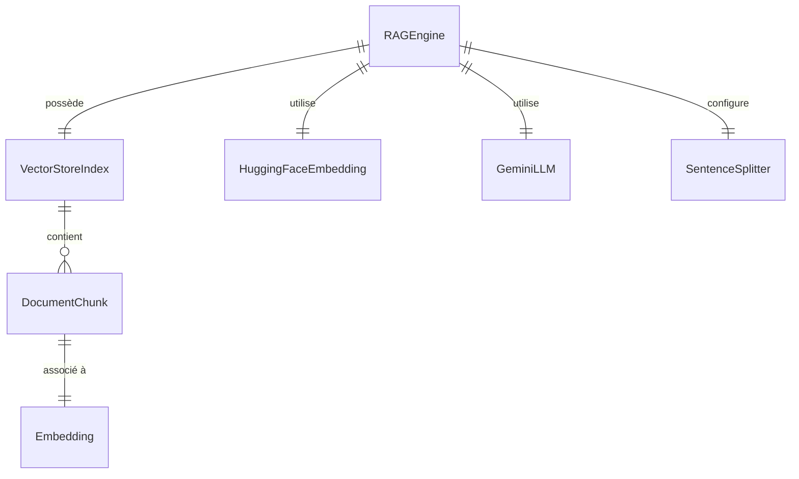

<!--
TEMPLATE — Modèle de données
============================
Public cible : (1) une IA qui écrit du code touchant à la persistance et doit raisonner
sur le schéma sans relire le SQL/ORM, (2) un humain qui prend le projet.

Doit permettre de RAISONNER sur les données sans ouvrir une seule migration. Catalogue
exhaustif, ordonné par importance fonctionnelle (pivot d'abord), pas par ordre alphabétique.

Garde-fous d'écriture :
- Tout type, contrainte, index = vérifiable depuis le DDL versionné OU le code (annotations
  ORM, schéma de validation). Si ni l'un ni l'autre, marquer "(à confirmer)".
- Les volumétries citées sont datées et tracent leur source (dashboard, requête, anonymisée
  depuis prod, etc.).
- Une cellule "non utilisé / aucun accès" est UNE INFORMATION — ne pas la supprimer.

Bloc « Mode d'emploi » en fin de fichier.
-->

# Modèle de données — RAG

| Champ | Valeur |
|---|---|
| **Dernière mise à jour** | 2026-05-11 |
| **Mise à jour par** | agent IA |
| **PR de référence** | (à confirmer) |
| **SGBD / Stockage** | Système de fichiers local — index vectoriel persisté dans `./storage/` via LlamaIndex (`StorageContext`) |
| **État du DDL** | Pas de DDL SQL — schéma implicite défini par les structures LlamaIndex sérialisées sur disque |
| **Source d'extraction** | `rag_engine.py`, `text_processor.py`, `pdf_loader.py`, `gemini_client.py`, `README.md` |

> **Résumé en 1 phrase** : Ce système persiste des index vectoriels de chunks de documents PDF, identifiés par un hash MD5 de l'URL source, afin de permettre une recherche sémantique et une génération de réponses via Gemini.

---

## 1. Vue d'ensemble

| Indicateur | Valeur | Source |
|---|---|---|
| **Nombre de tables / collections** | 1 répertoire d'index par URL indexée | `rag_engine.py` — `_get_index_path()` |
| **Nombre de domaines fonctionnels** | 1 (index vectoriel de documents PDF) | `rag_engine.py` |
| **Relations** | 0 FK déclarées — structure arborescente gérée par LlamaIndex | `rag_engine.py` |
| **Objets non-table** | Fichiers sérialisés LlamaIndex (`docstore.json`, `index_store.json`, `vector_store.json`, `graph_store.json`) | `./storage/<hash_md5>/` (à confirmer) |
| **Volume total approximatif** | Dépend du PDF indexé — non borné | (à confirmer) |
| **Croissance** | Append-only par nouvelle URL : un répertoire par URL jamais purgé automatiquement | `rag_engine.py` |

> _Résumé en 3 lignes : à quoi sert cette base ? Quels sont les concepts pivots ?_
>
> Le stockage persiste des index vectoriels de chunks de texte extraits de PDFs. Le concept pivot est l'index vectoriel (`VectorStoreIndex` LlamaIndex), identifié par un hash MD5 de l'URL PDF. Le mode dominant est écriture unique à la première indexation, lecture intensive à chaque requête.

---

## 2. Vue d'ensemble par domaine

> Les tables sont regroupées par **rôle fonctionnel**, pas par ordre alphabétique. Une cellule vide dans la matrice d'accès §7 est une information en soi : elle signifie « aucun accès ».

```
┌─── Index vectoriel (fichiers LlamaIndex) ──────────────────────────────────────┐
│   ./storage/index_<md5_url>/                                                   │
│   ├─ docstore.json       (documents bruts + métadonnées)                       │
│   ├─ index_store.json    (méta de l'index VectorStoreIndex)                    │
│   ├─ vector_store.json   (vecteurs d'embeddings des chunks)                    │
│   └─ graph_store.json    (graphe de relations — vide par défaut)               │
│                                                                                │
│   Clé de partitionnement : md5(pdf_url) — calculée dans RAGEngine._get_index_path()
└────────────────────────────────────────────────────────────────────────────────┘

RAGEngine (runtime, non persisté)
  ├─ embed_model : HuggingFaceEmbedding("BAAI/bge-small-en-v1.5")
  ├─ llm         : Gemini LLM (initialisé via gemini_client)
  ├─ parser      : SentenceSplitter(chunk_size=512, chunk_overlap=50)
  └─ query_engine: similarity_top_k=3, response_mode="compact"
```

---

## 3. Diagramme entité-relation



> Cardinalités Mermaid : `||--o{` = 1:N · `||--||` = 1:1 · `}o--o{` = N:N · `||--o|` = 1:0..1.
> Les entités ci-dessus sont des objets LlamaIndex sérialisés sur disque — il n'y a pas de FK SQL déclarée.

---

## 4. Relations

> Une ligne par arête. Ordonner par centralité : pivot d'abord, feuilles après.

| Source | Cible | Cardinalité | Clé(s) | Déclarée ? | Sémantique |
|---|---|---|---|---|---|
| `VectorStoreIndex` | `DocumentChunk` | 1:N | `node_id` interne LlamaIndex | Implicite (LlamaIndex) | Un index contient N chunks de texte extraits du PDF |
| `DocumentChunk` | `Embedding` | 1:1 | `node_id` | Implicite (LlamaIndex) | Chaque chunk a un vecteur d'embedding associé |
| `RAGEngine` | `VectorStoreIndex` | 1:1 | `md5(pdf_url)` → répertoire de stockage | Implicite (code) | Un moteur gère un index identifié par hash de l'URL |

> ⚠️ Il n'existe aucune FK SQL déclarée. Toute l'intégrité référentielle est gérée par LlamaIndex au niveau applicatif. Toute modification du chemin de stockage ou du schéma de hash casse la compatibilité avec les index existants.

---

## 5. Catalogue des tables

> Un bloc complet par table **pivot** ou **fréquemment écrite**. Un bloc abrégé pour les référentiels stables. Ordre : pivot → catalogue → liens → audit.

### 5.1 `vector_store.json` — Index vectoriel des chunks de documents PDF

| Méta | Valeur |
|---|---|
| **Domaine** | Index vectoriel |
| **Accédée par** | `RAGEngine` (`rag_engine.py`) via `VectorStoreIndex` LlamaIndex |
| **Volumétrie** | Dépend du PDF — proportionnelle au nombre de chunks (taille chunk : 512 tokens, overlap : 50) (à confirmer) |
| **Mode dominant** | Écriture unique à l'indexation, lecture intensive à chaque requête |
| **PK** | `node_id` — identifiant interne LlamaIndex (UUID) (à confirmer) |
| **FK sortantes** | Aucune FK SQL — référence implicite vers `docstore.json` par `node_id` |
| **Index** | Index de similarité cosinus géré par LlamaIndex |
| **Pattern temporel** | Append-only — un nouveau répertoire par URL, pas de mise à jour en place |

**Attributs (champs JSON LlamaIndex)**

| Attribut | Type | Null | Description | Flags |
|---|---|---|---|---|
| `node_id` | string (UUID) | N | Identifiant unique du chunk | PK implicite |
| `embedding` | list[float] | N | Vecteur d'embedding (dimension dépend du modèle `BAAI/bge-small-en-v1.5`) | IDX (similarité cosinus) |
| `text` | string | N | Contenu textuel du chunk (max ~512 tokens) | |
| `metadata` | object | Y | Métadonnées du document source (page, fichier, etc.) | |

**Accès typiques**

```python
# Lecture — recherche sémantique top-k
query_engine = index.as_query_engine(similarity_top_k=3, response_mode="compact")
response = query_engine.query(question)

# Écriture — indexation initiale
index = VectorStoreIndex.from_documents(documents, show_progress=True)
index.storage_context.persist(persist_dir=index_path)
```

**Pièges connus**

- ⚠️ Le répertoire d'index est identifié par `md5(pdf_url)` — changer l'URL (même si le contenu est identique) crée un nouvel index et ignore le cache existant.
- ⚠️ Aucune purge automatique : les anciens répertoires d'index s'accumulent dans `./storage/` sans mécanisme de nettoyage.

**Évolutions notables**

| Date | PR | Changement |
|---|---|---|
| 2026-05-11 | (à confirmer) | Initialisation du document — structure extraite du code |

---

### 5.2 `docstore.json` — Stockage des documents bruts et métadonnées de chunks

- **Domaine :** Index vectoriel · **Accédée par :** `RAGEngine` via LlamaIndex `StorageContext` · **PK :** `node_id` (UUID interne LlamaIndex)
- **Attributs clés :** `node_id` (string), `text` (string), `metadata` (object), `relationships` (object)
- **Pattern :** Append-only à l'indexation — pas de mise à jour en place

---

### 5.3 `index_store.json` — Métadonnées de l'index LlamaIndex _(forme abrégée)_

- **Domaine :** Index vectoriel · **Accédée par :** `RAGEngine` via LlamaIndex `StorageContext` · **PK :** clé interne LlamaIndex
- **Attributs :** `index_id` (string), `type` (string), `summary` (string), `nodes_dict` (object)
- **Pattern :** Quasi-stable — écrit une fois à l'indexation, lu au chargement du cache

---

## 6. Synthèse catalogue

| Domaine | Table | Volume | PK | Évolutivité |
|---|---|---|---|---|
| Index vectoriel | `vector_store.json` | Dépend du PDF (à confirmer) | `node_id` (UUID) | Écriture unique, lecture intensive |
| Index vectoriel | `docstore.json` | Dépend du PDF (à confirmer) | `node_id` (UUID) | Append-only à l'indexation |
| Index vectoriel | `index_store.json` | Petit (méta uniquement) | clé interne LlamaIndex | Quasi-stable |
| Index vectoriel | `graph_store.json` | Vide par défaut | N/A | Non utilisé actuellement |

---

## 7. Matrice d'accès composant × table

> Lignes = composants/services. Colonnes = tables. Cellule vide = aucun accès = information utile.
> Légende : 👁 SELECT · 🔄 SELECT curseur / paginé · ✍ INSERT · ✏ UPDATE · 🗑 DELETE · 🔀 UPSERT.

| Composant | `vector_store.json` | `docstore.json` | `index_store.json` | `graph_store.json` |
|---|---|---|---|---|
| `RAGEngine` (indexation) | ✍ | ✍ | ✍ | ✍ |
| `RAGEngine` (requête) | 👁 🔄 | 👁 | 👁 | — |
| `pdf_loader.py` | — | — | — | — |
| `text_processor.py` | — | — | — | — |
| `gemini_client.py` | — | — | — | — |

---

## 8. Objets non-table

_Pas d'objets non-table SQL dans ce projet — il n'y a pas de base de données relationnelle._

Les objets analogues côté LlamaIndex/fichiers :

| Type | Nom | Rôle | Localisation source |
|---|---|---|---|
| Index vectoriel | `VectorStoreIndex` | Stockage et recherche sémantique des embeddings | `rag_engine.py`, `./storage/<hash>/vector_store.json` |
| Modèle d'embedding | `HuggingFaceEmbedding` (`BAAI/bge-small-en-v1.5`) | Calcul des vecteurs de chunks | `text_processor.py` |
| Parser de nœuds | `SentenceSplitter` (chunk_size=512, overlap=50) | Découpage du texte PDF en chunks | `text_processor.py` |

---

## 9. Conventions transverses

### 9.1 Nommage

_Pas de convention de nommage SQL dans ce projet — stockage fichier LlamaIndex uniquement._

| Préfixe / suffixe | Sémantique | Exemple | Type canonique |
|---|---|---|---|
| `node_id` | Identifiant unique d'un chunk | `node_id` | string (UUID, géré par LlamaIndex) |
| `index_<hash>` | Répertoire d'index — hash MD5 de l'URL PDF | `index_abc123...` | Répertoire dans `./storage/` |

### 9.2 Types et conversions critiques

> Documenter ICI tout type qui pose problème aux frontières (sérialisation, comparaison, hashing).

- **Vecteurs d'embedding** : dimension fixée par le modèle `BAAI/bge-small-en-v1.5` (384 dimensions) (à confirmer) — incompatibilité si le modèle est changé sans re-indexation.
- **Sérialisation JSON LlamaIndex** : les fichiers `vector_store.json` et `docstore.json` sont des formats internes LlamaIndex susceptibles de changer entre versions majeures.

### 9.3 Dates et périodes de validité

_Pas de champs de date dans le stockage LlamaIndex — les métadonnées de date dépendent des métadonnées du PDF source et sont passées à travers LlamaIndex sans normalisation explicite (à confirmer)._

### 9.4 NULL sémantique

| Attribut | NULL/absent signifie | Impact |
|---|---|---|
| `metadata` dans `docstore.json` | Pas de métadonnées source disponibles pour ce chunk | Réponse Gemini sans référence de page/document |
| `graph_store.json` | Vide — aucun graphe de relations activé | Aucun impact sur la recherche vectorielle |

### 9.5 Capture d'erreur SQL / DB

- **Mécanisme** : Aucune gestion d'erreur explicite dans le code source actuel — les exceptions LlamaIndex et filesystem remontent à l'appelant (à confirmer)
- **Logs** : `print()` statements dans `RAGEngine.__init__()` — pas de logging structuré
- **Localisation** : `rag_engine.py` — `RAGEngine.__init__()` et `query()`

---

## 10. Contraintes implicites

> Règles d'intégrité **non déclarées en base** mais **tenues par le code**. Toute évolution doit les préserver — voir [contracts.md](contracts.md) pour les composants qui les portent.

| # | Règle | Tenue par | Sanction si violée |
|---|---|---|---|
| IMP-01 | Le répertoire `./storage/index_<md5>` doit contenir des fichiers LlamaIndex valides avant tout appel à `_load_index()` | `RAGEngine.__init__()` — vérification `os.path.exists(index_path)` | Échec au chargement avec exception LlamaIndex |
| IMP-02 | Le modèle d'embedding utilisé à l'indexation doit être identique à celui utilisé à la requête | Convention d'usage — aucun contrôle en code | Résultats de similarité incohérents / silencieusement incorrects |
| IMP-03 | La variable d'environnement `GOOGLE_API_KEY` (ou `config.py`) doit être définie avant l'initialisation de `GeminiLLM` | `gemini_client.initialize_gemini_llm()` | Échec au démarrage avec erreur d'authentification Google |

---

## 11. Politique de rétention et purge

| Stockage | Rétention | Mécanisme | RGPD / sensible |
|---|---|---|---|
| `./storage/index_<hash>/` | Indéfinie — aucune purge automatique | Suppression manuelle du répertoire | Contient le texte extrait des PDFs indexés — sensible si le PDF contient des données personnelles (à confirmer) |

---

## 12. Migrations / évolutions

_Pas de migrations SQL dans ce projet._ Les évolutions du schéma LlamaIndex se gèrent en supprimant les répertoires `./storage/` et en re-indexant.

- **Outil** : Aucun — stockage fichier LlamaIndex géré manuellement
- **Convention** : Répertoires nommés `index_<md5(pdf_url)>` dans `./storage/`
- **Réversibilité** : Re-indexation complète requise en cas de changement de modèle d'embedding ou de version LlamaIndex
- **Stratégie pour les changements bloquants** : Supprimer `./storage/` et relancer `main.py` pour re-indexer

---

## 13. Recommandations actives

> Recommandations **non encore appliquées** — actions concrètes, pas des vœux pieux. Une fois traitées, les retirer (les conserver dans la PR qui les implémente).

1. **Ajouter une purge automatique des anciens index** — Les répertoires `./storage/index_<hash>/` s'accumulent sans limite ; ajouter un mécanisme de nettoyage basé sur l'âge ou une liste de contrôle des URLs actives.
2. **Implémenter une gestion d'erreur explicite dans `RAGEngine`** — Les exceptions LlamaIndex et filesystem remontent sans traitement ; ajouter des `try/except` avec logs structurés pour faciliter le diagnostic.
3. **Documenter la compatibilité de version LlamaIndex** — Le format de sérialisation des fichiers JSON peut changer entre versions majeures ; figer la version dans `requirements.txt` et documenter la procédure de migration.

---

## Références

- Architecture : [architecture.md](architecture.md)
- Contrats des composants accédant aux données : [contracts.md](contracts.md)
- Glossaire : [glossaire.md](glossaire.md)
- Migrations versionnées : N/A — pas de DDL SQL, stockage fichier LlamaIndex dans `./storage/`

---

<!--
MODE D'EMPLOI DU TEMPLATE
=========================

POUR L'IA QUI MET À JOUR CE FICHIER

Déclencheurs (mettre à jour les sections concernées si la PR touche…) :

| Modification dans la PR | Sections à relire |
|---|---|
| Nouvelle migration / DDL change | §1, §3, §4, §5 (table concernée), §6 |
| Ajout / suppression de table | §1, §2, §3, §4, §5, §6, §7 |
| Nouvelle FK ou index | §4, §5 (table concernée), §10 si elle remplace une contrainte implicite |
| Nouveau composant accédant à la base | §7 (matrice) |
| Nouveau trigger / procédure / vue | §8 |
| Changement de convention de nommage | §9.1 |
| Changement de mécanisme de date / fuseau | §9.3 |
| Politique de rétention modifiée | §11 |
| Outil de migration changé | §12 |

Pour chaque table modifiée, MAJ obligatoire :
- Le bloc colonnes (§5.x).
- La ligne dans §6 si la volumétrie change d'ordre de grandeur.
- La ligne dans la matrice §7 si l'accès change.
- Ajouter une ligne « Évolutions notables » dans le bloc table avec date + PR.

Auto-checks :
- [ ] Toutes les tables citées en §5 existent dans le DDL / l'ORM.
- [ ] Toutes les FK §4 marquées « déclarée » correspondent à une vraie FK SQL.
- [ ] Le diagramme §3 reflète les relations §4.
- [ ] La matrice §7 ne mentionne pas de composant supprimé.
- [ ] Aucune `(à confirmer)` ancienne de plus de 60 jours sans ticket associé.

POUR LE RELECTEUR HUMAIN

- Vérifier que les volumétries ont une source datée (sinon : « ordre approximatif »).
- Les pièges §5.x doivent être réalistes — pas de sur-anticipation.
- Si l'IA invente un IMP-XX, vérifier que c'est bien tenu par le code et pas une
  hypothèse de relecture.

POUR ADAPTER À UN AUTRE PROJET

1. Remplacer placeholders.
2. Si stockage non relationnel (DynamoDB, MongoDB, Cassandra) :
   - §3 (ER) → schéma de documents / partitions clés.
   - §4 (relations) → références dénormalisées + GSI / SI.
   - §5 → catalogue de collections / item types ; les « colonnes » deviennent attributs.
3. Si plusieurs bases : dupliquer §5 par base, garder une vue d'ensemble §1 unique.
4. Garder les sections vides plutôt que les supprimer — l'absence est une information
   (« pas de trigger », « pas de pattern temporel »).
-->
