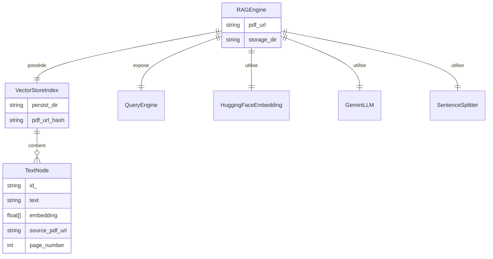

<!--
TEMPLATE — Modèle de données
============================
Public cible : (1) une IA qui écrit du code touchant à la persistance et doit raisonner
sur le schéma sans relire le SQL/ORM, (2) un humain qui prend le projet.

Doit permettre de RAISONNER sur les données sans ouvrir une seule migration. Catalogue
exhaustif, ordonné par importance fonctionnelle (pivot d'abord), pas par ordre alphabétique.

Garde-fous d'écriture :
- Tout type, contrainte, index = vérifiable depuis le DDL versionné OU le code (annotations
  ORM, schéma de validation). Si ni l'un ni l'autre, marquer "(à confirmer)".
- Les volumétries citées sont datées et tracent leur source (dashboard, requête, anonymisée
  depuis prod, etc.).
- Une cellule "non utilisé / aucun accès" est UNE INFORMATION — ne pas la supprimer.

Bloc « Mode d'emploi » en fin de fichier.
-->

# Modèle de données — RAG

| Champ | Valeur |
|---|---|
| **Dernière mise à jour** | 2026-05-20 |
| **Mise à jour par** | agent IA |
| **PR de référence** | e6e4931 |
| **SGBD / Stockage** | Stockage vectoriel sur disque (LlamaIndex `VectorStoreIndex` persisté dans `./storage/`) |
| **État du DDL** | Pas de DDL — schéma défini par le code Python (`rag_engine.py`, `text_processor.py`) |
| **Source d'extraction** | `rag_engine.py`, `text_processor.py`, `pdf_loader.py`, `gemini_client.py`, `pyproject.toml` |

> **Résumé en 1 phrase** : Le projet persiste un index vectoriel de chunks de texte extraits de PDFs distants, afin de permettre une recherche sémantique (RAG) alimentant un LLM Gemini.

---

## 1. Vue d'ensemble

| Indicateur | Valeur | Source |
|---|---|---|
| **Nombre de collections** | 1 index vectoriel par URL de PDF | `rag_engine.py:_get_index_path` |
| **Nombre de domaines fonctionnels** | 1 (recherche sémantique sur documents PDF) | `rag_engine.py` |
| **Relations** | Aucune FK — les chunks sont liés à leur document source via métadonnées LlamaIndex | `rag_engine.py` |
| **Objets non-table** | Aucun trigger ni vue — logique entièrement applicative | — |
| **Volume total approximatif** | Dépend du PDF source ; chunks de 512 tokens avec overlap 50 | `text_processor.py` |
| **Croissance** | Append-only par PDF ; un répertoire d'index par URL unique | `rag_engine.py:_get_index_path` |

> _Résumé en 3 lignes : à quoi sert cette base ? Quels sont les concepts pivots ?_
>
> L'index vectoriel est le pivot central : chaque PDF produit un `VectorStoreIndex` persisté dans `./storage/index_{md5_url}/`. Les chunks de texte (512 tokens, overlap 50) sont le seul type d'objet stocké. Le mode dominant est lecture (requêtes sémantiques), avec une écriture unique au premier chargement d'un PDF.

---

## 2. Vue d'ensemble par domaine

> Les tables sont regroupées par **rôle fonctionnel**, pas par ordre alphabétique. Une cellule vide dans la matrice d'accès §7 est une information en soi : elle signifie « aucun accès ».

```
┌─── Ingestion PDF ───────────────────────┐     ┌─── Index vectoriel (disque) ──────────────────────────┐
│  PDFReader (llama_index.readers.file)   │     │  VectorStoreIndex                                     │
│  - Téléchargement via requests (URL)   │──▶  │  Répertoire : ./storage/index_{md5(pdf_url)}/         │
│  - Extraction pages en Documents       │     │  ├─ TextNode  (chunk, embedding, metadata)            │
└─────────────────────────────────────────┘     │  └─ docstore.json / vector_store.json / index.json   │
                                                └───────────────────────────────────────────────────────┘
┌─── Traitement texte ────────────────────┐                        │
│  SentenceSplitter                       │                        ▼
│  - chunk_size  : 512                   │     ┌─── Requête ──────────────────────────────────────────┐
│  - chunk_overlap: 50                   │──▶  │  QueryEngine (similarity_top_k=3, mode=compact)      │
└─────────────────────────────────────────┘     │  Embedding : HuggingFace BAAI/bge-small-en-v1.5     │
                                                │  LLM       : Gemini models/gemini-2.5-flash          │
                                                └──────────────────────────────────────────────────────┘
```

---

## 3. Diagramme entité-relation



> Cardinalités Mermaid : `||--o{` = 1:N · `||--||` = 1:1 · `}o--o{` = N:N · `||--o|` = 1:0..1.
> Si une relation est **observée** mais non déclarée en base, l'indiquer dans la table §4.

---

## 4. Relations

> Une ligne par arête. Ordonner par centralité : pivot d'abord, feuilles après.

| Source | Cible | Cardinalité | Clé(s) | Déclarée ? | Sémantique |
|---|---|---|---|---|---|
| `RAGEngine` | `VectorStoreIndex` | 1:1 | `storage_dir + md5(pdf_url)` | Implicite (code) | Un moteur gère exactement un index par PDF URL |
| `VectorStoreIndex` | `TextNode` | 1:N | `node.id_` (généré par LlamaIndex) | Implicite (fichiers JSON) | L'index stocke N chunks issus du PDF |
| `TextNode` | PDF source | N:1 | `metadata.source` (à confirmer) | Implicite (métadonnées) | Chaque chunk référence son document d'origine |

> ⚠️ Il n'y a aucune FK déclarée — l'intégrité référentielle est entièrement tenue par LlamaIndex. Toute modification manuelle des fichiers `./storage/` peut corrompre silencieusement l'index.

---

## 5. Catalogue des tables

> Un bloc complet par table **pivot** ou **fréquemment écrite**. Un bloc abrégé pour les référentiels stables. Ordre : pivot → catalogue → liens → audit.

### 5.1 `VectorStoreIndex` — index vectoriel pivot persisté sur disque

| Méta | Valeur |
|---|---|
| **Domaine** | Recherche sémantique |
| **Accédée par** | `RAGEngine` (`rag_engine.py`) |
| **Volumétrie** | Un répertoire par PDF ; taille dépend du nombre de pages (à confirmer) |
| **Mode dominant** | Écriture unique au premier chargement, lecture à chaque requête |
| **PK** | `persist_dir` = `./storage/index_{md5(pdf_url)}/` |
| **FK sortantes** | Aucune déclarée — lien implicite vers PDF source via métadonnées |
| **Index** | Index vectoriel FAISS ou SimpleVectorStore (à confirmer — géré par LlamaIndex) |
| **Pattern temporel** | Append-only ; recréé si le cache est absent |

**Attributs de `RAGEngine`**

| Attribut | Type Python | Nullable | Description | Notes |
|---|---|---|---|---|
| `pdf_url` | `str` | N | URL du PDF source | Clé logique — hashée en MD5 pour le répertoire |
| `storage_dir` | `str` | N | Répertoire racine du cache | Défaut : `./storage` |
| `embed_model` | `HuggingFaceEmbedding` | N | Modèle d'embedding | `BAAI/bge-small-en-v1.5` |
| `llm` | `Gemini` | N | LLM de génération | `models/gemini-2.5-flash`, temperature=0.1 |
| `parser` | `SentenceSplitter` | N | Découpeur de texte | chunk_size=512, chunk_overlap=50 |
| `index` | `VectorStoreIndex` | N | Index vectoriel chargé ou construit | Persisté dans `storage_dir/index_{hash}/` |
| `query_engine` | `QueryEngine` | N | Moteur de requête | similarity_top_k=3, response_mode="compact" |

**Requêtes typiques (Python)**

```python
# Lecture — requête sémantique
response = self.query_engine.query(question)

# Écriture — construction de l'index
self.index = VectorStoreIndex.from_documents(documents, show_progress=True)
self.index.storage_context.persist(persist_dir=index_path)
```

**Pièges connus**

- ⚠️ Le cache est identifié par un hash MD5 de l'URL — si l'URL change (même contenu), un nouvel index est créé et l'ancien orphelin reste sur disque.
- ⚠️ `usedforsecurity=False` dans `hashlib.md5` : le hash n'est pas cryptographique, ne pas l'utiliser comme identifiant de sécurité.
- ⚠️ Aucune invalidation du cache si le contenu du PDF change à l'URL source — l'index existant est réutilisé silencieusement.

**Évolutions notables**

| Date | PR | Changement |
|---|---|---|
| 2026-05-20 | e6e4931 | Ajout de la classe `RAGEngine` avec cache disque par hash MD5 |

---

### 5.2 `TextNode` — chunk de texte avec embedding _(forme abrégée)_

- **Domaine :** Recherche sémantique · **Accédée par :** `VectorStoreIndex`, `QueryEngine` · **PK :** `id_` (UUID généré par LlamaIndex)
- **Attributs :** `text` (str), `embedding` (float[]), `metadata` (dict — inclut source, page_label), `start_char_idx` / `end_char_idx` (à confirmer)
- **Pattern :** Append-only au chargement ; lecture seule au runtime par le `QueryEngine`

---

## 6. Synthèse catalogue

| Domaine | Collection / Objet | Volume | PK | Évolutivité |
|---|---|---|---|---|
| Recherche sémantique | `VectorStoreIndex` | 1 index par URL PDF | `./storage/index_{md5(pdf_url)}/` | Append-only — écriture unique par PDF |
| Chunks | `TextNode` | N chunks / PDF (≈ pages × tokens / 512) | `id_` UUID | Append-only au premier chargement |

---

## 7. Matrice d'accès composant × table

> Lignes = composants/services. Colonnes = tables. Cellule vide = aucun accès = information utile.
> Légende : 👁 SELECT · 🔄 SELECT curseur / paginé · ✍ INSERT · ✏ UPDATE · 🗑 DELETE · 🔀 UPSERT.

| Composant | `VectorStoreIndex` | `TextNode` |
|---|---|---|
| `RAGEngine.__init__` | ✍ (création) ou 👁 (chargement cache) | ✍ (via `from_documents`) |
| `RAGEngine.query` | 👁 🔄 (recherche similarity) | 👁 (lecture chunks top-k) |
| `RAGEngine._save_index` | ✍ (persist disque) | — |
| `RAGEngine._load_index` | 👁 (depuis disque) | — |

---

## 8. Objets non-table

| Type | Nom | Rôle | Localisation source |
|---|---|---|---|
| Index vectoriel | `VectorStoreIndex` | Stockage et recherche des embeddings de chunks | `rag_engine.py` + LlamaIndex core |
| Fichiers JSON persistés | `vector_store.json`, `docstore.json`, `index_store.json` | Sérialisation de l'index sur disque | `./storage/index_{hash}/` (à confirmer — structure LlamaIndex) |

> Aucun trigger, vue SQL, ou procédure stockée — la logique métier est entièrement dans le code Python.

---

## 9. Conventions transverses

### 9.1 Nommage

| Préfixe / suffixe | Sémantique | Exemple | Type canonique |
|---|---|---|---|
| `id_` | Identifiant technique de node | `id_` dans `TextNode` | UUID str (généré par LlamaIndex) |
| `storage_dir` | Répertoire racine du cache vectoriel | `RAGEngine.storage_dir` | `str` chemin relatif ou absolu |
| `embed_model` | Modèle d'embedding utilisé | `RAGEngine.embed_model` | `HuggingFaceEmbedding` |
| `llm` | LLM de génération de réponses | `RAGEngine.llm` | `Gemini` |

### 9.2 Types et conversions critiques

> Documenter ICI tout type qui pose problème aux frontières (sérialisation, comparaison, hashing).

- **`float[]` embeddings** : vecteurs de dimension fixe dépendant du modèle (`BAAI/bge-small-en-v1.5` → 384 dimensions, à confirmer). Une incompatibilité de dimension entre deux modèles corrompt silencieusement la recherche si l'index est rechargé avec un modèle différent.
- **`str` (URL)** : l'URL du PDF est encodée en UTF-8 puis hashée en MD5 — tout caractère spécial dans l'URL est toléré mais génère un hash différent si l'URL est normalisée différemment.

### 9.3 Dates et périodes de validité

- **Format applicatif** : Aucun champ de date applicatif — pas de gestion temporelle dans le modèle de données actuel.
- **Fuseau** : Sans objet.
- **Convention de validité** : L'index est valide si le répertoire `./storage/index_{hash}/` existe ; aucune date d'expiration n'est gérée.
- **Filtre temporel canonique** : Aucun — la validité du cache est binaire (présent / absent).

### 9.4 NULL sémantique

| Attribut | Absent / None signifie | Impact |
|---|---|---|
| `TextNode.metadata` | Métadonnées non fournies par le `PDFReader` | La source du chunk est intraçable — perte de provenance |
| `RAGEngine.index` | Index non initialisé (ne devrait pas arriver post-`__init__`) | `AttributeError` à l'appel de `query` |

### 9.5 Capture d'erreur SQL / DB

- **Mécanisme** : Aucune gestion d'erreur explicite dans `rag_engine.py` — les exceptions LlamaIndex et `requests` se propagent à l'appelant.
- **Logs** : `print()` simples (pas de logger structuré) — aucune anonymisation des paramètres.
- **Localisation** : Aucune couche DAO dédiée — logique directement dans `RAGEngine.__init__` et `RAGEngine.query`.

---

## 10. Contraintes implicites

> Règles d'intégrité **non déclarées en base** mais **tenues par le code**. Toute évolution doit les préserver — voir [contracts.md](contracts.md) pour les composants qui les portent.

| # | Règle | Tenue par | Sanction si violée |
|---|---|---|---|
| IMP-01 | L'embedding model utilisé à la requête doit être identique à celui utilisé à l'indexation | `RAGEngine.__init__` (toujours `BAAI/bge-small-en-v1.5`) | Résultats de recherche incohérents — erreur silencieuse |
| IMP-02 | Le répertoire `./storage/index_{hash}/` ne doit pas être modifié manuellement entre deux sessions | Convention opérationnelle — aucune vérification dans le code | Corruption de l'index au rechargement |
| IMP-03 | `pdf_url` doit pointer vers un PDF valide et accessible au moment du premier chargement | `load_pdf_from_url` (vérification HTTP implicite via `requests`) | `requests.HTTPError` ou PDF invalide lu par `PDFReader` |

---

## 11. Politique de rétention et purge

| Collection | Rétention | Mécanisme | RGPD / sensible |
|---|---|---|---|
| `VectorStoreIndex` (cache disque) | Illimitée — aucune purge automatique | Suppression manuelle du répertoire `./storage/index_{hash}/` | Dépend du contenu du PDF source (à confirmer) |
| PDF temporaire (`temp_rag_document.pdf`) | Durée de session — fichier temp OS | Écrasé à chaque nouveau chargement | Dépend du contenu du PDF (à confirmer) |

---

## 12. Migrations / évolutions

> Pas de migrations SQL — le schéma est défini par le code Python. Cette section décrit les évolutions structurelles du stockage vectoriel.

- **Outil** : Aucun outil de migration — les changements de schéma impliquent de supprimer et recréer les index (`./storage/`).
- **Convention** : Toute modification du modèle de chunking (chunk_size, overlap, modèle d'embedding) **invalide tous les index existants** — les supprimer manuellement.
- **Réversibilité** : Les index sont recréés à la demande depuis les PDFs sources — aucune perte de données irréversible.
- **Stratégie pour les changements bloquants** : Supprimer `./storage/` et relancer le moteur pour forcer la réindexation.

---

## 13. Recommandations actives

> Recommandations **non encore appliquées** — actions concrètes, pas des vœux pieux. Une fois traitées, les retirer (les conserver dans la PR qui les implémente).

1. **Ajouter une invalidation de cache explicite** — Si le contenu du PDF source change à l'URL donnée, l'index est réutilisé sans recharger. Ajouter un checksum du contenu (ETag HTTP ou hash du PDF) pour détecter les changements.
2. **Remplacer les `print()` par un logger structuré** — Les logs actuels ne permettent pas de tracer les erreurs en production ni d'anonymiser les URLs (données potentiellement sensibles).
3. **Documenter la taille des embeddings** — La dimension des vecteurs (`BAAI/bge-small-en-v1.5` → 384 dims à confirmer) doit être explicite pour valider la compatibilité lors d'un changement de modèle.

---

## Références

- Architecture : [architecture.md](architecture.md)
- Contrats des composants accédant aux données : [contracts.md](contracts.md)
- Glossaire : [glossaire.md](glossaire.md)
- Migrations versionnées : sans objet — pas de DDL SQL dans ce projet

---

<!--
MODE D'EMPLOI DU TEMPLATE
=========================

POUR L'IA QUI MET À JOUR CE FICHIER

Déclencheurs (mettre à jour les sections concernées si la PR touche…) :

| Modification dans la PR | Sections à relire |
|---|---|
| Nouvelle migration / DDL change | §1, §3, §4, §5 (table concernée), §6 |
| Ajout / suppression de table | §1, §2, §3, §4, §5, §6, §7 |
| Nouvelle FK ou index | §4, §5 (table concernée), §10 si elle remplace une contrainte implicite |
| Nouveau composant accédant à la base | §7 (matrice) |
| Nouveau trigger / procédure / vue | §8 |
| Changement de convention de nommage | §9.1 |
| Changement de mécanisme de date / fuseau | §9.3 |
| Politique de rétention modifiée | §11 |
| Outil de migration changé | §12 |

Pour chaque table modifiée, MAJ obligatoire :
- Le bloc colonnes (§5.x).
- La ligne dans §6 si la volumétrie change d'ordre de grandeur.
- La ligne dans la matrice §7 si l'accès change.
- Ajouter une ligne « Évolutions notables » dans le bloc table avec date + PR.

Auto-checks :
- [ ] Toutes les tables citées en §5 existent dans le DDL / l'ORM.
- [ ] Toutes les FK §4 marquées « déclarée » correspondent à une vraie FK SQL.
- [ ] Le diagramme §3 reflète les relations §4.
- [ ] La matrice §7 ne mentionne pas de composant supprimé.
- [ ] Aucune `(à confirmer)` ancienne de plus de 60 jours sans ticket associé.

POUR LE RELECTEUR HUMAIN

- Vérifier que les volumétries ont une source datée (sinon : « ordre approximatif »).
- Les pièges §5.x doivent être réalistes — pas de sur-anticipation.
- Si l'IA invente un IMP-XX, vérifier que c'est bien tenu par le code et pas une
  hypothèse de relecture.

POUR ADAPTER À UN AUTRE PROJET

1. Remplacer placeholders.
2. Si stockage non relationnel (DynamoDB, MongoDB, Cassandra) :
   - §3 (ER) → schéma de documents / partitions clés.
   - §4 (relations) → références dénormalisées + GSI / SI.
   - §5 → catalogue de collections / item types ; les « colonnes » deviennent attributs.
3. Si plusieurs bases : dupliquer §5 par base, garder une vue d'ensemble §1 unique.
4. Garder les sections vides plutôt que les supprimer — l'absence est une information
   (« pas de trigger », « pas de pattern temporel »).
-->
