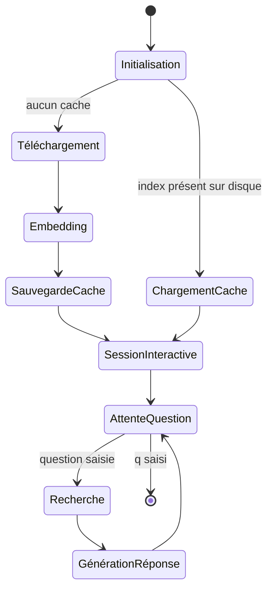

<!--
TEMPLATE — Documentation fonctionnelle
=======================================
Public cible : (1) une IA qui doit comprendre POURQUOI un comportement existe avant de
le modifier, (2) un humain (PO, dev qui arrive, support) qui veut connaître les règles
métier sans lire le code.

Ce document est la VOIX DU MÉTIER — pas du code. Il décrit ce que le produit fait, pour
qui, dans quelles conditions, avec quelles règles. Le HOW (techno, archi) vit dans
[architecture.md](architecture.md). Le QUOI (signatures) vit dans [contracts.md](contracts.md).

Garde-fous :
- Pas de jargon technique ici. Si un terme technique est nécessaire, soit on l'explique,
  soit on renvoie au glossaire.
- Une règle métier doit être tracée à un cas d'usage et idéalement à un test fonctionnel.
- Les hors-scope (« ce que le produit NE fait PAS ») sont aussi importants que les scopes —
  ils évitent de sur-interpréter.

Bloc « Mode d'emploi » en fin de fichier.
-->

# Documentation fonctionnelle — RAG

| Champ | Valeur |
|---|---|
| **Dernière mise à jour** | 2026-05-24 |
| **Mise à jour par** | agent IA |
| **PR de référence** | (à confirmer) |
| **Owner produit** | (à confirmer) |
| **Statut** | Brouillon |

> **Pitch en 1 phrase** : Système de question-réponse interactif en ligne de commande qui charge un PDF depuis une URL, l'indexe avec des embeddings HuggingFace, et répond aux questions en langage naturel via Gemini 2.5 Flash.

---

## 1. Vision et raison d'être

### 1.1 Problème adressé

Interroger un document PDF long (par exemple un article de recherche) en langage naturel est fastidieux : il faut parcourir manuellement des dizaines de pages. Ce système permet de poser des questions directement sur le contenu d'un PDF accessible en ligne et d'obtenir une réponse synthétique en quelques secondes, sans lecture préalable du document.

### 1.2 Bénéfices clés

| Pour | Bénéfice | Mesuré par |
|---|---|---|
| Utilisateur CLI | Obtenir une réponse précise sur un PDF sans le lire intégralement | Pertinence de la réponse (à confirmer) |
| Développeur / chercheur | Réutiliser l'index mis en cache pour des sessions ultérieures sans re-télécharger ni re-embedder | Temps d'initialisation à partir du cache (à confirmer) |

### 1.3 Hors-scope

> Ce que le produit ne fait PAS — délibérément. Inclure les fonctionnalités souvent confondues avec ce produit.

| Ce qui est hors-scope | Pourquoi | Alternative |
|---|---|---|
| Chargement d'un PDF depuis le système de fichiers local | Le système accepte uniquement des URLs | Modifier `pdf_url` dans `main.py` pour pointer vers un serveur local |
| Interface graphique ou API web | Application CLI uniquement | (à confirmer) |
| Indexation de plusieurs documents simultanément | Une seule URL PDF par session | (à confirmer) |
| Modification ou annotation du PDF | Lecture seule | (à confirmer) |

---

## 2. Personas et utilisateurs

| Persona | Rôle | Fréquence d'usage | Objectif principal | Compétences attendues |
|---|---|---|---|---|
| **Utilisateur CLI** | Chercheur, développeur ou tout utilisateur posant des questions sur un PDF | Ponctuel / régulier | Obtenir des réponses précises sur le contenu d'un PDF | Savoir lancer un script Python en ligne de commande |

> Pour chaque persona, lister les **cas d'usage prioritaires** dans §3.

---

## 3. Cas d'usage

### 3.1 Carte des cas d'usage

| ID | Cas d'usage | Persona | Fréquence | Criticité |
|---|---|---|---|---|
| UC-01 | Poser une question sur un PDF (première utilisation — index construit) | Utilisateur CLI | Ponctuel | Critique |
| UC-02 | Poser une question sur un PDF (utilisation suivante — index en cache) | Utilisateur CLI | Régulier | Critique |
| UC-03 | Quitter la session interactive | Utilisateur CLI | Systématique | Standard |

### 3.2 Détail par cas d'usage

> Un bloc par UC critique. Forme abrégée pour les UC standards.

#### UC-01 — Poser une question sur un PDF (première utilisation)

| Méta | Valeur |
|---|---|
| **Persona** | Utilisateur CLI |
| **Pré-conditions** | URL du PDF accessible ; variables d'environnement Gemini configurées (à confirmer) |
| **Post-conditions** | Index vectoriel persisté dans `./storage/<md5_url>/` ; réponse affichée dans le terminal |
| **Déclencheur** | Lancement de `python main.py` puis saisie d'une question |
| **Fréquence** | Ponctuel (une fois par PDF) |
| **Volumétrie** | (à confirmer) |
| **SLA** | (à confirmer) — dépend du téléchargement du PDF et de la durée d'embedding |
| **Endpoint(s) / écran(s)** | Interface CLI — `main.py` |
| **Règles métier appliquées** | RG-01, RG-02 (voir §4) |

**Scénario nominal**

1. L'utilisateur lance `python main.py`.
2. Le système télécharge le PDF depuis `https://arxiv.org/pdf/2005.11401.pdf`.
3. Le système segmente le texte en chunks (512 tokens, overlap 50) et génère les embeddings via `BAAI/bge-small-en-v1.5`.
4. L'index vectoriel est sauvegardé dans `./storage/<md5_url>/`.
5. Le système affiche l'invite `Your question:`.
6. L'utilisateur saisit une question en langage naturel.
7. Le moteur récupère les 3 passages les plus similaires (`similarity_top_k=3`) et génère une réponse via Gemini 2.5 Flash.
8. La réponse est affichée ; retour à l'étape 5.

**Scénarios alternatifs**

| Variante | Condition | Comportement |
|---|---|---|
| UC-02 — Cache existant | `./storage/<md5_url>/` existe déjà | Le téléchargement et l'embedding sont ignorés ; l'index est chargé depuis le disque |

**Cas d'erreur métier**

| Cas | Détection | Message utilisateur | Effet |
|---|---|---|---|
| URL inaccessible | Étape 2 | (à confirmer — exception non gérée explicitement) | Crash du programme |
| Clé API Gemini absente | Étape 7 | (à confirmer) | Crash du programme |

**Pièges connus**

- ⚠️ L'URL du PDF est codée en dur dans `main.py:8` — changer de document nécessite une modification du code source.
- ⚠️ Le cache est basé sur un hash MD5 de l'URL, non du contenu : si le PDF change à la même URL, le cache obsolète sera réutilisé.

#### UC-03 — Quitter la session interactive

| Méta | Valeur |
|---|---|
| **Persona** | Utilisateur CLI |
| **Pré-conditions** | Session interactive en cours |
| **Post-conditions** | Programme terminé |
| **Déclencheur** | Saisie de `q` à l'invite |
| **Fréquence** | Systématique (fin de chaque session) |
| **Règles métier appliquées** | RG-03 |

**Scénario nominal**

1. À l'invite `Your question:`, l'utilisateur saisit `q`.
2. La boucle interactive se termine ; le programme s'arrête normalement.

---

## 4. Règles de gestion

> Toute règle métier nommée. Une RG = une assertion sur le système, formulée en langage métier, idéalement testable.

### 4.1 Catalogue

| ID | Nom | Domaine | Cas d'usage liés | Statut |
|---|---|---|---|---|
| RG-01 | Cache par hash URL | Indexation | UC-01, UC-02 | Active |
| RG-02 | Retrieval top-k=3 | Recherche sémantique | UC-01, UC-02 | Active |
| RG-03 | Sortie par mot-clé `q` | Interaction CLI | UC-03 | Active |

### 4.2 Détail par règle

#### RG-01 — Cache par hash URL

- **Énoncé** : Si un index vectoriel existe déjà pour cette URL (identifiée par son hash MD5), le système le charge depuis le disque sans re-télécharger ni re-embedder le PDF.
- **Pré-conditions** : Le répertoire `./storage/index_<md5>/` existe sur le disque.
- **Effet** : Initialisation accélérée ; les embeddings ne sont pas recalculés.
- **Origine** : Décision technique — éviter le coût de re-embedding à chaque lancement.
- **Implémentation** : [rag_engine.py:32-37](rag_engine.py#L32)
- **Tests fonctionnels** : (à confirmer)
- **Évolutions** :
  | Date | PR | Changement |
  |---|---|---|
  | 2026-05-24 | (à confirmer) | Création |

#### RG-02 — Retrieval top-k=3

- **Énoncé** : Pour chaque question, le moteur récupère exactement les 3 passages du document les plus similaires sémantiquement avant de générer la réponse.
- **Pré-conditions** : Index vectoriel chargé.
- **Effet** : La réponse générée est fondée sur au maximum 3 extraits du PDF.
- **Origine** : Décision technique — compromis entre précision et coût d'inférence.
- **Implémentation** : [rag_engine.py:54](rag_engine.py#L54)
- **Tests fonctionnels** : (à confirmer)
- **Évolutions** :
  | Date | PR | Changement |
  |---|---|---|
  | 2026-05-24 | (à confirmer) | Création |

#### RG-03 — Sortie par mot-clé `q`

- **Énoncé** : La saisie de `q` (insensible à la casse) à l'invite met fin à la session interactive.
- **Pré-conditions** : Session interactive en cours.
- **Effet** : La boucle `while True` se termine ; le programme s'arrête.
- **Origine** : Convention CLI standard.
- **Implémentation** : [main.py:16-17](main.py#L16)
- **Tests fonctionnels** : (à confirmer)
- **Évolutions** :
  | Date | PR | Changement |
  |---|---|---|
  | 2026-05-24 | (à confirmer) | Création |

---

## 5. Workflows et machines à états

### 5.1 Session RAG

| Transition | Acteur | Pré-condition | Effet | Règles appliquées |
|---|---|---|---|---|
| `Initialisation → ChargementCache` | Système | `./storage/index_<md5>/` existe | Index chargé depuis disque | RG-01 |
| `Initialisation → Téléchargement` | Système | Aucun cache | PDF téléchargé depuis l'URL | — |
| `AttenteQuestion → Recherche` | Utilisateur CLI | Question saisie (≠ `q`) | 3 passages récupérés | RG-02 |
| `AttenteQuestion → [*]` | Utilisateur CLI | Saisie de `q` | Fin de session | RG-03 |

**Invariants** :

- Le cache est en lecture seule après création — il n'est jamais mis à jour automatiquement si le PDF source change.

---

## 6. Données métier de référence

> Référentiels et énumérations qui ont une signification métier. Le détail technique vit dans [data-model.md](data-model.md).

| Référentiel | Valeurs | Source de vérité | Mise à jour |
|---|---|---|---|
| **URL PDF par défaut** | `https://arxiv.org/pdf/2005.11401.pdf` | `main.py:8` | Manuel (modification du code) |
| **Modèle d'embedding** | `BAAI/bge-small-en-v1.5` (HuggingFace) | `text_processor.py:14` | Manuel |
| **Modèle LLM** | Gemini 2.5 Flash | `gemini_client.py` (à confirmer) | Manuel |
| **Taille de chunk** | 512 tokens, overlap 50 | `text_processor.py:16-17` | Manuel |
| **Commandes de sortie CLI** | `q` | `main.py:16` | Manuel |

---

## 7. Cas limites et pathologiques

> Comportements aux extrémités du fonctionnel. Ces cas sont la principale source de bugs en production — les documenter explicitement.

| Cas | Comportement attendu | Justification |
|---|---|---|
| **PDF inaccessible** | Crash non géré (exception Python) | Aucune gestion d'erreur explicite sur le téléchargement (à confirmer) |
| **PDF très volumineux** | Embedding long, potentiellement hors mémoire | Pas de limite de taille documentée (à confirmer) |
| **Question vide** | Transmise au moteur — réponse potentiellement incohérente | La validation de l'entrée n'est pas implémentée |
| **Cache corrompu** | Crash au chargement de l'index | Aucune vérification d'intégrité du cache (à confirmer) |
| **PDF sans texte extractible (scanné)** | Aucun document indexé — réponses vides | Dépend du loader PDF (à confirmer) |
| **Même URL, contenu modifié** | Cache obsolète réutilisé — réponses basées sur l'ancien contenu | Le cache est lié à l'URL, pas au contenu (RG-01) |

---

## 8. Conformité et contraintes externes

| Contrainte | Origine | Implémentation |
|---|---|---|
| Licence du modèle d'embedding | `BAAI/bge-small-en-v1.5` — licence MIT (à confirmer) | Utilisation via HuggingFace |
| Conditions d'utilisation Gemini API | Google — quota et facturation selon usage | `gemini_client.py` (à confirmer) |
| Droits d'accès au PDF source | Dépend de la source (ex. arXiv : accès libre) | Responsabilité de l'utilisateur |

---

## 9. KPIs et indicateurs métier

| KPI | Définition | Cible | Source | Dashboard |
|---|---|---|---|---|
| Temps d'initialisation (première session) | Durée entre le lancement et la première invite | (à confirmer) | Logs console | (à confirmer) |
| Temps d'initialisation (cache) | Durée entre le lancement et la première invite avec index en cache | (à confirmer) | Logs console | (à confirmer) |
| Temps de réponse par question | Durée entre la saisie et l'affichage de la réponse | (à confirmer) | Logs console | (à confirmer) |

> Note : ces KPIs orientent les décisions produit. Toute fonctionnalité majeure devrait s'y rattacher.

---

## 10. Roadmap et évolutions notables

> Historique compressé : grands jalons fonctionnels passés et à venir. Pas un changelog détaillé (qui vit dans `CHANGELOG.md` ou les releases).

### 10.1 Jalons passés

| Date | Version | Évolution majeure | PR / RFC |
|---|---|---|---|
| 2026-05-24 | (à confirmer) | Mise en place initiale : RAGEngine avec cache, embedding HuggingFace, LLM Gemini, interface CLI interactive | (à confirmer) |

### 10.2 À venir (haut niveau)

| Échéance | Évolution | Statut |
|---|---|---|
| (à confirmer) | (à confirmer) | (à confirmer) |

---

## 11. Questions ouvertes côté métier

> Décisions fonctionnelles non tranchées. Distinct des questions techniques (qui vivent dans le glossaire ou les ADR).

| # | Question | Impact si non tranché | Owner | Ouverte depuis |
|---|---|---|---|---|
| QF-01 | L'URL du PDF doit-elle être configurable sans modifier le code (argument CLI, fichier de config) ? | Limite l'usage à un seul document par défaut | (à confirmer) | 2026-05-24 |
| QF-02 | Faut-il gérer explicitement les erreurs réseau et les PDF invalides ? | Crashes non contrôlés en production | (à confirmer) | 2026-05-24 |

---

## Références

- Vue d'ensemble système : [architecture.md](architecture.md)
- Endpoints / interfaces qui matérialisent les UC : [contracts.md](contracts.md)
- Données qui supportent les règles : [data-model.md](data-model.md)
- Vocabulaire métier détaillé : [glossaire.md](glossaire.md)
- Décisions produit historiques : (à confirmer)
- Backlog : (à confirmer)

---

<!--
MODE D'EMPLOI DU TEMPLATE
=========================

POUR L'IA QUI MET À JOUR CE FICHIER

⚠️ La doc fonctionnelle est la PLUS DIFFICILE à maintenir par une IA seule — elle décrit
l'INTENTION, qui n'est pas dans le code. L'IA doit ÊTRE PRUDENTE et ne pas inventer du
sens. Si une PR introduit un comportement nouveau dont l'intention n'est pas claire,
laisser un placeholder et SIGNALER dans la PR plutôt que deviner.

Déclencheurs :

| Modification dans la PR | Sections à relire |
|---|---|
| Nouveau parcours utilisateur / endpoint exposé à un humain | §3 (carte + détail) |
| Nouveau persona ou rôle | §2 |
| Nouvelle règle de validation / contrainte métier | §4 |
| Modification d'un état possible / d'une transition | §5 |
| Nouvelle énumération / référentiel métier | §6 |
| Nouveau cas pathologique géré (ou bug fix significatif) | §7 |
| Conformité (RGPD, accessibilité, audit) | §8 |
| Nouveau KPI suivi | §9 |
| Lancement / dépréciation d'une feature majeure | §10.1 |
| Décision produit en attente | §11 |

Règles spéciales :
- Toute RG-XX nouvelle DOIT pointer vers une implémentation et un test (sinon, signalement
  en PR — c'est une RG « orpheline »).
- Si un UC change de comportement nominal, ajouter une ligne dans son sous-bloc « Évolutions »
  (à créer au besoin), ne pas réécrire silencieusement le scénario.
- Les hors-scope §1.3 vieillissent : si une fonctionnalité hors-scope devient scope, la
  retirer de §1.3 ET la documenter dans §3.

Auto-checks :
- [ ] Chaque RG citée dans un UC §3 existe dans §4.
- [ ] Chaque RG §4 cite une implémentation et un test.
- [ ] Chaque transition §5 a une ligne de tableau associée.
- [ ] Le pitch §0 est à jour avec la dernière évolution majeure §10.1.
- [ ] Aucune QF-XX § 11 ouverte depuis > 90 jours sans note de réunion.

POUR LE RELECTEUR HUMAIN (idéalement le PO ou un expert métier)

- Le doc doit pouvoir être lu par un nouvel arrivant non technique en 30 minutes.
- Vérifier que les RG ne sont pas « techniques déguisées » (ex. « le timeout est de 5s »
  est une contrainte non-fonctionnelle, pas une RG).
- Les KPIs §9 doivent provenir d'un dashboard existant, pas être souhaitables.
- Les hors-scope §1.3 méritent un challenge périodique.

POUR ADAPTER À UN AUTRE PROJET

1. C'est le template le plus PROJET-DÉPENDANT. Pour un produit B2C avec écrans : §3 est
   structuré par parcours utilisateur. Pour un service technique B2B : §3 est structuré par
   intégration partenaire.
2. Si le système est purement technique sans utilisateur final (ex. lib, infra) :
   - §2 = systèmes consommateurs.
   - §3 = scénarios d'intégration.
   - §5 et §9 peuvent disparaître.
3. Pour un système legacy en migration : ajouter une section « Comportements à reproduire
   à l'identique » et « Comportements connus non reproduits (et pourquoi) ».
4. Si le projet a une **forte dimension réglementaire** (banque, santé, public) : §8 prend
   beaucoup de place, mériter sa propre subdivision.
-->
