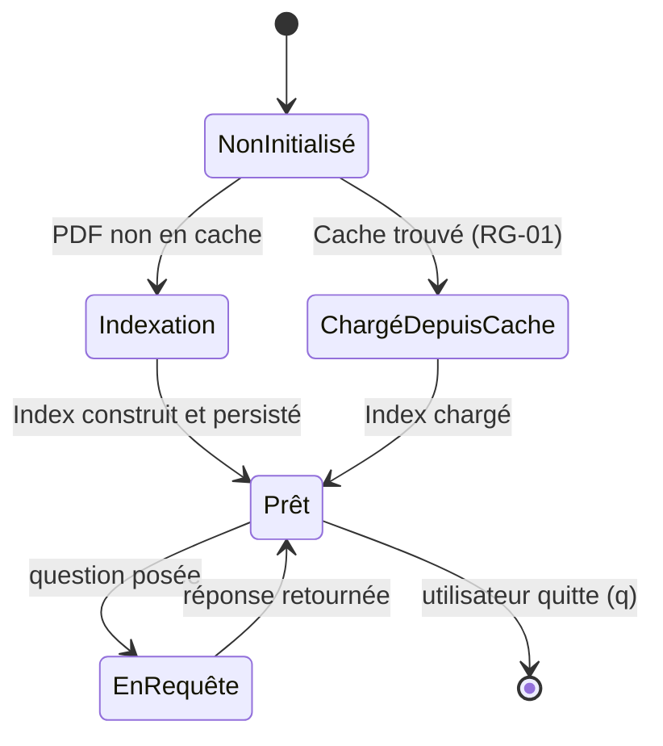

<!--
TEMPLATE — Documentation fonctionnelle
=======================================
Public cible : (1) une IA qui doit comprendre POURQUOI un comportement existe avant de
le modifier, (2) un humain (PO, dev qui arrive, support) qui veut connaître les règles
métier sans lire le code.

Ce document est la VOIX DU MÉTIER — pas du code. Il décrit ce que le produit fait, pour
qui, dans quelles conditions, avec quelles règles. Le HOW (techno, archi) vit dans
[architecture.md](architecture.md). Le QUOI (signatures) vit dans [contracts.md](contracts.md).

Garde-fous :
- Pas de jargon technique ici. Si un terme technique est nécessaire, soit on l'explique,
  soit on renvoie au glossaire.
- Une règle métier doit être tracée à un cas d'usage et idéalement à un test fonctionnel.
- Les hors-scope (« ce que le produit NE fait PAS ») sont aussi importants que les scopes —
  ils évitent de sur-interpréter.

Bloc « Mode d'emploi » en fin de fichier.
-->

# Documentation fonctionnelle — RAG

| Champ | Valeur |
|---|---|
| **Dernière mise à jour** | 2026-05-21 |
| **Mise à jour par** | agent IA (doc-patcher) |
| **PR de référence** | (à confirmer) |
| **Owner produit** | (à confirmer) |
| **Statut** | Brouillon |

> **Pitch en 1 phrase** : Système de question-réponse qui indexe des documents PDF via des embeddings sémantiques et génère des réponses contextuelles grâce au LLM Gemini de Google.

---

## 1. Vision et raison d'être

### 1.1 Problème adressé

Interroger manuellement un document PDF long est fastidieux et peu précis. Ce système permet d'extraire automatiquement la réponse à une question en langage naturel à partir du contenu d'un PDF, sans que l'utilisateur ait à lire l'intégralité du document. Le moteur indexe une fois le document, puis répond à toutes les questions suivantes depuis le cache.

### 1.2 Bénéfices clés

| Pour | Bénéfice | Mesuré par |
|---|---|---|
| **Utilisateur CLI** | Obtenir une réponse précise à partir d'un PDF sans le lire intégralement | Pertinence de la réponse Gemini |
| **Développeur** | Ré-utiliser l'index sans re-télécharger ni re-encoder le PDF | Temps de démarrage après premier run |

### 1.3 Hors-scope

> Ce que le produit ne fait PAS — délibérément. Inclure les fonctionnalités souvent confondues avec ce produit.

| Ce qui est hors-scope | Pourquoi | Alternative |
|---|---|---|
| Indexation de sources autres que PDF | Le chargeur est spécialisé PDF (`pdf_loader.py`) | Adapter le loader pour d'autres formats |
| Interface web / API REST | Produit CLI uniquement | Encapsuler dans un serveur FastAPI (à confirmer) |
| Multi-documents dans une même session | Un seul PDF par instance `RAGEngine` | Instancier plusieurs moteurs |
| Mise à jour incrémentale de l'index | L'index est reconstruit ou chargé en entier | Supprimer le cache pour forcer la reconstruction |

---

## 2. Personas et utilisateurs

| Persona | Rôle | Fréquence d'usage | Objectif principal | Compétences attendues |
|---|---|---|---|---|
| **Utilisateur CLI** | Toute personne souhaitant interroger un PDF | Ponctuel / quotidien | Obtenir des réponses en langage naturel depuis un PDF | Savoir lancer `python main.py` |
| **Développeur intégrateur** | Dev qui intègre `RAGEngine` dans une application | Ponctuel | Indexer un PDF et interroger l'index par code | Python, LlamaIndex (à confirmer) |

> Pour chaque persona, lister les **cas d'usage prioritaires** dans §3.

---

## 3. Cas d'usage

### 3.1 Carte des cas d'usage

| ID | Cas d'usage | Persona | Fréquence | Criticité |
|---|---|---|---|---|
| UC-01 | Indexer un PDF depuis une URL | Utilisateur CLI / Développeur | Ponctuel (premier run) | Critique |
| UC-02 | Poser une question sur un PDF déjà indexé | Utilisateur CLI | Quotidien | Critique |
| UC-03 | Réutiliser un index existant (cache) | Utilisateur CLI / Développeur | Quotidien | Standard |
| UC-04 | Générer du texte sans contexte RAG | Développeur intégrateur | Ponctuel | Standard |
| UC-05 | Résumer un texte arbitraire | Développeur intégrateur | Ponctuel | Standard |
| UC-06 | Reclasser des passages par pertinence (reranking LLM) | Développeur intégrateur | Ponctuel | Standard |

### 3.2 Détail par cas d'usage

> Un bloc par UC critique. Forme abrégée pour les UC standards.

#### UC-01 — Indexer un PDF depuis une URL

| Méta | Valeur |
|---|---|
| **Persona** | Utilisateur CLI |
| **Pré-conditions** | URL valide d'un PDF accessible, clé API Google configurée dans `config.py`, connexion internet disponible |
| **Post-conditions** | Index persisté dans `./storage/index_<md5_url>/` ; moteur de requête prêt |
| **Déclencheur** | Lancement de `python main.py` avec une URL non encore indexée |
| **Fréquence** | Une fois par PDF |
| **Volumétrie** | (à confirmer) |
| **SLA** | Dépend de la taille du PDF et de la vitesse réseau (à confirmer) |
| **Endpoint(s) / écran(s)** | CLI — `main.py` |
| **Règles métier appliquées** | RG-01, RG-02 |

**Scénario nominal**

1. L'utilisateur lance `python main.py`.
2. Le moteur calcule le hash MD5 de l'URL et vérifie l'absence de cache dans `./storage/`.
3. Le PDF est téléchargé depuis l'URL.
4. Le contenu est découpé en chunks de 512 tokens avec un recouvrement de 50 tokens.
5. Les embeddings sont générés via `BAAI/bge-small-en-v1.5`.
6. L'index vectoriel est construit et persisté sur disque.
7. Le moteur entre en mode interactif.

**Scénarios alternatifs**

| Variante | Condition | Comportement |
|---|---|---|
| Cache existant (UC-03) | Le dossier `./storage/index_<hash>/` existe déjà | Étapes 3 à 6 sautées ; index chargé depuis disque |

**Cas d'erreur métier**

| Cas | Détection | Message utilisateur | Effet |
|---|---|---|---|
| URL invalide ou PDF inaccessible | Échec du téléchargement | Exception propagée depuis `pdf_loader.py` | Arrêt du programme |
| Clé API Google absente | Initialisation Gemini échoue | Exception depuis `gemini_client.py` | Arrêt du programme |

**Pièges connus**

- ⚠️ Le cache est identifié par hash MD5 de l'URL uniquement — si le contenu du PDF à l'URL change, l'ancien index est réutilisé sans avertissement.

---

#### UC-02 — Poser une question sur un PDF indexé

| Méta | Valeur |
|---|---|
| **Persona** | Utilisateur CLI |
| **Pré-conditions** | UC-01 ou UC-03 complété ; moteur en mode interactif |
| **Post-conditions** | Réponse affichée dans le terminal |
| **Déclencheur** | Saisie d'une question dans le prompt `Your question:` |
| **Fréquence** | Multiple fois par session |
| **Volumétrie** | (à confirmer) |
| **SLA** | (à confirmer — dépend de la latence Gemini) |
| **Endpoint(s) / écran(s)** | CLI — `main.py` |
| **Règles métier appliquées** | RG-03 |

**Scénario nominal**

1. L'utilisateur saisit sa question.
2. Le moteur effectue une recherche sémantique et récupère les 3 chunks les plus pertinents (`similarity_top_k=3`).
3. Gemini génère une réponse en mode `compact` à partir des chunks récupérés.
4. La réponse est affichée dans le terminal.
5. Le prompt se ré-affiche pour une nouvelle question.

**Scénarios alternatifs**

| Variante | Condition | Comportement |
|---|---|---|
| Quitter la session | L'utilisateur saisit `q` | La boucle s'arrête proprement |

**Cas d'erreur métier**

| Cas | Détection | Message utilisateur | Effet |
|---|---|---|---|
| Question hors-sujet du document | Aucun chunk pertinent trouvé | Réponse Gemini indiquant l'absence de contexte (à confirmer) | Aucun — la session continue |

**Pièges connus**

- ⚠️ Seul `q` (minuscule) déclenche la sortie — `quit`, `exit`, `Q` ne fonctionnent pas.

---

#### UC-04 — Générer du texte sans contexte RAG

| Méta | Valeur |
|---|---|
| **Persona** | Développeur intégrateur |
| **Pré-conditions** | Clé API Google configurée ; `gemini_client` initialisé |
| **Post-conditions** | Texte généré retourné en chaîne |
| **Déclencheur** | Appel à `generate_text(prompt, temperature)` depuis le code |
| **Règles métier appliquées** | RG-04 |

**Scénario nominal**

1. Le développeur appelle `generate_text(prompt)`.
2. Si `temperature` est fourni, une instance Gemini temporaire est créée sans remplacer le singleton global.
3. Gemini génère et retourne la réponse textuelle.

**Cas d'erreur métier**

| Cas | Détection | Effet |
|---|---|---|
| Prompt vide ou blanc | `ValueError` levée avant tout appel réseau | Arrêt immédiat |

---

#### UC-05 — Résumer un texte arbitraire

| Méta | Valeur |
|---|---|
| **Persona** | Développeur intégrateur |
| **Pré-conditions** | Clé API Google configurée |
| **Post-conditions** | Résumé d'environ `max_words` mots retourné |
| **Déclencheur** | Appel à `summarize(text, max_words=150)` depuis le code |
| **Règles métier appliquées** | RG-05 |

**Scénario nominal**

1. Le développeur appelle `summarize(text)`.
2. Un prompt est construit demandant un résumé en `max_words` mots (défaut : 150).
3. `generate_text` est appelé en interne ; le résumé est retourné.

**Cas d'erreur métier**

| Cas | Détection | Effet |
|---|---|---|
| Texte vide ou blanc | `ValueError` levée avant tout appel réseau | Arrêt immédiat |

---

#### UC-06 — Reclasser des passages par pertinence (reranking LLM)

| Méta | Valeur |
|---|---|
| **Persona** | Développeur intégrateur |
| **Pré-conditions** | Clé API Google configurée ; liste de passages non vide |
| **Post-conditions** | Passages retournés dans l'ordre du plus au moins pertinent selon Gemini |
| **Déclencheur** | Appel à `rerank_passages(query, passages)` depuis le code |
| **Règles métier appliquées** | RG-06 |

**Scénario nominal**

1. Le développeur appelle `rerank_passages(query, passages)`.
2. Les passages sont présentés à Gemini numérotés ; le modèle retourne l'ordre préféré sous forme de liste CSV (ex. `3,1,2`).
3. La liste est parsée et les passages sont retournés dans le nouvel ordre.

**Scénarios alternatifs**

| Variante | Condition | Comportement |
|---|---|---|
| Liste vide | `passages == []` | Retourne `[]` immédiatement sans appel API |
| Échec de parsing | Réponse Gemini non parsable ou indices hors-plage | Retour à l'ordre original (`passages`) |

**Pièges connus**

- ⚠️ Le reranking utilise Gemini à `temperature=0.0` mais reste non-déterministe en cas de réponse mal formatée — le fallback silencieux sur l'ordre original peut masquer des erreurs.

---

## 4. Règles de gestion

> Toute règle métier nommée. Une RG = une assertion sur le système, formulée en langage métier, idéalement testable.

### 4.1 Catalogue

| ID | Nom | Domaine | Cas d'usage liés | Statut |
|---|---|---|---|---|
| RG-01 | Déduplication par hash URL | Indexation | UC-01, UC-03 | Active |
| RG-02 | Chunking fixe 512 / overlap 50 | Traitement texte | UC-01 | Active |
| RG-03 | Retrieval top-k = 3 | Requête | UC-02 | Active |
| RG-04 | Génération sans RAG — prompt direct Gemini | Génération LLM | UC-04 | Active |
| RG-05 | Résumé avec cible `max_words` (défaut 150) | Génération LLM | UC-05 | Active |
| RG-06 | Reranking zero-shot via liste CSV Gemini | Requête / Génération LLM | UC-06 | Active |

### 4.2 Détail par règle

#### RG-01 — Déduplication par hash URL

- **Énoncé** : Si un index dont le nom correspond au hash MD5 de l'URL existe déjà sur disque, le moteur le charge sans re-télécharger ni re-encoder le PDF.
- **Pré-conditions** : Dossier `./storage/index_<md5>/` présent sur le système de fichiers.
- **Effet** : Aucune requête réseau ni calcul d'embedding au démarrage.
- **Origine** : Décision de conception pour réduire le temps de démarrage et les coûts d'API.
- **Implémentation** : [rag_engine.py:33-37](../rag_engine.py)
- **Tests fonctionnels** : (à confirmer)
- **Évolutions** :
  | Date | PR | Changement |
  |---|---|---|
  | 2026-05-21 | (à confirmer) | Création |

#### RG-02 — Chunking fixe 512 / overlap 50

- **Énoncé** : Chaque document PDF est découpé en chunks de 512 tokens maximum avec un recouvrement de 50 tokens entre chunks consécutifs.
- **Pré-conditions** : S'applique à tout PDF indexé pour la première fois.
- **Effet** : Granularité sémantique uniforme pour la recherche vectorielle.
- **Origine** : Configuration explicite dans `text_processor.py` — valeur choisie par le développeur.
- **Implémentation** : [text_processor.py:14-19](../text_processor.py)
- **Tests fonctionnels** : (à confirmer)
- **Évolutions** :
  | Date | PR | Changement |
  |---|---|---|
  | 2026-05-21 | (à confirmer) | Création |

#### RG-03 — Retrieval top-k = 3

- **Énoncé** : Pour chaque question, le moteur récupère les 3 chunks les plus proches sémantiquement et les transmet à Gemini pour générer la réponse.
- **Pré-conditions** : Index vectoriel chargé et moteur de requête initialisé.
- **Effet** : Fenêtre de contexte limitée à 3 chunks en mode `compact`.
- **Origine** : Paramètre fixe dans `rag_engine.py` — compromis précision / latence.
- **Implémentation** : [rag_engine.py:54](../rag_engine.py)
- **Tests fonctionnels** : (à confirmer)
- **Évolutions** :
  | Date | PR | Changement |
  |---|---|---|
  | 2026-05-21 | (à confirmer) | Création |

#### RG-04 — Génération sans RAG — prompt direct Gemini

- **Énoncé** : `generate_text` envoie un prompt directement à Gemini sans passer par l'index vectoriel. Si `temperature` est spécifié, une instance temporaire est créée sans remplacer le singleton global.
- **Pré-conditions** : Prompt non vide ; clé API disponible.
- **Effet** : Texte généré retourné ; singleton inchangé si `temperature` est fourni.
- **Origine** : Besoin de génération ad-hoc hors pipeline RAG.
- **Implémentation** : [gemini_client.py:55-82](../gemini_client.py)
- **Tests fonctionnels** : (à confirmer)
- **Évolutions** :
  | Date | PR | Changement |
  |---|---|---|
  | 2026-05-21 | (à confirmer) | Création |

#### RG-05 — Résumé avec cible `max_words` (défaut 150)

- **Énoncé** : `summarize` construit un prompt demandant à Gemini un résumé en `max_words` mots (défaut : 150). La longueur est indicative — Gemini peut s'en écarter légèrement.
- **Pré-conditions** : Texte non vide.
- **Effet** : Résumé retourné ; aucun état modifié.
- **Origine** : Faciliter la condensation de textes longs avant ou après récupération.
- **Implémentation** : [gemini_client.py:85-106](../gemini_client.py)
- **Tests fonctionnels** : (à confirmer)
- **Évolutions** :
  | Date | PR | Changement |
  |---|---|---|
  | 2026-05-21 | (à confirmer) | Création |

#### RG-06 — Reranking zero-shot via liste CSV Gemini

- **Énoncé** : `rerank_passages` soumet les passages numérotés à Gemini à `temperature=0.0` et attend une liste CSV d'indices ordonnés par pertinence. En cas d'échec de parsing ou d'indices invalides, l'ordre d'entrée est conservé.
- **Pré-conditions** : Liste de passages non vide.
- **Effet** : Passages retournés du plus au moins pertinent ; en cas d'erreur, ordre original préservé silencieusement.
- **Origine** : Améliorer la précision du contexte transmis à Gemini après retrieval vectoriel.
- **Implémentation** : [gemini_client.py:109-149](../gemini_client.py)
- **Tests fonctionnels** : (à confirmer)
- **Évolutions** :
  | Date | PR | Changement |
  |---|---|---|
  | 2026-05-21 | (à confirmer) | Création |

---

## 5. Workflows et machines à états

### 5.1 RAGEngine — cycle de vie de l'index

| Transition | Acteur | Pré-condition | Effet | Règles appliquées |
|---|---|---|---|---|
| `NonInitialisé → Indexation` | Système | Cache absent | Téléchargement + encoding | RG-02 |
| `NonInitialisé → ChargéDepuisCache` | Système | Cache présent | Chargement depuis disque | RG-01 |
| `Indexation → Prêt` | Système | Index construit | Persistance disque | RG-02 |
| `Prêt → EnRequête` | Utilisateur CLI | Question saisie | Recherche sémantique + appel Gemini | RG-03 |
| `EnRequête → Prêt` | Système | Réponse générée | Affichage réponse | — |

**Invariants** :

- Un `RAGEngine` ne peut interroger qu'un seul PDF par instance.
- Le passage `Prêt → [*]` n'efface pas le cache — l'index reste disponible pour les sessions suivantes.

---

## 6. Données métier de référence

> Référentiels et énumérations qui ont une signification métier. Le détail technique vit dans [data-model.md](data-model.md).

| Référentiel | Valeurs | Source de vérité | Mise à jour |
|---|---|---|---|
| **Modèle d'embedding** | `BAAI/bge-small-en-v1.5` | `text_processor.py` | Manuel (mise à jour du code) |
| **Répertoire de stockage** | `./storage/` (configurable via paramètre `storage_dir`) | `rag_engine.py` | Manuel |
| **Taille de chunk** | 512 tokens | `text_processor.py` | Manuel |
| **Recouvrement de chunk** | 50 tokens | `text_processor.py` | Manuel |
| **Top-k retrieval** | 3 chunks | `rag_engine.py` | Manuel |

---

## 7. Cas limites et pathologiques

> Comportements aux extrémités du fonctionnel. Ces cas sont la principale source de bugs en production — les documenter explicitement.

| Cas | Comportement attendu | Justification |
|---|---|---|
| **PDF vide ou illisible** | Exception propagée lors du chargement | `pdf_loader.py` délègue à pypdf ; comportement non testé explicitement (à confirmer) |
| **PDF très volumineux** | Indexation longue mais fonctionnelle — pas de limite documentée | Dépend de la mémoire disponible pour les embeddings (à confirmer) |
| **Concurrence** | Deux instances écrivant dans le même dossier d'index simultanément peuvent corrompre le cache | Aucun mécanisme de verrouillage implémenté |
| **Reprise après panne** | Si le processus est interrompu pendant la persistance, le dossier d'index peut être partiel | Au redémarrage, LlamaIndex peut échouer à charger l'index — supprimer le dossier manuellement pour forcer la reconstruction |
| **URL identique, PDF modifié** | L'ancien index est réutilisé sans avertissement | RG-01 : le cache est basé sur l'URL, pas le contenu du fichier |
| **Rejeu de question identique** | Appel Gemini refait à chaque fois — pas de cache de réponse | (à confirmer) |

---

## 8. Conformité et contraintes externes

| Contrainte | Origine | Implémentation |
|---|---|---|
| Clé API Google Gemini requise | Conditions d'utilisation Google AI | Stockée dans `config.py` — ne pas versionner ce fichier avec la clé |
| Licence du modèle `BAAI/bge-small-en-v1.5` | MIT (à confirmer) | Modèle téléchargé depuis HuggingFace Hub |
| Données du PDF traitées localement | (à confirmer selon contexte déploiement) | Embeddings persistés dans `./storage/` ; seule la requête Gemini sort du périmètre local |

---

## 9. KPIs et indicateurs métier

| KPI | Définition | Cible | Source | Dashboard |
|---|---|---|---|---|
| Temps de démarrage (cache chaud) | Temps entre lancement et prompt interactif avec cache existant | (à confirmer) | Mesure manuelle | (à confirmer) |
| Temps de démarrage (premier run) | Temps entre lancement et prompt interactif sans cache | (à confirmer) | Mesure manuelle | (à confirmer) |
| Latence de réponse | Temps entre saisie de la question et affichage de la réponse | (à confirmer) | Mesure manuelle | (à confirmer) |

> Note : ces KPIs orientent les décisions produit. Toute fonctionnalité majeure devrait s'y rattacher.

---

## 10. Roadmap et évolutions notables

> Historique compressé : grands jalons fonctionnels passés et à venir. Pas un changelog détaillé (qui vit dans `CHANGELOG.md` ou les releases).

### 10.1 Jalons passés

| Date | Version | Évolution majeure | PR / RFC |
|---|---|---|---|
| (à confirmer) | v1.0 | Lancement : indexation PDF + requête Gemini + cache disque | (à confirmer) |

### 10.2 À venir (haut niveau)

| Échéance | Évolution | Statut |
|---|---|---|
| (à confirmer) | Support multi-documents | Hypothèse |
| (à confirmer) | Interface API REST | Hypothèse |

---

## 11. Questions ouvertes côté métier

> Décisions fonctionnelles non tranchées. Distinct des questions techniques (qui vivent dans le glossaire ou les ADR).

| # | Question | Impact si non tranché | Owner | Ouverte depuis |
|---|---|---|---|---|
| QF-01 | Quel comportement attendu quand Gemini renvoie une réponse vide ou une erreur d'API ? | L'utilisateur voit une exception brute non gérée | (à confirmer) | 2026-05-21 |
| QF-02 | Faut-il supporter d'autres formats de document (DOCX, HTML) ? | Hors-scope actuel mais fréquemment demandé | (à confirmer) | 2026-05-21 |

---

## Références

- Vue d'ensemble système : [architecture.md](architecture.md)
- Endpoints / interfaces qui matérialisent les UC : [contracts.md](contracts.md)
- Données qui supportent les règles : [data-model.md](data-model.md)
- Vocabulaire métier détaillé : [glossaire.md](glossaire.md)
- Décisions produit historiques : (à confirmer)
- Backlog : (à confirmer)

---

<!--
MODE D'EMPLOI DU TEMPLATE
=========================

POUR L'IA QUI MET À JOUR CE FICHIER

⚠️ La doc fonctionnelle est la PLUS DIFFICILE à maintenir par une IA seule — elle décrit
l'INTENTION, qui n'est pas dans le code. L'IA doit ÊTRE PRUDENTE et ne pas inventer du
sens. Si une PR introduit un comportement nouveau dont l'intention n'est pas claire,
laisser un placeholder et SIGNALER dans la PR plutôt que deviner.

Déclencheurs :

| Modification dans la PR | Sections à relire |
|---|---|
| Nouveau parcours utilisateur / endpoint exposé à un humain | §3 (carte + détail) |
| Nouveau persona ou rôle | §2 |
| Nouvelle règle de validation / contrainte métier | §4 |
| Modification d'un état possible / d'une transition | §5 |
| Nouvelle énumération / référentiel métier | §6 |
| Nouveau cas pathologique géré (ou bug fix significatif) | §7 |
| Conformité (RGPD, accessibilité, audit) | §8 |
| Nouveau KPI suivi | §9 |
| Lancement / dépréciation d'une feature majeure | §10.1 |
| Décision produit en attente | §11 |

Règles spéciales :
- Toute RG-XX nouvelle DOIT pointer vers une implémentation et un test (sinon, signalement
  en PR — c'est une RG « orpheline »).
- Si un UC change de comportement nominal, ajouter une ligne dans son sous-bloc « Évolutions »
  (à créer au besoin), ne pas réécrire silencieusement le scénario.
- Les hors-scope §1.3 vieillissent : si une fonctionnalité hors-scope devient scope, la
  retirer de §1.3 ET la documenter dans §3.

Auto-checks :
- [ ] Chaque RG citée dans un UC §3 existe dans §4.
- [ ] Chaque RG §4 cite une implémentation et un test.
- [ ] Chaque transition §5 a une ligne de tableau associée.
- [ ] Le pitch §0 est à jour avec la dernière évolution majeure §10.1.
- [ ] Aucune QF-XX § 11 ouverte depuis > 90 jours sans note de réunion.

POUR LE RELECTEUR HUMAIN (idéalement le PO ou un expert métier)

- Le doc doit pouvoir être lu par un nouvel arrivant non technique en 30 minutes.
- Vérifier que les RG ne sont pas « techniques déguisées » (ex. « le timeout est de 5s »
  est une contrainte non-fonctionnelle, pas une RG).
- Les KPIs §9 doivent provenir d'un dashboard existant, pas être souhaitables.
- Les hors-scope §1.3 méritent un challenge périodique.

POUR ADAPTER À UN AUTRE PROJET

1. C'est le template le plus PROJET-DÉPENDANT. Pour un produit B2C avec écrans : §3 est
   structuré par parcours utilisateur. Pour un service technique B2B : §3 est structuré par
   intégration partenaire.
2. Si le système est purement technique sans utilisateur final (ex. lib, infra) :
   - §2 = systèmes consommateurs.
   - §3 = scénarios d'intégration.
   - §5 et §9 peuvent disparaître.
3. Pour un système legacy en migration : ajouter une section « Comportements à reproduire
   à l'identique » et « Comportements connus non reproduits (et pourquoi) ».
4. Si le projet a une **forte dimension réglementaire** (banque, santé, public) : §8 prend
   beaucoup de place, mériter sa propre subdivision.
-->
