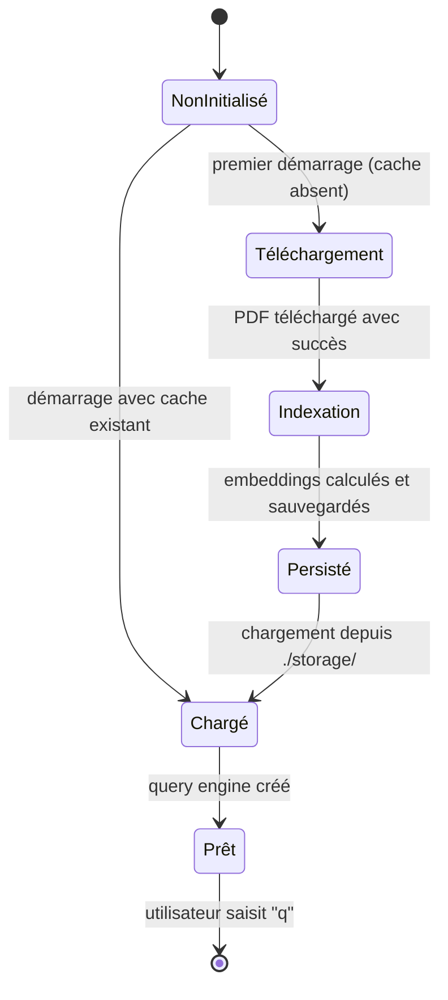

<!--
TEMPLATE — Documentation fonctionnelle
=======================================
Public cible : (1) une IA qui doit comprendre POURQUOI un comportement existe avant de
le modifier, (2) un humain (PO, dev qui arrive, support) qui veut connaître les règles
métier sans lire le code.

Ce document est la VOIX DU MÉTIER — pas du code. Il décrit ce que le produit fait, pour
qui, dans quelles conditions, avec quelles règles. Le HOW (techno, archi) vit dans
[architecture.md](architecture.md). Le QUOI (signatures) vit dans [contracts.md](contracts.md).

Garde-fous :
- Pas de jargon technique ici. Si un terme technique est nécessaire, soit on l'explique,
  soit on renvoie au glossaire.
- Une règle métier doit être tracée à un cas d'usage et idéalement à un test fonctionnel.
- Les hors-scope (« ce que le produit NE fait PAS ») sont aussi importants que les scopes —
  ils évitent de sur-interpréter.

Bloc « Mode d'emploi » en fin de fichier.
-->

# Documentation fonctionnelle — RAG

| Champ | Valeur |
|---|---|
| **Dernière mise à jour** | 2026-05-10 |
| **Mise à jour par** | agent IA |
| **PR de référence** | (à confirmer) |
| **Owner produit** | (à confirmer) |
| **Statut** | Brouillon |

> **Pitch en 1 phrase** : Système de question-réponse intelligent sur documents PDF — télécharge un PDF depuis une URL, le découpe en fragments sémantiques, les indexe dans un vector store, puis répond aux questions en langage naturel grâce à Google Gemini.

---

## 1. Vision et raison d'être

### 1.1 Problème adressé

Les documents PDF (articles de recherche, rapports, manuels) contiennent de l'information dense difficile à explorer manuellement. Un utilisateur souhaitant une réponse précise doit aujourd'hui parcourir l'intégralité du document. Le système RAG automatise cette recherche : il indexe le contenu une seule fois, puis répond en langage naturel à toute question, en citant les passages pertinents récupérés par similarité sémantique.

### 1.2 Bénéfices clés

| Pour | Bénéfice | Mesuré par |
|---|---|---|
| **Utilisateur (chercheur / développeur)** | Obtenir une réponse contextuelle sans lire tout le PDF | Pertinence de la réponse (à confirmer) |
| **Système (re-exécution)** | Réutilisation de l'index sans re-calcul des embeddings | Temps de démarrage à chaud vs à froid |

### 1.3 Hors-scope

> Ce que le produit ne fait PAS — délibérément.

| Ce qui est hors-scope | Pourquoi | Alternative |
|---|---|---|
| Indexation de plusieurs PDF simultanément | Un seul `pdf_url` est accepté par instance `RAGEngine` | Instancier plusieurs `RAGEngine` en parallèle |
| Interfaces graphiques / web | Le produit expose uniquement un CLI interactif | (à confirmer) |
| Ingestion de formats autres que PDF | Seul `PDFReader` est intégré | Adapter `pdf_loader.py` avec un autre reader LlamaIndex |
| Mise à jour incrémentale de l'index | L'index est reconstruit complet lors du premier téléchargement | Supprimer le dossier `./storage/index_<hash>` pour forcer la re-indexation |

---

## 2. Personas et utilisateurs

| Persona | Rôle | Fréquence d'usage | Objectif principal | Compétences attendues |
|---|---|---|---|---|
| **Utilisateur CLI** | Développeur ou chercheur posant des questions sur un PDF | Ponctuel / ad hoc | Obtenir une réponse en langage naturel à partir d'un document PDF | Maîtrise d'un terminal, Python installé |
| **Opérateur (configurateur)** | Développeur paramétrant l'URL du PDF et la clé API Gemini | Ponctuel (mise en place) | Configurer `main.py` et `config.py` pour pointer vers le bon document | Python, lecture du README |

> Pour chaque persona, lister les **cas d'usage prioritaires** dans §3.

---

## 3. Cas d'usage

### 3.1 Carte des cas d'usage

| ID | Cas d'usage | Persona | Fréquence | Criticité |
|---|---|---|---|---|
| UC-01 | Poser une question sur un PDF (session interactive) | Utilisateur CLI | Ponctuel | Critique |
| UC-02 | Configurer le système (URL PDF + clé API) | Opérateur | Ponctuel | Critique |
| UC-03 | Re-utiliser un index existant (chargement depuis le cache) | Utilisateur CLI | Fréquent (re-exécution) | Standard |
| UC-04 | Quitter la session interactive | Utilisateur CLI | Ponctuel | Annexe |

### 3.2 Détail par cas d'usage

> Un bloc par UC critique. Forme abrégée pour les UC standards.

#### UC-01 — Poser une question sur un PDF (session interactive)

| Méta | Valeur |
|---|---|
| **Persona** | Utilisateur CLI |
| **Pré-conditions** | `config.py` contient une `GOOGLE_API_KEY` valide ; `main.py` pointe vers un `pdf_url` accessible |
| **Post-conditions** | La réponse générée par Gemini est affichée dans le terminal ; la session reste ouverte |
| **Déclencheur** | L'utilisateur saisit une question dans le prompt `Your question:` |
| **Fréquence** | Autant de fois que souhaité dans une session |
| **Volumétrie** | (à confirmer) |
| **SLA** | (à confirmer) — dépend du modèle Gemini et du réseau |
| **Endpoint(s) / écran(s)** | CLI — `main.py` → `RAGEngine.query()` |
| **Règles métier appliquées** | RG-01, RG-02 (voir §4) |

**Scénario nominal**

1. L'utilisateur lance `python main.py`.
2. Le moteur RAG s'initialise (chargement ou construction de l'index — voir UC-02 / UC-03).
3. Le prompt `Your question:` s'affiche.
4. L'utilisateur saisit sa question en langage naturel.
5. Le moteur effectue une recherche sémantique (`similarity_top_k=3`) dans le vector index.
6. Les 3 chunks les plus proches sont transmis à Gemini avec la question.
7. Gemini génère une réponse ; le système affiche `Answer: <réponse>`.
8. Le prompt réapparaît pour une nouvelle question.

**Scénarios alternatifs**

| Variante | Condition | Comportement |
|---|---|---|
| Cache disponible (UC-03) | `./storage/index_<md5_url>` existe déjà | L'index est chargé depuis le disque ; aucun téléchargement ni embedding n'est recalculé |

**Cas d'erreur métier**

| Cas | Détection | Message utilisateur | Effet |
|---|---|---|---|
| Clé API Gemini invalide ou absente | Lors de l'initialisation du LLM | Erreur levée par `google-generativeai` | Arrêt de l'application |
| URL PDF inaccessible | Lors du téléchargement HTTP (timeout 30 s) | Exception `requests` non interceptée | Arrêt de l'application |

**Pièges connus**

- ⚠️ La réponse est limitée par la qualité et le découpage du PDF source — un PDF scanné non OCR produira des chunks vides ou incohérents.
- ⚠️ Le `response_mode="compact"` de LlamaIndex peut fusionner les chunks et tronquer les sources si les 3 chunks sont trop longs.

#### UC-02 — Configurer le système

| Méta | Valeur |
|---|---|
| **Persona** | Opérateur |
| **Pré-conditions** | Python 3.10+ installé ; dépendances installées via `pip install -r requirements.txt` |
| **Post-conditions** | `config.py` contient `GOOGLE_API_KEY` ; `main.py` contient le `pdf_url` cible |
| **Déclencheur** | Première mise en place ou changement de document source |
| **Règles métier appliquées** | RG-03 |

**Scénario nominal**

1. L'opérateur édite `config.py` et renseigne `GOOGLE_API_KEY`.
2. L'opérateur édite `main.py` et remplace la valeur de `pdf_url` par l'URL du PDF souhaité.
3. L'opérateur lance `python main.py` pour vérifier l'initialisation.

#### UC-03 — Re-utiliser un index existant (chargement depuis le cache)

Le hash MD5 de l'URL est calculé à chaque démarrage. Si `./storage/index_<hash>` existe, l'index est chargé directement depuis le disque sans re-téléchargement ni re-calcul des embeddings.

#### UC-04 — Quitter la session interactive

L'utilisateur saisit `q` au prompt `Your question:`. La boucle se termine proprement.

---

## 4. Règles de gestion

> Toute règle métier nommée. Une RG = une assertion sur le système, formulée en langage métier, idéalement testable.

### 4.1 Catalogue

| ID | Nom | Domaine | Cas d'usage liés | Statut |
|---|---|---|---|---|
| RG-01 | Recherche sémantique top-k | Retrieval | UC-01 | Active |
| RG-02 | Mode de réponse compact | Génération | UC-01 | Active |
| RG-03 | Cache par hash d'URL | Indexation | UC-02, UC-03 | Active |

### 4.2 Détail par règle

#### RG-01 — Recherche sémantique top-k

- **Énoncé** : Pour chaque question, le système récupère les 3 chunks les plus proches sémantiquement de la question dans le vector index.
- **Pré-conditions** : Le vector index est initialisé et chargé.
- **Effet** : Seuls les 3 fragments les plus pertinents sont transmis à Gemini comme contexte.
- **Origine** : Décision technique — paramètre `similarity_top_k=3` dans `RAGEngine.__init__`.
- **Implémentation** : [rag_engine.py:54](rag_engine.py#L54)
- **Tests fonctionnels** : (à confirmer)
- **Évolutions** :
  | Date | PR | Changement |
  |---|---|---|
  | 2026-05-10 | (à confirmer) | Création |

#### RG-02 — Mode de réponse compact

- **Énoncé** : Les chunks récupérés sont fusionnés en un contexte condensé avant d'être soumis à Gemini (`response_mode="compact"`).
- **Pré-conditions** : Au moins 1 chunk récupéré par RG-01.
- **Effet** : La réponse est plus concise ; les chunks trop longs peuvent être tronqués.
- **Origine** : Décision technique — paramètre `response_mode="compact"` dans `RAGEngine.__init__`.
- **Implémentation** : [rag_engine.py:54](rag_engine.py#L54)
- **Tests fonctionnels** : (à confirmer)
- **Évolutions** :
  | Date | PR | Changement |
  |---|---|---|
  | 2026-05-10 | (à confirmer) | Création |

#### RG-03 — Cache par hash d'URL

- **Énoncé** : L'index est persisté dans `./storage/index_<md5(pdf_url)>`. Si ce répertoire existe au démarrage, le système le charge sans re-télécharger ni re-calculer les embeddings.
- **Pré-conditions** : L'URL du PDF est identique à celle utilisée lors de l'indexation initiale.
- **Effet** : Les runs suivants sont instantanés (pas de téléchargement ni d'embedding). Changer l'URL crée un nouvel index dans un sous-dossier différent.
- **Origine** : Décision technique — `RAGEngine._get_index_path()` utilise `hashlib.md5`.
- **Implémentation** : [rag_engine.py:58-60](rag_engine.py#L58)
- **Tests fonctionnels** : (à confirmer)
- **Évolutions** :
  | Date | PR | Changement |
  |---|---|---|
  | 2026-05-10 | (à confirmer) | Création |

---

## 5. Workflows et machines à états

### 5.1 Index PDF

| Transition | Acteur | Pré-condition | Effet | Règles appliquées |
|---|---|---|---|---|
| `NonInitialisé → Téléchargement` | Système | Cache absent pour l'URL | HTTP GET vers `pdf_url` (timeout 30 s) | RG-03 |
| `NonInitialisé → Chargé` | Système | `./storage/index_<hash>` existe | Index chargé depuis le disque | RG-03 |
| `Téléchargement → Indexation` | Système | PDF valide reçu | Découpage en chunks 512 tokens / overlap 50 ; calcul embeddings `BAAI/bge-small-en-v1.5` | — |
| `Indexation → Persisté` | Système | Embeddings calculés | Sauvegarde dans `./storage/index_<hash>` | RG-03 |
| `Persisté → Chargé` | Système | Dossier de persistance valide | `VectorStoreIndex` prêt en mémoire | — |
| `Chargé → Prêt` | Système | Index en mémoire | Query engine disponible (`top_k=3`, `compact`) | RG-01, RG-02 |

**Invariants** :

- Un index persisté ne peut pas être mis à jour incrémentalement — toute modification du PDF source impose de supprimer le dossier de cache pour forcer la re-indexation.
- L'état `Prêt` est le seul depuis lequel des questions peuvent être posées.

---

## 6. Données métier de référence

> Référentiels et énumérations qui ont une signification métier. Le détail technique vit dans [data-model.md](data-model.md).

| Référentiel | Valeurs | Source de vérité | Mise à jour |
|---|---|---|---|
| **Modèle d'embedding** | `BAAI/bge-small-en-v1.5` (HuggingFace) | `text_processor.py` | Manuel (modification du code) |
| **Paramètres de chunking** | `chunk_size=512`, `chunk_overlap=50` | `text_processor.py` | Manuel |
| **LLM de génération** | Google Gemini (initialisé via `gemini_client.py`) | `gemini_client.py` | Manuel |
| **PDF source par défaut** | `https://arxiv.org/pdf/2005.11401.pdf` | `main.py` | Manuel (modification de `pdf_url`) |

---

## 7. Cas limites et pathologiques

> Comportements aux extrémités du fonctionnel. Ces cas sont la principale source de bugs en production — les documenter explicitement.

| Cas | Comportement attendu | Justification |
|---|---|---|
| **PDF vide ou illisible** | Exception levée lors de l'extraction par `PDFReader` ; arrêt de l'application | Aucune gestion d'erreur explicite dans `pdf_loader.py` |
| **PDF très long (> 1 000 pages)** | Indexation possible mais lente ; consommation mémoire proportionnelle au nombre de chunks | Pas de limite de taille explicite dans le code |
| **Question vide / whitespace** | La question est transmise telle quelle à Gemini ; réponse potentiellement vide ou générique | Aucune validation de saisie dans `main.py` |
| **Même URL, PDF modifié côté serveur** | L'index en cache est utilisé même si le contenu du PDF a changé — réponses potentiellement obsolètes | Le cache est basé sur l'URL, pas sur un hash du contenu du PDF |
| **Reprise après panne en cours d'indexation** | Le dossier de cache peut être partiellement écrit ; le prochain démarrage tentera de le charger et échouera | Supprimer manuellement `./storage/index_<hash>` pour forcer la re-indexation |
| **Rejeu de la même question** | Idempotent — chaque appel à `rag.query()` effectue une nouvelle recherche sémantique | Pas de cache de questions/réponses |

---

## 8. Conformité et contraintes externes

| Contrainte | Origine | Implémentation |
|---|---|---|
| Clé API Google Gemini obligatoire | Conditions d'utilisation Google AI | `config.py` — clé non versionnée (à confirmer : présence dans `.gitignore`) |
| Licence des PDF indexés | Droits d'auteur des documents sources | Responsabilité de l'opérateur qui fournit l'URL |

---

## 9. KPIs et indicateurs métier

| KPI | Définition | Cible | Source | Dashboard |
|---|---|---|---|---|
| Temps d'initialisation à froid | Durée entre le lancement et l'affichage du premier prompt, sans cache | (à confirmer) | Mesure manuelle | (à confirmer) |
| Temps d'initialisation à chaud | Durée entre le lancement et l'affichage du premier prompt, avec cache | (à confirmer) | Mesure manuelle | (à confirmer) |
| Temps de réponse par question | Durée entre la saisie et l'affichage de `Answer:` | (à confirmer) | Mesure manuelle | (à confirmer) |

> Note : ces KPIs orientent les décisions produit. Toute fonctionnalité majeure devrait s'y rattacher.

---

## 10. Roadmap et évolutions notables

> Historique compressé : grands jalons fonctionnels passés et à venir. Pas un changelog détaillé (qui vit dans `CHANGELOG.md` ou les releases).

### 10.1 Jalons passés

| Date | Version | Évolution majeure | PR / RFC |
|---|---|---|---|
| (à confirmer) | v1.0 | Lancement initial — CLI interactif sur PDF unique avec embeddings HuggingFace et LLM Gemini | commit 03de3db |

### 10.2 À venir (haut niveau)

| Échéance | Évolution | Statut |
|---|---|---|
| (à confirmer) | Support multi-PDF | Hypothèse |
| (à confirmer) | Gestion d'erreurs robuste (PDF inaccessible, clé API invalide) | Hypothèse |

---

## 11. Questions ouvertes côté métier

> Décisions fonctionnelles non tranchées. Distinct des questions techniques (qui vivent dans le glossaire ou les ADR).

| # | Question | Impact si non tranché | Owner | Ouverte depuis |
|---|---|---|---|---|
| QF-01 | Quelle est la stratégie de gestion des erreurs HTTP lors du téléchargement du PDF ? | Plantage silencieux en production | (à confirmer) | 2026-05-10 |
| QF-02 | Le `GOOGLE_API_KEY` doit-il être géré via variable d'environnement plutôt que `config.py` pour éviter les fuites dans le dépôt ? | Risque sécurité si `config.py` est versionné avec la clé | (à confirmer) | 2026-05-10 |
| QF-03 | Quel modèle Gemini exact est utilisé (`gemini_client.py`) ? | Impact sur les coûts d'API et les limites de tokens | (à confirmer) | 2026-05-10 |

---

## Références

- Vue d'ensemble système : [architecture.md](architecture.md)
- Endpoints / interfaces qui matérialisent les UC : [contracts.md](contracts.md)
- Données qui supportent les règles : [data-model.md](data-model.md)
- Vocabulaire métier détaillé : [glossaire.md](glossaire.md)
- Décisions produit historiques : (à confirmer)
- Backlog : (à confirmer)

---

<!--
MODE D'EMPLOI DU TEMPLATE
=========================

POUR L'IA QUI MET À JOUR CE FICHIER

⚠️ La doc fonctionnelle est la PLUS DIFFICILE à maintenir par une IA seule — elle décrit
l'INTENTION, qui n'est pas dans le code. L'IA doit ÊTRE PRUDENTE et ne pas inventer du
sens. Si une PR introduit un comportement nouveau dont l'intention n'est pas claire,
laisser un placeholder et SIGNALER dans la PR plutôt que deviner.

Déclencheurs :

| Modification dans la PR | Sections à relire |
|---|---|
| Nouveau parcours utilisateur / endpoint exposé à un humain | §3 (carte + détail) |
| Nouveau persona ou rôle | §2 |
| Nouvelle règle de validation / contrainte métier | §4 |
| Modification d'un état possible / d'une transition | §5 |
| Nouvelle énumération / référentiel métier | §6 |
| Nouveau cas pathologique géré (ou bug fix significatif) | §7 |
| Conformité (RGPD, accessibilité, audit) | §8 |
| Nouveau KPI suivi | §9 |
| Lancement / dépréciation d'une feature majeure | §10.1 |
| Décision produit en attente | §11 |

Règles spéciales :
- Toute RG-XX nouvelle DOIT pointer vers une implémentation et un test (sinon, signalement
  en PR — c'est une RG « orpheline »).
- Si un UC change de comportement nominal, ajouter une ligne dans son sous-bloc « Évolutions »
  (à créer au besoin), ne pas réécrire silencieusement le scénario.
- Les hors-scope §1.3 vieillissent : si une fonctionnalité hors-scope devient scope, la
  retirer de §1.3 ET la documenter dans §3.

Auto-checks :
- [ ] Chaque RG citée dans un UC §3 existe dans §4.
- [ ] Chaque RG §4 cite une implémentation et un test.
- [ ] Chaque transition §5 a une ligne de tableau associée.
- [ ] Le pitch §0 est à jour avec la dernière évolution majeure §10.1.
- [ ] Aucune QF-XX § 11 ouverte depuis > 90 jours sans note de réunion.

POUR LE RELECTEUR HUMAIN (idéalement le PO ou un expert métier)

- Le doc doit pouvoir être lu par un nouvel arrivant non technique en 30 minutes.
- Vérifier que les RG ne sont pas « techniques déguisées » (ex. « le timeout est de 5s »
  est une contrainte non-fonctionnelle, pas une RG).
- Les KPIs §9 doivent provenir d'un dashboard existant, pas être souhaitables.
- Les hors-scope §1.3 méritent un challenge périodique.

POUR ADAPTER À UN AUTRE PROJET

1. C'est le template le plus PROJET-DÉPENDANT. Pour un produit B2C avec écrans : §3 est
   structuré par parcours utilisateur. Pour un service technique B2B : §3 est structuré par
   intégration partenaire.
2. Si le système est purement technique sans utilisateur final (ex. lib, infra) :
   - §2 = systèmes consommateurs.
   - §3 = scénarios d'intégration.
   - §5 et §9 peuvent disparaître.
3. Pour un système legacy en migration : ajouter une section « Comportements à reproduire
   à l'identique » et « Comportements connus non reproduits (et pourquoi) ».
4. Si le projet a une **forte dimension réglementaire** (banque, santé, public) : §8 prend
   beaucoup de place, mériter sa propre subdivision.
-->
