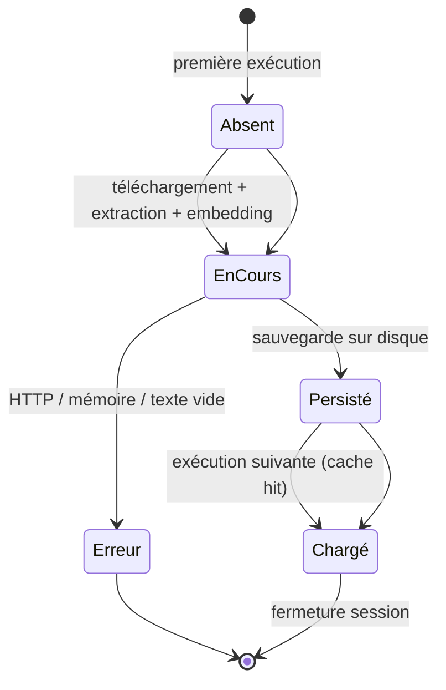

<!--
TEMPLATE — Documentation fonctionnelle
=======================================
Public cible : (1) une IA qui doit comprendre POURQUOI un comportement existe avant de
le modifier, (2) un humain (PO, dev qui arrive, support) qui veut connaître les règles
métier sans lire le code.

Ce document est la VOIX DU MÉTIER — pas du code. Il décrit ce que le produit fait, pour
qui, dans quelles conditions, avec quelles règles. Le HOW (techno, archi) vit dans
[architecture.md](architecture.md). Le QUOI (signatures) vit dans [contracts.md](contracts.md).

Garde-fous :
- Pas de jargon technique ici. Si un terme technique est nécessaire, soit on l'explique,
  soit on renvoie au glossaire.
- Une règle métier doit être tracée à un cas d'usage et idéalement à un test fonctionnel.
- Les hors-scope (« ce que le produit NE fait PAS ») sont aussi importants que les scopes —
  ils évitent de sur-interpréter.

Bloc « Mode d'emploi » en fin de fichier.
-->

# Documentation fonctionnelle — RAG

| Champ | Valeur |
|---|---|
| **Dernière mise à jour** | 2026-05-07 |
| **Mise à jour par** | agent IA |
| **PR de référence** | 04b7fd4 |
| **Owner produit** | (à confirmer) |
| **Statut** | Brouillon |

> **Pitch en 1 phrase** : Système de question-réponse sur documents PDF — l'utilisateur fournit une URL de PDF et pose des questions en langage naturel ; le moteur retrouve les passages pertinents et génère une réponse via Google Gemini.

---

## 1. Vision et raison d'être

### 1.1 Problème adressé

Lire et interroger un document PDF long est coûteux en temps. Ce système permet d'indexer un PDF accessible par URL, puis de poser des questions en langage naturel et d'obtenir une réponse synthétique générée à partir des passages les plus pertinents du document. L'accent est mis sur la réutilisation de l'index : une fois généré, il est mis en cache sur disque pour éviter de recalculer les embeddings à chaque session.

### 1.2 Bénéfices clés

| Pour | Bénéfice | Mesuré par |
|---|---|---|
| **Utilisateur CLI** | Obtenir une réponse précise à partir d'un PDF sans le lire intégralement | Pertinence de la réponse (à confirmer) |
| **Utilisateur récurrent** | Pas de re-traitement du PDF si l'URL n'a pas changé (cache disque) | Temps de démarrage < 5 s au deuxième lancement (à confirmer) |

### 1.3 Hors-scope

> Ce que le produit ne fait PAS — délibérément. Inclure les fonctionnalités souvent confondues avec ce produit.

| Ce qui est hors-scope | Pourquoi | Alternative |
|---|---|---|
| Ingestion de fichiers PDF locaux (sans URL) | Le point d'entrée courant est une URL HTTP ; aucun upload local prévu | Modifier `pdf_url` dans `main.py` pour pointer vers un serveur local |
| Interface web ou API REST | Produit CLI uniquement | (à confirmer) |
| Indexation de plusieurs PDFs simultanément | Un seul PDF par instance de `RAGEngine` | Instancier plusieurs moteurs |
| Mise à jour incrémentale de l'index | L'index est lié au hash MD5 de l'URL ; un changement de contenu sans changement d'URL ne déclenche pas de réindexation | Supprimer le répertoire `./storage/index_<hash>` manuellement |

---

## 2. Personas et utilisateurs

| Persona | Rôle | Fréquence d'usage | Objectif principal | Compétences attendues |
|---|---|---|---|---|
| **Utilisateur CLI** | Toute personne souhaitant interroger un PDF | Ponctuel / régulier | Obtenir une réponse en langage naturel à partir d'un document PDF | Savoir lancer `python main.py`, avoir une clé API Google |
| **Développeur** | Intégrateur / mainteneur du système | Ponctuel | Adapter l'URL du PDF, modifier les paramètres d'indexation | Maîtrise Python, connaissance de llama-index |

> Pour chaque persona, lister les **cas d'usage prioritaires** dans §3.

---

## 3. Cas d'usage

### 3.1 Carte des cas d'usage

| ID | Cas d'usage | Persona | Fréquence | Criticité |
|---|---|---|---|---|
| UC-01 | Indexer un PDF depuis une URL | Utilisateur CLI / Développeur | Ponctuel (premier lancement ou changement d'URL) | Critique |
| UC-02 | Interroger le PDF en langage naturel | Utilisateur CLI | Régulier | Critique |
| UC-03 | Réutiliser l'index mis en cache | Utilisateur CLI | Régulier | Standard |

### 3.2 Détail par cas d'usage

> Un bloc par UC critique. Forme abrégée pour les UC standards.

#### UC-01 — Indexer un PDF depuis une URL

| Méta | Valeur |
|---|---|
| **Persona** | Utilisateur CLI, Développeur |
| **Pré-conditions** | URL HTTP(S) d'un PDF valide, clé API Google configurée dans `config.py`, connexion réseau disponible |
| **Post-conditions** | Index vectoriel persisté dans `./storage/index_<md5_url>/` ; moteur de requête prêt |
| **Déclencheur** | Lancement de `python main.py` lorsqu'aucun index n'existe pour l'URL courante |
| **Fréquence** | Ponctuel (une fois par URL) |
| **Volumétrie** | (à confirmer) |
| **SLA** | Dépend de la taille du PDF et de la vitesse réseau (à confirmer) |
| **Endpoint(s) / écran(s)** | CLI — `main.py` |
| **Règles métier appliquées** | RG-01, RG-02 (voir §4) |

**Scénario nominal**

1. L'utilisateur lance `python main.py`.
2. Le système télécharge le PDF en streaming par blocs de 8 Mo (`_DOWNLOAD_CHUNK`) avec un timeout (connect : 10 s, read : 60 s).
3. Le texte est extrait page par page en lots de 50 pages (`_PAGE_BATCH`) ; la mémoire est libérée entre chaque lot.
4. Les documents sont découpés en chunks sémantiques et les embeddings sont générés via HuggingFace sentence-transformers.
5. L'index vectoriel est persisté sur disque.
6. Le moteur de requête est initialisé (top-k = 3, mode `compact`).

**Scénarios alternatifs**

| Variante | Condition | Comportement |
|---|---|---|
| Index déjà présent | `./storage/index_<md5_url>/` existe | Le téléchargement et l'indexation sont ignorés ; l'index est chargé directement (UC-03) |

**Cas d'erreur métier**

| Cas | Détection | Message utilisateur | Effet |
|---|---|---|---|
| URL inaccessible / réponse non-2xx | `requests.HTTPError` levée par `load_pdf_from_url` | Traceback Python dans le terminal | Arrêt du programme ; fichier temporaire supprimé |
| PDF sans texte extractible | `ValueError` levée par `load_documents_from_pdf` | `No extractable text found in <path>` | Arrêt du programme |
| Mémoire insuffisante à l'indexation | `MemoryError` levée par `RAGEngine.__init__` | Message invitant à réduire `_PAGE_BATCH` ou `embed_batch_size` | Arrêt du programme |

**Pièges connus**

- ⚠️ Si l'URL ne change pas mais que le contenu du PDF change, le cache existant est réutilisé sans réindexation. Pour forcer une réindexation, supprimer manuellement le répertoire `./storage/index_<md5_url>/`.
- ⚠️ Le fichier temporaire du PDF est supprimé immédiatement après extraction — toute erreur survenant après le `finally` ne peut pas être rejouée sans re-téléchargement.

#### UC-02 — Interroger le PDF en langage naturel

| Méta | Valeur |
|---|---|
| **Persona** | Utilisateur CLI |
| **Pré-conditions** | UC-01 ou UC-03 complété ; moteur initialisé |
| **Post-conditions** | Une réponse en langage naturel est affichée dans le terminal |
| **Déclencheur** | Saisie d'une question par l'utilisateur dans la boucle interactive |
| **Fréquence** | Régulier (multiple par session) |
| **Volumétrie** | (à confirmer) |
| **SLA** | (à confirmer) |
| **Endpoint(s) / écran(s)** | CLI — boucle `while True` dans `main.py` |
| **Règles métier appliquées** | RG-03 (voir §4) |

**Scénario nominal**

1. L'utilisateur saisit une question.
2. Le moteur effectue une recherche sémantique (top-k = 3 chunks).
3. Les chunks récupérés sont passés à Gemini avec la question.
4. La réponse générée est affichée.
5. L'utilisateur peut poser une nouvelle question ou saisir `q` pour quitter.

**Cas d'erreur métier**

| Cas | Détection | Message utilisateur | Effet |
|---|---|---|---|
| Erreur API Gemini | Exception levée par `query_engine.query` | Traceback Python | Arrêt de la session |

---

## 4. Règles de gestion

> Toute règle métier nommée. Une RG = une assertion sur le système, formulée en langage métier, idéalement testable.

### 4.1 Catalogue

| ID | Nom | Domaine | Cas d'usage liés | Statut |
|---|---|---|---|---|
| RG-01 | Cache par hash d'URL | Indexation | UC-01, UC-03 | Active |
| RG-02 | Traitement par lots mémoire-sûr | Chargement PDF | UC-01 | Active |
| RG-03 | Arrêt sur saisie `q` | Interaction CLI | UC-02 | Active |

### 4.2 Détail par règle

#### RG-01 — Cache par hash d'URL

- **Énoncé** : Si un index vectoriel existe déjà pour le hash MD5 de l'URL courante, le système le charge directement sans re-télécharger ni re-indexer le PDF.
- **Pré-conditions** : `RAGEngine` initialisé avec une `pdf_url`.
- **Effet** : Téléchargement et génération d'embeddings ignorés ; session démarrée immédiatement.
- **Origine** : Optimisation de performance — éviter de re-calculer des embeddings coûteux pour un document déjà indexé.
- **Implémentation** : [`rag_engine.py:73-75`](../rag_engine.py)
- **Tests fonctionnels** : (à confirmer)
- **Évolutions** :
  | Date | PR | Changement |
  |---|---|---|
  | 2026-05-07 | 04b7fd4 | Création |

#### RG-02 — Traitement par lots mémoire-sûr

- **Énoncé** : Le texte d'un PDF est extrait par lots de `_PAGE_BATCH` pages (défaut : 50) ; un `gc.collect()` est appelé entre chaque lot pour libérer la mémoire des objets de page.
- **Pré-conditions** : PDF téléchargé avec succès.
- **Effet** : Pic mémoire borné ; `MemoryError` levée avec message explicite si l'indexation dépasse la RAM disponible.
- **Origine** : Contrainte technique — les PDFs volumineux saturaient la mémoire sans gestion explicite des lots.
- **Implémentation** : [`pdf_loader.py:69-84`](../pdf_loader.py)
- **Tests fonctionnels** : (à confirmer)
- **Évolutions** :
  | Date | PR | Changement |
  |---|---|---|
  | 2026-05-07 | 04b7fd4 | Création (remplacement de `PDFReader` de llama-index par `pypdf` avec batching) |

#### RG-03 — Arrêt sur saisie `q`

- **Énoncé** : La boucle interactive se termine lorsque l'utilisateur saisit `q` (insensible à la casse).
- **Pré-conditions** | Moteur initialisé, boucle active.
- **Effet** : Programme terminé proprement.
- **Origine** : Décision UX CLI.
- **Implémentation** : [`main.py:10-13`](../main.py)
- **Tests fonctionnels** : (à confirmer)
- **Évolutions** :
  | Date | PR | Changement |
  |---|---|---|
  | 2026-05-07 | 04b7fd4 | Création |

---

## 5. Workflows et machines à états

### 5.1 Index vectoriel

| Transition | Acteur | Pré-condition | Effet | Règles appliquées |
|---|---|---|---|---|
| `Absent → EnCours` | Système | Aucun index trouvé pour le hash URL | Téléchargement PDF, extraction texte, génération embeddings | RG-01, RG-02 |
| `EnCours → Persisté` | Système | Indexation réussie | Index sauvegardé dans `./storage/index_<hash>/` | RG-01 |
| `Persisté → Chargé` | Système | Répertoire d'index existant | Chargement rapide sans re-calcul | RG-01 |
| `EnCours → Erreur` | Système | Erreur HTTP / mémoire / PDF sans texte | Exception levée, fichier temporaire supprimé | RG-02 |

**Invariants** :

- Un index persisté n'est jamais mis à jour automatiquement — il faut le supprimer manuellement pour forcer une réindexation.

---

## 6. Données métier de référence

> Référentiels et énumérations qui ont une signification métier. Le détail technique vit dans [data-model.md](data-model.md).

| Référentiel | Valeurs | Source de vérité | Mise à jour |
|---|---|---|---|
| **Constantes de chargement PDF** | `_DOWNLOAD_CHUNK` = 8 Mo, `_REQUEST_TIMEOUT` = (10 s, 60 s), `_PAGE_BATCH` = 50 pages | [`pdf_loader.py`](../pdf_loader.py) | Manuelle (modification du code) |
| **Paramètres de retrieval** | `similarity_top_k` = 3, `response_mode` = `compact` | [`rag_engine.py`](../rag_engine.py) | Manuelle |

---

## 7. Cas limites et pathologiques

> Comportements aux extrémités du fonctionnel. Ces cas sont la principale source de bugs en production — les documenter explicitement.

| Cas | Comportement attendu | Justification |
|---|---|---|
| **PDF sans texte extractible (scanné, images)** | `ValueError` levée avec message explicite ; aucun index créé | `pypdf` ne fait pas d'OCR ; le texte doit être natif |
| **PDF très volumineux (centaines de pages)** | Traitement par lots de 50 pages ; `MemoryError` avec message invitant à réduire `_PAGE_BATCH` si la RAM est insuffisante | RG-02 — batching mémoire-sûr |
| **URL inaccessible ou timeout** | `requests.HTTPError` ou timeout levée ; fichier temporaire supprimé automatiquement | Bloc `except` de `load_pdf_from_url` nettoie systématiquement |
| **Même URL, contenu PDF modifié** | L'ancien index est réutilisé — les nouvelles données ne sont pas prises en compte | ⚠️ RG-01 — suppression manuelle de l'index nécessaire |
| **Reprise après panne en cours d'indexation** | L'index partiel n'est pas sauvegardé ; au prochain lancement, l'indexation repart de zéro | Pas de mécanisme de checkpoint |
| **Rejeu de la même question** | Idempotent côté retrieval ; la réponse Gemini peut varier selon le paramétrage du modèle | (à confirmer) |
| **Pages sans texte (vide)** | Les pages dont `text.strip()` est vide sont silencieusement ignorées | [`pdf_loader.py:72-83`](../pdf_loader.py) |

---

## 8. Conformité et contraintes externes

| Contrainte | Origine | Implémentation |
|---|---|---|
| Clé API Google Gemini | Conditions d'utilisation Google AI | `config.py` — clé non versionnée (à confirmer) |
| Licence des documents PDF indexés | Dépend de la source du PDF fournie par l'utilisateur | Responsabilité de l'utilisateur (à confirmer) |

---

## 9. KPIs et indicateurs métier

| KPI | Définition | Cible | Source | Dashboard |
|---|---|---|---|---|
| Temps de chargement (cache miss) | Durée entre le lancement et la disponibilité du moteur (premier run) | (à confirmer) | Logs console | (à confirmer) |
| Temps de chargement (cache hit) | Durée entre le lancement et la disponibilité du moteur (index existant) | (à confirmer) | Logs console | (à confirmer) |
| Pertinence des réponses | Évaluation qualitative des réponses générées | (à confirmer) | (à confirmer) | (à confirmer) |

> Note : ces KPIs orientent les décisions produit. Toute fonctionnalité majeure devrait s'y rattacher.

---

## 10. Roadmap et évolutions notables

> Historique compressé : grands jalons fonctionnels passés et à venir. Pas un changelog détaillé (qui vit dans `CHANGELOG.md` ou les releases).

### 10.1 Jalons passés

| Date | Version | Évolution majeure | PR / RFC |
|---|---|---|---|
| 2026-05-07 | 03de3db | Mise en place initiale du système RAG (pdf_loader, rag_engine, gemini_client, text_processor, main) | 03de3db |
| 2026-05-07 | 04b7fd4 | Refactoring `pdf_loader` : streaming par chunks, batching mémoire-sûr (`pypdf`), gestion explicite `MemoryError` dans `rag_engine` | 04b7fd4 |

### 10.2 À venir (haut niveau)

| Échéance | Évolution | Statut |
|---|---|---|
| (à confirmer) | Support de plusieurs PDFs par instance | hypothèse |
| (à confirmer) | Interface web ou API REST | hypothèse |

---

## 11. Questions ouvertes côté métier

> Décisions fonctionnelles non tranchées. Distinct des questions techniques (qui vivent dans le glossaire ou les ADR).

| # | Question | Impact si non tranché | Owner | Ouverte depuis |
|---|---|---|---|---|
| QF-01 | Quelle est la politique de mise à jour de l'index lorsque l'URL reste identique mais le contenu du PDF change ? | Risque de réponses basées sur des données obsolètes | (à confirmer) | 2026-05-07 |
| QF-02 | Le système est-il destiné à un usage mono-utilisateur CLI uniquement, ou une API est-elle envisagée ? | Impacte l'architecture et la gestion des accès concurrents | (à confirmer) | 2026-05-07 |

---

## Références

- Vue d'ensemble système : [architecture.md](architecture.md)
- Endpoints / interfaces qui matérialisent les UC : [contracts.md](contracts.md)
- Données qui supportent les règles : [data-model.md](data-model.md)
- Vocabulaire métier détaillé : [glossaire.md](glossaire.md)
- Décisions produit historiques : (à confirmer)
- Backlog : (à confirmer)

---

<!--
MODE D'EMPLOI DU TEMPLATE
=========================

POUR L'IA QUI MET À JOUR CE FICHIER

⚠️ La doc fonctionnelle est la PLUS DIFFICILE à maintenir par une IA seule — elle décrit
l'INTENTION, qui n'est pas dans le code. L'IA doit ÊTRE PRUDENTE et ne pas inventer du
sens. Si une PR introduit un comportement nouveau dont l'intention n'est pas claire,
laisser un placeholder et SIGNALER dans la PR plutôt que deviner.

Déclencheurs :

| Modification dans la PR | Sections à relire |
|---|---|
| Nouveau parcours utilisateur / endpoint exposé à un humain | §3 (carte + détail) |
| Nouveau persona ou rôle | §2 |
| Nouvelle règle de validation / contrainte métier | §4 |
| Modification d'un état possible / d'une transition | §5 |
| Nouvelle énumération / référentiel métier | §6 |
| Nouveau cas pathologique géré (ou bug fix significatif) | §7 |
| Conformité (RGPD, accessibilité, audit) | §8 |
| Nouveau KPI suivi | §9 |
| Lancement / dépréciation d'une feature majeure | §10.1 |
| Décision produit en attente | §11 |

Règles spéciales :
- Toute RG-XX nouvelle DOIT pointer vers une implémentation et un test (sinon, signalement
  en PR — c'est une RG « orpheline »).
- Si un UC change de comportement nominal, ajouter une ligne dans son sous-bloc « Évolutions »
  (à créer au besoin), ne pas réécrire silencieusement le scénario.
- Les hors-scope §1.3 vieillissent : si une fonctionnalité hors-scope devient scope, la
  retirer de §1.3 ET la documenter dans §3.

Auto-checks :
- [ ] Chaque RG citée dans un UC §3 existe dans §4.
- [ ] Chaque RG §4 cite une implémentation et un test.
- [ ] Chaque transition §5 a une ligne de tableau associée.
- [ ] Le pitch §0 est à jour avec la dernière évolution majeure §10.1.
- [ ] Aucune QF-XX § 11 ouverte depuis > 90 jours sans note de réunion.

POUR LE RELECTEUR HUMAIN (idéalement le PO ou un expert métier)

- Le doc doit pouvoir être lu par un nouvel arrivant non technique en 30 minutes.
- Vérifier que les RG ne sont pas « techniques déguisées » (ex. « le timeout est de 5s »
  est une contrainte non-fonctionnelle, pas une RG).
- Les KPIs §9 doivent provenir d'un dashboard existant, pas être souhaitables.
- Les hors-scope §1.3 méritent un challenge périodique.

POUR ADAPTER À UN AUTRE PROJET

1. C'est le template le plus PROJET-DÉPENDANT. Pour un produit B2C avec écrans : §3 est
   structuré par parcours utilisateur. Pour un service technique B2B : §3 est structuré par
   intégration partenaire.
2. Si le système est purement technique sans utilisateur final (ex. lib, infra) :
   - §2 = systèmes consommateurs.
   - §3 = scénarios d'intégration.
   - §5 et §9 peuvent disparaître.
3. Pour un système legacy en migration : ajouter une section « Comportements à reproduire
   à l'identique » et « Comportements connus non reproduits (et pourquoi) ».
4. Si le projet a une **forte dimension réglementaire** (banque, santé, public) : §8 prend
   beaucoup de place, mériter sa propre subdivision.
-->
