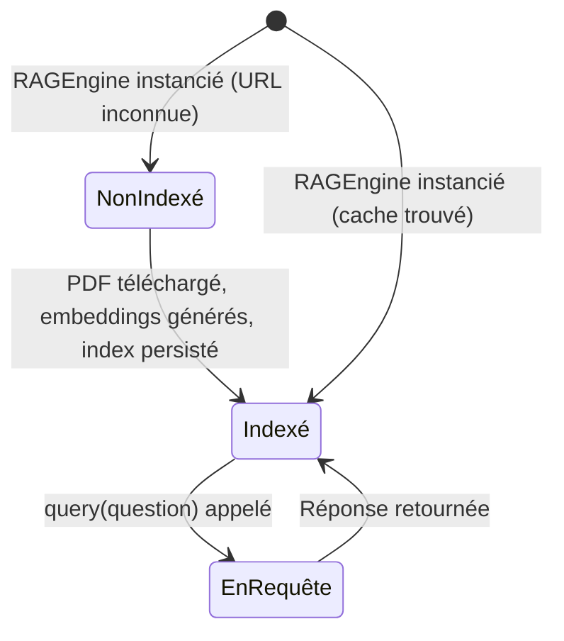

<!--
TEMPLATE — Documentation fonctionnelle
=======================================
Public cible : (1) une IA qui doit comprendre POURQUOI un comportement existe avant de
le modifier, (2) un humain (PO, dev qui arrive, support) qui veut connaître les règles
métier sans lire le code.

Ce document est la VOIX DU MÉTIER — pas du code. Il décrit ce que le produit fait, pour
qui, dans quelles conditions, avec quelles règles. Le HOW (techno, archi) vit dans
[architecture.md](architecture.md). Le QUOI (signatures) vit dans [contracts.md](contracts.md).

Garde-fous :
- Pas de jargon technique ici. Si un terme technique est nécessaire, soit on l'explique,
  soit on renvoie au glossaire.
- Une règle métier doit être tracée à un cas d'usage et idéalement à un test fonctionnel.
- Les hors-scope (« ce que le produit NE fait PAS ») sont aussi importants que les scopes —
  ils évitent de sur-interpréter.

Bloc « Mode d'emploi » en fin de fichier.
-->

# Documentation fonctionnelle — RAG

| Champ | Valeur |
|---|---|
| **Dernière mise à jour** | 2026-05-11 |
| **Mise à jour par** | agent IA (doc-patcher) |
| **PR de référence** | (à confirmer) |
| **Owner produit** | (à confirmer) |
| **Statut** | Brouillon |

> **Pitch en 1 phrase** : Système de questions-réponses sur documents PDF qui télécharge, indexe et interroge des PDF via des embeddings sémantiques HuggingFace et le LLM Google Gemini, à destination des développeurs ou chercheurs souhaitant explorer le contenu d'un document sans en lire chaque page.

---

## 1. Vision et raison d'être

### 1.1 Problème adressé

Lire et interroger un document PDF long (article académique, rapport, manuel) est coûteux en temps. Le système RAG résout ce problème en indexant automatiquement le contenu sémantique d'un PDF et en permettant à l'utilisateur de poser des questions en langage naturel, recevant des réponses générées par un LLM (Google Gemini) appuyées sur les passages les plus pertinents du document.

### 1.2 Bénéfices clés

| Pour | Bénéfice | Mesuré par |
|---|---|---|
| Développeur / chercheur | Obtenir une réponse précise sur un PDF sans le lire intégralement | Pertinence des réponses (à confirmer) |
| Utilisateur récurrent | Pas de re-traitement : les embeddings sont mis en cache sur disque | Temps de démarrage sur 2ᵉ run |

### 1.3 Hors-scope

> Ce que le produit ne fait PAS — délibérément. Inclure les fonctionnalités souvent confondues avec ce produit.

| Ce qui est hors-scope | Pourquoi | Alternative |
|---|---|---|
| Indexation de fichiers autres que PDF | Seul `pdf_loader.py` est implémenté | Étendre `pdf_loader.py` (à confirmer) |
| Interface graphique / web | Seul un CLI interactif est fourni | Construire un frontend sur `RAGEngine.query()` |
| Gestion multi-documents simultanés | Un seul PDF par instance `RAGEngine` | Instancier plusieurs `RAGEngine` (à confirmer) |
| Authentification / multi-utilisateurs | Outil mono-utilisateur en CLI | (à confirmer) |

---

## 2. Personas et utilisateurs

| Persona | Rôle | Fréquence d'usage | Objectif principal | Compétences attendues |
|---|---|---|---|---|
| **Utilisateur CLI** | Développeur ou chercheur interrogeant un PDF via le terminal | Ponctuel / régulier | Obtenir une réponse précise sur le contenu d'un PDF | Python, ligne de commande |
| **Intégrateur** | Développeur intégrant `RAGEngine` dans une application plus large | Ponctuel | Utiliser `RAGEngine.query()` comme brique de service | Python intermédiaire |

> Pour chaque persona, lister les **cas d'usage prioritaires** dans §3.

---

## 3. Cas d'usage

### 3.1 Carte des cas d'usage

| ID | Cas d'usage | Persona | Fréquence | Criticité |
|---|---|---|---|---|
| UC-01 | Indexer un PDF depuis une URL et lancer le CLI interactif | Utilisateur CLI | Ponctuel (premier accès) | Critique |
| UC-02 | Interroger un PDF déjà indexé (cache présent) | Utilisateur CLI | Régulier | Critique |
| UC-03 | Intégrer `RAGEngine` dans une application tierce | Intégrateur | Ponctuel | Standard |

### 3.2 Détail par cas d'usage

> Un bloc par UC critique. Forme abrégée pour les UC standards.

#### UC-01 — Indexer un PDF depuis une URL et interroger via le CLI

| Méta | Valeur |
|---|---|
| **Persona** | Utilisateur CLI |
| **Pré-conditions** | `GOOGLE_API_KEY` configurée dans `config.py` ; accès réseau au PDF ; dépendances installées |
| **Post-conditions** | Index vectoriel persisté dans `./storage/index_<md5_url>/` ; réponse affichée pour chaque question |
| **Déclencheur** | `python main.py` en ligne de commande |
| **Fréquence** | Ponctuel (premier run sur un PDF donné) |
| **Volumétrie** | (à confirmer) |
| **SLA** | (à confirmer) — indexation peut prendre plusieurs minutes selon la taille du PDF |
| **Endpoint(s) / écran(s)** | CLI — voir [contracts.md](contracts.md) |
| **Règles métier appliquées** | RG-01, RG-02 (voir §4) |

**Scénario nominal**

1. L'utilisateur lance `python main.py`.
2. Le système télécharge le PDF depuis l'URL configurée (`pdf_url` dans `main.py`).
3. Le système découpe le PDF en chunks sémantiques, génère les embeddings et persiste l'index dans `./storage/`.
4. Le CLI affiche l'invite `Your question:`.
5. L'utilisateur saisit une question en langage naturel.
6. Le système effectue une recherche sémantique (top-3 chunks) et transmet le contexte à Gemini.
7. La réponse générée est affichée sous `Answer:`.
8. Les étapes 5–7 se répètent jusqu'à saisie de `q`.

**Scénarios alternatifs**

| Variante | Condition | Comportement |
|---|---|---|
| Cache existant (UC-02) | L'index pour ce PDF existe déjà dans `./storage/` | Le système charge l'index depuis le cache et saute l'étape de génération d'embeddings |

**Cas d'erreur métier**

| Cas | Détection | Message utilisateur | Effet |
|---|---|---|---|
| URL PDF inaccessible | Étape 2 — téléchargement échoue | Exception Python (à confirmer) | Arrêt du programme |
| Clé API manquante ou invalide | Étape initialisation Gemini | Exception Python (à confirmer) | Arrêt du programme |

**Pièges connus**

- ⚠️ Le cache est identifié par le hash MD5 de l'URL (`hashlib.md5`) — changer l'URL même d'un caractère génère un nouvel index, ignorant tout cache existant.
- ⚠️ Pour changer le PDF indexé, il faut modifier `pdf_url` dans `main.py` ; aucune invite interactive ne le permet.

#### UC-03 — Intégrer `RAGEngine` comme brique de service (forme abrégée)

Instancier `RAGEngine(pdf_url)`, puis appeler `rag.query(question)` pour obtenir une réponse (`str`). L'intégrateur gère lui-même la boucle d'interaction. Les règles RG-01 et RG-02 s'appliquent identiquement.

---

## 4. Règles de gestion

> Toute règle métier nommée. Une RG = une assertion sur le système, formulée en langage métier, idéalement testable.

### 4.1 Catalogue

| ID | Nom | Domaine | Cas d'usage liés | Statut |
|---|---|---|---|---|
| RG-01 | Cache par hash d'URL | Indexation | UC-01, UC-02, UC-03 | Active |
| RG-02 | Récupération top-k=3 | Recherche sémantique | UC-01, UC-02, UC-03 | Active |

### 4.2 Détail par règle

#### RG-01 — Cache par hash d'URL

- **Énoncé** : Le système doit réutiliser un index vectoriel déjà construit pour une URL donnée, sans re-télécharger ni re-indexer le PDF.
- **Pré-conditions** : Le répertoire `./storage/index_<md5(url)>/` existe et est accessible en lecture.
- **Effet** : Si le répertoire de cache existe, le chargement depuis le disque remplace la génération d'embeddings.
- **Origine** : Décision technique — limiter le coût de calcul des embeddings sur les runs répétés.
- **Implémentation** : [rag_engine.py:37-41](../rag_engine.py#L37)
- **Tests fonctionnels** : (à confirmer)
- **Évolutions** :
  | Date | PR | Changement |
  |---|---|---|
  | 2026-05-11 | (à confirmer) | Création |

#### RG-02 — Récupération top-k=3

- **Énoncé** : Pour chaque question, le moteur de recherche récupère les 3 chunks documentaires les plus similaires sémantiquement à la question, et les transmet à Gemini comme contexte.
- **Pré-conditions** : L'index vectoriel est chargé en mémoire.
- **Effet** : La réponse Gemini est conditionnée par au plus 3 passages du document.
- **Origine** : Décision technique — compromis entre précision et longueur du contexte LLM.
- **Implémentation** : [rag_engine.py:58](../rag_engine.py#L58)
- **Tests fonctionnels** : (à confirmer)
- **Évolutions** :
  | Date | PR | Changement |
  |---|---|---|
  | 2026-05-11 | (à confirmer) | Création |

---

## 5. Workflows et machines à états

### 5.1 Cycle de vie de l'index vectoriel

| Transition | Acteur | Pré-condition | Effet | Règles appliquées |
|---|---|---|---|---|
| `NonIndexé → Indexé` | Système | PDF accessible, clé API valide | Index persisté dans `./storage/` | RG-01 |
| `[*] → Indexé` | Système | Cache présent (`./storage/index_<hash>/`) | Index chargé depuis le disque | RG-01 |
| `Indexé → EnRequête` | Utilisateur CLI / Intégrateur | Index chargé | Recherche sémantique déclenchée | RG-02 |
| `EnRequête → Indexé` | Système | Réponse Gemini obtenue | Réponse retournée à l'appelant | RG-02 |

**Invariants** :

- Une fois un index créé pour une URL, il ne peut être recréé qu'en supprimant manuellement le répertoire de cache correspondant.
- L'index en mémoire n'est pas modifiable après initialisation (lecture seule).

---

## 6. Données métier de référence

> Référentiels et énumérations qui ont une signification métier. Le détail technique vit dans [data-model.md](data-model.md).

| Référentiel | Valeurs | Source de vérité | Mise à jour |
|---|---|---|---|
| **Mode de réponse LLM** | `compact` | `rag_engine.py:58` — paramètre `response_mode` | Manuel (modification du code) |
| **Nombre de chunks récupérés (top-k)** | `3` | `rag_engine.py:58` — paramètre `similarity_top_k` | Manuel (modification du code) |

---

## 7. Cas limites et pathologiques

> Comportements aux extrémités du fonctionnel. Ces cas sont la principale source de bugs en production — les documenter explicitement.

| Cas | Comportement attendu | Justification |
|---|---|---|
| **PDF vide ou illisible** | Exception à l'extraction (`load_documents_from_pdf`) — comportement exact (à confirmer) | Dépend de `pypdf` |
| **PDF très long (> centaines de pages)** | Indexation possible mais lente ; pas de limite explicite dans le code | Mémoire et temps de calcul proportionnels au volume |
| **Même URL, PDF modifié côté serveur** | L'ancien cache est utilisé — le contenu modifié n'est pas re-indexé | RG-01 : cache basé uniquement sur le hash de l'URL, pas du contenu |
| **Question hors-sujet (aucun chunk pertinent)** | Gemini répond avec le contexte peu pertinent — pas de garde-fou explicite (à confirmer) | `similarity_top_k=3` retourne toujours 3 chunks même si la similarité est faible |
| **Reprise après panne en cours d'indexation** | L'index partiel peut être corrompu dans `./storage/` — nécessite suppression manuelle (à confirmer) | Pas de transaction atomique sur l'écriture de l'index |
| **Accès concurrent** | Non géré — CLI mono-utilisateur | Outil local, pas de serveur multi-utilisateurs |

---

## 8. Conformité et contraintes externes

| Contrainte | Origine | Implémentation |
|---|---|---|
| Clé API Google Gemini requise | Conditions d'utilisation Google AI | `config.py` — `GOOGLE_API_KEY` (non versionnée) |
| Licence des PDFs indexés | Droit d'auteur / licence du document source | Responsabilité de l'utilisateur — aucune vérification dans le code |
| Données envoyées à l'API Gemini | Confidentialité — le contenu des chunks est transmis à Google | (à confirmer) selon la politique de confidentialité Google Generative AI |

---

## 9. KPIs et indicateurs métier

| KPI | Définition | Cible | Source | Dashboard |
|---|---|---|---|---|
| Temps d'indexation (1er run) | Durée entre lancement de `main.py` et affichage de l'invite | (à confirmer) | Logs console | (à confirmer) |
| Temps de chargement depuis cache | Durée entre lancement et affichage de l'invite quand le cache existe | (à confirmer) | Logs console | (à confirmer) |
| Pertinence des réponses | Évaluation qualitative des réponses Gemini | (à confirmer) | (à confirmer) | (à confirmer) |

> Note : ces KPIs orientent les décisions produit. Toute fonctionnalité majeure devrait s'y rattacher.

---

## 10. Roadmap et évolutions notables

> Historique compressé : grands jalons fonctionnels passés et à venir. Pas un changelog détaillé (qui vit dans `CHANGELOG.md` ou les releases).

### 10.1 Jalons passés

| Date | Version | Évolution majeure | PR / RFC |
|---|---|---|---|
| (à confirmer) | v1.0 | Lancement initial — CLI interactif, indexation PDF, cache disque, intégration Gemini | commit 03de3db |

### 10.2 À venir (haut niveau)

| Échéance | Évolution | Statut |
|---|---|---|
| (à confirmer) | Support multi-documents | Hypothèse |
| (à confirmer) | Interface web / API REST | Hypothèse |

---

## 11. Questions ouvertes côté métier

> Décisions fonctionnelles non tranchées. Distinct des questions techniques (qui vivent dans le glossaire ou les ADR).

| # | Question | Impact si non tranché | Owner | Ouverte depuis |
|---|---|---|---|---|
| QF-01 | Quel comportement exact en cas d'index corrompu (écriture interrompue) ? | Risque de réponses erronées silencieuses | (à confirmer) | 2026-05-11 |
| QF-02 | Faut-il avertir l'utilisateur lorsque la similarité des chunks récupérés est très faible (question hors-sujet) ? | Expérience utilisateur dégradée | (à confirmer) | 2026-05-11 |

---

## Références

- Vue d'ensemble système : [architecture.md](architecture.md)
- Endpoints / interfaces qui matérialisent les UC : [contracts.md](contracts.md)
- Données qui supportent les règles : [data-model.md](data-model.md)
- Vocabulaire métier détaillé : [glossaire.md](glossaire.md)
- Décisions produit historiques : (à confirmer)
- Backlog : (à confirmer)

---

<!--
MODE D'EMPLOI DU TEMPLATE
=========================

POUR L'IA QUI MET À JOUR CE FICHIER

⚠️ La doc fonctionnelle est la PLUS DIFFICILE à maintenir par une IA seule — elle décrit
l'INTENTION, qui n'est pas dans le code. L'IA doit ÊTRE PRUDENTE et ne pas inventer du
sens. Si une PR introduit un comportement nouveau dont l'intention n'est pas claire,
laisser un placeholder et SIGNALER dans la PR plutôt que deviner.

Déclencheurs :

| Modification dans la PR | Sections à relire |
|---|---|
| Nouveau parcours utilisateur / endpoint exposé à un humain | §3 (carte + détail) |
| Nouveau persona ou rôle | §2 |
| Nouvelle règle de validation / contrainte métier | §4 |
| Modification d'un état possible / d'une transition | §5 |
| Nouvelle énumération / référentiel métier | §6 |
| Nouveau cas pathologique géré (ou bug fix significatif) | §7 |
| Conformité (RGPD, accessibilité, audit) | §8 |
| Nouveau KPI suivi | §9 |
| Lancement / dépréciation d'une feature majeure | §10.1 |
| Décision produit en attente | §11 |

Règles spéciales :
- Toute RG-XX nouvelle DOIT pointer vers une implémentation et un test (sinon, signalement
  en PR — c'est une RG « orpheline »).
- Si un UC change de comportement nominal, ajouter une ligne dans son sous-bloc « Évolutions »
  (à créer au besoin), ne pas réécrire silencieusement le scénario.
- Les hors-scope §1.3 vieillissent : si une fonctionnalité hors-scope devient scope, la
  retirer de §1.3 ET la documenter dans §3.

Auto-checks :
- [ ] Chaque RG citée dans un UC §3 existe dans §4.
- [ ] Chaque RG §4 cite une implémentation et un test.
- [ ] Chaque transition §5 a une ligne de tableau associée.
- [ ] Le pitch §0 est à jour avec la dernière évolution majeure §10.1.
- [ ] Aucune QF-XX § 11 ouverte depuis > 90 jours sans note de réunion.

POUR LE RELECTEUR HUMAIN (idéalement le PO ou un expert métier)

- Le doc doit pouvoir être lu par un nouvel arrivant non technique en 30 minutes.
- Vérifier que les RG ne sont pas « techniques déguisées » (ex. « le timeout est de 5s »
  est une contrainte non-fonctionnelle, pas une RG).
- Les KPIs §9 doivent provenir d'un dashboard existant, pas être souhaitables.
- Les hors-scope §1.3 méritent un challenge périodique.

POUR ADAPTER À UN AUTRE PROJET

1. C'est le template le plus PROJET-DÉPENDANT. Pour un produit B2C avec écrans : §3 est
   structuré par parcours utilisateur. Pour un service technique B2B : §3 est structuré par
   intégration partenaire.
2. Si le système est purement technique sans utilisateur final (ex. lib, infra) :
   - §2 = systèmes consommateurs.
   - §3 = scénarios d'intégration.
   - §5 et §9 peuvent disparaître.
3. Pour un système legacy en migration : ajouter une section « Comportements à reproduire
   à l'identique » et « Comportements connus non reproduits (et pourquoi) ».
4. Si le projet a une **forte dimension réglementaire** (banque, santé, public) : §8 prend
   beaucoup de place, mériter sa propre subdivision.
-->
